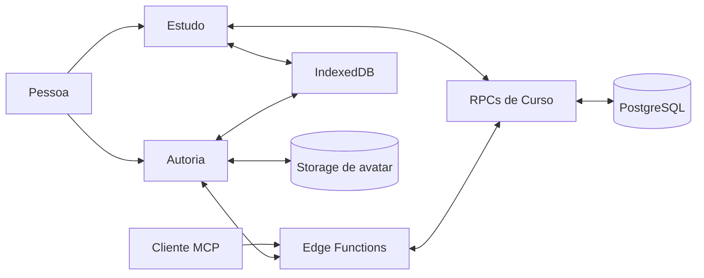

# Arquitetura do AraLearn

Este capítulo explica a arquitetura implementada no código corrente. Ele não
descreve como concluídas as camadas futuras de proveniência, auditoria,
variantes ou analytics de pesquisa.

## Vocabulário necessário

**Curso vivo.** Objeto instrucional identificável e mutável que reúne título,
objetivo, plano instrucional e composição. O mesmo identificador é usado por
Estudo, Autoria e MCP.

**Plano instrucional.** Planejamento normalizado e editável do Curso. Reúne
público, escopo, orientação de autoria, resultados de aprendizagem pretendidos,
unidades de análise instrucional, requisitos de evidência e Partes de autoria.
Título e objetivo aparecem nessa projeção para leitura, mas sua autoridade
permanece exclusivamente na raiz do Curso.

**Parte de autoria.** Recorte operacional ordenado que liga uma intenção de
produção a zero ou mais Microssequências didáticas. Sua posição de produção
não muda a hierarquia curricular e sua remoção não apaga conteúdo didático.

**Entidade do Curso.** Linha que representa Módulo, Lição, Tópico,
Microssequência didática ou Unidade de estudo. A posição e a relação com o pai
ficam em colunas; o conteúdo próprio fica em JSON validado.

**Lista fina.** Página de descritores pequenos: identidade, título, objetivo,
revisão, propriedade, contagens, progresso e data de atualização. Ela não leva
a composição inteira de todos os Cursos.

**Estado pessoal.** Progresso, marcas para rever e observações de uma pessoa em
um Curso. Ele não altera o conteúdo canônico e não é compartilhado com outra
pessoa que estude o mesmo Curso.

**Concorrência otimista.** Uma alteração informa a revisão que leu. O servidor
só a aceita se essa revisão ainda for corrente; caso contrário, o cliente
precisa reler e reconciliar o estado.

**Idempotência.** Uma chave de pedido permite repetir com segurança a mesma
operação. Reutilizá-la com outro conteúdo é conflito, não uma nova solicitação.

## Visão geral

**Descrição textual:** Estudo e Autoria usam controladores separados porque
possuem autoridades diferentes, mas ambos chegam ao mesmo Curso. A interface e
o cliente MCP compartilham o serviço de Curso; o dispositivo conserva cache e
estado pessoal no IndexedDB; PostgreSQL é a autoridade remota. Storage contém
somente fotos privadas de perfil nesta etapa.

O diagrama mostra canais, não equivalência de autoridade. Estudo pode ler um
Curso próprio ou compartilhado e alterar somente estado pessoal. Autoria e MCP
listam e alteram apenas Cursos próprios.

## Decisão 1 — uma identidade de Curso vivo

### Problema

Separar planejamento, cópia de estudo e versão publicada cria a impressão de
três produtos. Uma alteração precisa ser propagada entre identidades e a pessoa
não consegue saber qual estado é o vigente.

### Alternativas consideradas

- manter um recipiente de produção e gerar cópias distribuídas;
- fixar versões integrais imutáveis no Storage;
- usar o Curso como raiz única e registrar sua revisão corrente.

### Decisão e funcionamento

`public.courses` é a raiz. Ela conserva `id`, proprietário, título, objetivo,
revisão e datas. `private.course_instructional_plans` e suas relações guardam o
planejamento autoral; `private.course_entities` conserva a composição
normalizada. Toda relação aponta diretamente para `course_id`; não há
identidade intermediária necessária para abrir o Curso em Estudo.

O Curso pode ser estudado enquanto muda. Uma nova edição incrementa a revisão,
mas não transforma o conteúdo em outro Curso. Nesta etapa não existe estado
editorial de rascunho ou publicado, nem documento integral imutável necessário
à leitura.

### Consequências

- Autoria, Estudo e MCP apontam para a mesma raiz;
- propriedade e compartilhamento também apontam diretamente para o Curso;
- a revisão protege concorrência sem prometer imutabilidade do Curso;
- exportação ou disponibilização pública, se vierem a existir, serão operações
  explícitas e não um segundo estado obrigatório.

### Limites e evidência

O modelo está implementado e testado localmente. A conversão dos dados
hospedados ainda não foi executada; a seção de gates ao final delimita o que
falta antes da promoção.

## Decisão 2 — lista fina e composição paginada

### Problema

Baixar todos os Cursos e todas as Unidades de estudo para desenhar a tela
inicial desperdiça memória, rede e processamento, especialmente em celular e
no Supabase Free Plan.

### Decisão e funcionamento

A lista usa paginação por data de atualização e identidade. Cada item traz
contagens agregadas e progresso, mas não a composição. A busca examina título,
objetivo e, somente para o proprietário, orientações privadas.

Quando a pessoa abre um Curso, o cliente recebe cabeçalho e hierarquia compacta
ou percorre entidades em páginas. Cada página exige a revisão esperada; se o
Curso mudar entre páginas, a leitura falha em vez de misturar duas versões.
Depois de composto e validado, o documento é cacheado no IndexedDB.

### Consequências

- a Home cresce com o número de páginas, não com o total de Unidades;
- um Curso só consome tráfego de composição ao ser aberto;
- cache conhecido permite abrir conteúdo já carregado sem conexão;
- Curso atualizado invalida a leitura parcial e é recarregado de modo íntegro.

### Limites e evidência

O carregamento inicial de Estudo percorre descritores acessíveis para permitir
retomada offline. O orçamento de rede prolongado ainda precisa ser medido com
uso real; “paginado” não significa automaticamente “barato” em qualquer
cardinalidade.

## Decisão 3 — composição relacional e documento validado

### Problema

Um único JSON integral simplifica a leitura, mas torna atualizações parciais,
relações, paginação e inspeção no banco mais difíceis. Fragmentação excessiva,
por outro lado, distribui o conteúdo em tabelas demais.

### Decisão e funcionamento

A solução usa uma única tabela de entidades para cinco tipos:

| Tipo persistido | Pai | Posição |
| --- | --- | --- |
| Módulo | Curso | contígua a partir de zero |
| Lição | Módulo | contígua a partir de zero |
| Tópico | Lição | contígua a partir de zero |
| Microssequência didática | Lição | contígua a partir de zero |
| Unidade de estudo | Microssequência | inteiro positivo do contrato |

Chaves estrangeiras compostas garantem que o pai pertence ao mesmo Curso. O
domínio `courseEntities` achata um documento `aralearn.library.v1`, valida
linhas e recompõe o documento usado pelo renderer. Estrutura relacional e
conteúdo JSON não duplicam `id`, posição nem filhos.

### Consequências

Uma tabela atende a paginação e a substituição de composição sem criar uma
tabela para cada nível didático. O custo é manter validação equivalente no
domínio JavaScript e no banco; os testes de roundtrip e da migration verificam
essa fronteira.

## Decisão 4 — plano vivo e Partes operacionais normalizadas

### Problema

Um grande JSON de autoria obriga pessoas e clientes conversacionais a trocar o
documento inteiro, oculta relações e cria uma segunda interpretação do estado.
Também confunde a ordem em que conteúdo será produzido com a ordem curricular
em que será estudado.

### Decisão e funcionamento

Cada Curso possui exatamente um plano em
`private.course_instructional_plans`. Itens ordenados ficam em
`private.course_instructional_plan_items`; Partes vivas, em
`private.course_authoring_parts`; e o vínculo exclusivo entre Parte e
Microssequência, em
`private.course_authoring_part_didactic_microsequences`. A posição desse
vínculo é ordem de produção, não `course_entities.position`.

A interface apresenta campos e listas em linguagem natural. Ela permite editar
o plano, acrescentar, editar, remover e reordenar itens, criar, editar,
reordenar, dividir e unir Partes e mover ou retirar vínculos. Nenhuma dessas
operações exige editar JSON. Remover ou reorganizar o plano conserva Módulos,
Lições, Microssequências e Unidades já produzidos.

A faixa preferencial nasce em 7–12 Partes. Ela pode ser alterada pela pessoa ou
por uma condição de pesquisa e registra sua origem; é um padrão operacional,
não lei pedagógica, resultado científico nem validação do número ideal.

Materializar uma Parte é um processo retomável em
`private.course_authoring_part_materializations` e
`private.course_authoring_part_materialization_steps`. Começar, registrar uma
etapa e finalizar são comandos pequenos, limitados, idempotentes e protegidos
por revisão do Curso, versão do plano, versão da Parte ou versão da tentativa,
conforme a operação. Uma etapa que altera entidades confirma composição,
vínculo, fatos e progresso na mesma transação. O progresso exibido é derivado
de vínculos, Unidades e tentativas persistidas; não é um selo manual.

O botão visual **Levar pedido ao chat conectado** apenas copia uma solicitação.
Ele não inicia tentativa, não materializa conteúdo e não muda o status. Somente
fatos confirmados por API/MCP podem aparecer como atividade ou progresso.

A vista leve do plano conserva somente o resumo da última tentativa. Quando a
pessoa escolhe **Ver etapas**, ou quando um cliente MCP precisa retomar, uma
leitura owner-only busca somente aquela tentativa e no máximo 64 etapas. O DTO
inclui as versões, o contexto e os fatos limitados e a próxima etapa pendente;
não depende do histórico da conversa nem carrega todas as tentativas do Curso.
Uma Parte com tentativa em andamento não pode ser alterada ou ter vínculos
reorganizados até terminar ou falhar, evitando estado irrecuperável.

### Consequências

- planejamento e composição possuem comandos separados e não se sobrescrevem;
- interface e MCP leem e alteram o mesmo plano e os mesmos recibos;
- repetição idêntica devolve o recibo selado; reutilização divergente da chave
  é conflito;
- CAS desatualizado exige releitura e reconciliação, sem última escrita vencer;
- a atividade recente informa apenas fatos persistidos e o canal `application`
  ou `mcp`.

## Decisão 5 — estado pessoal separado do Curso

### Problema

Progresso e observações pertencem à experiência de uma pessoa. Se forem
misturados ao conteúdo, cada avanço de estudante alterará a revisão autoral e
poderá vazar para outras pessoas.

### Decisão e funcionamento

`public.course_personal_states` mantém um documento compacto por pessoa e
Curso. Ele contém:

- cursores e Unidades concluídas por Lição;
- marcas de revisão por Unidade;
- observações por alvo, com categoria, texto e instante de atualização.

O IndexedDB mantém a réplica local e uma mutação pendente por Curso. A RPC
`mutate_course_personal_state_v1` valida acesso, revisão, limites e chave de
pedido. Recibos expiram em sete dias e existem apenas para repetição segura.

### Consequências

- conteúdo e estado pessoal evoluem separadamente;
- uma concessão de acesso basta para Estudo, sem papel editorial;
- revogar acesso impede novas leituras, mas o tratamento de dados locais já
  baixados continua dependente da política do dispositivo;
- observações pessoais já persistem, mas sua fila autoral unificada e seu ciclo
  de correção ainda não estão implementados.

## Decisão 6 — propriedade e acesso direto

### Problema

Compartilhar um Curso para prática não exige organização institucional, papel,
matriz de permissões ou workflow editorial.

### Decisão e funcionamento

Todo Curso tem exatamente um `owner_id`. `public.course_access` contém somente
o par Curso–pessoa, quem concedeu e quando. Não há nível de acesso: a concessão
significa **Estudo**. O proprietário conserva toda edição.

Na interface, **Pessoas** mostra o proprietário e as pessoas com acesso. Uma
concessão exige o e-mail exato de uma conta existente e confirmação; a resposta
e os eventos não devolvem nem persistem o e-mail. Revogar usa a identidade já
listada. MCP aplica a mesma regra pela ferramenta `gerirPessoas`.

### Consequências

- compartilhar não organiza nem duplica o Curso;
- a pessoa favorecida encontra o Curso em Estudo, não em Autoria;
- coestudantes não veem uns aos outros;
- somente proprietário e pessoa favorecida podem ver nome e avatar entre si;
- conceder ou revogar é idempotente e produz um evento pequeno quando muda o
  estado.

## Decisão 7 — perfil humano mínimo e avatar privado

`public.person_profiles` conserva nome opcional e chave de avatar. Um perfil é
criado para cada conta, sem transformar o produto em rede social. A interface
de Conta permite definir nome, enviar ou remover foto e excluir a própria
conta.

O bucket `person-avatars` é privado. Aceita JPEG, PNG e WebP até 512 KiB, com
chave `<user-id>/<uuid>.<extensão>`. A própria pessoa envia e apaga seus objetos;
a leitura é permitida somente para ela e para uma relação direta de acesso a
Curso. Antes da exclusão da conta, os objetos de avatar precisam ser removidos.

O Storage não guarda conteúdo de Curso nesta etapa. Essa delimitação evita usar
armazenamento de objetos apenas porque a infraestrutura existe.

## Decisão 8 — dois transportes, uma regra de domínio

O aplicativo usa RPCs autenticadas para Estudo e a Edge Function
`aralearn-course-api` para operações autorais. Clientes conversacionais usam
`aralearn-authoring-mcp`, autenticado por OAuth. As duas Edge Functions chamam
o mesmo roteador de Curso, o mesmo domínio de plano e as mesmas funções de
serviço; não reimplementam propriedade, revisão ou idempotência. Planejamento,
composição e avanço de materialização são operações distintas no protocolo,
embora compartilhem a revisão do mesmo Curso.

As ferramentas MCP correntes são seis:

1. `listarCursos`;
2. `lerCurso`;
3. `criarCurso`;
4. `alterarCurso`;
5. `gerirPessoas`;
6. `consultarComponentesDidaticos`.

O sexto item é uma ferramenta de descoberta e validação da biblioteca, não uma
mutação do Curso. A lista separa capacidades de Curso das operações progressivas
da biblioteca sem expor o banco diretamente.

## Decisão 9 — núcleo pequeno e pacotes de componentes

O núcleo de execução conhece composição, temas, acessibilidade e protocolos
comuns. Cada pacote de componente conserva schema, validação, renderer,
capacidades e exemplos. Browser e Edge derivam a biblioteca do mesmo índice
gerado.

Essa modularidade é útil somente se cada pacote possuir valor representacional
e contrato semanticamente defensável. O corte de Curso encontrou formatos
antigos sem equivalência instalada; eles bloqueiam a migração em vez de serem
convertidos por aproximação. A resolução dessa lacuna é gate de dados, não
compatibilidade permanente.

## Organização do código

| Responsabilidade | Local principal |
| --- | --- |
| identidade e composição do Curso | `src/domain/courseEntities.js` |
| plano instrucional e comandos de Parte | `src/domain/courseAuthoringPlan.js` |
| cache local | `src/persistence/CourseLocalStore.js` |
| estado pessoal e fila | `src/persistence/CoursePersonalStateRepository.js` |
| acesso HTTP/RPC | `src/supabase/CourseApiClient.js` |
| cache, paginação e revisão | `src/supabase/CourseController.js` |
| aplicação de Estudo | `src/study/` |
| Autoria visual | `src/ui/CourseAuthoringSurface.js` |
| API e MCP | `supabase/functions/_shared/aralearn-authoring/course*` |
| banco canônico | migrations `20260817140000`, `20260817150000` e `20260817160000` |
| importador transitório | `scripts/courseCutover/` |

## Gates antes da promoção hospedada

O runtime canônico está implementado localmente, mas a migração hospedada não
está concluída. A promoção exige, nesta ordem:

1. reinstalar equivalentes semanticamente válidos para os componentes antigos
   ainda bloqueadores e decidir explicitamente os poucos dados sem contrato;
2. executar o importador em modo somente leitura e obter validação integral dos
   oito Cursos reais;
3. reconstruir o Supabase local, executar migrations, testes de banco e jornada
   de navegador contra o schema resultante;
4. confirmar que dispositivos conhecidos não possuem fila pendente do modelo
   substituído;
5. executar o importador e as migrations `1400`, `1500` e `1600` na mesma
   transação hospedada, abortando diante de drift;
6. publicar Edge Functions, site e APK somente depois da verificação hospedada.

O importador é transitório e não entra no runtime. Não há leitura dupla,
fallback, alias nem sincronização paralela. O Git preserva a arquitetura
anterior.

## Propriedades demonstradas e questões abertas

| Afirmação | Estado | Evidência ou limite |
| --- | --- | --- |
| um identificador representa o Curso em Estudo, Autoria e MCP | implementado localmente | domínio, migrations, testes de API/MCP e jornada de navegador |
| Cursos compartilhados aparecem somente em Estudo | implementado localmente | controladores owner-only e testes de acesso |
| lista fina precede composição sob demanda | implementado localmente | RPCs paginadas, cache e testes de revisão |
| plano e Partes são editáveis sem JSON pela interface e pelo MCP | implementado localmente | domínio, migration `1600`, API, MCP e testes focais |
| remover ou reorganizar Parte não apaga conteúdo produzido | implementado localmente | relações separadas, transações e testes de domínio/banco |
| progresso de Parte reflete somente fatos persistidos | implementado localmente | projeção relacional de vínculos, entidades, tentativas e etapas |
| estado pessoal não altera o Curso | implementado localmente | schema, RPC e repositório local |
| perfil e avatar respeitam relação direta | implementado localmente | RLS, bucket privado e interface de Conta |
| o corte preserva todos os dados reais | ainda não demonstrado | importação hospedada bloqueada por componentes sem equivalente |
| a interface é compreensível por pessoas leigas | ainda não demonstrado | exige aceitação humana em celular e desktop |
| o modelo cabe no Free Plan em uso prolongado | ainda não demonstrado | faltam séries de egress, Storage e carga real |
| o desenho melhora aprendizagem | não demonstrado | exige estudo educacional com instrumentos e análise adequados |
