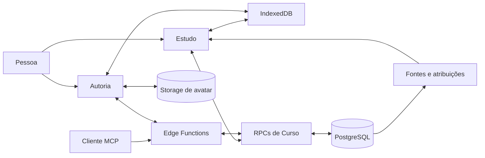

# Arquitetura do AraLearn

Este capítulo explica a arquitetura implementada no código corrente. Ele não
descreve como concluídas as camadas futuras de achados de auditoria, correção
verificada, variantes ou analytics de pesquisa.

## Vocabulário necessário

**Curso vivo.** Objeto instrucional identificável e mutável que reúne título,
objetivo, plano instrucional e composição. O mesmo identificador é usado por
Estudo, Autoria e MCP.

**Plano instrucional.** Planejamento normalizado e editável do Curso. Reúne
público, escopo, resultados de aprendizagem pretendidos, unidades de análise
instrucional, requisitos de evidência e Partes de autoria. Título e objetivo
aparecem nessa projeção para leitura, mas sua autoridade permanece
exclusivamente na raiz do Curso.

**Desenho por escopo.** Resolução versionada de parâmetros pedagógicos,
orientações naturais e política de componentes para um alvo do Curso.
Orientação conserva texto original e interpretação separada; política
representacional não se mistura a limites técnicos. Numa Microssequência, o
desenho inclui também a atribuição explícita dos itens de análise e evidência
que aquele alvo deve realizar.

**Fonte e Âncora.** Uma Fonte é uma identidade privada do Curso com revisões
append-only. Uma Âncora localiza evidência numa revisão exata por página,
tempo, fragmento URI ou trecho textual; seu trecho de verificação permanece
privado.

**Atribuição de Fonte.** Conjunto completo, ordenado e versionado de vínculos
entre revisões de Fontes, Âncoras exatas e um item do plano ou uma Unidade. A
relação declara se a Fonte informa, sustenta, foi adaptada ou foi citada.

**Parte de autoria.** Recorte operacional ordenado que liga uma intenção de
produção a zero ou mais Microssequências didáticas. Sua posição de produção
não muda a hierarquia curricular e sua remoção não apaga conteúdo didático.

**Entidade do Curso.** Linha que representa Módulo, Lição, Tópico,
Microssequência didática ou Unidade de estudo. A posição e a relação com o pai
ficam em colunas; o conteúdo próprio fica em JSON validado.

**Lista fina.** Página de descritores pequenos: identidade, título, objetivo,
revisão, propriedade, contagens, progresso e data de atualização. Ela não leva
a composição inteira de todos os Cursos.

**Inspeção autoral.** Leitura vertical owner-only de Unidades de estudo em uma
revisão fixada. Pode ser limitada ao Curso, a uma Parte, às Unidades sem Parte
ou a um recorte curricular e não recompõe o documento integral.

**Estado pessoal.** Documento v2 com somente progresso e marcas para rever de
uma pessoa em um Curso. Ele não altera o conteúdo canônico e não é compartilhado
com outra pessoa que estude o mesmo Curso.

**Anotação ancorada.** Registro protegido de uma Observação ligado a Curso,
Módulo, Lição, Tópico, Microssequência didática ou Unidade de estudo. Várias
anotações podem coexistir no mesmo alvo; elas possuem persistência, versões e
sincronização separadas do estado pessoal e do conteúdo canônico.

**Concorrência otimista.** Uma alteração informa a revisão que leu. O servidor
só a aceita se essa revisão ainda for corrente; caso contrário, o cliente
precisa reler e reconciliar o estado.

**Idempotência.** Uma chave de pedido permite repetir com segurança a mesma
operação. Reutilizá-la com outro conteúdo é conflito, não uma nova solicitação.

## Visão geral

**Descrição textual:** Estudo e Autoria usam controladores separados porque
possuem autoridades diferentes, mas ambos chegam ao mesmo Curso. A interface e
o cliente MCP compartilham o serviço de Curso; o dispositivo conserva cache e
estado pessoal no IndexedDB; PostgreSQL é a autoridade remota. Metadados e URLs
de Fontes ficam no PostgreSQL; Storage contém somente fotos privadas de perfil
nesta etapa e não armazena os arquivos referenciados.

O diagrama mostra canais, não equivalência de autoridade. Estudo pode ler um
Curso próprio ou compartilhado e alterar somente estado pessoal. Autoria e MCP
listam e alteram apenas Cursos próprios.

## Decisão 1 — uma identidade de Curso vivo

### Problema

Separar planejamento, cópia de estudo e versão publicada cria a impressão de
três produtos. Uma alteração precisa ser propagada entre identidades e a pessoa
não consegue saber qual estado é o vigente.

### Alternativas consideradas

- manter um recipiente de produção e gerar cópias distribuídas;
- fixar versões integrais imutáveis no Storage;
- usar o Curso como raiz única e registrar sua revisão corrente.

### Decisão e funcionamento

`public.courses` é a raiz. Ela conserva `id`, proprietário, título, objetivo,
revisão e datas. `private.course_instructional_plans` e suas relações guardam o
planejamento autoral; `private.course_entities` conserva a composição
normalizada. Toda relação aponta diretamente para `course_id`; não há
identidade intermediária necessária para abrir o Curso em Estudo.

O Curso pode ser estudado enquanto muda. Uma nova edição incrementa a revisão,
mas não transforma o conteúdo em outro Curso. Nesta etapa não existe estado
editorial de rascunho ou publicado, nem documento integral imutável necessário
à leitura.

### Consequências

- Autoria, Estudo e MCP apontam para a mesma raiz;
- propriedade e compartilhamento também apontam diretamente para o Curso;
- a revisão protege concorrência sem prometer imutabilidade do Curso;
- exportação ou disponibilização pública, se vierem a existir, serão operações
  explícitas e não um segundo estado obrigatório.

### Limites e evidência

O modelo está implementado e testado localmente. A conversão dos dados
hospedados ainda não foi executada; a seção de gates ao final delimita o que
falta antes da promoção.

## Decisão 2 — lista fina e composição paginada

### Problema

Baixar todos os Cursos e todas as Unidades de estudo para desenhar a tela
inicial desperdiça memória, rede e processamento, especialmente em celular e
no Supabase Free Plan.

### Decisão e funcionamento

A lista usa paginação por data de atualização e identidade. Cada item traz
contagens agregadas e progresso, mas não a composição. A busca examina título,
objetivo e, somente para o proprietário, orientações privadas.

Quando a pessoa abre um Curso, o cliente recebe cabeçalho e hierarquia compacta
ou percorre entidades em páginas. Cada página exige a revisão esperada; se o
Curso mudar entre páginas, a leitura falha em vez de misturar duas versões.
Depois de composto e validado, o documento é cacheado no IndexedDB.

Autoria possui uma leitura diferente para inspeção: a RPC owner-only devolve
Unidades em ordem curricular com contexto de Módulo, Lição e Microssequência,
Parte associada e link profundo. Âncora inclui o alvo de entrada; cursor marca
a fronteira já consumida e nunca aparece junto da âncora. A interface pede 12
itens, mantém no máximo 36 artigos no DOM e pagina em ambas as direções. O cache
local é indexado pela revisão e pelo pedido completo e limitado a quatro
páginas ou 8 MiB por Curso; a posição local guarda Unidade, escopo e distância
da barra fixa sem criar escrita remota.

### Consequências

- a Home cresce com o número de páginas, não com o total de Unidades;
- um Curso só consome tráfego de composição ao ser aberto;
- cache conhecido permite abrir conteúdo já carregado sem conexão;
- Curso atualizado invalida a leitura parcial e é recarregado de modo íntegro;
- inspeção longa mantém rede, memória e DOM limitados sem perder contexto;
- uma página exata pode ser relida offline como stale, mas outro recorte não é
  usado como aproximação.

### Limites e evidência

O carregamento inicial de Estudo percorre descritores acessíveis para permitir
retomada offline. A Inspeção usa alvo normal de 512 KiB, aceita entre 64 KiB e
1.500.000 bytes e falha fechada se a projeção completa ultrapassar 1,75 MiB,
preservando margem sob 2 MiB. O orçamento de rede prolongado ainda precisa ser
medido com uso real; “paginado” não significa automaticamente “barato” em
qualquer cardinalidade.

## Decisão 3 — composição relacional e documento validado

### Problema

Um único JSON integral simplifica a leitura, mas torna atualizações parciais,
relações, paginação e inspeção no banco mais difíceis. Fragmentação excessiva,
por outro lado, distribui o conteúdo em tabelas demais.

### Decisão e funcionamento

A solução usa uma única tabela de entidades para cinco tipos:

| Tipo persistido | Pai | Posição |
| --- | --- | --- |
| Módulo | Curso | contígua a partir de zero |
| Lição | Módulo | contígua a partir de zero |
| Tópico | Lição | contígua a partir de zero |
| Microssequência didática | Lição | contígua a partir de zero |
| Unidade de estudo | Microssequência | inteiro positivo do contrato |

Chaves estrangeiras compostas garantem que o pai pertence ao mesmo Curso. O
domínio `courseEntities` achata um documento `aralearn.course.v1`, valida
linhas e recompõe o documento usado pelo renderer. Estrutura relacional e
conteúdo JSON não duplicam `id`, posição nem filhos.

O tipo final da Unidade é `study_unit`, e a coleção filha da Microssequência é
`studyUnits`; não há alias para o discriminador ou a coleção substituídos. A
escrita continua segmentada: cada linha alterada passa pelo validador semântico
do tipo, e o PostgreSQL verifica `dependsOn` somente nas Lições afetadas. A
inspeção permanece leitura paginada e não é usada como pretexto para recompor o
Curso antes de cada escrita.

### Consequências

Uma tabela atende a paginação e a substituição de composição sem criar uma
tabela para cada nível didático. O custo é manter validação equivalente no
domínio JavaScript e no banco; os testes de roundtrip e da migration verificam
essa fronteira.

## Decisão 4 — plano vivo e Partes operacionais normalizadas

### Problema

Um grande JSON de autoria obriga pessoas e clientes conversacionais a trocar o
documento inteiro, oculta relações e cria uma segunda interpretação do estado.
Também confunde a ordem em que conteúdo será produzido com a ordem curricular
em que será estudado.

### Decisão e funcionamento

Cada Curso possui exatamente um plano em
`private.course_instructional_plans`. Itens ordenados ficam em
`private.course_instructional_plan_items`; Partes vivas, em
`private.course_authoring_parts`; e o vínculo exclusivo entre Parte e
Microssequência, em
`private.course_authoring_part_didactic_microsequences`. A posição desse
vínculo é ordem de produção, não `course_entities.position`.

A interface apresenta campos e listas em linguagem natural. Ela permite editar
o plano, acrescentar, editar, remover e reordenar itens, criar, editar,
reordenar, dividir e unir Partes e mover ou retirar vínculos. Nenhuma dessas
operações exige editar JSON. Remover ou reorganizar o plano conserva Módulos,
Lições, Microssequências e Unidades já produzidos.

A faixa preferencial nasce em 7–12 Partes. Ela pode ser alterada pela pessoa ou
por uma condição de pesquisa e registra sua origem; é um padrão operacional,
não lei pedagógica, resultado científico nem validação do número ideal.

Materializar uma Parte é um processo retomável em
`private.course_authoring_part_materializations` e
`private.course_authoring_part_materialization_steps`. Começar, registrar uma
etapa e finalizar são comandos pequenos, limitados, idempotentes e protegidos
por revisão do Curso, versão do plano, versão da Parte ou versão da tentativa,
conforme a operação. Uma etapa que altera entidades confirma composição,
vínculo, fatos e progresso na mesma transação. O progresso exibido é derivado
de vínculos, Unidades e tentativas persistidas; não é um selo manual.

O botão visual **Levar pedido ao chat conectado** apenas copia uma solicitação.
Ele não inicia tentativa, não materializa conteúdo e não muda o status. Somente
fatos confirmados por API/MCP podem aparecer como atividade ou progresso.

A vista leve do plano conserva somente o resumo da última tentativa. Quando a
pessoa escolhe **Ver etapas**, ou quando um cliente MCP precisa retomar, uma
leitura owner-only busca somente aquela tentativa e no máximo 64 etapas. O DTO
inclui as versões, o contexto e os fatos limitados e a próxima etapa pendente;
não depende do histórico da conversa nem carrega todas as tentativas do Curso.
Uma Parte com tentativa em andamento não pode ser alterada ou ter vínculos
reorganizados até terminar ou falhar, evitando estado irrecuperável.

### Consequências

- planejamento e composição possuem comandos separados e não se sobrescrevem;
- interface e MCP leem e alteram o mesmo plano e os mesmos recibos;
- repetição idêntica devolve o recibo selado; reutilização divergente da chave
  é conflito;
- CAS desatualizado exige releitura e reconciliação, sem última escrita vencer;
- a atividade recente informa apenas fatos persistidos e o canal `application`
  ou `mcp`.

## Decisão 5 — desenho pedagógico resolvido e selado pelo servidor

### Problema

Um campo livre no plano não permite distinguir intenção humana, interpretação
automatizada, herança, default e decisão experimental. Permitir que o cliente
declare o contexto usado numa materialização também tornaria a auditoria
autorreferente.

### Decisão e funcionamento

O catálogo corrente possui quatro parâmetros fechados: teto de novas unidades
de análise por Unidade expositiva, formas de explicação, mínimo de
oportunidades distintas de prática e dimensões de variação. Cada definição
declara schema, default como hipótese de produto, escopos admitidos,
limitações e referências de fundamentação.

Parâmetros usam Curso, Lição ou Microssequência. Orientação e política de
componentes também admitem Módulo. A resolução escolhe primeiro a decisão
explícita `author|research_condition` mais próxima, depois a automática mais
próxima e, por fim, o default. Herança é calculada; limpar remove somente a
atribuição local.

Orientações são revisões imutáveis do texto original. A leitura acumula a pilha
Curso→alvo e mantém interpretações estruturadas ligadas à revisão exata, sem
reescrever o texto. Política de componentes é um valor completo, ligado à
revisão exata do catálogo, cuja resolução escolhe primeiro a política
`author|research_condition` mais próxima, depois a `automatic` mais próxima e,
por fim, o default; exclusão vence e preferência não autoriza uso.

`private.course_design_target_plan_items` representa a atribuição
muitos-para-muitos de unidades de análise instrucional e requisitos de
evidência às Microssequências. A leitura `targetPlanItems` expõe as duas listas
somente no escopo de Microssequência; `set_target_plan_items` substitui o
conjunto completo daquele alvo. Nada infere que toda Microssequência de uma
Parte precise cobrir todos os itens do Curso.

Ao iniciar uma materialização, o servidor resolve o desenho para cada
Microssequência-alvo e sela um contexto limitado. Revisões de orientação são
deduplicadas; os catálogos de análise e evidência selam
`{id, position, statement, version}` e cada alvo referencia somente seus IDs.
O contexto `aralearn.course-design-context.v2` também sela as revisões e
Âncoras atribuídas a esses itens do plano. Na etapa, o cliente envia fatos
limitados de aplicação e aplicações de proveniência; o auditor os confronta
somente com o subconjunto daquele alvo.

Formas explicativas, oportunidades e variações são declarações do agente ou da
pessoa autora cuja forma, referências, contagens e coerência interna são
validadas; o PostgreSQL não as extrai semanticamente do conteúdo. A checagem
material na mesma transação reconcilia os IDs de Unidades, seu pai e alvo e os
`componentRefs` presentes nas entidades com a política selada.

### Consequências

- interface e MCP mostram o mesmo valor efetivo, origem e fonte;
- automação não sobrescreve silenciosamente decisão explícita;
- defaults e conformidade são hipóteses e fatos técnicos, não eficácia;
- limites de bytes, DOM e lote ficam fora do catálogo pedagógico;
- prompt, conversa e raciocínio não viram estado do Curso.

## Decisão 6 — estado pessoal separado do Curso

### Problema

Progresso e marcações **Rever** pertencem à continuidade de uma pessoa. Se forem
misturados ao conteúdo, cada avanço de estudante alterará a revisão autoral e
poderá vazar para outras pessoas.

### Decisão e funcionamento

`public.course_personal_states` mantém um documento compacto por pessoa e
Curso. Ele contém:

- cursores e Unidades concluídas por Lição;
- marcas de revisão por Unidade.

O IndexedDB mantém a réplica local e uma mutação pendente por Curso. As RPCs
`load_course_personal_state_v2` e `mutate_course_personal_state_v2` validam
acesso, revisão, limites e chave de pedido. O runtime não lê nem grava o contrato
v1; recibos v1 remanescentes são cercados por versão de protocolo e só existem
até sua expiração original.

### Consequências

- conteúdo e estado pessoal evoluem separadamente;
- uma concessão de acesso basta para Estudo, sem papel editorial;
- revogar acesso impede novas leituras, mas o tratamento de dados locais já
  baixados continua dependente da política do dispositivo;
- Anotações ancoradas usam tabelas, API, cache e outbox próprios; não ampliam o
  estado pessoal v2.

## Decisão 7 — propriedade e acesso direto

### Problema

Compartilhar um Curso para prática não exige organização institucional, papel,
matriz de permissões ou workflow editorial.

### Decisão e funcionamento

Todo Curso tem exatamente um `owner_id`. `public.course_access` contém somente
o par Curso–pessoa, quem concedeu e quando. Não há nível de acesso: a concessão
significa **Estudo**. O proprietário conserva toda edição.

Na interface, **Pessoas** mostra o proprietário e as pessoas com acesso. Uma
concessão exige o e-mail exato de uma conta existente e confirmação; a resposta
e os eventos não devolvem nem persistem o e-mail. Revogar usa a identidade já
listada. MCP aplica a mesma regra pela ferramenta `gerirPessoas`.

### Consequências

- compartilhar não organiza nem duplica o Curso;
- a pessoa favorecida encontra o Curso em Estudo, não em Autoria;
- coestudantes não veem uns aos outros;
- somente proprietário e pessoa favorecida podem ver nome e avatar entre si;
- conceder ou revogar é idempotente e produz um evento pequeno quando muda o
  estado.

## Decisão 8 — perfil humano mínimo e avatar privado

`public.person_profiles` conserva nome opcional e chave de avatar. Um perfil é
criado para cada conta, sem transformar o produto em rede social. A interface
de Conta permite definir nome, enviar ou remover foto e excluir a própria
conta.

O bucket `person-avatars` é privado. Aceita JPEG, PNG e WebP até 512 KiB, com
chave `<user-id>/<uuid>.<extensão>`. A própria pessoa envia e apaga seus objetos;
a leitura é permitida somente para ela e para uma relação direta de acesso a
Curso. Antes da exclusão da conta, os objetos de avatar precisam ser removidos.

O Storage não guarda conteúdo de Curso nesta etapa. Essa delimitação evita usar
armazenamento de objetos apenas porque a infraestrutura existe.

## Decisão 9 — dois transportes, uma regra de domínio

O aplicativo usa RPCs autenticadas para Estudo e a Edge Function
`aralearn-course-api` para operações autorais. Clientes conversacionais usam
`aralearn-authoring-mcp`, autenticado por OAuth. As duas Edge Functions chamam
o mesmo roteador de Curso, o mesmo domínio de plano e as mesmas funções de
serviço; não reimplementam propriedade, revisão ou idempotência. Planejamento,
composição e avanço de materialização são operações distintas no protocolo,
embora compartilhem a revisão do mesmo Curso.

As ferramentas MCP correntes são seis:

1. `listarCursos`;
2. `lerCurso`;
3. `criarCurso`;
4. `alterarCurso`;
5. `gerirPessoas`;
6. `consultarComponentesDidaticos`.

O sexto item é uma ferramenta de descoberta e validação da biblioteca, não uma
mutação do Curso. A lista separa capacidades de Curso das operações progressivas
da biblioteca sem expor o banco diretamente.

## Decisão 10 — núcleo pequeno e pacotes de componentes

O núcleo de execução conhece composição, temas, acessibilidade e protocolos
comuns. Cada pacote de componente conserva schema, validação, renderer,
capacidades e exemplos. Browser e Edge derivam a biblioteca do mesmo índice
gerado.

Essa modularidade é útil somente se cada pacote possuir valor representacional
e contrato semanticamente defensável. O corte de Curso encontrou formatos
antigos sem equivalência instalada; eles bloqueiam a migração em vez de serem
convertidos por aproximação. A resolução dessa lacuna é gate de dados, não
compatibilidade permanente.

## Decisão 11 — proveniência relacional fora do conteúdo

### Problema

Um vetor textual `sources` dentro de cada Unidade mistura conteúdo público com
catálogo privado, não identifica versão nem localização e permite que uma
correção silenciosa reescreva a explicação histórica.

### Decisão e funcionamento

Cinco tabelas privadas conservam revisões de Fontes, revisões de Âncoras,
snapshots de atribuição e seus vínculos ordenados. Leituras owner-only separam
catálogo, detalhe e histórico do alvo. Escritas novas admitem no máximo 32
Fontes por alvo e oito identidades de Âncora por revisão de Fonte, e cada vínculo exige ao menos uma
Âncora ativa da revisão exata.

O corte remove `StudyUnit.sources` do documento canônico. A composição recebe
um `sourceAttributionApplications` separado e completo para cada Unidade
incluída ou substituída, inclusive vazio. O Estudo consulta citações somente ao
abrir a Unidade e recebe uma projeção redigida: Fonte oculta ou legada não
resolvida é omitida; `citation` omite URL; `citation_and_link` pode entregá-la.

A migration `1900` preserva cada referência anterior em ordem como
`legacy_reference`, com identidade literal, estado `unresolved_legacy`,
metadados nulos e visibilidade oculta. Resolver acrescenta uma revisão ativa
sob essa mesma identidade. Não existe inferência de título, URL, Âncora ou
autoria, nem compatibilidade permanente com `sources` no conteúdo.

Na materialização, o servidor só aceita
`aralearn.course-source-attribution-application.v1` formado por Fontes e
Âncoras seladas no contexto. Entidades, vínculo, aplicação, atribuições, etapa,
evento e recibo pertencem à mesma transação.

### Consequências

- histórico e ordem são verificáveis sem expor o catálogo ao Estudo;
- visibilidade de estudo não concede acesso ao trecho privado de verificação,
  ator, canal ou histórico;
- a atribuição por alvo não equivale a uma cadeia de alegações no padrão W3C
  nem prova autoria científica;
- Anotações ancoradas são uma relação própria; achados, correções e verificação
  independente permanecem uma fatia posterior.

## Decisão 12 — Observações como Anotações ancoradas protegidas

### Problema

Uma observação precisa conservar contexto, chegar ao proprietário e continuar
privada entre estudantes. Misturá-la ao Curso avançaria a revisão de conteúdo;
misturá-la ao estado pessoal impediria a caixa de entrada compartilhada e
obrigaria um único registro por Unidade.

### Decisão e funcionamento

`private.course_anchored_annotations` conserva a linha corrente;
`private.course_anchored_annotation_events` guarda eventos append-only com
hashes e metadados limitados, sem texto anterior; e
`private.course_anchored_annotation_receipts` oferece idempotência por até 14
dias. `private.course_anchored_annotation_viewer_versions` guarda Curso, pessoa,
contador monotônico da projeção privada e `protected_ref` aleatório persistido,
com RLS forçada e sem grants diretos; é coordenação e pseudonimização, não
autoridade textual ou histórico novo.
`courses.annotation_set_version` é o contador global entregue ao proprietário.
Estudo recebe apenas o contador privado da própria pessoa, de modo que atividade
alheia não se torna observável. Nenhum dos dois transforma triagem em mudança
de conteúdo. A linha privada dura até excluir a pessoa ou o Curso para manter a
monotonicidade do cache; não entra no TTL de texto, tombstone ou recibo. Há N
anotações por pessoa e alvo, nos estados
`open|considered|resolved|withdrawn`, com origem e canal validados.

A classificação automática só associa assunto quando o alvo é exatamente um
Tópico (`exact_topic_target`). Outros alvos permanecem
`target_scope_unclassified`; uma seleção posterior do proprietário é registrada
separadamente como `human_topic_selection`, sem apagar o fato automático.

O proprietário lê a caixa de entrada inteira. Cada estudante lê somente os
próprios registros. O DTO owner-only usa contribuidor protegido: papel e
pseudônimo aleatório persistido `person-` + 16 hex, não derivado de Curso/UUID e
nunca UUID ou e-mail. Assim, conhecer o roster não permite correlacionar `ref`.
A interface mostra
somente o `label` pseudônimo protegido, não `ref` nem identidade direta. Estudo
possui cache e outbox offline próprios e coordena abas por IDs,
nunca por texto bruto. Perda de autoridade purga cache, outbox e handoff.

### Consequências

- **Observações** é a sétima área da Autoria, com sínteses, filtros e links
  profundos; Anotar uma Unidade parte da Inspeção;
- o MCP continua com seis ferramentas: `lerCurso` lê
  `anchored_annotations` e `alterarCurso` executa
  `update_anchored_annotations`;
- retirada redige texto, síntese e resposta imediatamente; após 14 dias o
  tombstone expira logicamente; a limpeza física processa por toque um lote de
  até 128 tombstones e 256 recibos expirados, mas Curso inativo pode conservar
  lixo físico porque não há cron; Curso e conta aplicam as respectivas regras;
- categoria, quantidade, estado, resposta, resolução e timestamps não são
  medidas de aprendizagem, dificuldade, atenção, qualidade ou eficácia.

## Organização do código

| Responsabilidade | Local principal |
| --- | --- |
| identidade e composição do Curso | `src/domain/courseEntities.js` |
| plano instrucional e comandos de Parte | `src/domain/courseAuthoringPlan.js` |
| parâmetros, orientação e política de componentes | `src/domain/courseDesignParameters.js` |
| Fontes, Âncoras e atribuições | `src/domain/courseSources.js` |
| Anotações ancoradas | `src/domain/courseAnchoredAnnotations.js` |
| cache local | `src/persistence/CourseLocalStore.js` |
| estado pessoal e fila | `src/persistence/CoursePersonalStateRepository.js` |
| cache e outbox de anotações | `src/persistence/CourseAnnotationRepository.js` |
| acesso HTTP/RPC | `src/supabase/CourseApiClient.js` |
| cache, paginação e revisão | `src/supabase/CourseController.js` |
| aplicação de Estudo | `src/study/` |
| Autoria visual | `src/ui/CourseAuthoringSurface.js` |
| sequência vertical de Inspeção | `src/ui/CourseInspectionSequence.js` |
| catálogo visual de Fontes | `src/ui/CourseSourcesPanel.js` |
| caixa de entrada de Observações | `src/ui/CourseObservationsPanel.js` |
| API e MCP | `supabase/functions/_shared/aralearn-authoring/course*` |
| banco canônico | migrations `20260817140000` a `20260817200000` |
| importador transitório | `scripts/courseCutover/` |

## Gates antes da promoção hospedada

O runtime canônico está implementado localmente, mas a migração hospedada não
está concluída. A promoção exige, nesta ordem:

1. reinstalar equivalentes semanticamente válidos para os componentes antigos
   ainda bloqueadores e decidir explicitamente os poucos dados sem contrato;
2. executar o importador em modo somente leitura e obter validação integral dos
   oito Cursos reais;
3. reconstruir o Supabase local, executar migrations, testes de banco e jornada
   de navegador contra o schema resultante;
4. confirmar que dispositivos conhecidos não possuem fila pendente do modelo
   substituído;
5. executar o importador e as migrations `1400`, `1500`, `1600`, `1700`,
   `1800`, `1900` e `2000`, nessa ordem, na mesma transação hospedada,
   abortando diante de drift; o runner declara e hasheia as sete antes de
   `--apply` e não usa `db push` separado para as migrations do corte;
6. publicar Edge Functions, site e APK somente depois da verificação hospedada.

O importador é transitório e não entra no runtime. Não há leitura dupla,
fallback, alias nem sincronização paralela. O Git preserva a arquitetura
anterior.

O preflight da `1800` também é fail-closed: bloqueia as relações legadas antes
de conferir que estão vazias e aborta diante de qualquer tentativa ou etapa de
materialização criada antes do novo contexto. Materialização antiga não é
reinterpretada nem retomada sob o contrato novo.

O preflight da `1900` bloqueia materializações em andamento e referências
legadas malformadas. A atestação `prepared` e a verificação pós-corte incluem
`sourceReferenceHash`, hash canônico da ordem de
`{studyUnitId, sourceOrdinal, sourceId}`, junto com os hashes e contagens já
selados.

O preflight da `2000` aceita somente as pontes legadas de observações e recibos
previstas pelo contrato; linhas `audit_finding` falham fechadas até decisão
explícita da fatia de auditoria, assim como qualquer dado inesperado. Notas
autorais e observações pessoais legadas são convertidas uma vez e removidas dos
documentos pessoais após prova por hash. `trail_observation_threads` permanece
apenas como ponte temporária de correção sem texto bruto, não como fonte ativa.

O contrato congelado tem SHA-256
`209D7E7684AB7BDD615243938AD849B4F498EB509D557CA398080812CBC716E6`, idêntico
no domínio e no espelho Edge.
O inventário vertical regenerado pós-`2000` possui 2.096 objetos: 501 ligados a
sete casos correntes — 84 de Anotações ancoradas, 272 de Autoria, 84 de Fontes,
26 de Estudo, 31 de pessoas/acesso, um de componentes e três de transportes — e
1.595 isolados como legado físico. Entre os legados permanece
`private.valid_course_personal_state_v1`, cercado para remoção posterior; RPCs,
constraint e feature v1 não integram o runtime. Nenhum total anterior serve
como prova desse schema.

## Propriedades demonstradas e questões abertas

| Afirmação | Estado | Evidência ou limite |
| --- | --- | --- |
| um identificador representa o Curso em Estudo, Autoria e MCP | implementado localmente | domínio, migrations, testes de API/MCP e jornada de navegador |
| Cursos compartilhados aparecem somente em Estudo | implementado localmente | controladores owner-only e testes de acesso |
| lista fina precede composição sob demanda | implementado localmente | RPCs paginadas, cache e testes de revisão |
| plano e Partes são editáveis sem JSON pela interface e pelo MCP | implementado localmente | domínio, migration `1600`, API, MCP e testes focais |
| parâmetros, itens do plano por alvo, orientação original e política são resolvidos pelo mesmo contrato na UI e no MCP | implementado localmente | domínio, relação muitos-para-muitos da migration `1800`, API/MCP, área Parâmetros e testes focais |
| materialização sela enunciados, versões e subconjuntos por alvo e cerca fatos declarados | implementado localmente | migration `1800`, hash do contexto, validação interna e regressão DNS/DHCP; o banco reconcilia materialmente somente IDs de Unidades, pai/alvo e `componentRefs` |
| Fontes e Âncoras preservam revisões e atribuições por alvo fora do conteúdo | implementado localmente | domínio compartilhado, migration `1900`, API/MCP, sexta área de Autoria e testes focais |
| Anotações ancoradas reúnem manifestações autorais e estudantis sem ampliar o estado pessoal | implementado localmente | domínio compartilhado, migration `2000`, RPC/API/MCP, sétima área, folha no Estudo e testes focais |
| Estudo recebe somente citações visíveis e sob demanda | implementado localmente | RPC redigida, cache lazy e casos de ocultação, URL e revogação; não há edição de Fontes no Estudo |
| composição e materialização confirmam proveniência junto com conteúdo | implementado localmente | aplicação completa por Unidade, contexto v2, transações e rollback focal |
| UI e MCP inspecionam as mesmas Unidades por escopo e revisão | implementado localmente | migration `1700`, RPC owner-only, `lerCurso study_units`, cache e testes focais |
| a Inspeção limita página, payload e janela visual | implementado localmente | 12/24 itens, hard cap de 1,75 MiB, cache limitado e no máximo 36 artigos |
| remover ou reorganizar Parte não apaga conteúdo produzido | implementado localmente | relações separadas, transações e testes de domínio/banco |
| progresso de Parte reflete somente fatos persistidos | implementado localmente | projeção relacional de vínculos, entidades, tentativas e etapas |
| estado pessoal v2 contém somente progresso e Rever e não altera o Curso | implementado localmente | schema, RPC v2 e repositório local; anotações usam contador global owner-only e contador privado no Estudo |
| perfil e avatar respeitam relação direta | implementado localmente | RLS, bucket privado e interface de Conta |
| o corte preserva todos os dados reais | ainda não demonstrado | importação hospedada bloqueada por componentes sem equivalente |
| a interface é compreensível por pessoas leigas | ainda não demonstrado | exige aceitação humana em celular e desktop |
| o modelo cabe no Free Plan em uso prolongado | ainda não demonstrado | Fontes usam metadados/URLs, páginas de 24, leitura lazy, 32 vínculos por alvo e oito identidades de Âncora por revisão, mas faltam séries de banco, egress, Storage, funções e crescimento append-only |
| o desenho melhora aprendizagem | não demonstrado | exige estudo educacional com instrumentos e análise adequados |
