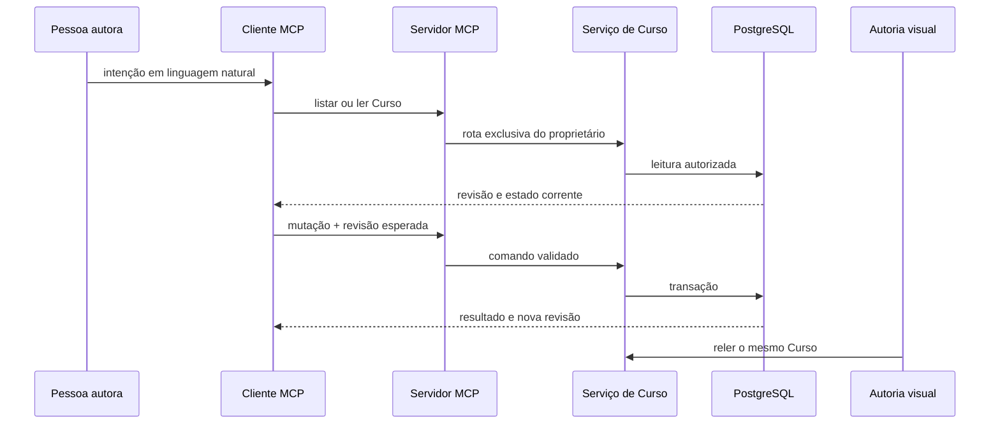

# Autoria remota por modelos de linguagem

Este capítulo ensina como um cliente conversacional opera a Autoria pelo
**Model Context Protocol (MCP)** sem criar uma segunda realidade. A interface
visual usa a API de Cursos, enquanto o cliente conversacional usa o MCP; ambos
leem e alteram o mesmo Curso vivo no PostgreSQL.

O ambiente hospedado oferece cinco ferramentas. Perfil e
gestão de acesso permanecem na aplicação autenticada. O escopo
`offline_access`, os aliases pareados e o upload autenticado integram o contrato
publicado.

## O problema que o serviço resolve

Uma conversa é adequada para intenções amplas, como planejar, comparar, revisar
ou reorganizar, mas texto livre não deve receber acesso irrestrito ao banco. Sem
uma fronteira tipada, cada cliente precisaria conhecer tabelas, autorização,
paginação, concorrência e contratos de componentes.

O serviço MCP oferece poucas ferramentas de produto. A pessoa descreve a
tarefa; o cliente escolhe a ferramenta, valida argumentos, chama o servidor e
apresenta o resultado. O servidor continua responsável por identidade,
propriedade, revisão, idempotência e invariantes.

Na interface visual, a pessoa inspeciona o conteúdo, registra Observações no
alvo exato e salva mudanças de Parâmetros. Esses registros permanecem visíveis
na Autoria e integram o mesmo Curso que o ChatGPT ou outro cliente conectado lê
por MCP. A conversa pode examinar vários registros, apresentar uma proposta e
receber correções ou objeções antes de qualquer escrita. A operação só é enviada
depois da aprovação explícita da pessoa no cliente conectado. A interface normal
não abre um compositor nem depende de copiar um pedido.

Curso, Módulo, Lição, Tópico, Microssequência, Unidade de estudo, Fonte, Âncora
e Parte de autoria podem ser alvos de conversa. Planejar e preparar estrutura
pertencem ao Curso ou à Parte; verificar Fonte pertence a Fonte ou Âncora;
corrigir pertence à Unidade; materializar pertence à Parte. Revisar e discutir
ficam disponíveis nos alvos em que ajudam a pessoa a argumentar sem iniciar uma
alteração automática.

Discutir ou recusar uma proposta não altera o Curso. Depois de uma operação
confirmada no cliente MCP, voltar à guia ou focalizar a janela do AraLearn
atualiza o cabeçalho canônico e a área visível. A ação de atualização do
cabeçalho oferece o mesmo caminho quando o navegador não sinaliza o retorno.
Essa releitura não pede nova confirmação para uma alteração já confirmada no
cliente.

Se uma confirmação ou um formulário estiver ativo, a releitura é adiada. O
AraLearn conserva os campos do rascunho e orienta a pessoa a concluir ou
cancelar antes de atualizar. Esse adiamento não confirma nem desfaz uma operação
no servidor.

## O que é MCP

MCP é um protocolo para um cliente descobrir ferramentas e recursos de
conhecimento expostos por um servidor. No AraLearn, o transporte usa JSON-RPC
sobre HTTP e a versão de protocolo `2025-11-25`.

Há duas classes de objeto:

- **ferramenta MCP:** executa uma leitura ou mutação tipada;
- **recurso MCP:** entrega conhecimento estável que pode ser lido sob demanda.

As cinco ferramentas são projetadas do protocolo público
`aralearn.authoring-protocol.v1`. Essa autoridade não é gerada a partir das
estruturas internas do domínio. `courseMcpTools` funciona como adaptador:
preserva o vocabulário público, acrescenta os metadados OAuth e MCP Apps do
transporte e converte cada chamada para o roteador e os validadores do backend.
Uma alteração interna, portanto, não muda silenciosamente o esquema descoberto
por `tools/list`.

O protocolo possui três níveis de identidade. O sufixo v1 do identificador
aponta para o major público, `schemaVersion` identifica o snapshot semântico e o
fingerprint SHA-256 identifica exatamente seu catálogo. `initialize` usa a
`schemaVersion` em `serverInfo.version`; `initialize` e `tools/list` expõem os
três valores em `_meta.authoringContract`. As respostas HTTP, a descoberta OAuth
e o preflight repetem a identidade em
`X-AraLearn-Authoring-Contract`.

O servidor permanece sem sessão e não anuncia `listChanged`, pois não emite a
notificação correspondente. Depois de publicar outro snapshot compatível, um
cliente que conservou a descoberta anterior precisa reconectar a integração. O
fingerprint permite distinguir esse cache de uma Edge Function realmente
defasada.

As instruções permanentes contêm somente invariantes transversais: Curso vivo,
leitura focal antes da escrita, revisões correntes, ausência de invenção e ciclo
de proposta, aplicação e verificação. Planejamento, desenho, materialização,
Fontes, inspeção, Auditoria e componentes possuem recursos próprios sob
`aralearn://authoring/*`. A primeira leitura pertinente também devolve
`phaseGuidance`; assim o cliente recebe a orientação da fase sem carregar
simultaneamente os manuais das demais fases.

O recurso visual opcional `ui://aralearn/course-inspector/0.0.24.html` segue a
extensão MCP Apps. Ele representa focos de inspeção agrupados por
Microssequência, a prévia de uma Unidade de estudo, os indicadores agregados de
Pesquisa e a comparação de Variantes; também apresenta um resumo adequado para
as demais operações da biblioteca de componentes. No foco, cada Unidade traz
referência curta, conteúdo final, prática já resolvida, feedback e desenho
contextual sob divulgação progressiva. Um cliente sem MCP Apps continua
recebendo a forma textual canônica do mesmo resultado autorizado.

A política estável do MCP Apps não permite a compilação WebAssembly usada pelos
diagramas Graphviz. Nesses componentes, o recurso apresenta a descrição textual
equivalente e o endereço autorizado, sem tentar afrouxar a política do cliente.
Os demais componentes conservam a prévia visual.

Plano, parâmetros, orientações, política de componentes, fontes, observações,
rodadas, achados e correções não devem ser copiados para esse recurso nem
fixados nas instruções do cliente. Eles pertencem ao Curso e precisam poder mudar
sem reconstruir o assistente.

## Componentes e fluxo de uma alteração

**Descrição textual:** a pessoa formula a intenção no cliente; o cliente lê o
Curso, chama uma ferramenta com dados tipados e recebe o novo estado; a
interface visual consulta a mesma raiz depois da alteração.



O MCP não acessa tabelas diretamente. `courseMcpTools` mapeia cada chamada para
o roteador canônico; `CourseSupabaseAdapter` autentica a pessoa e chama apenas
as funções de serviço permitidas.

## Autenticação e autorização

Cada cliente usa OAuth com uma conta individual do AraLearn. Os metadados
anunciam exatamente `offline_access`; a troca do código
e a renovação devolvem access token e refresh token, sem `id_token`. O access
token é destinado ao recurso MCP e traz aliases pareados da pessoa e da sessão
em `sub` e `session_id`, específicos do cliente OAuth; ele não é uma sessão da
aplicação. O JWT também conserva `aralearn_session_id`, identificador real e
correlacionável da sessão de origem usado somente pelo servidor para conferir
vida e consentimento. A credencial inteira continua sendo um segredo, não um
identificador anônimo. Uma chave administrativa compartilhada não é credencial
de cliente.

O fluxo interativo usa código de autorização com PKCE S256. O endereço protegido
publica metadados OAuth em `/.well-known/oauth-protected-resource`, e respostas
401/403 incluem o desafio necessário para reconectar a conta.

A Edge Function verifica a assinatura ES256 com chave EC P-256 pela JWKS do
emissor, além de emissor, destinatário, tempos e escopo. Só depois uma RPC de
serviço resolve a pessoa e confirma que sessão de origem, cliente e
consentimento OAuth permanecem vivos. O bearer é recusado quando usado
diretamente no GoTrue, na API de dados ou no Storage. Propriedade do Curso ainda
é revalidada em cada operação.

Consentimentos e sessões OAuth encerrados não renovam acesso. Um token já
emitido permanece criptograficamente válido somente até `exp`. A verificação
operacional está em [Implantação](implantacao.md).

As regras correntes são deliberadamente simples:

- ferramentas de Autoria listam e alteram somente Cursos próprios;
- Curso compartilhado não aparece no MCP autoral;
- acesso direto concede somente Estudo no Curso original; a cópia pessoal é
  criada exclusivamente pela aplicação e só depois passa a ser um Curso próprio;
- o escopo `offline_access` permite renovar a conexão, mas não concede escrita
  por si; depois de validar token, sessão de origem, cliente e consentimento, o
  servidor cria um principal interno com as capacidades `authoring:read` e
  `authoring:write`. Elas não são escopos OAuth solicitáveis pelo cliente. Cada
  mutação ainda depende da ferramenta admitida, da propriedade do Curso e das
  revisões esperadas;
- perfil e acesso continuam sujeitos à identidade da sessão e à propriedade;
- o servidor nunca confia num identificador enviado pelo cliente para ampliar
  autoridade.

## Ferramentas correntes

### `listarCursos`

Lista Cursos próprios em páginas de até 50 itens. Aceita busca opcional e cursor
formado por data de atualização e identidade. A resposta é fina e inclui links
para a interface visual; não carrega toda a composição.

Use-a primeiro quando a pessoa nomear um Curso por título. Não escolha entre
homônimos sem confirmar o contexto.

### `lerCurso`

Lê uma destas projeções:

- `summary`: cabeçalho fino do Curso;
- `outline`: hierarquia compacta;
- `instructional_plan`: plano vivo, itens com identidades estáveis, Partes,
  vínculos, progresso derivado e atividade recente;
- `course_design`: catálogo pedagógico, valor local e efetivo por escopo,
  orientação original e interpretação, política de componentes, itens do plano
  atribuídos quando o escopo é uma Microssequência e resumo
  planejado×aplicado;
- `course_sources`: catálogo de Fontes, detalhe versionado de uma Fonte ou
  histórico de atribuições de um alvo, em projeção sem identidade de ator nem
  caminhos do Storage;
- `course_source_attachment`: leitura temporária de um PDF privado de uma
  revisão de Fonte, com declaração explícita antes de receber a URL assinada;
- `anchored_annotations`: caixa de entrada, anotações de um alvo ou detalhe de
  uma Anotação ancorada;
- `audit_cycle`: contexto focal, achados, rodadas ou detalhe de um achado ou de
  uma rodada de auditoria;
- `variant_comparisons`: conjuntos de Variantes ligados ao Curso;
- `variant_comparison`: comparação factual de um conjunto e suas revisões;
- `research`: fatos, métricas, filtros e páginas da área Pesquisa;
- `part_materialization`: uma execução persistida, seu contexto e fatos
  limitados, as etapas com versão e a próxima etapa pendente;
- `study_units`: Unidades de estudo em ordem curricular, com contexto, Parte e
  links profundos; com `inspectionFocusId`, lê somente o conjunto ordenado
  persistido pelo cliente;
- `entities`: página de entidades do Curso.

`entities` exige `expectedRevision`. O cursor contém tipo e identidade da
última entidade. Se a revisão mudar durante a paginação, a leitura é recusada;
o cliente deve reiniciar a partir do estado corrente.

`study_units` também exige `expectedRevision` e aceita os mesmos escopos da
sequência visual de Conteúdo: Curso, Parte de autoria, Unidades sem Parte, Módulo, Lição ou
Microssequência didática. `anchorStudyUnitId` inclui a Unidade escolhida na
primeira página; `cursor: {studyUnitId}` continua para frente ou para trás e
não pode coexistir com a âncora. A página normal contém 12 itens, o máximo é 24
e `maxBytes` fica entre 64 KiB e 1.500.000 bytes. O contrato falha fechado se a
resposta completa ultrapassar 1,75 MiB.

Quando `inspectionFocusId` está presente, o foco substitui escopo e âncora. A
página preserva a ordem escolhida, informa Unidades que deixaram de existir e
fornece um endereço que abre **Conteúdo** com o mesmo filtro. O registro conserva
somente Curso, revisão de origem, título e identidades das Unidades; o conteúdo
continua vindo do Curso vivo.

`part_materialization` exige `authoringPartId` e `materializationId`, ambos
obtidos do plano ou do recibo anterior. A resposta traz no máximo 64 etapas e
`nextPendingStep`; por isso um cliente novo retoma trabalho real sem depender
da conversa anterior. Se uma etapa falhou ou a execução terminou, o próximo
passo é nulo. Essa vista é exclusiva do proprietário e não inclui instruções
enviadas ao modelo nem raciocínio privado.

Antes de auditar ou alterar estrutura, percorra todas as páginas pertinentes.
Um resumo não demonstra que uma Unidade existe nem que sua composição é válida.

`course_design` recebe um escopo concreto de Curso, Módulo, Lição ou
Microssequência. A resposta traz o contexto progressivo, os quatro parâmetros,
a pilha de orientações, a política efetiva e as 32 opções da revisão exata do
catálogo de componentes. Parâmetros pedagógicos não aceitam override em Módulo;
orientação e política aceitam. `targetPlanItems` contém as listas de unidades de
análise e requisitos de evidência atribuídos quando o alvo é uma
Microssequência e vale `null` nos demais escopos. A leitura falha fechada acima
do limite executável de 256 KiB; não há promessa contratual de 96 KiB para
toda resposta normal.

`course_sources` exige `expectedRevision` e escolhe exatamente um modo:
`catalog`, `source` ou `target`. A leitura é exclusiva do proprietário, estrita e paginada em
até 24 itens. `source` recebe a identidade literal da Fonte; `target` recebe
`plan_item|study_unit` e a identidade do alvo. O cursor é opaco, não pode ser
fabricado pelo cliente e só vale sob a revisão lida. O catálogo traz a revisão
corrente; o detalhe preserva revisões e Âncoras; o alvo preserva atribuições
somente por acréscimo e indica qual ainda corresponde à versão e ao resumo
criptográfico atuais.

No MCP, a resposta usa `aralearn.mcp-course-sources.v1`. Identidades de ator e
de atribuição, resumo interno do alvo, Curso de origem do objeto e caminhos do
Storage permanecem fora; `dataDisclosure` registra essas omissões. A aplicação
autenticada conserva o DTO interno completo para suas próprias telas. Título,
  autoria declarada, identificador, citação, endereço, edição ou versão, localizador humano, trecho de
verificação e valores textuais dos seletores `text_quote` e `uri_fragment` são
campos livres potencialmente pessoais que integram o detalhe autoral;
`dataDisclosure` também os enumera quando esse recorte é enviado ao cliente
conectado, conforme os tipos de seletor efetivamente presentes.

Na aplicação, o DTO interno contém exatamente `contract`, `courseId`,
`courseRevision`, `mode`, `query`, `items` e `nextCursor`. A projeção MCP troca
o contrato por `aralearn.mcp-course-sources.v1`, omite `courseId` e acrescenta
`pdfStorage` e `dataDisclosure`. Em ambos os recortes, `query` explicita os três binds e deixa
nulos os que não pertencem ao modo. Cada vínculo de alvo tem
`{sourceId, sourceRevision, relation, anchors}`; cada referência de Âncora tem
`{anchorId, anchorRevision}`. Campos adicionais não são extensão tolerada.

`course_source_attachment` exige revisão do Curso, Fonte e revisão da Fonte. Na
aplicação, `prepare_upload` valida tipo, tamanho e resumo criptográfico e cria
uma intenção privada de dez minutos para o caminho e as revisões exatas; não
devolve URL de upload. O aplicativo envia o PDF ao Storage com sua sessão viva,
e a inserção consome a intenção. O MCP não oferece essa preparação porque seu
token não é uma sessão do aplicativo. No MCP, `download` exige
`includeAttachmentDownloadUrl: true` antes da chamada ao adaptador; a resposta
`aralearn.mcp-course-source-attachment-access.v1` omite caminhos e identidade
do Curso de Storage, identifica a URL como credencial temporária e a limita a
60 segundos. Depois do envio feito pela aplicação, `attach_pdf` confirma o
vínculo relacional. Há limite de 20 MiB por arquivo, 64 MiB de conteúdo único
por Curso e oito anexos por Fonte.

O backend emite v2 somente para `prepare_upload` e v1 somente para `download`.
Um upload incompatível falha fechado, sem restaurar URL assinada. A seleção
ocorre pela operação, nunca por `User-Agent`.

`anchored_annotations` escolhe `inbox`, `target` ou `detail`. A caixa de entrada
aceita filtros por origem, canal, estado, categoria, ausência de categoria,
assuntos e hierarquia com descendentes; o modo alvo exige identidade exata e o
detalhe exige `annotationId` e `includeObservationText: true`. A página admite no máximo 24 itens, cursor opaco
de até 240 caracteres e resposta de até 256 KiB. Cada item usa
`aralearn.mcp-anchored-annotation-page.v1`. A projeção comum contém somente
`annotationId`, versão, origem, canal, espécie e papel da pessoa contribuinte,
identidade opaca e rótulo educacional do alvo, revisão observada, síntese, classificação sem IDs,
estado e capacidades. Ela não envia `contributor.ref`, o rótulo protegido da
pessoa, caminhos do alvo, links profundos nem IDs de Tópico. A identidade opaca
do alvo permite localizar a Unidade, Fonte ou Âncora observada sem expor a
hierarquia. O texto
integral da Observação aparece somente no detalhe explicitamente declarado;
horários exatos permanecem fora. `dataDisclosure` identifica o destinatário
real — `connected_mcp_client` no MCP ou `connected_actions_gpt` em Actions —,
a finalidade e os campos omitidos. O texto de uma resposta autoral
anterior também permanece fora do MCP; o recorte informa apenas que ela existe
e sua espécie. A aplicação autenticada conserva o DTO interno completo para
suas próprias telas e ações.

Fonte e Âncora são alvos válidos dessa leitura, ao lado dos objetos da
hierarquia didática. O detalhe de uma Fonte pode, portanto, consultar a mesma
página de Anotações usada pela caixa de entrada. A categoria
`reformulation_request` identifica um pedido de reformulação ligado à Fonte ou
à Âncora exata.

`audit_cycle` escolhe `context`, `findings`, `runs` ou `detail`. `findings` e
`runs` são paginados, aceitam `targetStudyUnitId` opcional e usam cursor opaco;
`runs` enumera também rodadas limpas, sem achados. A página distingue a lista
`runs` do detalhe `runDetail`. No modo `detail`, o cliente informa exatamente
um entre `findingId` e `auditRunId`; o detalhe da rodada entrega todas as verificações
e suas evidências, e não apenas os achados derivados. A página admite até 24
itens, cursor de até 240 caracteres e resposta de até 240 KiB.

O contexto focal reúne a Unidade corrente, Microssequência, plano, desenho,
Fontes/Âncoras e até 12 Observações selecionadas. Uma referência a Observação
guarda somente identidade e versão. Enquanto uma retirada ainda existe como
registro de retirada, ela aparece `available: false` e sem link profundo. Depois da remoção
física prevista pelo ciclo de limpeza das Anotações, a exclusão em cascata remove apenas o
vínculo e o identificador da projeção; nenhum texto, pseudônimo ou dado pessoal
foi copiado para rodada, achado ou correção.

Cada parâmetro efetivo do desenho inclui seu `changeId` corrente. O cliente usa
essa identidade em `parameterRefs` para registrar quais decisões de desenho
foram realmente auditadas; valor e justificativa continuam legíveis, e o
servidor recusa referência herdada ou substituída que tenha ficado stale.

Ao pedir que o contexto MCP inclua textos de Observações selecionadas, o
cliente informa `includeObservationText: true`. Sem essa declaração, a leitura
é recusada; mesmo com ela, referências pessoais, rótulos protegidos, caminhos e
links internos permanecem fora da projeção.

`variant_comparisons` lista os conjuntos ligados ao Curso na revisão esperada.
`variant_comparison` exige `comparisonSetId` e devolve planejamento comum,
revisões dos Cursos, diferenças declaradas, desvios não declarados, diferenças
factuais e dados ausentes. Cada membro continua sendo um Curso independente.

`research` devolve o mesmo contrato da área Pesquisa. Aceita conjuntos,
estados, intervalo de datas, limite e cursor; a resposta preserva definições,
denominadores e dados ausentes. Os fatos são descritivos e não sustentam, por si
sós, uma conclusão causal ou de aprendizagem.

### `criarCurso`

Cria atomicamente um Curso privado vazio e seu plano instrucional inicial.
Exige:

- `requestId` estável para a intenção;
- título;
- objetivo.

O plano nasce vazio com preferência automática de 7–12 Partes. A faixa é um
ponto de partida editável e pesquisável, não uma prescrição sobre ensino.

Não cria recipiente, estágio editorial ou cópia de distribuição. A pessoa que
autenticou a chamada é proprietária.

### `alterarCurso`

Possui oito operações fechadas:

- `update_instructional_plan`: aplica um comando semântico ao plano, como atualizar
  campos naturais, incluir/editar/reordenar itens, incluir/editar/dividir/
  juntar/reordenar Partes ou mover vínculos de microssequência;
- `update_course_design`: define ou limpa parâmetro, orientação e política de
  componentes, registra interpretação ligada à revisão exata da orientação ou
  aplica `set_target_plan_items` para substituir as duas listas de itens de uma
  Microssequência;
- `update_course_sources`: cria ou revisa uma Fonte, aposenta Fonte ou Âncora,
  salva Âncora, confirma um PDF já enviado ou substitui o conjunto ordenado de
  Fontes de um item do plano ou de uma Unidade;
- `update_anchored_annotations`: cria ou revisa Anotação ancorada, retira,
  considera, responde, resolve, reabre ou corrige assuntos;
- `update_audit_cycle`: registra rodada, propõe ou rejeita correção, decide
  achado, aplica correção, verifica achado ou executa reversão;
- `update_course_variants`: cria Cursos variantes a partir de um ponto comum ou
  desvincula um membro sem excluir o Curso;
- `commit_course_composition`: inclui, substitui ou exclui entidades em lote;
- `advance_part_materialization`: inicia uma execução, registra uma etapa
  delimitada ou finaliza a materialização de uma Parte;
- `create_inspection_focus`: registra de uma a 64 Unidades ordenadas para
  inspeção incorporada e para o endereço filtrado da Autoria, sem avançar a
  revisão do Curso.

Todas exigem `courseId` e `requestId`. Operações de conteúdo exigem a revisão
esperada do Curso; em Anotações ancoradas ela aparece somente ao criar ou
corrigir assuntos. Alterar o plano exige também sua versão. Um comando carrega
intenção e identidades estáveis; o servidor calcula e persiste o alvo inteiro
na mesma transação.
O alvo do plano aceita até 192 vínculos de Microssequência no total e 512 KiB;
esse limite mantém sua leitura enriquecida abaixo do orçamento do transporte.

`update_course_sources` aceita somente os comandos `save_source`,
`retire_source`, `save_anchor`, `retire_anchor`, `attach_pdf` e
`set_target_sources`. Um
vínculo novo declara `informed_by`, `supported_by`, `adapted_from`,
`quoted_from`, `contrasted_with`, `exemplified_by`, `inspired_by` ou
`needs_verification` e exige ao menos uma Âncora ativa da revisão exata. Há no máximo
32 Fontes por alvo e oito identidades de Âncora por revisão de Fonte.
`legacy_reference` é apenas fato de
migração e nunca opção de escrita. Uma identidade legada não resolvida é
resolvida na mesma identidade, preservando literalmente o identificador; o cliente não a
normaliza nem cria substituto.

`save_source` registra somente metadados fornecidos ou verificados. Quando um
dado necessário à referência estiver ausente, o cliente conversa com a pessoa
antes de escrever e nunca o infere. Em `save_anchor`, `humanLocator` é opcional
e nomeia a localização declarada pelo material; `selector` continua sendo a
posição exata e independente.

`update_course_variants` aceita `create_comparison_variants` e
`detach_comparison_variant`. A criação recebe de duas a oito variantes, fixa o
ponto comum do planejamento e cria Cursos independentes com diferenças
declaradas de parâmetros ou política. A desvinculação exige confirmação e não
apaga Curso, conteúdo, acesso nem estado pessoal.

`update_anchored_annotations` aceita os oito comandos fechados
`create_anchored_annotation`, `revise_anchored_annotation`,
`withdraw_anchored_annotation`, `consider_anchored_annotation`,
`respond_to_anchored_annotation`, `resolve_anchored_annotation`,
`reopen_anchored_annotation` e `correct_anchored_annotation_subjects`. Criar
exige `confirmed: true` depois de confirmação humana e `briefSummary` não nulo
nem vazio; o servidor remove `confirmed` antes de chamar o domínio. Texto bruto
tem 2.000 escalares/16 KiB, síntese 500/4 KiB e resposta 2.000/16 KiB.

Há várias anotações por ator e alvo. Estados são apenas
`open|considered|resolved|withdrawn`. Classificação automática exata ocorre
somente em alvo Tópico; a correção de assuntos é um fato humano separado.
Criar e corrigir assuntos exigem também a revisão esperada do Curso. Revisar,
responder e mudar estado usam a versão esperada da anotação e o contador global
do conjunto, pois o MCP é exclusivo do proprietário, sem avançar a revisão de conteúdo apenas
pela triagem. A projeção de Estudo usa outro contador privado por pessoa; ele
não cria ferramenta nem estado MCP adicional.

O comando de criação aceita também os alvos `source` e `source_anchor` e a
categoria `reformulation_request`. Ao responder, `responseKind: "answer"`
exige `consideredSourceLinks` vazio. `responseKind: "reformulation"` exige ao
menos um vínculo canônico com revisão de Fonte e uma ou mais Âncoras vigentes.
O recibo devolve essa base na resposta da pessoa autora.

`update_audit_cycle` aceita sete comandos fechados: `record_audit`,
`propose_authoring_correction`, `reject_authoring_correction`,
`decide_finding`, `apply_authoring_correction`, `verify_finding` e
`rollback_authoring_correction`. O envelope do ciclo aceita no máximo 192 KiB.
`auditCommand.confirmed: true` é obrigatório apenas para aplicar ou executar
`rollback_authoring_correction`; os outros cinco comandos recusam esse campo. O servidor retira a
confirmação antes de chamar o domínio.

Uma rodada registra exatamente três verificações humanas nas dimensões pedagógica, factual e
editorial; o servidor acrescenta a verificação estrutural determinística, sob máximo
de 32 verificações. Cada resultado é
`passed|failed|uncertain|not_applicable|not_checked`, com até 16 achados na
rodada. Rodada imutável, versões somente por acréscimo de achado e correção e a junção com
Anotações são autoridades privadas distintas.

A correção v1 só substitui conteúdo e o conjunto completo de Fontes da Unidade
focal existente. Ela preserva `topics` legítimos e não cria, apaga, move,
reposiciona ou muda o pai de uma entidade. Uma operação sem efeito é recusada.
A aplicação conserva o ponto de controle `before|after`, com até 48 KiB por
estado e 96 KiB no conjunto, e avança o achado para `awaiting_verification`; a
reversão exige que o estado aplicado ainda corresponda ao ponto de controle. Ambos reutilizam
`course_change_receipts`, com resultado de até 64 KiB, e são as únicas operações
do ciclo que criam `course_events`.

Verificação registra outra rodada e informa `resolved|still_open`. Resolver
exige que o critério focal tenha passado; `still_open` reabre. Evidência factual
positiva ou resolução factual exige Fonte e Âncora ativas na revisão exata:
`supported_by` sustenta afirmações e `quoted_from` só vale para
`quotation_fidelity`. A verificação sincroniza atomicamente o estado das
Observações vinculadas compatíveis com `resolved|still_open` e devolve
`suggestedAnnotationActions` vazio. Quando outra transição, como a reversão de
correção, devolve uma sugestão, executá-la ainda requer comando explícito de
`update_anchored_annotations` com a versão corrente.

O recibo de Fonte contém exatamente `contract`, `courseId`, `courseRevision`,
`requestId`, `idempotent`, `changed` e `change`. `change` é nulo quando não há alteração; caso
contrário, contém `type`, `subjectId` e `revision`, e `changed` precisa refletir
essa diferença.

Cada grupo de composição aceita no máximo 200 itens. Uma etapa de
materialização aceita no máximo 64 mudanças de entidade e 256 KiB, fixa a
versão da Parte e mantém conteúdo, etapa, vínculo, revisão, evento e recibo na
mesma transação. A execução persiste o próximo passo; repetir a mesma chamada
recupera o recibo antes do CAS. A transação valida pais, posições, identidades,
conteúdo de cada linha pelo tipo
`module|lesson|topic|microsequence|study_unit`; o banco verifica `dependsOn`
somente nas Lições afetadas. A escrita permanece segmentada e não recompõe o
Curso integral antes de cada confirmação. Excluir ou reordenar uma Parte nunca
exclui a composição didática.

`commit_course_composition` não aceita `sources` dentro de `studyUnits`. Para
cada Unidade incluída ou substituída, o pedido leva exatamente uma entrada em
`sourceAttributionApplications` com o conjunto completo de vínculos, inclusive
quando vazio. Entidades, atribuições, revisão, evento e recibo confirmam ou
revertem juntos.

A API do aplicativo reutiliza essa composição com uma forma mais estreita para
a edição contextual: exatamente uma Unidade existente, nenhuma exclusão,
versão esperada da Unidade e origem `manual` ou `provider_assistance`. O
servidor registra canal e origem no recibo e no evento. A forma de resposta do
canal MCP permanece inalterada e não recebe esses campos internos.

Para repetir uma edição depois de resposta perdida, a interface conserva sob o
mesmo `requestId` o conjunto de Fontes lido antes da primeira tentativa. A
transação aceita referências históricas somente como carga JSONB idêntica da
proveniência efetiva anterior; vínculo novo ou modificado continua exigindo
Fonte e Âncora ativas. Essa regra não oferece ao MCP uma forma de criar
`legacy_reference`.

O início de uma materialização não aceita contexto declarado pelo cliente. O
servidor resolve e sela parâmetros, orientações, política e atribuições de
Fontes dos itens do plano para as Microssequências-alvo. O contexto
`aralearn.course-design-context.v2` inclui catálogos de itens como
`{id, position, statement, version}` e, em cada alvo, somente os IDs atribuídos
a ele, além das revisões e Âncoras seladas. Cada `record_step` apresenta uma
aplicação factual limitada e aplicações
`aralearn.course-source-attribution-application.v1`; somente fatos presentes
no contexto podem ser gravados. Conteúdo, vínculos, atribuições, etapa, evento e
recibo são atômicos sob o resumo criptográfico do contexto.

Formas de explicação, oportunidades e dimensões de variação são declarações do
cliente conversacional ou da pessoa autora com esquema, referências, contagens e coerência
interna validados; não são inferidas semanticamente da prosa pelo banco. A
transação reconcilia materialmente os IDs de Unidades, o pai/alvo e os
`componentRefs` do conteúdo. Referência desconhecida, excluída ou fora de
`allow_only` reverte o lote inteiro.

O cliente deve reler depois da escrita. Uma resposta de sucesso demonstra que
a transação foi aceita, não que a mudança é pedagogicamente adequada.

### Gestão de Pessoas permanece na aplicação

As cinco operações de perfil e acesso continuam disponíveis somente pela API
autenticada da aplicação:

| Operação | Efeito |
| --- | --- |
| `read_profile` | lê nome e chave de avatar da própria pessoa |
| `update_profile` | altera nome ou referência de avatar já enviada |
| `list_access` | lista proprietário e pessoas com acesso ao Curso próprio |
| `grant_access` | concede Estudo a uma conta localizada por e-mail exato |
| `revoke_access` | revoga pelo identificador retornado na lista |

Conceder e revogar usam `requestId` e confirmação na interface. A operação não
pesquisa diretório nem sugere contas. A fotografia é enviada pelo fluxo seguro
do Storage. Nenhuma dessas operações é anunciada como ferramenta MCP, de modo
que nome, referência protegida e e-mail-alvo não são enviados ao cliente
conversacional.

A concessão devolve o mesmo recibo de solicitação para conta existente,
inexistente, própria, já favorecida ou tentativa limitada. São permitidas dez
tentativas por ator em dez minutos. A auditoria operacional conserva apenas
ator, tempos e contadores agregados, sem e-mail ou hash do e-mail, e fica
elegível à limpeza depois de 30 dias.

Essa igualdade vale para a resposta imediata. Uma releitura posterior da lista
de Pessoas pode mostrar a relação realmente concedida e, assim, revelar o
resultado ao proprietário autorizado. O risco residual é explícito; esta
revisão não introduz convite pendente para escondê-lo.

### `consultarComponentesDidaticos`

Descobre e valida a biblioteca sem carregar todos os contratos no contexto:

1. `explore` apresenta famílias e facetas;
2. `search` encontra candidatos por intenção;
3. `inspect` compara poucos pacotes;
4. `contracts` entrega o contrato exato necessário;
5. `validate_study_unit` valida uma Unidade composta;
6. `audit_representation` confronta composição e intenção;
7. `preview_study_unit` prepara inspeção fiel ao renderizador.

## Concorrência e repetição segura

Cada Curso possui uma revisão inteira crescente. Uma mutação só é aceita quando
`expectedRevision` coincide com a revisão corrente. Esse mecanismo é
**compare-and-swap (CAS)**: comparar a revisão lida e trocar o estado numa única
transação.

O plano e cada execução de materialização também possuem versões próprias.
Assim, uma mudança alheia fora da Parte não apaga trabalho em andamento, mas
alterar a própria Parte ou repetir uma etapa sobre uma versão antiga produz um
conflito explícito. Enquanto uma execução está em andamento, cabeçalho e
itens independentes do plano continuam editáveis; a Parte, sua posição e seus
vínculos ficam protegidos até a execução terminar ou ser marcada como falha.

Cada mutação também possui `requestId`. O servidor conserva um recibo pequeno e
temporário:

- pedido repetido com o mesmo conteúdo recupera o resultado;
- o mesmo identificador com outro conteúdo é recusado;
- recibos de Curso, acesso e Anotações ancoradas expiram em até 14 dias;
- o recibo não é histórico de conversa nem cópia do Curso.

Para Anotações, essa expiração é autoritativa: o recibo deixa de admitir
repetição no prazo. A remoção física ocorre oportunisticamente durante leituras
e mutações do Curso, em um lote de até 128 registros de retirada e 256 recibos
expirados a cada operação. A rotina privada diária
acrescenta um lote de até 512 itens por classe, devolve contagens e torna a limpeza
independente da abertura do Curso.

Diante de conflito de revisão, não aumente o número e tente novamente às cegas.
Releia, compare a intenção com o estado novo e proponha a reconciliação.

## Conhecimento estável e estado dinâmico

O servidor entrega instruções curtas no `initialize` e pelo recurso de
invariantes. O Curso conserva dados mutáveis:

- título e objetivo;
- plano instrucional com público, escopo, faixa preferencial,
  resultados pretendidos, unidades de análise e requisitos de evidência;
- parâmetros pedagógicos, orientações autorais versionadas, interpretações e
  política de componentes por escopo;
- atribuições muitos-para-muitos de unidades de análise e requisitos de
  evidência às Microssequências;
- catálogo privado e versionado de Fontes e Âncoras, mais atribuições
  somente por acréscimo a itens do plano e Unidades;
- Partes operacionais, seus vínculos e execuções de materialização;
- composição didática;
- Anotações ancoradas autorais e estudantis, com contador global exclusivo do
  proprietário e contador privado por pessoa na projeção de Estudo;
- rodadas imutáveis, versões de achados, vínculos protegidos com Observações e
  correções versionadas;
- fatos, métricas, filtros e exportações da área Pesquisa;
- pontos comuns, membros e comparações factuais de Variantes.

Essa separação evita que mudar o planejamento exija editar as instruções fixas
do cliente ou reconstruir uma base fixa. Também evita persistir conversa integral ou
raciocínio privado como se fossem dados do produto.

## Respostas, erros e limites

Ferramentas retornam `structuredContent` no formato:

```json
{
  "ok": true,
  "requestId": "identificador-ou-null",
  "data": {}
}
```

Falhas de ferramenta retornam `ok: false`, código, mensagem e detalhes seguros.
Erros previsíveis incluem:

- autenticação ausente ou revogada;
- escopo insuficiente;
- Curso inexistente ou não pertencente à pessoa;
- revisão desatualizada;
- `requestId` reutilizado com outro comando;
- Fonte, revisão, Âncora, relação ou alvo inválido;
- rodada, achado, correção, critério focal ou evidência inválida;
- confirmação indevida num comando não destrutivo do ciclo de auditoria;
- entidade, plano, Parte ou etapa de materialização inválida;
- solicitação de acesso recebida sem revelar se o e-mail possui conta;
- confirmação ausente;
- limite do corpo do pedido ou prazo excedido.

O transporte aceita pedidos de até 1 MiB, e as ferramentas usam limites ainda
menores por campo e lote. A leitura `study_units` possui orçamento próprio de
resposta, com limite máximo de 1,75 MiB sob o teto de 2 MiB. O prazo de uma
chamada não autoriza aumentar o lote indefinidamente; a produção por Partes
precisa respeitar limites reais de modelo, rede e transação.

As leituras de Fontes têm resposta máxima de 256 KiB, página de até 24 itens e
cursor opaco de até 240 caracteres. Metadados e URLs ficam no PostgreSQL; o
contrato não envia arquivos de referência ao Storage. Esses limites reduzem
transferência, mas o crescimento somente por acréscimo e o consumo real de
banco, saída de dados e funções ainda precisam ser medidos antes de afirmar
sustentabilidade no plano gratuito.

O ciclo de auditoria limita páginas e resultados de mudança a 240 KiB, comandos
a 192 KiB, 256 rodadas por Curso com reserva para correções aplicadas, 1.024
identidades de achado, 64 correções por Curso e oito por achado. Históricos
projetados também são limitados. Auditoria e correção exigem conexão: não há
relação local, cópia autoritativa nem fila de envio delas no IndexedDB.

## Configuração

O endereço tem a forma:

```text
https://<project-ref>.supabase.co/functions/v1/aralearn-authoring-mcp
```

Para conectar um cliente:

1. confirme que migrações e manifesto pertencem à mesma revisão e que o
   fingerprint da Edge Function corresponde ao protocolo local;
2. cadastre o cliente OAuth e seus endereços de redirecionamento;
3. configure o endereço acima;
4. autentique uma conta individual;
5. confira a descoberta das cinco ferramentas, seu `_meta.authoringContract`,
   os recursos focais de autoria e, num cliente compatível, o recurso visual
   versionado;
6. faça primeiro uma leitura sem mutação;
7. teste criação e alteração somente num Curso de desenvolvimento.

## Verificação

A verificação cobre protocolo, OAuth, registro de ferramentas, roteamento,
autorização, concorrência e contratos:

```powershell
node --test tests/runtime/course-mcp-server.test.js
node --test tests/runtime/course-mcp-tools.test.js
node --test tests/runtime/course-tool-executor.test.js
node --test tests/runtime/course-router.test.js
node --test tests/runtime/authoring-protocol-compatibility.test.js
npm run test:authoring:mcp:local
npm run test:authoring:mcp:local:oauth
npm run test:authoring:supabase:e2e
```

O último teste exige Supabase e todas as Edge Functions locais em execução,
credenciais efêmeras e `ARALEARN_E2E_REAL_SUPABASE=1`. Ele atravessa a interface
servida por `public/main.js`, IndexedDB, API de Cursos, PostgreSQL, Storage, RLS,
registro e autorização OAuth com PKCE e chamadas MCP. A mesma jornada cria a
estrutura mínima, vincula uma Microssequência à Parte, inicia uma materialização,
registra a etapa de contexto, relê `part_materialization` e comprova a chegada do
andamento à interface e ao IndexedDB. Abrir **Ver etapas** não envia nova escrita
nem repete a confirmação já feita no cliente MCP. O teste encerra removendo os
dados descartáveis criados. A jornada também cobre edição manual, assistência
com provider simulado, eventos `manual` e `provider_assistance`, releitura da API e do
PostgreSQL e promoção no IndexedDB.

Essa prova é local e automatizada. Ela não comprova, sozinha, a usabilidade da
assistência num navegador ou aparelho real nem o fluxo dentro de um cliente
externo. A verificação hospedada só deve ser executada depois que as
migrations remotas estiverem em paridade com `supabase/runtime-manifest.json`.
O smoke hospedado também compara o cabeçalho e o metadado servidos, além do
esquema completo de `tools/list`, com o catálogo canônico local. Somente
`securitySchemes` e metadados próprios do transporte são retirados antes dessa
comparação.

## Referências normativas e técnicas

- [Model Context Protocol: especificação 2025-11-25](https://modelcontextprotocol.io/specification/2025-11-25)
- [MCP Apps: extensão estável 2026-01-26](https://github.com/modelcontextprotocol/ext-apps/blob/main/specification/2026-01-26/apps.mdx)
- [Supabase Auth como servidor OAuth 2.1](https://supabase.com/docs/guides/auth/oauth-server)
- [OAuth 2.0 Security Best Current Practice: RFC 9700](https://www.rfc-editor.org/rfc/rfc9700)
- [Proof Key for Code Exchange: RFC 7636](https://www.rfc-editor.org/rfc/rfc7636)
- [OAuth 2.0 Protected Resource Metadata: RFC 9728](https://www.rfc-editor.org/rfc/rfc9728)
