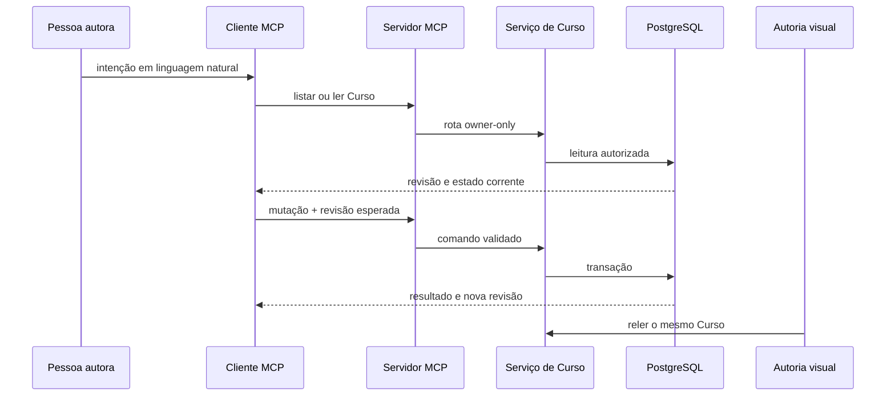

# Autoria remota por modelos de linguagem

Este capítulo ensina como um cliente conversacional opera a Autoria pelo
**Model Context Protocol (MCP)** sem criar uma segunda realidade. A interface
visual e o MCP leem e alteram o mesmo Curso vivo no PostgreSQL.

## O problema que o serviço resolve

Uma conversa é adequada para intenções amplas — planejar, comparar, revisar ou
reorganizar —, mas texto livre não deve receber acesso irrestrito ao banco. Sem
uma fronteira tipada, cada cliente precisaria conhecer tabelas, autorização,
paginação, concorrência e contratos de componentes.

O serviço MCP oferece poucas ferramentas de produto. A pessoa descreve a
tarefa; o cliente escolhe a ferramenta, valida argumentos, chama o servidor e
apresenta o resultado. O servidor continua responsável por identidade,
propriedade, revisão, idempotência e invariantes.

## O que é MCP

MCP é um protocolo para um cliente descobrir ferramentas e recursos de
conhecimento expostos por um servidor. No AraLearn, o transporte usa JSON-RPC
sobre HTTP e a versão de protocolo `2025-11-25`.

Há duas classes de objeto:

- **ferramenta MCP:** executa uma leitura ou mutação tipada;
- **recurso MCP:** entrega conhecimento estável que pode ser lido sob demanda.

O recurso corrente é `aralearn://authoring/invariants`. Ele contém somente
invariantes de operação: Curso vivo, leitura antes de escrita, estado dinâmico
persistido, Parte como agrupamento operacional, descoberta progressiva de
componentes, materialização por etapas retomáveis e síntese breve do resultado.

Plano, parâmetros, fontes, observações e configuração de pesquisa não devem
ser copiados para esse recurso nem fixados no prompt do cliente. Eles pertencem
ao Curso e precisam poder mudar sem reconstruir o assistente.

## Componentes e fluxo de uma alteração

**Descrição textual:** a pessoa formula a intenção no cliente; o cliente lê o
Curso, chama uma ferramenta com dados tipados e recebe o novo estado; a
interface visual consulta a mesma raiz depois da alteração.



O MCP não acessa tabelas diretamente. `courseMcpTools` mapeia cada chamada para
o roteador canônico; `CourseSupabaseAdapter` autentica a pessoa e chama apenas
as funções de serviço permitidas.

## Autenticação e autorização

Cada cliente usa OAuth com uma conta individual do AraLearn. O token identifica
a sessão; o servidor ainda revalida a propriedade do Curso em cada operação.
Uma chave administrativa compartilhada não é credencial de cliente.

O fluxo interativo usa Authorization Code com PKCE S256. O endpoint protegido
publica metadata OAuth em `/.well-known/oauth-protected-resource`, e respostas
401/403 incluem o desafio necessário para reconectar a conta.

As regras correntes são deliberadamente simples:

- ferramentas de Autoria listam e alteram somente Cursos próprios;
- Curso compartilhado não aparece no MCP autoral;
- acesso direto concede somente Estudo;
- mutações exigem escopo de escrita;
- perfil e acesso continuam sujeitos à identidade da sessão e à propriedade;
- o servidor nunca confia num identificador enviado pelo cliente para ampliar
  autoridade.

## Ferramentas correntes

### `listarCursos`

Lista Cursos próprios em páginas de até 50 itens. Aceita busca opcional e cursor
formado por data de atualização e identidade. A resposta é fina e inclui links
para a interface visual; não carrega toda a composição.

Use-a primeiro quando a pessoa nomear um Curso por título. Não escolha entre
homônimos sem confirmar o contexto.

### `lerCurso`

Lê uma destas projeções:

- `summary`: cabeçalho fino do Curso;
- `outline`: hierarquia compacta;
- `instructional_plan`: plano vivo, itens com identidades estáveis, Partes,
  vínculos, progresso derivado e atividade recente;
- `part_materialization`: uma tentativa persistida, seu contexto e fatos
  limitados, as etapas com versão e a próxima etapa pendente;
- `entities`: página de entidades do Curso.

`entities` exige `expectedRevision`. O cursor contém tipo e identidade da
última entidade. Se a revisão mudar durante a paginação, a leitura é recusada;
o cliente deve reiniciar a partir do estado corrente.

`part_materialization` exige `authoringPartId` e `materializationId`, ambos
obtidos do plano ou do recibo anterior. A resposta traz no máximo 64 etapas e
`nextPendingStep`; por isso um cliente novo retoma trabalho real sem depender
da conversa anterior. Se uma etapa falhou ou a tentativa terminou, o próximo
passo é nulo. Essa vista é owner-only e não inclui prompt nem raciocínio privado.

Antes de auditar ou alterar estrutura, percorra todas as páginas pertinentes.
Um resumo não demonstra que uma Unidade existe nem que sua composição é válida.

### `criarCurso`

Cria atomicamente um Curso privado vazio e seu plano instrucional inicial.
Exige:

- `requestId` estável para a intenção;
- título;
- objetivo.

O plano nasce vazio com preferência automática de 7–12 Partes. A faixa é um
ponto de partida editável e pesquisável, não uma prescrição sobre ensino.

Não cria recipiente, estágio editorial ou cópia de distribuição. A pessoa que
autenticou a chamada é proprietária.

### `alterarCurso`

Possui três operações fechadas:

- `update_instructional_plan`: aplica um comando semântico ao plano — atualizar
  campos naturais, incluir/editar/reordenar itens, incluir/editar/dividir/
  juntar/reordenar Partes ou mover vínculos de microssequência;
- `commit_course_composition`: inclui, substitui ou exclui entidades em lote;
- `advance_part_materialization`: inicia uma tentativa, registra uma etapa
  delimitada ou finaliza a tentativa de uma Parte.

Todas exigem `courseId`, `requestId` e a revisão esperada do Curso. Alterar o
plano exige também sua versão. Um comando carrega intenção e identidades
estáveis; o servidor calcula e persiste o alvo inteiro na mesma transação.
O alvo do plano aceita até 192 vínculos de Microssequência no total e 512 KiB;
esse limite mantém sua leitura enriquecida abaixo do orçamento do transporte.

Cada grupo de composição aceita no máximo 200 itens. Uma etapa de
materialização aceita no máximo 64 mudanças de entidade e 256 KiB, fixa a
versão da Parte e mantém conteúdo, etapa, vínculo, revisão, evento e recibo na
mesma transação. A tentativa persiste o próximo passo; repetir a mesma chamada
recupera o recibo antes do CAS. A transação valida pais, posições, identidades,
conteúdo e recomposição do documento. Excluir ou reordenar uma Parte nunca
exclui a composição didática.

O cliente deve reler depois da escrita. Uma resposta de sucesso demonstra que
a transação foi aceita, não que a mudança é pedagogicamente adequada.

### `gerirPessoas`

Agrupa cinco operações estreitamente relacionadas:

| Operação | Efeito |
| --- | --- |
| `read_profile` | lê nome e chave de avatar da própria pessoa |
| `update_profile` | altera nome ou referência de avatar já enviada |
| `list_access` | lista proprietário e pessoas com acesso ao Curso próprio |
| `grant_access` | concede Estudo a uma conta localizada por e-mail exato |
| `revoke_access` | revoga pelo identificador retornado na lista |

Conceder e revogar exigem `confirmed: true` depois de confirmação humana clara
e usam `requestId`. A ferramenta não pesquisa diretório, não sugere contas e
não devolve o e-mail. A fotografia é enviada pelo fluxo seguro do Storage; o
MCP apenas registra ou remove a chave já autorizada.

### `consultarComponentesDidaticos`

Descobre e valida a biblioteca sem carregar todos os contratos no contexto:

1. `explore` apresenta famílias e facetas;
2. `search` encontra candidatos por intenção;
3. `inspect` compara poucos pacotes;
4. `contracts` entrega o contrato exato necessário;
5. `validate_card` valida uma Unidade composta;
6. `audit_representation` confronta composição e intenção;
7. `preview_card` prepara inspeção fiel ao renderer.

## Concorrência e repetição segura

Cada Curso possui uma revisão inteira crescente. Uma mutação só é aceita quando
`expectedRevision` coincide com a revisão corrente. Esse mecanismo é
**compare-and-swap (CAS)**: comparar a revisão lida e trocar o estado numa única
transação.

O plano e cada tentativa de materialização também possuem versões próprias.
Assim, uma mudança alheia fora da Parte não apaga trabalho em andamento, mas
alterar a própria Parte ou repetir uma etapa sobre uma versão antiga produz um
conflito explícito. Enquanto uma tentativa está em andamento, cabeçalho e
itens independentes do plano continuam editáveis; a Parte, sua posição e seus
vínculos ficam cercados até a tentativa terminar ou ser marcada como falha.

Cada mutação também possui `requestId`. O servidor conserva um recibo pequeno e
temporário:

- pedido repetido com o mesmo conteúdo recupera o resultado;
- o mesmo identificador com outro conteúdo é recusado;
- recibos de Curso e acesso expiram em até 14 dias;
- o recibo não é histórico de conversa nem cópia do Curso.

Diante de conflito de revisão, não aumente o número e tente novamente às cegas.
Releia, compare a intenção com o estado novo e proponha a reconciliação.

## Conhecimento estável e estado dinâmico

O servidor entrega instruções curtas no `initialize` e pelo recurso de
invariantes. O Curso conserva dados mutáveis:

- título e objetivo;
- plano instrucional com público, escopo, orientação, faixa preferencial,
  resultados pretendidos, unidades de análise e requisitos de evidência;
- Partes operacionais, seus vínculos e tentativas de materialização;
- composição didática;
- futuramente, parâmetros, fontes, observações autorais e configuração de
  pesquisa quando essas fatias forem implementadas.

Essa separação evita que mudar o planejamento exija editar o prompt de sistema
ou reconstruir uma base fixa. Também evita persistir conversa integral ou
raciocínio privado como se fossem dados do produto.

## Respostas, erros e limites

Ferramentas retornam `structuredContent` no formato:

```json
{
  "ok": true,
  "requestId": "identificador-ou-null",
  "data": {}
}
```

Falhas de ferramenta retornam `ok: false`, código, mensagem e detalhes seguros.
Erros previsíveis incluem:

- autenticação ausente ou revogada;
- escopo insuficiente;
- Curso inexistente ou não pertencente à pessoa;
- revisão desatualizada;
- `requestId` reutilizado com outro comando;
- entidade, plano, Parte ou etapa de materialização inválida;
- e-mail sem conta correspondente;
- confirmação ausente;
- limite de payload ou prazo excedido.

O transporte aceita mensagens de até 1 MiB, e as ferramentas usam limites
ainda menores por campo e lote. O prazo de uma chamada não autoriza aumentar lote
indefinidamente; produção por Partes precisa respeitar limites reais de modelo,
rede e transação.

## Configuração

O endpoint tem a forma:

```text
https://<project-ref>.supabase.co/functions/v1/aralearn-authoring-mcp
```

Para conectar um cliente:

1. confirme que migrations, manifesto e Edge Function pertencem à mesma
   revisão;
2. cadastre o cliente OAuth e seus endereços de redirecionamento;
3. configure o endpoint acima;
4. autentique uma conta individual;
5. confira a descoberta das seis ferramentas e do recurso de invariantes;
6. faça primeiro uma leitura sem mutação;
7. teste criação e alteração somente num Curso de desenvolvimento.

Os materiais de empacotamento ficam em [`authoring/`](../authoring/README.md).
Eles precisam ser regenerados para corresponder ao mesmo registro de
ferramentas, manifesto e revisão do backend.

## Verificação

A verificação focal cobre protocolo, OAuth, registro de ferramentas, roteamento,
autorização, concorrência e contratos:

```powershell
node --test tests/runtime/course-mcp-server.test.js
node --test tests/runtime/course-mcp-tools.test.js
node --test tests/runtime/course-tool-executor.test.js
node --test tests/runtime/course-router.test.js
npm run test:authoring:mcp:local
```

O smoke local exige Supabase iniciado e credenciais de teste efêmeras. O smoke
hospedado só deve ser executado depois da migration remota; no estado corrente,
essa promoção continua bloqueada pelos gates de importação.

## Referências normativas e técnicas

- [Model Context Protocol — especificação 2025-11-25](https://modelcontextprotocol.io/specification/2025-11-25)
- [Supabase Auth como servidor OAuth 2.1](https://supabase.com/docs/guides/auth/oauth-server)
- [OAuth 2.0 Security Best Current Practice — RFC 9700](https://www.rfc-editor.org/rfc/rfc9700)
- [Proof Key for Code Exchange — RFC 7636](https://www.rfc-editor.org/rfc/rfc7636)
- [OAuth 2.0 Protected Resource Metadata — RFC 9728](https://www.rfc-editor.org/rfc/rfc9728)
