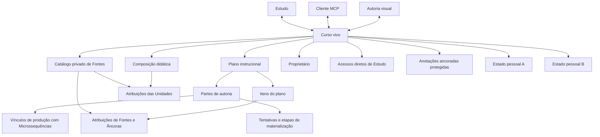
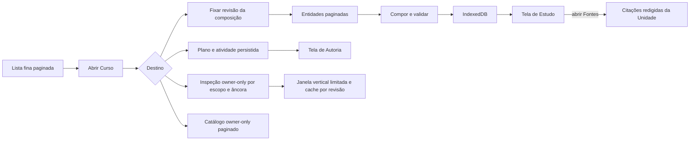

# Estado corrente do produto

Esta página separa capacidade implementada, ligação entre camadas, acesso,
evidência e intenção. A fotografia técnica é de **2026-08-17** e descreve o
código da revisão corrente. O serviço hospedado e a última release pública
ainda não receberam este corte.

## Como ler a matriz

- **Existe:** há implementação identificável?
- **Conectado:** interface, domínio, persistência e serviço realmente se ligam?
- **Acessível:** uma pessoa autorizada alcança a capacidade?
- **Uso verificado:** há uso humano ou somente fixtures e automação?
- **Funciona:** qual evidência sustenta a afirmação?
- **Necessário:** corresponde a um problema atual do produto?
- **Alinhamento:** a solução corresponde à intenção corrente?
- **Limites e destino:** o que ainda não se pode concluir?

“Parcial” pode significar uma fatia vertical incompleta, não “quase pronto”.
Teste de software não é evidência de aprendizagem nem de compreensão humana.

## Matriz por caso de uso

| Caso de uso | Existe | Conectado | Acessível | Uso verificado | Funciona | Necessário | Alinhamento | Limites e destino |
| --- | --- | --- | --- | --- | --- | --- | --- | --- |
| listar Cursos sem baixar toda a composição | Sim | Sim: RPC paginada → cliente → controlador → Home | Pessoa autenticada; Cursos próprios e compartilhados em Estudo | Automação e navegador local | Lista fina, busca, cursor e cache têm testes focais | Sim, reduz rede e carga móvel | Alto | Medir egress e latência com cardinalidade real; serviço hospedado ainda não migrado |
| abrir e estudar um Curso vivo | Sim | Sim: descritor → composição paginada → documento validado → IndexedDB → renderer; citações são buscadas por Unidade somente ao abrir Fontes | Proprietário ou pessoa com acesso | Jornada local em viewport móvel; ainda sem nova aceitação humana | Navegação Curso → Módulo → Lição → Microssequência → Unidade, prática, feedback, retomada e projeção redigida de Fontes foram exercitados | Sim | Alto; preserva Estudo como referência | Fontes ocultas ou não resolvidas são omitidas e citação sem permissão não entrega link; revalidar no APK e depois da migração hospedada; eficácia educacional não foi medida |
| manter progresso e revisão pessoais | Sim | Sim: interface → repositório local v2 → fila → RPC v2 → PostgreSQL | Cada pessoa somente sobre seu próprio estado em Curso acessível | Automação local | Validação, revisão, idempotência, reconciliação e reset por Curso têm testes focais | Sim | Alto | O estado v2 contém apenas `progress` e `reviewMarks`; revogação e dispositivo offline exigem testes de campo |
| registrar e triar Anotações ancoradas | Sim | Sim: Estudo/Autoria/MCP → domínio comum → cache/outbox ou API → PostgreSQL | Estudante lê somente as próprias e recebe contador privado; proprietário recebe caixa de entrada e contador global | Automação local e jornadas de navegador | N por alvo, estados, filtros, links profundos, classificação exata de Tópico, versões privadas, offline e duas abas têm testes focais | Sim | Alto | Resposta e resolução não corrigem o Curso; atividade alheia não fica observável no Estudo; auditoria, reparo e verificação permanecem posteriores; falta aceitação humana |
| criar um Curso privado | Sim | Sim: formulário e MCP → API de Curso → RPC transacional | Somente pessoa autenticada; torna-se proprietária | Automação e interface local | Criação idempotente produz raiz vazia com título, objetivo, plano normalizado e preferência inicial de 7–12 Partes | Sim | Alto | 7–12 é padrão configurável, não regra pedagógica; criação hospedada aguarda o corte |
| inspecionar o próprio Curso na Autoria | Sim | Sim: rota → leituras owner-only paginadas → sequência vertical, catálogo de Fontes e caixa de Observações | Somente proprietário | Automação e inspeção local | As sete áreas Planejamento, Parâmetros, Fontes, Estrutura, Inspeção, Observações e Pessoas usam o estado canônico; a Inspeção pagina 12 por vez e limita a janela a 36 Unidades | Sim | Alto para leitura | Respostas ficam inertes na Inspeção e edição contextual permanece futura; falta nova aceitação humana em 360/390/430 px e desktop |
| editar o plano instrucional em linguagem natural | Sim | Sim: interface e MCP → domínio de comandos → RPC do plano → projeção comum | Somente proprietário | Automação local | Título, objetivo, público, escopo, três listas do plano e faixa preferencial usam CAS, versão do plano e recibo idempotente | Sim | Alto | Orientação possui contrato próprio por escopo; o plano não mantém cópia. Não demonstra qualidade ou efeito educacional |
| configurar parâmetros, orientações, itens por alvo e política de componentes | Sim | Sim: área Parâmetros e MCP → domínio comum → RPC owner-only → resolução por escopo | Somente proprietário | Automação local | Quatro parâmetros fechados, atribuição muitos-para-muitos de unidades de análise e evidências por Microssequência, pilha versionada de orientação, interpretação separada e política ligada ao catálogo usam CAS, idempotência e proveniência visível | Sim | Alto como contrato verificável | Formas, oportunidades e variações aplicadas são declarações validadas, não observação semântica do banco; defaults são hipóteses e planejado×aplicado não mede aprendizagem. Promoção hospedada e avaliação humana continuam pendentes |
| planejar e reorganizar por Parte de autoria | Sim | Sim: controles naturais/MCP → comandos de Parte e vínculo → relações normalizadas | Somente proprietário | Automação local | É possível criar, editar, reordenar, dividir e unir Partes e mover/desvincular Microssequências sem apagar a composição | Sim | Alto | Parte é unidade operacional fora da hierarquia curricular; o melhor dimensionamento continua questão configurável e pesquisável |
| materializar uma Parte com retomada | Sim no serviço; entrega visual delimitada | API/MCP avançam tentativa e etapas transacionais; a interface apenas copia o pedido para o chat conectado | Somente proprietário | Automação local | Início sela desenho e Fontes dos itens do plano; cada etapa confirma conteúdo, aplicação e atribuições de proveniência na mesma transação com CAS e idempotência | Sim | Alto | Copiar o pedido não inicia nem conclui materialização; a execução depende do cliente conectado e requer ensaio ponta a ponta real |
| editar a composição do Curso pelo MCP | Sim | Sim: ferramenta → roteador → RPC própria de composição → entidades, atribuições e eventos | Somente proprietário autenticado por OAuth | Smokes e testes locais | Upserts e exclusões são atômicos, limitados a 200 itens e protegidos por revisão e idempotência; cada upsert de Unidade leva uma aplicação completa de Fontes, inclusive vazia | Sim | Alto como infraestrutura mínima | `StudyUnit.sources` é recusado sem alias ou fallback; Anotações usam operação separada e auditoria/correção pertencem a fatias posteriores |
| compartilhar um Curso para Estudo | Sim | Sim: Pessoas/MCP → serviço → vínculo direto → lista de Estudo | Proprietário concede por e-mail exato; favorecido recebe somente Estudo | Automação local | Concessão e revogação são idempotentes, confirmadas e registram evento sem e-mail | Sim | Alto | Sem convite pendente ou pesquisa de diretório; precisa de ensaio humano e promoção hospedada |
| manter nome e foto de perfil | Sim | Sim: Conta → API → perfil; foto → bucket privado → chave no perfil | Própria pessoa; proprietário e favorecido veem perfis relacionados diretamente | Automação e interface local | Nome, envio, substituição, remoção e leitura autorizada possuem validações focais | Sim | Alto | Limite de 512 KiB e formatos precisam de mensagem clara em dispositivos reais; serviço hospedado ainda não migrado |
| excluir a própria conta | Sim | Sim: confirmação → remoção de avatar → RPC → cascade da conta | Somente a própria pessoa autenticada | Automação local | A operação exige frase exata e recusa enquanto houver avatar privado | Sim | Alto | Ação é irreversível e exige aceitação humana antes da release |
| consultar componentes didáticos no MCP | Sim | Sim: índice gerado compartilhado entre browser e Edge | Proprietário autenticado | Testes de catálogo e contratos | Descoberta progressiva, inspeção e validação existem | Sim | Parcial | Há formatos reais antigos ainda sem equivalente semântico; isso bloqueia a importação, não autoriza conversão aproximada |
| rastrear Fontes e proveniência até a Unidade | Sim | Sim: sexta área/MCP → contratos comuns → cinco relações privadas; Estudo usa RPC lazy e redigida | Catálogo somente proprietário; pessoa com acesso recebe apenas citações visíveis | Automação local e jornada de navegador | Revisões e Âncoras append-only, atribuição de conjunto completo a item do plano ou Unidade, legado não resolvido honesto, resolução in-place e atomicidade de composição/materialização têm cobertura focal | Sim | Alto como proveniência por alvo | Não é cadeia de alegações W3C nem prova de autoria; promoção hospedada, medição e aceitação humana permanecem gates |
| produzir achados, corrigir, revisar e verificar | Não no runtime canônico | Não | Não | Não | Anotações fornecem uma entrada situada, mas não constituem esse workflow | Sim | Ainda em desenho | Auditoria automática não está autorizada a inferir assuntos; qualquer ponte legada de correção permanece isolada até contrato explícito |
| criar variantes e analytics de pesquisa | Não no runtime canônico | Não | Não | Não | Infraestrutura anterior não é considerada capacidade corrente | Sim como objetivo de pesquisa | Ainda em desenho | Reconstruir sobre perguntas e dados brutos; nenhuma estrutura sobrevivente é legitimada apenas por existir |
| operar dentro do Supabase Free Plan | Parcial | Limites, paginação, payloads, citações lazy e Storage pequeno estão conectados | Não há painel de orçamento | Medição pontual, sem série | Fontes usam metadados/URLs, páginas de 24, resposta de 256 KiB, 32 vínculos por alvo e oito identidades de Âncora por revisão; isso reduz transferência, mas não prova sustentabilidade | Sim | Parcial | Medir banco, egress, Storage, invocações e crescimento append-only antes e depois da promoção |

## Mapa do Curso vivo

**Descrição textual:** um Curso possui uma raiz, uma composição e vários
estados pessoais. Proprietário, Autoria, Estudo e MCP não criam identidades
paralelas.

## Mapa de carregamento

**Descrição textual:** a Home obtém páginas pequenas; abrir um Curso busca sua
revisão e suas entidades; somente o documento integral validado entra no cache
e no renderer. O catálogo é carregado separadamente na Autoria, e o Estudo só
consulta as citações de uma Unidade quando seu painel é aberto.

## Evidência visual corrente

A referência móvel de Estudo permanece a captura em 390 × 844 pixels:

As capturas antigas de Autoria não representam a superfície canônica desta
revisão. A Inspeção vertical já está integrada, mas novas capturas só devem ser
adotadas depois da verificação da aplicação real em 360, 390 e 430 px e
desktop; conservar imagem desatualizada como documentação corrente criaria uma
segunda fonte de verdade.

## Gates de migração e promoção

O corte não está hospedado. Os gates restantes são:

1. fornecer equivalência semântica aos componentes antigos ainda bloqueados e
   decidir explicitamente os poucos dados que não possuem contrato suficiente;
2. obter preflight integral do importador sobre os oito Cursos reais;
3. reconstruir o banco local e executar testes de migration, autorização,
   concorrência e navegador contra o schema resultante;
4. confirmar ausência de mutações pendentes em dispositivos conhecidos;
5. executar importação e migrations `1400`, `1500`, `1600`, `1700`, `1800`,
   `1900` e `2000`, nessa ordem, numa única transação com verificação de drift;
   o runner declara e hasheia as sete antes de `--apply`, sem `db push`
   separado;
6. conferir `sourceReferenceHash` entre origem, artefato preparado e
   verificação pós-corte, além dos hashes e contagens anteriores;
7. conferir o inventário vertical regenerado pós-`2000`: 2.096 objetos, dos
   quais 501 ligados aos sete casos correntes — 84 Anotações ancoradas, 272
   Autoria, 84 Fontes, 26 Estudo, 31 pessoas/acesso, um componentes e três
   transportes — e 1.595 no legado físico;
8. publicar funções, site e APK somente depois da verificação hospedada.

O importador é ferramenta transitória de desenvolvimento. Ele não entra no
runtime e será removido depois do corte. Não há leitura dupla, alias, fallback
ou sincronização paralela. Objetos físicos já isolados do modelo substituído
serão apagados na etapa final; até lá, sua presença no schema não significa que
sejam acessíveis ou necessários.

## Próximas fatias funcionais

A ordem seguinte preserva paridade vertical: uma fatia só é concluída quando
possui comportamento compreensível, interface, MCP quando aplicável,
persistência, autorização e teste.

1. achados de auditoria, correção, revisão e verificação;
2. variantes comparáveis;
3. dados brutos, métricas e visualização de pesquisa;
4. assistência de pesquisa;
5. remoção física final, validação completa e release.

Parâmetros e política de componentes, Fontes, Âncoras, proveniência por alvo e
Anotações ancoradas já pertencem ao runtime local deste corte. A retenção das
anotações não redefine a das materializações, e a próxima fatia não deve ser
antecipada como uma cadeia de correção já existente.

Backend novo sem uma forma de uso ou inspeção na interface e, quando pertinente,
no MCP não satisfaz uma fatia. Da mesma forma, uma tela sem persistência e
autorização reais não conta como capacidade concluída.
