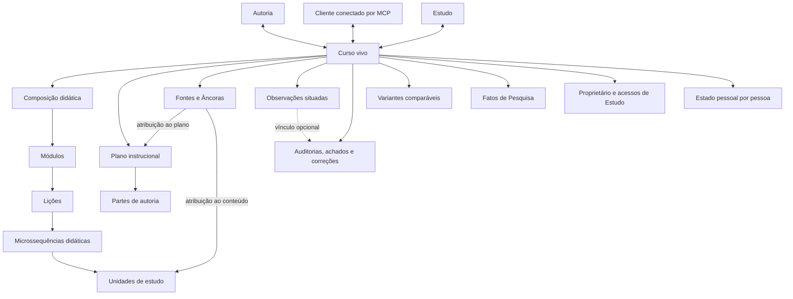
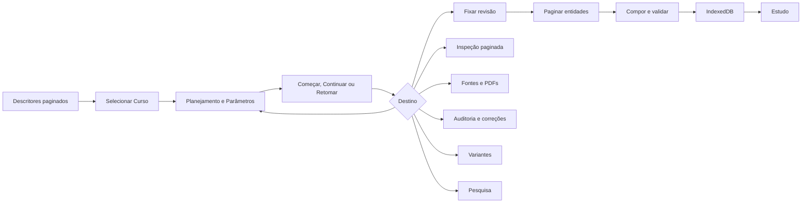

# Estado corrente do produto

Esta página registra o estado observado em **2026-08-21**. A linha publicada é
a versão 0.0.25, sobre o esquema hospedado `20260820224424`. A candidata local
0.0.26 declara `20260821145358`, mas ainda não foi promovida. A API de Cursos
publicada está na revisão 5 e o MCP, na revisão 120. O contrato público das seis
ferramentas e do recurso visual MCP permanece 0.0.23. A página distingue
implementação, ligação entre camadas, acesso, uso e evidência.

O feedback humano posterior ao corte confirmou regressões em Estudo e Autoria.
A versão 0.0.25 conclui
[#148](https://github.com/fabio-ara/AraLearn/issues/148) ao restaurar a seleção
compacta de Curso, a prévia rica e a retomada persistida. A edição contextual
para quem apenas estuda está implementada no ramo da
[#149](https://github.com/fabio-ara/AraLearn/issues/149), sobre a persistência
Supabase corrente. Seus gates locais de banco, concorrência, cliente e navegador
foram concluídos; promoção, artefatos oficiais e verificação pós-publicação ainda
dependem da integração. A
Autoria expôs carga
conceitual e visual incompatível com a identidade do aplicativo. O
[roadmap #147](https://github.com/fabio-ara/AraLearn/issues/147) substitui o
planejamento anterior sem declarar seus requisitos concluídos. As issues #148 a
[#155](https://github.com/fabio-ara/AraLearn/issues/155) terminam e estabilizam a
Refatoração 2.0 na persistência atual. A investigação Git começa somente depois.

O contrato publicado usa o Curso como identidade comum de Estudo, Autoria,
Pesquisa e Model Context Protocol (MCP). A revisão hospedada é
`20260820224424`. A candidata da #149 avança o manifesto local para
`20260821145358`, sem implementar Git, e somente representará o ambiente
publicado depois de promoção e verificação.

## Como ler a matriz

- **Existe:** há implementação identificável na revisão corrente.
- **Conectado:** interface, domínio, persistência e serviço participam do mesmo
  caso de uso.
- **Acessível:** informa quem pode chegar à capacidade e por qual superfície.
- **Uso verificado:** separa execução automatizada, uso em navegador e uso no
  serviço publicado.
- **Funciona:** resume a evidência técnica disponível.
- **Necessário:** indica se a capacidade resolve um problema atual.
- **Alinhamento:** compara a solução com a intenção corrente do produto.
- **Limites e destino:** registra o que a evidência ainda não autoriza afirmar e
  qual providência operacional permanece.

**Parcial** descreve uma ligação ou comprovação incompleta. Não significa
aproximação percentual de conclusão. Teste de software também não demonstra
aprendizagem, compreensão ou usabilidade humana.

## Matriz por caso de uso

| Caso de uso | Existe | Conectado | Acessível | Uso verificado | Funciona | Necessário | Alinhamento | Limites e destino |
| --- | --- | --- | --- | --- | --- | --- | --- | --- |
| selecionar e entrar em Cursos concretos | Sim | Descritores paginados alimentam um combobox e uma prévia selecionada; controlador, rota, banco e MCP preservam a mesma identidade sem expor o identificador técnico | Pessoa autenticada vê Cursos próprios e Cursos recebidos para Estudo | Testes de runtime, dois cenários focais de navegador e oito capturas nas quatro larguras e nos dois temas | Um único Curso por vez apresenta título, objetivo, relação de acesso, progresso, disponibilidade local e **Começar**, **Continuar** ou **Retomar**; a composição completa só é carregada na entrada | Sim | Alto | A verificação pós-publicação repete a jornada no Chrome real sem substituir a evidência automatizada local |
| estudar o Curso vivo | Sim | Revisão, entidades paginadas, composição validada, IndexedDB e mecanismo de renderização formam um único fluxo | Proprietário e pessoa com acesso direto | Testes focais, navegador e Pages publicado | Navegação curricular, prática, retorno, progresso, marcas de revisão e Fontes visíveis foram exercitados | Sim | Alto | A atualização do APK 0.0.22 permanece obrigatória; o funcionamento não prova eficácia educacional |
| continuar o estudo sem conexão | Sim | Composição já validada, seleção, ponto visitado, estado pessoal e filas específicas permanecem no dispositivo | Pessoa que já sincronizou o Curso | Testes de reinício, reconexão, duas abas, disponibilidade focal e revogação | A prévia consulta a cópia validada e distingue disponibilidade real no dispositivo de um Curso que exige conexão; revogação purga conteúdo e posição e escolhe outro Curso acessível | Sim | Alto | Um dispositivo desconhecido com escrita antiga não sincronizada não pode ser recuperado depois da migração que remove o armazenamento anterior |
| criar um Curso privado | Sim | Interface e MCP usam o mesmo domínio, API, transação e revisão | Pessoa autenticada torna-se proprietária | Testes locais | A criação idempotente produz identidade, metadados e plano inicial sob autorização | Sim | Alto | O padrão de 7 a 12 Partes é configurável e não constitui regra pedagógica |
| operar a Autoria compacta e descobrir tarefas | Parcial | A versão 0.0.25 conserva os casos de uso em quatro grupos progressivos, numa superfície única de até 430 px | Proprietário | Testes nas quatro larguras, artefato anterior publicado e feedback humano que originou a antiga #144 | Limite de largura, navegação por ícones e alcance das capacidades possuem prova automatizada; descoberta espontânea ainda não foi reavaliada | Sim | Alto na linha corrente | #152 e #153 mantêm abertas a simplificação final, a sessão humana por tarefas e a conferência da interface publicada |
| editar uma Unidade manualmente no contexto | Sim | Estudo e Inspeção usam o mesmo renderer, campos editáveis declarados pelo componente, validação da Unidade e operação autenticada de composição | Somente o proprietário | 136/136 verificações focais, 9/9 cenários integrados e prova vertical real | A edição conserva pai, posição, identidade e proveniência; antes de invalidar projeções, o recibo 2xx promove o snapshot no IndexedDB, preserva progresso e Observações e permite leitura sem rede como confirmada, com sincronização pendente | Sim | Alto | Releitura igual normaliza o snapshot, revisão superior o substitui, logout, limpeza ou revogação o purgam; atualização externa rebasa o CAS sem perder a seleção; a reversão autoral persistida continua no ciclo de correção |
| criar uma cópia pessoal pela edição em Estudo | Candidata | O mesmo renderer envia uma operação exclusiva da aplicação; uma transação cria um Curso privado, copia somente a composição e aplica a mudança inicial | Pessoa com acesso direto, sem escrita sobre o original | Supabase local recriado; pgTAP 78/78, PGlite 45/45, concorrência 1/1, smoke real local e Playwright 118/120 aprovados; os dois restantes são condicionais | Mantém a mesma Unidade, separa planejamento, Fontes, PDFs, acessos, progresso e Observações e repete o pedido durável sem duplicar a cópia; revogação ou desaparecimento da origem não desfazem uma confirmação já persistida | Sim | Alto | Chrome real local em 390 px confirmou o fluxo, a ausência de identificadores e controles de 44 px; promoção, Pages, APK e verificação pós-publicação permanecem pendentes |
| pedir uma sugestão focal por API | Parcial | O mesmo editor contextual delimita o trecho, chama o relay local, valida uma mudança esparsa e aplica a sugestão ao rascunho antes da gravação | Proprietário no Curso corrente; a candidata 0.0.26 estende a prévia a quem estuda, salvando apenas na cópia pessoal; a credencial do provider fica no relay | Testes de domínio e navegador da linha publicada, duas passagens da prova vertical real, a mais recente 1/1 em 14,2 s, compilação Android de release e fluxo local da cópia pessoal aprovados | Produção mostra apenas Serviço local nos hosts previstos e na porta 4183; o navegador distingue loopback de rede local, e o Android usa desde a 0.0.24 uma ponte nativa fixa em `127.0.0.1:4183` sem relaxar a política de conteúdo misto; prévia, falha, recorte grande ou indisponibilidade não gravam conteúdo | Sim, como complemento | Alto na web local | O envelope omite identidades internas, PDFs, Fontes e outras Unidades; Pages ainda exige ensaio de acesso à rede local, e o APK de release instalado precisa de prova em dispositivo real |
| planejar e organizar por Partes | Sim | Planejamento, itens, Partes, vínculos de produção e atividade são lidos e alterados pelas duas interfaces | Proprietário | Testes locais | É possível editar campos do plano, criar, reordenar, dividir e unir Partes e mover Microssequências sem apagar conteúdo | Sim | Alto | Parte é unidade operacional; o dimensionamento adequado continua sujeito ao conteúdo e à avaliação |
| produzir uma Parte com assistência conversacional | Sim | O cliente conectado lê plano, parâmetros, componentes, Fontes e Observações e confirma etapas limitadas no servidor | Proprietário autenticado por OAuth | Testes de domínio, serviço e MCP | Etapas são retomáveis, idempotentes e transacionais; o progresso deriva do conteúdo confirmado | Sim | Alto | A interface visual prepara o pedido, mas não executa a produção sozinha; falta o ensaio final no cliente conversacional hospedado |
| configurar parâmetros e componentes didáticos | Sim | Área Parâmetros e MCP chamam a mesma resolução por escopo e a mesma operação atômica de política | Proprietário | Testes de domínio, banco, MCP e interface | Valor efetivo, origem, herança, preferência, disponibilidade e bloqueio permanecem inspecionáveis | Sim | Alto | Valores aplicados são fatos declarados de desenho; não medem qualidade ou aprendizagem |
| descobrir e validar componentes didáticos | Sim | Navegador e função remota usam o mesmo catálogo gerado e recuperam um contrato versionado por consulta | Proprietário na Autoria e no MCP | Auditoria dos 32 pacotes, testes do núcleo, função remota e MCP | A busca devolve até oito candidatos; 22 pacotes são mantidos e 10 possuem restrições de uso declaradas | Sim | Alto | Disponibilidade técnica e adequação contextual são relações distintas; o uso real continua concentrado em poucos componentes |
| percorrer Unidades na Inspeção | Sim | Consulta paginada, janela vertical, posição local e endereços diretos usam a revisão fixada do Curso | Proprietário | Navegador em 360, 390, 430 e 1280 px; claro, escuro, movimento reduzido e duas abas | Páginas de 12 Unidades, janela de até 36, retorno exato, reconexão e atualização localizada possuem cobertura | Sim | Alto | Respostas ficam inertes; inspeção rápida não constitui medida de atenção ou qualidade da revisão humana |
| manter perfil e compartilhar para Estudo | Sim | Perfil, avatar privado, acesso direto, lista de Estudo e MCP usam a mesma autorização | Proprietário concede ou revoga; favorecido recebe somente Estudo | Testes locais e jornada hospedada com três identidades | A pessoa favorecida estudou após a concessão e perdeu a leitura depois da revogação; o terceiro permaneceu sem acesso | Sim | Alto | Não há grupos, organizações, convite pendente ou coautoria; a inspeção do avatar em aparelho real permanece separada |
| excluir a própria conta | Sim | O aplicativo envia uma solicitação confirmada; a API autentica a pessoa, deriva seus Cursos e caminhos privados, remove PDFs e avatares e chama a função transacional, que recusa resíduos antes de excluir a conta e seus Cursos | Somente a própria pessoa, após confirmação literal | Testes de API, controlador e banco | A operação falha sem excluir a conta quando resta um objeto privado; confirmação, ordem de bloqueio, limpeza física e remoção relacional possuem cobertura | Sim | Alto | Exige conexão; uma URL de envio de PDF ou sessão ainda válida pode criar objeto órfão depois da exclusão, por isso a operação hospedada exige inventário posterior às duas janelas |
| registrar Observações situadas | Sim | Estudo, Autoria e MCP usam Anotação ancorada, versões, fila local e persistência protegida | Estudante vê somente as próprias; proprietário recebe a caixa de entrada | Testes de banco, repositório, reconexão, duas abas e navegador | Texto original, alvo, revisão, canal, estado, resposta e classificação corrigível permanecem rastreáveis | Sim | Alto | Ausência, quantidade, categoria e tempo de tratamento não diagnosticam compreensão, dificuldade ou aprendizagem |
| registrar Fontes, Âncoras e proveniência | Sim | Interface, MCP, banco e leitura redigida em Estudo compartilham identidades e revisões | Catálogo e edição pertencem ao proprietário; Estudo recebe apenas citações autorizadas | Testes focais e fluxo local com PostgreSQL e armazenamento de objetos | Metadados estruturados, relações, Âncoras, referências importadas e aplicação por alvo possuem contratos comuns | Sim | Alto | Proveniência identifica origem e transformação; não prova correção factual ou autoria científica |
| anexar PDF a uma Fonte | Sim | Envio direto assinado, confirmação transacional, vínculo à revisão da Fonte e transferência autorizada formam o fluxo | Proprietário | Testes de banco e jornada hospedada com Storage real | PDF de até 20 MiB, no máximo oito por revisão de Fonte e 64 MiB de conteúdo único por Curso; a API recusou bytes adulterados e confirmou o arquivo íntegro com o mesmo SHA-256 | Sim | Alto | Fora da exclusão integral da conta, retirar bytes sem vínculo exige política de retenção e prova de segurança |
| auditar, corrigir e verificar uma Unidade | Sim | Contexto focal, rodada, achado, proposta, comparação, aplicação, nova rodada e reversão usam o mesmo ciclo na interface e no MCP | Proprietário | Testes de domínio, banco, MCP e navegador | Quatro dimensões, evidência por Fonte e Âncora, concorrência, confirmação, métricas do ciclo e endereços diretos possuem cobertura | Sim | Alto | A correção corrente altera conteúdo e Fontes da Unidade focal; auditoria factual mantém incerteza quando a evidência não sustenta conclusão |
| criar e comparar variantes | Sim | Área Variantes e MCP usam ponto comum de planejamento, Cursos independentes e comparação factual | Proprietário | Testes de domínio, PostgreSQL, navegador e jornada hospedada | De duas a oito variantes conservam diferenças declaradas, revisões, produção, Fontes, PDFs e desvinculação; a primeira posição permaneceu referência no caso Z/A | Sim | Alto para comparação descritiva | Não há participantes, atribuição, desfecho ou inferência causal; uma comparação técnica não equivale a experimento |
| consultar fatos de Autoria em Pesquisa | Sim | Banco, domínio, API, painel, exportação e MCP usam o mesmo recorte versionado | Proprietário | Testes de domínio, PostgreSQL, interface, MCP e jornada hospedada | Sete conjuntos de fatos, filtros, paginação, gráfico, tabela, CSV, JSON, denominador e dados ausentes usam os mesmos valores; Fontes e Variantes apareceram no recorte remoto | Sim | Alto | Os fatos descrevem Autoria; não incluem telemetria comportamental de Estudo nem medem aprendizagem |
| pedir análise e visualização no cliente conversacional | Sim | A vista de Pesquisa do MCP fornece conteúdo estruturado, representação textual, componente visual opcional e endereços para o AraLearn | Proprietário conectado por OAuth; a forma visual depende do suporte do cliente | Testes locais do servidor MCP e do componente; OAuth hospedado | Tabela e gráfico derivam do mesmo contrato; a operação continua útil sem componente visual | Sim | Alto | Falta a verificação final numa sessão real do cliente conectado |
| operar dentro dos limites gratuitos do Supabase | Parcial | Paginação, limites de resposta, anexos deduplicados e consultas sob demanda reduzem banco, armazenamento, transferência e funções remotas | Operação administrativa, sem painel próprio | Plano Free confirmado e medidas hospedadas do corte | O banco ocupa 97.053.843 bytes de 500 MB; os objetos ocupam 14.674.570 bytes de 1 GB; 41 chamadas MCP consecutivas responderam com sucesso, com mediana de 291 ms e percentil 95 de 587 ms | Sim | Alto | O limite mensal é de 500 mil invocações e 5 GB de transferência; ainda faltam a medição mensal de transferência e a projeção de crescimento após uso continuado |
| manter somente a arquitetura corrente | Parcial | O código de execução, a interface, o MCP e os testes correntes usam Curso; módulos substituídos de autoria e sincronização genérica foram retirados | Não é uma capacidade exposta | Busca estática, inventário vertical e corte hospedado | O saldo no repositório é negativo em tabelas conceituais, rotas, módulos, ferramentas e testes; objetos antigos permanecem isolados e sem consumidor corrente | Sim | Alto | A remoção física exige cópia posterior ao corte, restauração, plano exato e autorização específica |
| publicar a revisão integrada | Sim | Site e Android 0.0.25 declaram o manifesto `20260820224424`; não há migração nem nova função | Os canais oficiais publicam somente a ponta validada de `main` | Suíte final, verificadores de artefato e fluxos oficiais de Pages e Android | A atualização de clientes reutiliza o backend já hospedado, sem promover contrato remoto | Sim | Alto | A verificação pós-publicação confronta endereço, Release, APK e Chrome real; ela não substitui o ensaio do APK instalado nem a avaliação no ChatGPT e com pessoas |

## Relações do Curso vivo

**Descrição textual:** um Curso possui identidade e revisão próprias. O plano e
a composição pertencem a essa identidade; estado pessoal, Observações, Fontes,
auditorias, variantes e fatos de Pesquisa mantêm relações próprias. Estudo,
Autoria e MCP consultam o mesmo objeto.

## Carregamento e autoridade

**Descrição textual:** a entrada inicial recebe apenas descritores e apresenta
um combobox com uma única prévia selecionada. Selecionar não carrega a
composição. Ao começar, continuar ou retomar o Curso, a aplicação fixa uma
revisão, pagina as entidades, recompõe e valida o documento e só então atualiza
o IndexedDB. Fontes, auditoria, variantes e Pesquisa possuem leituras próprias,
limitadas e autorizadas.

## Evidência visual

A entrada de Estudo foi preservada em oito capturas, cobrindo 360, 390, 430 e
1280 px nos temas claro e escuro. A série completa está descrita no
[sistema visual](sistema-visual.md). Estes dois quadros mostram a identidade
compacta no telefone e no computador:

A captura móvel anterior continua documentando a composição de uma Unidade de
estudo e seus controles:

A lista móvel de Autoria, também em 390 por 844 px, documenta a entrada dos
Cursos próprios:

Uma captura isolada não define todo o estado. A documentação adota uma série
depois de conferir a aplicação em
360, 390 e 430 px e em 1280 px, nos modos claro e escuro, com texto extenso,
teclado e interação. Em 1280 px, a superfície continua centralizada e limitada
a 430 px; uma captura larga não autoriza painel, segunda coluna ou outra
composição para desktop.

## Evidência automatizada e limites

Na versão 0.0.25, `npm test` reuniu 999 verificações: 990 passaram e nove
permaneceram condicionadas ao ambiente. A suíte ponta a ponta reuniu 113 casos
em nove arquivos: 111 passaram e dois permaneceram condicionais. A distinção
entre aprovação e condição não executada é preservada nos relatórios.

Dois cenários focais completaram a entrada de Estudo. A matriz gerou e verificou
os oito quadros, manteve o shell centralizado com largura máxima de 430 px e
recusou corte ou overflow global. O segundo cenário levou o foco a **Rever**,
abriu e fechou a seção por `Enter` e confirmou a mudança de orientação do
indicador. Essas provas não demonstram compreensão humana. A inspeção no Chrome
real integra a verificação pós-publicação do mesmo artefato.

A candidata 0.0.26 acrescentou uma matriz no Chrome real local para o fluxo da
cópia pessoal. Em 360, 390, 430 e 1.280 px, nos temas claro e escuro, o shell
mediu 360/390/430/430 px e ficou centralizado na largura maior; seletor e ação
principal mediram 44 px. Não houve overflow nem identificador técnico, e a Home
mostrou **Sua cópia** e **Compartilhado com você** como opções distintas. Esse
ensaio local ainda não substitui a verificação do artefato publicado.

A matriz anterior da Autoria continua válida para a linha que ela verificou:
10/10 em 51,4 segundos nas quatro larguras e nos dois temas, incluindo Auditoria
em 1280 px. A sessão humana por tarefas permanece nas issues
[#152](https://github.com/fabio-ara/AraLearn/issues/152) e
[#153](https://github.com/fabio-ara/AraLearn/issues/153).

As antigas #114, #120, #128, #129, #130, #131 e #144 foram encerradas como
**substituídas**, não como concluídas. Seus critérios executáveis foram
redistribuídos pela cadeia nativa da #147. Na fase corrente, ainda é necessário:

1. instalar e exercer a ponte nativa do relay no APK de release e
   comprovar no Pages o acesso HTTPS à rede local;
2. exercer autoria, materialização, pesquisa, recurso visual e representação
   textual numa sessão real do ChatGPT conectado, registrando as medidas
   disponíveis do modelo e das funções;
3. realizar a sessão humana por descoberta de tarefas prevista no
   [roteiro de aceitação](roteiro-aceitacao-humana-autoria.md), sem ensinar a
   organização interna da Autoria.

O cutover corrente está em
[#154](https://github.com/fabio-ara/AraLearn/issues/154) e a estabilização com
limpeza autorizada, em [#155](https://github.com/fabio-ara/AraLearn/issues/155).
As issues [#156](https://github.com/fabio-ara/AraLearn/issues/156) e
[#157](https://github.com/fabio-ara/AraLearn/issues/157) apenas fixam fronteiras
e investigam Git com dados sintéticos depois dessa baseline. As #158–#168 são
condicionais à aprovação do ensaio. Nenhuma prova local encerra gates externos.

A remoção física das estruturas substituídas continua separada. Ela requer uma
cópia posterior ao corte, contagens e impressões digitais, restauração em banco
descartável, estratégia de recuperação e autorização específica. Essa
pendência não altera o contrato já publicado.
