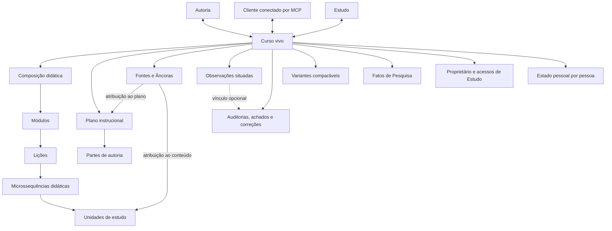
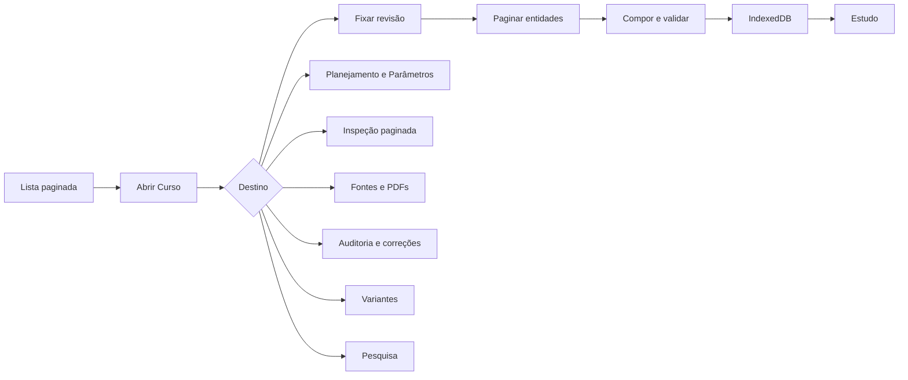

# Estado corrente do produto

Esta página registra o estado observado em **2026-08-20**, depois do corte do
banco e da publicação web da versão 0.0.23. Ela distingue implementação,
ligação entre camadas, acesso, uso e evidência. A coluna correspondente informa
quando uma conclusão ainda depende do APK, do cliente conectado ou de pessoas.

O contrato corrente usa o Curso como identidade comum de Estudo, Autoria,
Pesquisa e Model Context Protocol (MCP). A revisão de banco declarada no
manifesto é `20260820101500`.

## Como ler a matriz

- **Existe:** há implementação identificável na revisão corrente.
- **Conectado:** interface, domínio, persistência e serviço participam do mesmo
  caso de uso.
- **Acessível:** informa quem pode chegar à capacidade e por qual superfície.
- **Uso verificado:** separa execução automatizada, uso em navegador e uso no
  serviço publicado.
- **Funciona:** resume a evidência técnica disponível.
- **Necessário:** indica se a capacidade resolve um problema atual.
- **Alinhamento:** compara a solução com a intenção corrente do produto.
- **Limites e destino:** registra o que a evidência ainda não autoriza afirmar e
  qual providência operacional permanece.

**Parcial** descreve uma ligação ou comprovação incompleta. Não significa
aproximação percentual de conclusão. Teste de software também não demonstra
aprendizagem, compreensão ou usabilidade humana.

## Matriz por caso de uso

| Caso de uso | Existe | Conectado | Acessível | Uso verificado | Funciona | Necessário | Alinhamento | Limites e destino |
| --- | --- | --- | --- | --- | --- | --- | --- | --- |
| listar e abrir Cursos concretos | Sim | Lista paginada, controlador, rota, banco e MCP usam o mesmo `courseId` | Pessoa autenticada vê Cursos próprios e Cursos recebidos para Estudo | Testes, navegador e serviço publicado | Busca, paginação, retorno e vínculo direto abrem o mesmo Curso sem baixar toda a composição; o banco hospedado possui oito Cursos e 5.056 entidades correntes | Sim | Alto | A quantidade hospedada comprova o corte atual, não o comportamento sob cardinalidades muito maiores |
| estudar o Curso vivo | Sim | Revisão, entidades paginadas, composição validada, IndexedDB e mecanismo de renderização formam um único fluxo | Proprietário e pessoa com acesso direto | Testes focais, navegador e Pages publicado | Navegação curricular, prática, retorno, progresso, marcas de revisão e Fontes visíveis foram exercitados | Sim | Alto | A atualização do APK 0.0.22 permanece obrigatória; o funcionamento não prova eficácia educacional |
| continuar o estudo sem conexão | Sim | Composição já validada, estado pessoal e filas específicas permanecem no dispositivo | Pessoa que já sincronizou o Curso | Testes de reinício, reconexão e duas abas | A última revisão válida continua disponível; estado pessoal e Observações retomam o envio sem duplicação | Sim | Alto | Um dispositivo desconhecido com escrita antiga ainda não sincronizada não pode ser recuperado depois da migração que remove o armazenamento anterior |
| criar um Curso privado | Sim | Interface e MCP usam o mesmo domínio, API, transação e revisão | Pessoa autenticada torna-se proprietária | Testes locais | A criação idempotente produz identidade, metadados e plano inicial sob autorização | Sim | Alto | O padrão de 7 a 12 Partes é configurável e não constitui regra pedagógica |
| planejar e organizar por Partes | Sim | Planejamento, itens, Partes, vínculos de produção e atividade são lidos e alterados pelas duas interfaces | Proprietário | Testes locais | É possível editar campos do plano, criar, reordenar, dividir e unir Partes e mover Microssequências sem apagar conteúdo | Sim | Alto | Parte é unidade operacional; o dimensionamento adequado continua sujeito ao conteúdo e à avaliação |
| produzir uma Parte com assistência conversacional | Sim | O cliente conectado lê plano, parâmetros, componentes, Fontes e Observações e confirma etapas limitadas no servidor | Proprietário autenticado por OAuth | Testes de domínio, serviço e MCP | Etapas são retomáveis, idempotentes e transacionais; o progresso deriva do conteúdo confirmado | Sim | Alto | A interface visual prepara o pedido, mas não executa a produção sozinha; falta o ensaio final no cliente conversacional hospedado |
| configurar parâmetros e componentes didáticos | Sim | Área Parâmetros e MCP chamam a mesma resolução por escopo e a mesma operação atômica de política | Proprietário | Testes de domínio, banco, MCP e interface | Valor efetivo, origem, herança, preferência, disponibilidade e bloqueio permanecem inspecionáveis | Sim | Alto | Valores aplicados são fatos declarados de desenho; não medem qualidade ou aprendizagem |
| descobrir e validar componentes didáticos | Sim | Navegador e função remota usam o mesmo catálogo gerado e recuperam um contrato versionado por consulta | Proprietário na Autoria e no MCP | Auditoria dos 32 pacotes, testes do núcleo, função remota e MCP | A busca devolve até oito candidatos; 22 pacotes são mantidos e 10 possuem restrições de uso declaradas | Sim | Alto | Disponibilidade técnica e adequação contextual são relações distintas; o uso real continua concentrado em poucos componentes |
| percorrer Unidades na Inspeção | Sim | Consulta paginada, janela vertical, posição local e endereços diretos usam a revisão fixada do Curso | Proprietário | Navegador em 360, 390, 430 e 1280 px; claro, escuro, movimento reduzido e duas abas | Páginas de 12 Unidades, janela de até 36, retorno exato, reconexão e atualização localizada possuem cobertura | Sim | Alto | Respostas ficam inertes; inspeção rápida não constitui medida de atenção ou qualidade da revisão humana |
| manter perfil e compartilhar para Estudo | Sim | Perfil, avatar privado, acesso direto, lista de Estudo e MCP usam a mesma autorização | Proprietário concede ou revoga; favorecido recebe somente Estudo | Testes locais e jornada hospedada com três identidades | A pessoa favorecida estudou após a concessão e perdeu a leitura depois da revogação; o terceiro permaneceu sem acesso | Sim | Alto | Não há grupos, organizações, convite pendente ou coautoria; a inspeção do avatar em aparelho real permanece separada |
| excluir a própria conta | Sim | O aplicativo envia uma solicitação confirmada; a API autentica a pessoa, deriva seus Cursos e caminhos privados, remove PDFs e avatares e chama a função transacional, que recusa resíduos antes de excluir a conta e seus Cursos | Somente a própria pessoa, após confirmação literal | Testes de API, controlador e banco | A operação falha sem excluir a conta quando resta um objeto privado; confirmação, ordem de bloqueio, limpeza física e remoção relacional possuem cobertura | Sim | Alto | Exige conexão; uma URL de envio de PDF ou sessão ainda válida pode criar objeto órfão depois da exclusão, por isso a operação hospedada exige inventário posterior às duas janelas |
| registrar Observações situadas | Sim | Estudo, Autoria e MCP usam Anotação ancorada, versões, fila local e persistência protegida | Estudante vê somente as próprias; proprietário recebe a caixa de entrada | Testes de banco, repositório, reconexão, duas abas e navegador | Texto original, alvo, revisão, canal, estado, resposta e classificação corrigível permanecem rastreáveis | Sim | Alto | Ausência, quantidade, categoria e tempo de tratamento não diagnosticam compreensão, dificuldade ou aprendizagem |
| registrar Fontes, Âncoras e proveniência | Sim | Interface, MCP, banco e leitura redigida em Estudo compartilham identidades e revisões | Catálogo e edição pertencem ao proprietário; Estudo recebe apenas citações autorizadas | Testes focais e fluxo local com PostgreSQL e armazenamento de objetos | Metadados estruturados, relações, Âncoras, referências importadas e aplicação por alvo possuem contratos comuns | Sim | Alto | Proveniência identifica origem e transformação; não prova correção factual ou autoria científica |
| anexar PDF a uma Fonte | Sim | Envio direto assinado, confirmação transacional, vínculo à revisão da Fonte e transferência autorizada formam o fluxo | Proprietário | Testes de banco e jornada hospedada com Storage real | PDF de até 20 MiB, no máximo oito por revisão de Fonte e 64 MiB de conteúdo único por Curso; a API recusou bytes adulterados e confirmou o arquivo íntegro com o mesmo SHA-256 | Sim | Alto | Fora da exclusão integral da conta, retirar bytes sem vínculo exige política de retenção e prova de segurança |
| auditar, corrigir e verificar uma Unidade | Sim | Contexto focal, rodada, achado, proposta, comparação, aplicação, nova rodada e reversão usam o mesmo ciclo na interface e no MCP | Proprietário | Testes de domínio, banco, MCP e navegador | Quatro dimensões, evidência por Fonte e Âncora, concorrência, confirmação, métricas do ciclo e endereços diretos possuem cobertura | Sim | Alto | A correção corrente altera conteúdo e Fontes da Unidade focal; auditoria factual mantém incerteza quando a evidência não sustenta conclusão |
| criar e comparar variantes | Sim | Área Variantes e MCP usam ponto comum de planejamento, Cursos independentes e comparação factual | Proprietário | Testes de domínio, PostgreSQL, navegador e jornada hospedada | De duas a oito variantes conservam diferenças declaradas, revisões, produção, Fontes, PDFs e desvinculação; a primeira posição permaneceu referência no caso Z/A | Sim | Alto para comparação descritiva | Não há participantes, atribuição, desfecho ou inferência causal; uma comparação técnica não equivale a experimento |
| consultar fatos de Autoria em Pesquisa | Sim | Banco, domínio, API, painel, exportação e MCP usam o mesmo recorte versionado | Proprietário | Testes de domínio, PostgreSQL, interface, MCP e jornada hospedada | Sete conjuntos de fatos, filtros, paginação, gráfico, tabela, CSV, JSON, denominador e dados ausentes usam os mesmos valores; Fontes e Variantes apareceram no recorte remoto | Sim | Alto | Os fatos descrevem Autoria; não incluem telemetria comportamental de Estudo nem medem aprendizagem |
| pedir análise e visualização no cliente conversacional | Sim | A vista de Pesquisa do MCP fornece conteúdo estruturado, representação textual, componente visual opcional e endereços para o AraLearn | Proprietário conectado por OAuth; a forma visual depende do suporte do cliente | Testes locais do servidor MCP e do componente; OAuth hospedado | Tabela e gráfico derivam do mesmo contrato; a operação continua útil sem componente visual | Sim | Alto | Falta a verificação final numa sessão real do cliente conectado |
| operar dentro dos limites gratuitos do Supabase | Parcial | Paginação, limites de resposta, anexos deduplicados e consultas sob demanda reduzem banco, armazenamento, transferência e funções remotas | Operação administrativa, sem painel próprio | Plano Free confirmado e medidas hospedadas do corte | O banco ocupa 97.053.843 bytes de 500 MB; os objetos ocupam 14.674.570 bytes de 1 GB; 41 chamadas MCP consecutivas responderam com sucesso, com mediana de 291 ms e percentil 95 de 587 ms | Sim | Alto | O limite mensal é de 500 mil invocações e 5 GB de transferência; ainda faltam a medição mensal de transferência e a projeção de crescimento após uso continuado |
| manter somente a arquitetura corrente | Parcial | O código de execução, a interface, o MCP e os testes correntes usam Curso; módulos substituídos de autoria e sincronização genérica foram retirados | Não é uma capacidade exposta | Busca estática, inventário vertical e corte hospedado | O saldo no repositório é negativo em tabelas conceituais, rotas, módulos, ferramentas e testes; objetos antigos permanecem isolados e sem consumidor corrente | Sim | Alto | A remoção física exige cópia posterior ao corte, restauração, plano exato e autorização específica |
| publicar a revisão integrada | Sim | Manifesto, migrações, funções remotas, Pages e Android usam a versão 0.0.23 | Site e APK são distribuídos pelos canais oficiais | Corte transacional, OAuth hospedado, verificadores do manifesto e dos artefatos e fluxos de publicação | O site publica o renderer de Unidade e suas dependências; o APK assinado conserva versão, configuração e identidade histórica do certificado | Sim | Alto | Instalações Android 0.0.22 precisam ser atualizadas; publicação técnica não substitui avaliação humana |

## Relações do Curso vivo

**Descrição textual:** um Curso possui identidade e revisão próprias. O plano e
a composição pertencem a essa identidade; estado pessoal, Observações, Fontes,
auditorias, variantes e fatos de Pesquisa mantêm relações próprias. Estudo,
Autoria e MCP consultam o mesmo objeto.

## Carregamento e autoridade

**Descrição textual:** a lista inicial recebe apenas descritores. Ao abrir um
Curso, a aplicação fixa uma revisão, pagina as entidades, recompõe e valida o
documento e só então atualiza o IndexedDB. Fontes, auditoria, variantes e
Pesquisa possuem leituras próprias, limitadas e autorizadas.

## Evidência visual

A captura móvel de Estudo em 390 por 844 px documenta a composição de conteúdo
e controles usada como referência:

A lista móvel de Autoria, também em 390 por 844 px, documenta a entrada dos
Cursos próprios:

Capturas anteriores de outras superfícies não definem o estado atual. A
documentação só adota uma nova imagem depois de conferir a aplicação real em
360, 390 e 430 px e em 1280 px, nos modos claro e escuro, com texto extenso,
teclado e interação.

## Pendências de evidência

O banco, as funções correntes, o Pages e o APK pertencem à versão 0.0.23.
Permanecem duas verificações independentes:

1. exercer o recurso visual e a representação textual numa sessão real do
   cliente conectado, registrando as medidas disponíveis do modelo;
2. realizar a sessão humana prevista no roteiro de compreensão da Autoria.

A remoção física das estruturas substituídas continua separada. Ela requer uma
cópia posterior ao corte, contagens e impressões digitais, restauração em banco
descartável, estratégia de recuperação e autorização específica. Essa
pendência não altera o contrato já publicado.
