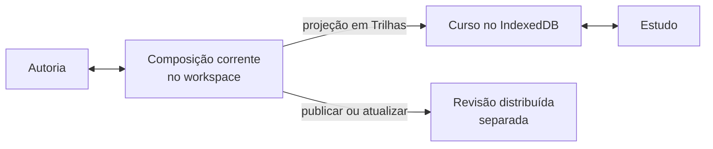
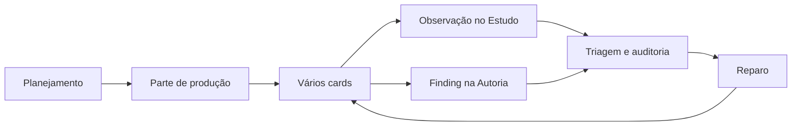
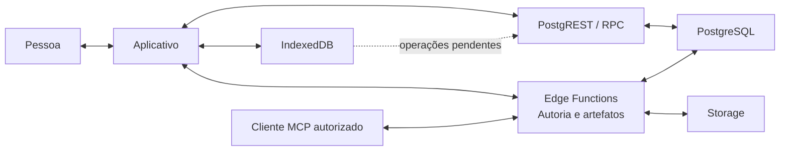
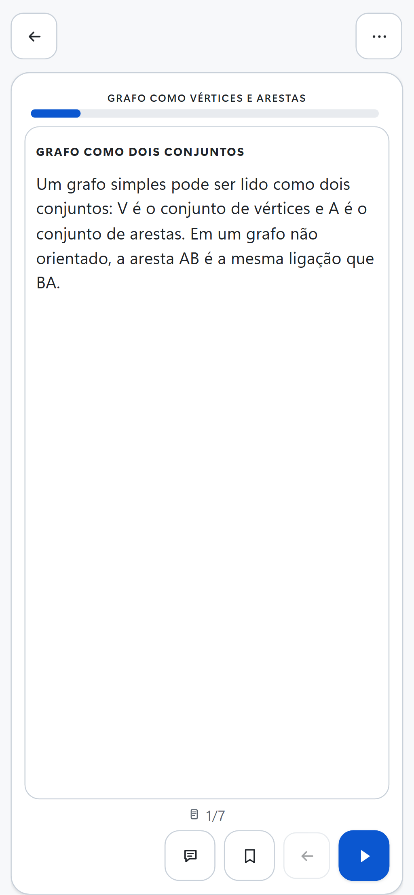
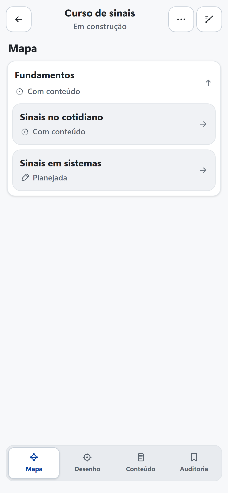
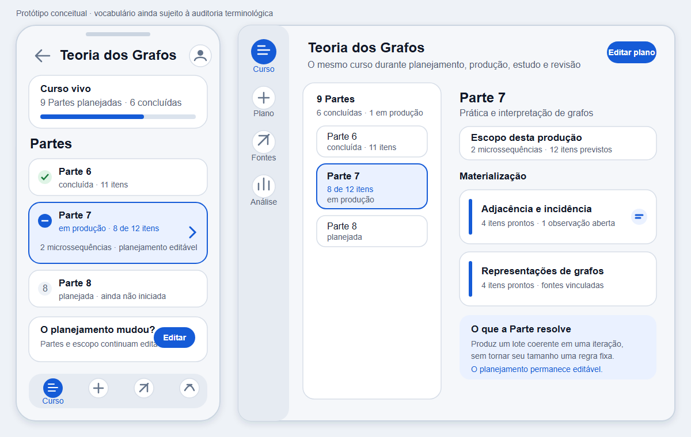

# Estado corrente do produto

Esta página é a fonte única para saber o que o AraLearn oferece **agora**. Ela
não é um roadmap, uma lista de desejos nem a história do desenvolvimento. O
trabalho futuro pertence às issues; estados anteriores permanecem no Git, nas
issues encerradas e nas evidências datadas.

**Data de corte da leitura do código:** 17 de agosto de 2026. **Data da última
regressão integrada registrada:** 16 de agosto de 2026, no commit
`cb777d0d7f5fc5c2c77be0839cc59564dd8a8e51`. Mudanças posteriores ainda precisam
de nova regressão integral. Por isso, “funciona” abaixo significa somente que a
capacidade passou nas condições e na data indicadas, não que esteja validada
para qualquer conteúdo, pessoa ou implantação.

Os nomes **Estudo**, **Autoria**, *workspace*, *microssequência*, *card*,
*resource*, *finding* e outros termos em uso no código são identificadores do
modelo corrente. Sua presença nesta página não os aprova como vocabulário final.
A revisão terminológica avaliará cada conceito nas áreas acadêmicas pertinentes
e fará um corte limpo em código, interface, dados e documentação.

## Como ler a matriz

As colunas respondem a perguntas diferentes:

- **Existe:** há código, contrato ou estrutura persistente para o caso de uso?
- **Conectado:** as camadas necessárias participam de um fluxo executável?
- **Acessível:** uma pessoa alcança a capacidade pelo aplicativo e/ou ela é
  oferecida a um cliente autorizado pelo Model Context Protocol (MCP)?
- **Uso verificado:** há registro de uso real, além de fixture, teste ou smoke?
- **Funciona:** qual comportamento foi exercitado e qual é a evidência datada?
- **Necessário:** o problema atendido faz parte da intenção atual do produto?
- **Alinhamento:** a solução corrente corresponde a essa intenção?
- **Limites e destino:** o que a evidência não demonstra e qual disposição de
  produto já foi decidida?

“Parcial” não significa “quase pronto”: pode indicar uma ligação incompleta, uma
superfície inacessível ou uma solução tecnicamente ampla para o problema errado.
Teste automatizado não conta como uso real nem como evidência de aprendizagem.

## Matriz por caso de uso

| Caso de uso | Existe | Conectado | Acessível | Uso verificado | Funciona | Necessário | Alinhamento | Limites e destino |
| --- | --- | --- | --- | --- | --- | --- | --- | --- |
| Estudar um curso e retomar o ponto alcançado | Sim: leitor, hierarquia didática, progresso, modo offline e fila local | Sim: curso e progresso passam por domínio, IndexedDB e sincronização remota quando disponível | Aplicativo: sim. MCP: não se aplica ao ato de estudar | Uso corrente foi relatado, mas não há protocolo ou conjunto de dados que permita auditá-lo | **Evidência técnica de 16/08/2026:** jornada Playwright com curso de 1.052 cards e suíte integrada; não mede aprendizagem | Sim | Alto: **Estudo** é a referência visual e comportamental atual | Preservar o comportamento durante a refatoração; revalidar em celular, desktop e Android e estudar usabilidade com pessoas |
| Manter um único curso vivo entre estudo e produção | Parcial: a composição corrente pode ser estudada antes de publicação, mas também existem revisões e artefatos publicados | Sim para o curso privado corrente: estrutura planejada aparece em Trilhas e cards materializados tornam-se estudáveis; publicação abre outro caminho | Aplicativo: **Autoria** altera a composição e **Estudo** abre sua projeção por Trilhas. MCP: opera o estado autoral | Não registrado em uso longitudinal real | **Evidência técnica de 16/08/2026:** projeção do estado corrente, retorno ao leitor e jornada Action foram testados; não houve ensaio humano prolongado de mudanças durante a produção | Sim | Parcial: já existe estudo sem publicação, mas *workspace*, Trilha, revisão corrente e publicação escondem essa unidade sob vários conceitos | Tornar o curso privado, vivo e mutável o objeto concreto de entrada; remover publicação imutável e os estados paralelos do modelo final |
| Inspecionar e editar manualmente a produção no celular | Sim: superfícies de Mapa, Desenho, Conteúdo, Auditoria e Resultados | Sim para os fluxos cobertos: a interface chama o cliente autoral e o backend relacional | Aplicativo: sim. MCP: lê e altera parte do mesmo estado por ferramentas próprias | Não houve aceitação registrada com pessoa leiga | **Evidência técnica de 16/08/2026:** 143 cenários E2E e capturas em 360, 390, 412 e 1.280 px; isso verifica geometria e ações, não compreensão | Sim | Baixo a parcial: existe cobertura ampla, mas a experiência corrente é mais complexa e textual que **Estudo** | Reconstruir a entrada em torno de cursos concretos, navegação didática e rolagem vertical de cards; nenhuma tela sem função de produto permanece |
| Planejar, materializar e retomar a produção por Parte | Sim: plano, execuções, Partes, contexto causal, tentativas e cards materializados | Sim: contratos, serviço autoral, PostgreSQL e MCP formam um fluxo | Aplicativo: visualização parcial do andamento. MCP: sim, com operações próprias | Somente fixtures, jornadas automatizadas e smokes | **Evidência técnica de 16/08/2026:** testes de domínio, PGlite, PostgreSQL local e jornada MCP/Action; limites reais de modelos e cursos completos ainda não foram medidos | Sim: Parte reduz o número de iterações necessárias para produzir um curso | Parcial: o conceito é necessário, mas “parte” também nomeia entidades estruturais em trechos do código e seus defaults ainda não são controláveis de modo simples | Conservar uma unidade de lote de produção com tamanho padrão configurável; eliminar a ambiguidade nominal e expor progresso e mudança de plano no aplicativo |
| Usar assistência autoral por conversa e MCP | Sim: servidor MCP, Action, OAuth, catálogo progressivo, continuidade e executor compartilhado | Sim: clientes autorizados atravessam Edge Function, serviço e persistência | Aplicativo: mostra projeções do estado, mas não todas as operações compostas. MCP: sim | Não há corpus de sessões reais de autoria analisado | **Evidência técnica de 16/08/2026:** smokes OAuth local e hospedado e jornada Action passaram; uma resposta era limitada a 96 KiB | Sim | Parcial: a separação entre conversa e estado persistido é correta, mas quantidade de ferramentas, contratos e conceitos impõe carga excessiva | Manter uma experiência conversacional orientada por intenção; a pessoa não escolhe ferramentas. Renomear e reduzir contratos após ensaios com limites reais de contexto e processamento |
| Parametrizar propriedades pedagógicas e representações | Sim: análise, parâmetros por escopo, valores efetivos, locks, conjuntos e manifestos | Sim: domínio, PostgreSQL, réplica parcial no IndexedDB, aplicativo e MCP | Aplicativo: sim, em **Desenho** e **Resources**. MCP: sim | Não houve investigação educacional real com esses controles | **Evidência técnica de 16/08/2026:** testes de resolução, autorização, interface e pacote de 500 microssequências; não validam os construtos | Sim | Parcial: escopo, herança e seleção são problemas reais; parte do modelo corrente cristaliza cedo demais modos, artefatos imutáveis e governança | Redefinir parâmetros como propriedades semânticas observáveis, separar limites editoriais e testar controles Auto/manual. Manter somente estruturas necessárias à pesquisa e à produção |
| Escolher representações modulares para os cards | Sim: 32 packages declarados, catálogo, contratos, validadores e renderizadores | Sim: navegador e Edge usam runtime sincronizado; MCP descobre e inspeciona contratos | Aplicativo: catálogo e cards são visíveis. MCP: sim | Uso acadêmico real das 32 representações não foi verificado | **Evidência técnica anterior a 17/08/2026:** corpus, schemas e paridade de runtime têm testes; a fixture do catálogo precisou ser regenerada depois de mudanças recentes | Sim | Parcial: modularidade é útil, mas a fronteira entre package, kernel, MCP e planejamento e o próprio termo *resource* ainda precisam de fundamentação | Auditar exemplos, carga de contexto e dependências; manter apenas módulos com valor instrucional demonstrável e adotar nomenclatura academicamente defensável |
| Registrar fontes, proveniência e ancoragem do conteúdo | Parcial: contratos possuem referências, hashes, evidências e alguns campos de origem | Parcial: os registros não formam uma cadeia simples e completa entre fonte, trecho planejado, card e reparo | Aplicativo: fragmentário. MCP: fragmentário | Não | Não há evidência integrada datada que reconstrua uma fonte interna ou externa até o conteúdo exibido e sua revisão | Sim | Baixo: o autor especialista ainda não recebe visibilidade suficiente das fontes e ancoragens | Projetar uma cadeia rastreável e econômica; fontes e ancoragens precisam ser visíveis e editáveis na produção e legíveis pelo MCP |
| Comentar um card, auditar, reparar e verificar | Parcial: observações de estudo, notas situadas, findings, rodadas de auditoria, reparo e reauditoria | Parcial: existem fluxos separados, mas comentário de estudante, observação do autor e conversa não convergem numa fila autoral simples | Aplicativo: ações distintas existem em **Estudo** e **Autoria**. MCP: acessa auditoria e reparo, com lacunas na entrada unificada | Não há uso real registrado do ciclo completo | **Evidência técnica de 16/08/2026:** testes de finding, alvo, currentness e reauditoria passaram; não há demonstração longitudinal de comentário até correção confirmada | Sim | Parcial a baixo | Unificar as entradas por origem e assunto, preservar o vínculo com o card e mostrar o estado da resolução; somente fatos observáveis alimentam analytics |
| Possuir privadamente um curso e conceder acesso direto | Parcial: propriedade, membership, convites, papéis e capabilities existem | Sim no modelo de *workspace* e publicação corrente | Aplicativo: sim por Coleções, Trilhas, conta e *workspaces*. MCP: sim conforme capability | Somente smokes e fixtures | **Evidência técnica de 16/08/2026:** testes de autorização, RLS, convites e OAuth; não há estudo de compreensão da governança | Sim | Baixo: seis papéis, tipos de *workspace* e publicação misturam acesso, organização e processo | Substituir por proprietário único e concessão explícita de acesso ao curso. Coleções e Trilhas só sobrevivem se demonstrarem outra função concreta; não haverá aliases nem adaptadores do modelo removido |
| Produzir variantes comparáveis e analisar métricas de autoria | Sim: condições, variantes, locks, freeze, atribuição, outcomes, datasets e visualização de Resultados | Sim nas jornadas e no schema correntes | Aplicativo: sim para parte do fluxo. MCP: sim por operações especializadas | Não houve estudo educacional real | **Evidência técnica de 16/08/2026:** jornada PGlite, pgTAP, gráfico/tabela e exportação passaram; as 68 relações privadas da fixture indicam custo estrutural relevante | Sim: variantes e dados brutos são centrais à pesquisa educacional | Baixo a parcial: o problema é correto, mas a arquitetura e as medidas atuais não foram aceitas como modelo mínimo nem validadas cientificamente | Reconstruir a partir das perguntas de pesquisa; conservar dados brutos, proveniência, denominadores e exportação, sem inferir causalidade nem manter workflow institucional desnecessário |
| Fixar, revisar editorialmente e publicar uma revisão imutável | Sim: revisões, submissão, revisão editorial, targets, hashes e Storage | Sim | Aplicativo: sim. MCP/Action: sim | Somente jornadas automatizadas | **Evidência técnica de 16/08/2026:** jornada Action local percorreu publicação e revisão editorial | Não, no modelo atual desejado | Baixo | Remover do produto final a distinção entre rascunho e publicado e os workflows associados. Se compartilhamento público surgir depois, será uma decisão explícita e separada |
| Operar dentro do orçamento do Supabase Free Plan | Parcial: há limites locais de payload, retenção e coleta de objetos | Parcial: banco, Storage e Edge Functions remotos estão ativos, mas a telemetria de egress e bytes do Storage não foi obtida | Aplicativo e MCP usam o backend; não há superfície simples de orçamento para quem pesquisa | Há uma medição pontual do projeto vinculado, sem série temporal | **Evidência operacional de 17/08/2026:** o [baseline de infraestrutura](evidence/baseline-infraestrutura-2026-08-17.json) registra uso, limites oficiais e lacunas; a stack local tem divergência de versão PostgreSQL e Vector instável | Sim | Parcial | Medir crescimento e egress antes do corte; corrigir paridade local; cada estrutura persistente precisa de consumidor, finalidade de pesquisa e orçamento. Tabela vazia não é removida só por estar vazia |

## Três mapas do comportamento corrente

Os diagramas mostram o sistema encontrado, inclusive suas separações. Eles não
antecipam a arquitetura da substituição.

### Estudo, curso e Autoria

**Descrição textual:** a Autoria modifica uma composição corrente dentro de um workspace; sua projeção em Trilhas permite estudar cards materializados antes de publicação e o IndexedDB conserva a cópia local; em paralelo, uma etapa opcional de publicação fixa outra revisão, acrescentando estados e conceitos ao mesmo curso.

O acesso antes de publicação já existe. A divergência está na quantidade de
objetos intermediários e no segundo caminho imutável, não na impossibilidade de
estudar o conteúdo corrente.

### Planejamento, Parte, conteúdo e retorno humano

**Descrição textual:** o planejamento divide a produção em Partes; cada Parte materializa vários cards; cards podem receber observações no Estudo e findings na Autoria; triagem, auditoria e reparo produzem uma nova revisão, mas as duas entradas humanas ainda chegam por caminhos distintos.

Parte é necessária como lote de produção: não é sinônimo de módulo, lição,
microssequência ou card. O código corrente ainda usa “parte” também para alguns
elementos estruturais, o que precisa desaparecer na revisão terminológica.

### Aplicativo, persistência local, Supabase e MCP

**Descrição textual:** o aplicativo lê e grava dados locais no IndexedDB. Os
fluxos de Estudo e sincronização chamam RPCs pelo PostgREST; os fluxos de
Autoria assistida e de artefatos passam por Edge Functions. Um cliente MCP
autorizado também chega ao domínio autoral pelas Edge Functions, sem passar
pela interface. As operações locais pendentes voltam ao PostgREST quando há
conexão. PostgreSQL guarda relações e estado compartilhado; Storage recebe
somente os artefatos que passam pela camada autoral apropriada.

Nem o aplicativo nem o cliente MCP recebem acesso administrativo direto ao
banco. PostgREST expõe apenas as operações permitidas; as Edge Functions
autenticam e autorizam seus próprios casos de uso. IndexedDB sustenta leitura e
intenção local; PostgreSQL permanece a autoridade para relações, autorização e
estado compartilhado; Storage conserva objetos grandes quando há justificativa
para não armazená-los em linhas.

## Evidência visual móvel do estado encontrado

As capturas abaixo são baselines do runtime corrente, não propostas para a
nova Autoria. Ambas usam viewport de 390 × 844 pixels, tema claro e dados
determinísticos de teste. A captura de Estudo é regenerada pelo cenário opt-in
`gera capturas canônicas do percurso móvel de Estudo`; a de Autoria vem da
fixture canônica do fluxo integral.

| Estudo | Autoria corrente |
| --- | --- |
|  |  |

O contraste visual confirma duas afirmações diferentes. Estudo concentra uma
tarefa e o conteúdo visível; a Autoria já preserva largura móvel e controles
iconográficos, mas distribui o curso entre cinco áreas abstratas e não oferece
na tela inicial a inspeção contínua dos cards. Essa observação orienta a
reconcepção, mas não demonstra por si só qual alternativa será mais
compreensível: isso exige protótipo e avaliação humana.

### Protótipo de compreensão — não implementado

O protótipo abaixo testa somente uma hipótese para a próxima etapa: apresentar
um curso vivo como objeto concreto, mostrar suas Partes planejadas e concluídas
e manter planejamento e andamento acessíveis por poucos controles. Ele não
define schema, não comprova usabilidade e não representa uma funcionalidade já
disponível. A composição reúne as versões móvel e desktop para permitir a
comparação antes de qualquer mudança funcional.

A versão vetorial regenerável está em
[`prototype-course-part-v1.svg`](screenshots/authoring/prototype-course-part-v1.svg).
As decisões de vocabulário, navegação e interação continuam sujeitas à revisão
terminológica e aos testes posteriores; a evidência desta etapa é apenas que a
relação **Curso → Partes → conteúdo produzido** pode ser mostrada sem expor
*workspace*, revisão, lock ou identificadores internos.

## Evidências e lacunas transversais

A [evidência integrada legível por máquina](evidence/authoring-integrated-validation-2026-08-16.json)
registra os comandos e números de 16 de agosto de 2026. Naquela execução:

- `npm test` aprovou 1.164 testes, com um ensaio de PostgreSQL real ignorado por
  ausência das dependências exigidas;
- `npm run test:e2e` aprovou 143 cenários, com uma captura opt-in ignorada;
- em 17/08/2026, o cenário opt-in focado gerou duas capturas móveis de Estudo
  em 5,9 segundos, inclusive a imagem exibida nesta página, sem repetir a suíte
  E2E;
- a stack Supabase local aplicou as migrations e aprovou 330 testes pgTAP;
- os smokes OAuth do MCP local e hospedado passaram;
- o curso grande exercitado tinha 175 microssequências e 1.052 cards;
- a fixture relacional de experimento ocupou 3.817.472 bytes em 68 relações
  privadas, incluindo índices e TOAST;
- o orçamento serializado de desenho para 500 microssequências somou 7.042.790
  bytes, sem medir páginas e índices reais do PostgreSQL.

Esses resultados não demonstram aceitação por pessoa leiga, adequação das
medidas, validade de construto, eficácia educacional, sustentabilidade no
Supabase Free Plan ou operação prolongada com cursos reais. A
[matriz de conformidade técnica](matriz-conformidade-tecnica.md) localiza código
e testes; o [roteiro de aceitação humana](roteiro-aceitacao-humana-autoria.md)
define observações que automação não pode substituir.

Os principais sinais de complexidade desproporcional são:

- dois estados operacionais para aquilo que a intenção descreve como um curso
  vivo;
- governança por *workspaces*, seis papéis, capabilities, submissão e publicação
  para um problema imediato de propriedade privada e acesso direto;
- dezenas de relações privadas de Autoria antes de uso educacional real;
- conceitos iguais ou próximos nomeados de maneiras distintas entre interface,
  domínio, MCP e banco, e o termo “parte” usado para duas funções;
- backend de experimentos, analytics e publicação mais amplo que as tarefas que
  uma pessoa consegue compreender e executar pela interface;
- proveniência e observações, embora essenciais, ainda fragmentadas entre
  contratos e fluxos.

## Regra do próximo estado publicado

Quando um modelo for substituído, o estado final não conservará nomenclatura,
UI, rota, alias, adapter, leitura, escrita ou fallback do modelo anterior. Isso
inclui nomes de arquivos, funções, tabelas, campos, ferramentas MCP, testes e
documentos. Dados que precisem sobreviver serão transformados uma única vez;
essa transformação não se tornará uma camada permanente de compatibilidade.

A história permanece recuperável no Git, nas issues encerradas e nas evidências
datadas. O código ativo e a documentação corrente descrevem somente o produto
vigente. Um corte só pode ser declarado completo depois de busca textual,
inspeção de schema, testes de integração e verificação visual confirmarem que o
modelo removido não continua executável nem ensinável por acidente.
