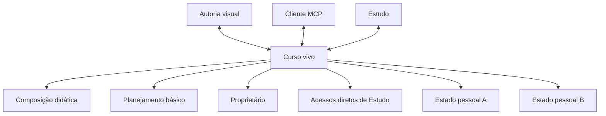
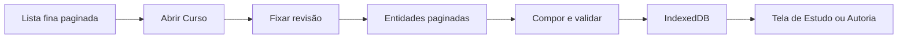

# Estado corrente do produto

Esta página separa capacidade implementada, ligação entre camadas, acesso,
evidência e intenção. A fotografia técnica é de **2026-08-17** e descreve o
código da revisão corrente. O serviço hospedado e a última release pública
ainda não receberam este corte.

## Como ler a matriz

- **Existe:** há implementação identificável?
- **Conectado:** interface, domínio, persistência e serviço realmente se ligam?
- **Acessível:** uma pessoa autorizada alcança a capacidade?
- **Uso verificado:** há uso humano ou somente fixtures e automação?
- **Funciona:** qual evidência sustenta a afirmação?
- **Necessário:** corresponde a um problema atual do produto?
- **Alinhamento:** a solução corresponde à intenção corrente?
- **Limites e destino:** o que ainda não se pode concluir?

“Parcial” pode significar uma fatia vertical incompleta, não “quase pronto”.
Teste de software não é evidência de aprendizagem nem de compreensão humana.

## Matriz por caso de uso

| Caso de uso | Existe | Conectado | Acessível | Uso verificado | Funciona | Necessário | Alinhamento | Limites e destino |
| --- | --- | --- | --- | --- | --- | --- | --- | --- |
| listar Cursos sem baixar toda a composição | Sim | Sim: RPC paginada → cliente → controlador → Home | Pessoa autenticada; Cursos próprios e compartilhados em Estudo | Automação e navegador local | Lista fina, busca, cursor e cache têm testes focais | Sim, reduz rede e carga móvel | Alto | Medir egress e latência com cardinalidade real; serviço hospedado ainda não migrado |
| abrir e estudar um Curso vivo | Sim | Sim: descritor → composição paginada → documento validado → IndexedDB → renderer | Proprietário ou pessoa com acesso | Jornada local em viewport móvel; ainda sem nova aceitação humana | Navegação Curso → Módulo → Lição → Microssequência → Unidade, prática, feedback e retomada foram exercitados | Sim | Alto; preserva Estudo como referência | Revalidar no APK e depois da migração hospedada; eficácia educacional não foi medida |
| manter progresso, revisão e observações pessoais | Sim | Sim: interface → repositório local → fila → RPC → PostgreSQL | Cada pessoa somente sobre seu próprio estado em Curso acessível | Automação local | Validação, revisão, idempotência, reconciliação e reset por Curso têm testes focais | Sim | Alto | Observações ainda não chegam a uma fila autoral de correção; revogação e dispositivo offline exigem testes de campo |
| criar um Curso privado | Sim | Sim: formulário e MCP → API de Curso → RPC transacional | Somente pessoa autenticada; torna-se proprietária | Automação e interface local | Criação idempotente produz raiz vazia com título, objetivo, orientações e revisão | Sim | Alto | Não há criação pública nem estágio editorial; criação hospedada aguarda o corte |
| inspecionar o próprio Curso na Autoria | Sim | Sim: lista owner-only → cabeçalho/hierarquia/entidades paginadas → quatro áreas visuais | Somente proprietário | Automação e inspeção local | Planejamento, Estrutura, Conteúdo e Pessoas carregam o estado canônico | Sim | Parcial | Estrutura e Conteúdo ainda são listas; inspeção vertical contínua e edição contextual ampla pertencem à próxima fatia |
| editar metadados e estado básico de planejamento | Sim | Sim: interface e MCP usam revisão e a mesma mutação canônica | Somente proprietário | Automação local | Título, objetivo, orientações e estado estruturado são atualizados com concorrência otimista | Sim | Parcial | O editor estruturado ainda expõe JSON; Partes e parâmetros semânticos precisam de controles próprios antes de uso por pessoa leiga |
| editar a composição do Curso pelo MCP | Sim | Sim: ferramenta → roteador → RPC → entidades e eventos | Somente proprietário autenticado por OAuth | Smokes e testes locais | Upserts e exclusões são atômicos, limitados a 200 itens e protegidos por revisão e idempotência | Sim | Alto como infraestrutura mínima | O fluxo completo de planejar, produzir Parte, auditar e corrigir ainda não foi reconstituído sobre as novas ferramentas |
| compartilhar um Curso para Estudo | Sim | Sim: Pessoas/MCP → serviço → vínculo direto → lista de Estudo | Proprietário concede por e-mail exato; favorecido recebe somente Estudo | Automação local | Concessão e revogação são idempotentes, confirmadas e registram evento sem e-mail | Sim | Alto | Sem convite pendente ou pesquisa de diretório; precisa de ensaio humano e promoção hospedada |
| manter nome e foto de perfil | Sim | Sim: Conta → API → perfil; foto → bucket privado → chave no perfil | Própria pessoa; proprietário e favorecido veem perfis relacionados diretamente | Automação e interface local | Nome, envio, substituição, remoção e leitura autorizada possuem validações focais | Sim | Alto | Limite de 512 KiB e formatos precisam de mensagem clara em dispositivos reais; serviço hospedado ainda não migrado |
| excluir a própria conta | Sim | Sim: confirmação → remoção de avatar → RPC → cascade da conta | Somente a própria pessoa autenticada | Automação local | A operação exige frase exata e recusa enquanto houver avatar privado | Sim | Alto | Ação é irreversível e exige aceitação humana antes da release |
| consultar componentes didáticos no MCP | Sim | Sim: índice gerado compartilhado entre browser e Edge | Proprietário autenticado | Testes de catálogo e contratos | Descoberta progressiva, inspeção e validação existem | Sim | Parcial | Há formatos reais antigos ainda sem equivalente semântico; isso bloqueia a importação, não autoriza conversão aproximada |
| planejar e produzir por Parte de autoria | Parcial | Estado básico possui `parts`, mas o ciclo completo ainda não foi ligado ao novo serviço | Contagem visível; edição específica não | Não | Somente contrato estrutural mínimo | Sim | Parcial | Implementar dimensão configurável, progresso e retomada sem transformar Parte em nível didático |
| rastrear fontes e proveniência até a Unidade | Parcial | Campos históricos sobrevivem no conteúdo, mas não há cadeia canônica completa | Fragmentário | Não | Importador verifica que fontes não se perdem, mas isso não é uma interface de proveniência | Sim | Baixo | Projetar e validar fonte → âncora → conteúdo → correção de ponta a ponta |
| reunir observações, auditoria e correção | Parcial | Estado pessoal existe; fluxo autoral unificado ainda não | Observação em Estudo existe; triagem autoral nova não | Não | Persistência de entrada funciona; resolução não | Sim | Baixo | Unificar origem, assunto, alvo, decisão, correção e verificação antes de produzir métricas |
| criar variantes e analytics de pesquisa | Não no runtime canônico | Não | Não | Não | Infraestrutura anterior não é considerada capacidade corrente | Sim como objetivo de pesquisa | Ainda em desenho | Reconstruir sobre perguntas e dados brutos; nenhuma estrutura sobrevivente é legitimada apenas por existir |
| operar dentro do Supabase Free Plan | Parcial | Limites, paginação, payloads e Storage pequeno estão conectados | Não há painel de orçamento | Medição pontual, sem série | O desenho reduz transferências desnecessárias, mas não prova sustentabilidade | Sim | Parcial | Medir banco, egress, Storage, invocações e crescimento antes e depois da promoção |

## Mapa do Curso vivo

**Descrição textual:** um Curso possui uma raiz, uma composição e vários
estados pessoais. Proprietário, Autoria, Estudo e MCP não criam identidades
paralelas.

## Mapa de carregamento

**Descrição textual:** a Home obtém páginas pequenas; abrir um Curso busca sua
revisão e suas entidades; somente o documento integral validado entra no cache
e no renderer.

## Evidência visual corrente

A referência móvel de Estudo permanece a captura em 390 × 844 pixels:

As capturas antigas de Autoria não representam a superfície canônica desta
revisão. Novas capturas devem ser produzidas depois que a inspeção vertical e a
navegação autoral estiverem integradas; conservar imagem desatualizada como
documentação corrente criaria uma segunda fonte de verdade.

## Gates de migração e promoção

O corte não está hospedado. Os gates restantes são:

1. fornecer equivalência semântica aos componentes antigos ainda bloqueados e
   decidir explicitamente os poucos dados que não possuem contrato suficiente;
2. obter preflight integral do importador sobre os oito Cursos reais;
3. reconstruir o banco local e executar testes de migration, autorização,
   concorrência e navegador contra o schema resultante;
4. confirmar ausência de mutações pendentes em dispositivos conhecidos;
5. executar importação e migration hospedadas numa única transação com
   verificação de drift;
6. publicar funções, site e APK somente depois da verificação hospedada.

O importador é ferramenta transitória de desenvolvimento. Ele não entra no
runtime e será removido depois do corte. Não há leitura dupla, alias, fallback
ou sincronização paralela. Objetos físicos já isolados do modelo substituído
serão apagados na etapa final; até lá, sua presença no schema não significa que
sejam acessíveis ou necessários.

## Próximas fatias funcionais

A ordem seguinte preserva paridade vertical: uma fatia só é concluída quando
possui comportamento compreensível, interface, MCP quando aplicável,
persistência, autorização e teste.

1. planejamento vivo e produção configurável por Partes;
2. inspeção móvel vertical da composição;
3. parâmetros semânticos e regras de componentes;
4. fontes, âncoras e proveniência;
5. observações autorais e estudantis reunidas;
6. auditoria, correção e verificação;
7. variantes comparáveis;
8. dados brutos, métricas e visualização de pesquisa;
9. assistência de pesquisa;
10. remoção física final, validação completa e release.

Backend novo sem uma forma de uso ou inspeção na interface e, quando pertinente,
no MCP não satisfaz uma fatia. Da mesma forma, uma tela sem persistência e
autorização reais não conta como capacidade concluída.
