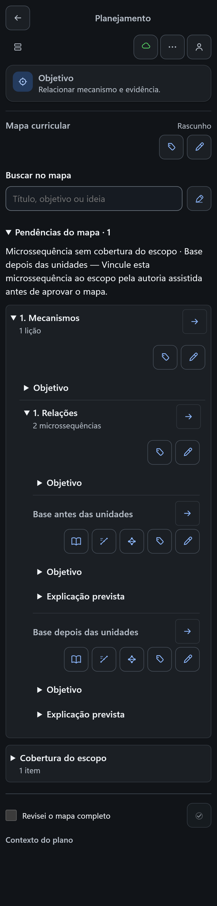
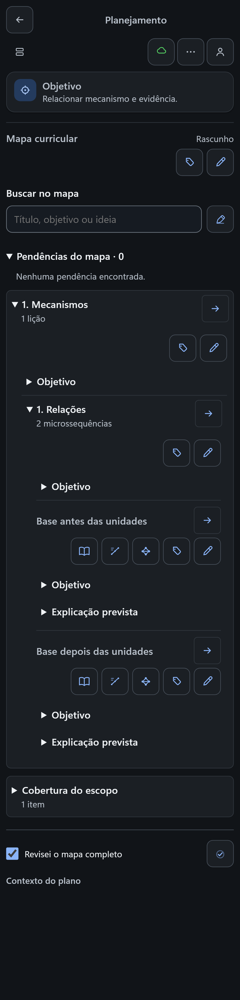

# Cobertura do mapa — pendência `coverage_missing` (prova local de UI)

Validação local do estado **microssequência sem cobertura do escopo** no mapa curricular de autoria, em 390 px, com o caso focal do Playwright `tests/e2e/course-planning-context.spec.js`. Reutiliza o fixture, o harness e `inspectCurricularMapCompleteness` reais do repositório; nenhum DOM ou CSS é simulado. Prova local, **não hospedada**, sem validação humana.

## Texto do próximo passo

O mapa não oferece, hoje, controle para gravar o vínculo de cobertura (`scopeItemIds`) de uma microssequência: ele expõe Parâmetros, Orientações, Explicação, Fontes e Análise. A orientação da pendência foi corrigida em `src/ui/CourseCurriculumMap.js` para apontar a via que existe:

| | Texto |
| --- | --- |
| Antes | Abra a microssequência e indique a cobertura de escopo antes de aprovar o mapa. |
| Depois | **Vincule esta microssequência ao escopo pela autoria assistida antes de aprovar o mapa.** |

## Cenário e sequência observados

O fixture monta o escopo inteiro coberto pela microssequência irmã **Base antes das unidades** e uma nova microssequência **Base depois das unidades** com objetivo e plano, mas sem cobertura.

1. `Pendências do mapa · 1`, aberta, com "Microssequência sem cobertura do escopo · Base depois das unidades — Vincule esta microssequência ao escopo pela autoria assistida antes de aprovar o mapa.".
2. O nó da nova microssequência recebe `data-curriculum-pending="true"`; a irmã coberta permanece `false`.
3. A caixa "Revisei o mapa completo" e o botão "Aprovar mapa inspecionado" ficam desabilitados; nenhuma escrita foi disparada (`requests = 0`).
4. O filtro "Mostrar somente pendências do mapa" mantém a microssequência sem cobertura visível e oculta a irmã.
5. Com a pendência ativa, consultar e editar **outro objetivo** continua disponível: o painel "Parâmetros > Orientações" do módulo abre, aceita rascunho no campo de direção editorial e devolve o foco ao botão que o abriu.
6. Resolução simulada no mapa persistido do harness (a microssequência passa a cobrir o item) e releitura pelo controle existente **Atualizar curso**: `course:2, plan:2, map:2`.
7. Depois da releitura: `Pendências do mapa · 0`, "Nenhuma pendência encontrada.", `data-curriculum-pending="false"`, caixa habilitada e botão de aprovação habilitado — a aprovação **não** foi acionada (`requests = 0`).

## Foco e geometria

A verificação de foco é **funcional** (`document.activeElement`), não visual: as capturas não mostram anel de foco. Imediatamente após a releitura pelo controle existente, o foco permaneceu no controle do próprio mapa "Orientações de Mecanismos" (botão `data-curriculum-context="guidance"`, `data-target-id="module-context"`) e `main.scrollTop` continuou em 0 — a releitura não corta foco nem posição. No estado final, o `activeElement` é a caixa de inspeção marcada.

Em 390 × 844 não há transbordamento horizontal (`scrollWidth − innerWidth = 0`). Pendência e bloco de aprovação ficam a cerca de 1026 px um do outro, acima da altura do telefone; por isso as duas capturas usam a mesma largura de 390 px com altura de 1620 px CSS, para trazer o contorno completo e o bloco de aprovação no mesmo enquadramento.

## Capturas (PNG, 1024 × 4253 px)

Reproduções byte a byte das capturas geradas pelo caso; nenhuma edição.

| Arquivo | Bytes | SHA-256 | O que mostra |
| --- | ---: | --- | --- |
| `cobertura-mapa-prova-local-390-antes.png` | 287336 | `a2919390827315c63b914e3e429f38efe5e1be634c945a4a6e5d3c28f93cf2d2` | pendência identificando a microssequência e aprovação bloqueada |
| `cobertura-mapa-prova-local-390-depois.png` | 251605 | `012985bcb01c2ce7b7722412d6370b4cf5c3ca67b600e177c1f567c10b0c5e19` | pendência zerada após a releitura e aprovação liberada |

## Limites

- Prova **local com controller mock e servidor de artefato do próprio caso focal**; não é prova hospedada nem validação humana.
- A **resolução da cobertura foi simulada** no mapa persistido do harness, porque o mapa não tem controle de UI para gravar `scopeItemIds`; o que a prova cobre é a releitura pelo controle real e a mudança de estado do mapa.
- A aprovação foi habilitada, mas não acionada: nenhuma escrita ocorreu.
- A verificação de foco é funcional, não visual.
- A execução de navegador abrange somente o caso focal. A integração também alinhou a asserção de texto no teste de projeção do mapa.
