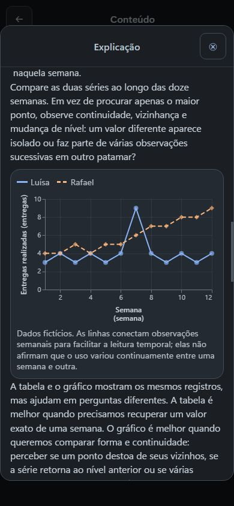
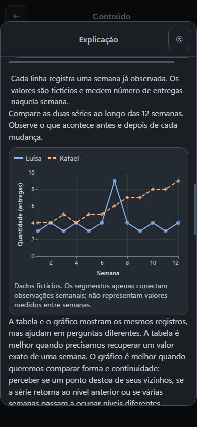

# Terceira Explicação — criação e correção por Actions

O ChatGPT criou **O que o consumo observado permite concluir?** no curso novo, corrigiu uma ambiguidade de redação e releu o resultado. O export de engenharia confirmou a revisão 21: três Explicações e nenhuma unidade de estudo. A tabela e o gráfico preservam as mesmas doze observações semanais do rascunho original; os exemplos de média usam dados independentes, sem antecipar os gabaritos da prática futura.

Codex abriu o link retornado, inspecionou o gráfico em 390 px e anexou a captura real ao ChatGPT. O GPT manteve as duas séries e a legenda, retirou a repetição “Semana (semana)” e encurtou a pergunta e a nota. A nota continua esclarecendo que os segmentos conectam observações semanais e não representam medições entre semanas. A revisão 22 foi relida integralmente e reaberta na interface.

O [registro sanitizado](exp3-actions-fluxo-real-sanitizado.json) reúne os dois pedidos em linguagem humana, o destino específico, hashes das capturas e 19 chamadas ChatGPT-User, todas 200. Criação: 27/09/2026 às 00:51:15Z; correções: 00:52:07Z e 01:04:25Z, seguidas de releitura. Os logs e exports são diagnóstico de engenharia que corrobora o fluxo real; as escritas foram feitas pelo ChatGPT por Actions.

Essa prova cobre Explicação na superfície de autoria, em 390 px. Ainda não há prática, ciclo de resposta/feedback ou avanço em Estudo nesse curso. **Nenhum resultado desta intervenção constitui validação humana pós-correção.**
