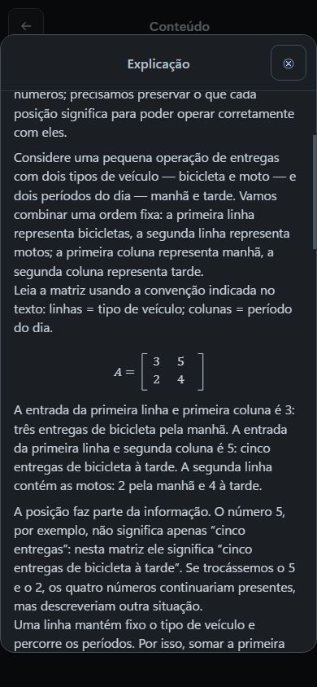
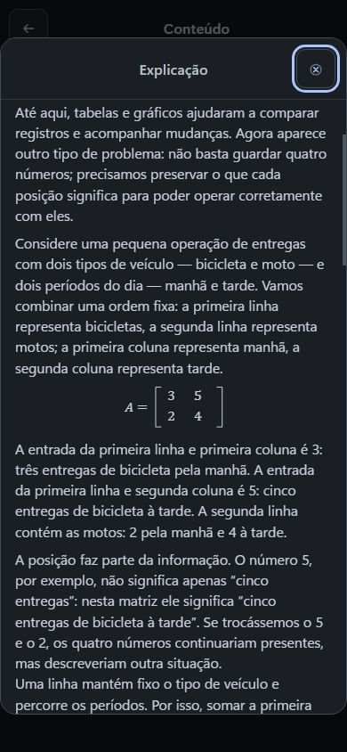
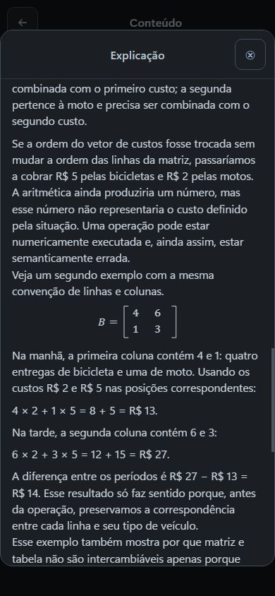

# Quarta Explicação — criação, correção e recuperação por Actions

O ChatGPT criou **Quando posição e operação importam?** no curso novo por Actions e, em seguida, corrigiu a explicação depois de uma observação visual. O export de engenharia confirmou a revisão 23 com quatro Explicações e nenhuma unidade de estudo; a correção gerou a revisão 24. As matrizes A, B e o vetor de custos C não mudaram de valor, os dez parágrafos permaneceram idênticos e os cálculos seguem iguais.

Codex abriu o link retornado, inspecionou a explicação em 390 px, anexou a captura real ao ChatGPT e registrou a leitura: o documento não tem overflow horizontal e as três matrizes ocupam 111, 81 e 112 px de largura. O GPT aceitou a observação, retirou a instrução repetida das matrizes A e B e encurtou o prompt do vetor de custos para “Custos na ordem das linhas: bicicleta, depois moto.”; nada mais foi alterado. As três capturas abaixo são reais e não foram editadas.

A captura extra `actions-exp4-390-matriz-b-depois.jpg` (SHA-256 `ec75de9aee86effa11c3f0353cfda6241bf9dd569c2aac8081edc7e330c6951f`) registra a matriz B depois da correção: o texto imediatamente abaixo identifica 4 bicicletas e 1 moto pela manhã e os custos 2 e 5. Na inspeção de pixels da raiz, essa convenção é suficiente no contexto; a captura não foi editada.

O [registro sanitizado](exp4-actions-fluxo-real-sanitizado.json) reúne os três pedidos em linguagem humana, o destino específico, hashes das capturas e 25 chamadas ChatGPT-User: 23 com status 200 e 2 com status 409. As duas respostas 409 foram de `preparar_revisao`, em 01:34:17.200Z e 01:34:24.130Z — não são sucesso e o corpo do erro não foi registrado, então nenhuma causa é atribuída aqui. Criação: 27/09/2026 às 01:22:02.958Z; correção: 01:33:58.779Z. A recuperação releu a explicação e exportou oito páginas com status 200 entre 01:38:33.038Z e 01:39:25.598Z, sem nova escrita. Os exports de engenharia confirmaram as revisões 23 e 24 da criação e da correção. A comparação entre elas está na auditoria privada: só o campo de prompt das três matrizes mudou.

Os logs e exports são diagnóstico de engenharia que corrobora o fluxo real; as escritas foram feitas pelo ChatGPT por Actions, com o operador Codex, e nenhuma revisão humana de conteúdo foi registrada.

Essa prova cobre a Explicação na superfície de autoria, em 390 px. Ainda não há prática, ciclo de resposta/feedback ou avanço em Estudo nesse curso. **Nenhum resultado desta intervenção constitui validação humana pós-correção nem aprovação pedagógica humana.**
