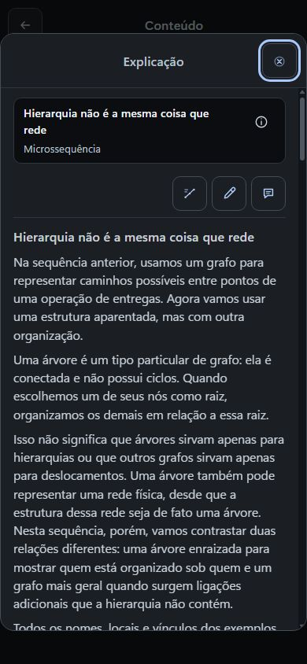
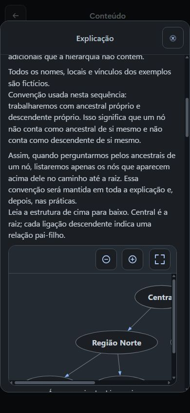
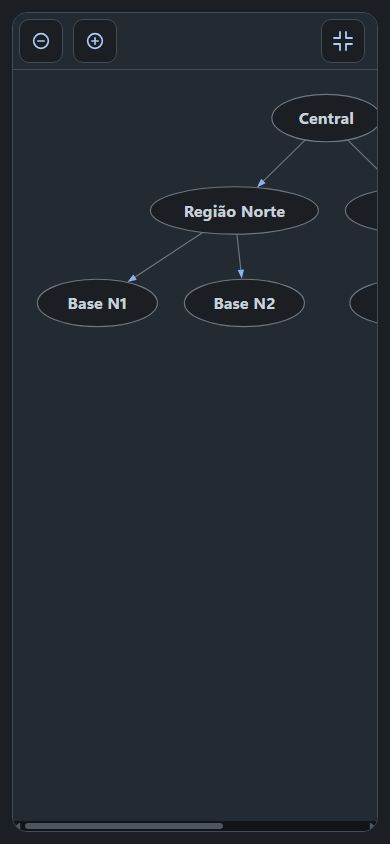
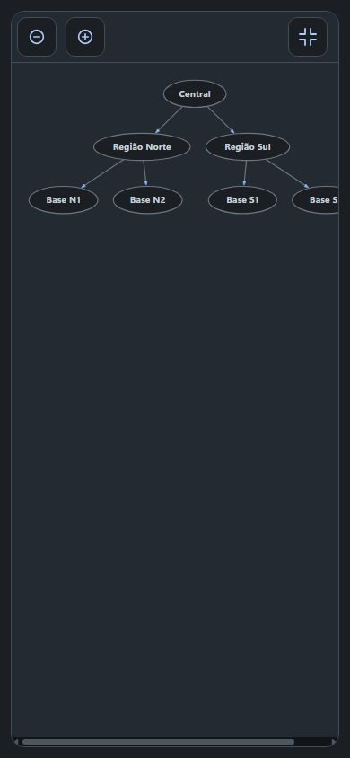
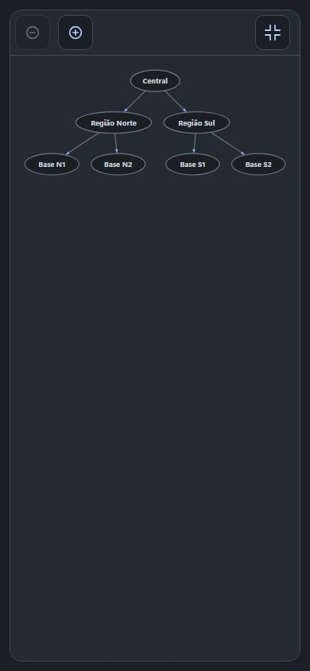
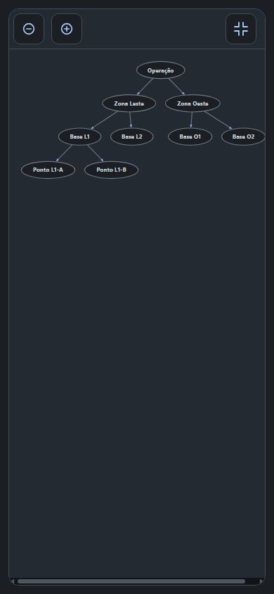
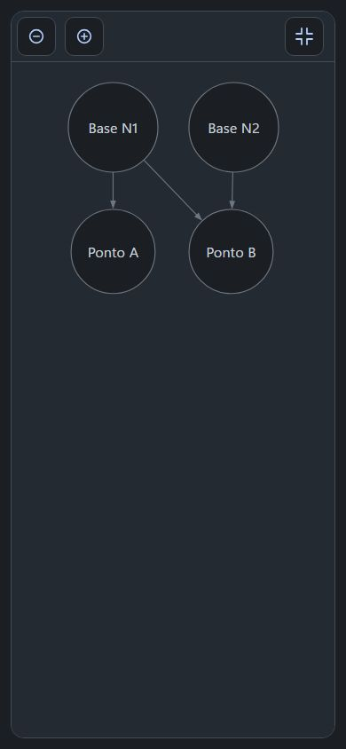
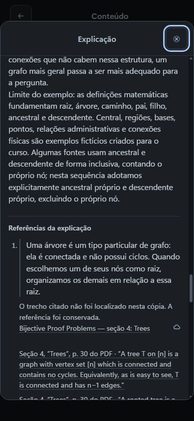

# Exp6 — criação, observação e correção por Actions (revisões 34 → 55)

Sexta explicação, *Hierarquia não é a mesma coisa que rede*, do curso **Do sinal à decisão: como representamos situações para prever o que acontece depois** (`68d099a5-60d6-4a26-bd93-4a990a4789c3`), revisão **55**, com 8 módulos, 25 microssequências, 6 explicações e **0 unidades de estudo**. O curso ainda não oferece o ciclo completo de Estudo. Este registro reúne evidência sanitizada; os logs de borda corroboram as chamadas do ChatGPT e pertencem ao diagnóstico de engenharia.

Consentimento pontual operado por Codex sob mandato do proprietário, restrito a este curso. Não houve pessoa revisando a produção neste momento; nada aqui é aprovação humana.

## Ciclo real de Actions

**45 chamadas** consolidadas, **44 com status `200` e 1 com status `422`**. O log de criação e o de correção registram o mesmo `exportar_autoria` às `2026-09-27T02:28:04.229`; deduplicado por horário e operação, ele entra só na fase de correção, e por isso a fase de criação fica em 18 chamadas.

| Fase | Janela (UTC) | Chamadas | Status |
| --- | --- | ---: | --- |
| Criação (início + escrita) | 02:09:21.873 → 02:16:51.871 | 18 | 17 × `200` + 1 × `422` |
| Correção (export, fontes, correções, revisão) | 02:28:04.229 → 02:36:39.000 | 27 | 27 × `200` |

Marcos da criação: primeira escrita `manter_fonte` em **02:14:16.788**; `salvar_explicacoes` recusado com **`422` em 02:15:43.393** e aceito com `200` em **02:16:20.222**; quatro `preparar_revisao` até 02:16:51.871. Marcos da correção: `exportar_autoria` em 02:28:04.229, sete `consultar_fontes`, doze `manter_fonte`, `aplicar_correcoes` em **02:34:51.268** e seis `preparar_revisao` até 02:36:39.000. O corpo das chamadas não foi registrado, então **a causa do único `422` é desconhecida** e não é atribuída aqui.

## Conversa

Os dois prompts literais desta etapa, preservados na íntegra:

> Você disse:
> Vamos salvar a explicação de “Hierarquia não é a mesma coisa que rede”, usando o rascunho revisado que anexei. Quero que o estudante entenda quando uma árvore enraizada realmente representa a situação e quando uma rede com outras relações é necessária. Desenvolva raiz, relação entre pai e filho, caminho, ancestral e descendente com exemplos concretos, deixando claro que um nó não é seu próprio ancestral nem descendente neste curso. Use uma árvore de verdade e um contraste que mostre o que se perde quando tentamos encaixar relações cruzadas numa hierarquia. Ensine as convenções antes de usá-las, mantenha as fontes e limites do rascunho e deixe os casos e respostas da prática para a etapa seguinte. A representação precisa continuar explorável no telefone. Salve só essa explicação no curso existente, preserve as demais, releia o resultado até o fim e corrija inconsistências. Traga o link específico e não registre revisão humana.

> Você disse:
> Abri a explicação sobre hierarquia e rede e anexei três capturas reais do telefone: a árvore dentro do texto, a visão de conjunto após afastar o zoom e o grafo com duas ligações chegando a Ponto B. A exploração funciona e o foco volta ao controle ao fechar. Como educador, avalie se essas visões ajudam a aprender a relação entre pai, filho e caminho; você pode manter ou contrapor minha leitura, sem alterar relações corretas apenas por concordância.
>
> Encontrei um problema concreto no texto: perto do fim aparecem Base A1, Base A2 e Ponto A1-Y, mas nenhuma árvore da explicação apresentou esses nomes. Eles pertencem ao cenário reservado às práticas. Corrija esse trecho usando somente um exemplo já ensinado, ou retire a repetição se o raciocínio já estiver explicado, preservando os casos e respostas das práticas para depois. Mantenha a distinção cuidadosa: o grafo mostrado deixa de representar uma árvore enraizada naquela orientação; isso não significa que, ao ignorar as setas, qualquer rede com esse desenho deixe de ser árvore.
>
> As referências ainda aparecem como “Nenhuma fonte” na explicação. Reabra as seis referências acadêmicas guardadas no curso e confira onde estão as definições realmente utilizadas: seção, página, lema ou slide. O rascunho já indica alguns desses locais. Vincule à explicação somente as passagens que você conseguir localizar e que sustentem a afirmação específica; não invente trecho, localização ou conferência. Essa checagem será sua, como agente, e não uma revisão humana minha. Se alguma fonte não puder ser conferida, mantenha a pendência explícita e diga qual afirmação ficou sem apoio. Corrija só esta sequência, releia tudo que salvou e traga o link atualizado.

A resposta final visível do GPT afirma que corrigiu os nomes, refinou a distinção sobre as setas e conferiu as seis referências, concluindo que “as âncoras e ocorrências que vinculei estão localizadas e sem problemas de evidência”. Essa conclusão **não se confirma na leitura da explicação**: a seção de referências mostra os avisos descritos abaixo, e o diagnóstico registra a causa. A íntegra visível está no [registro sanitizado](exp6-actions-fluxo-real-sanitizado.json); o dump AX usado era apenas texto visível, sem cadeia de pensamento.

## Delta da explicação entre as revisões 34 e 55

- Nenhuma microssequência foi adicionada ou removida: **25 → 25**. As outras **24 microssequências** e as outras **cinco explicações** permanecem inalteradas, byte a byte.
- Só a Exp6 mudou. O campo `explanation` passou de **17 para 16** blocos: o antigo `content-17` foi eliminado.
- As duas árvores (`content-3` e `content-10`) e o grafo (`content-8`) são **byte a byte idênticos** entre as duas revisões — os 3 diagramas da explicação não foram tocados.
- **Base A1**, **Base A2** e **Ponto A1-Y** foram removidos (apareciam 1, 1 e 2 vezes; agora zero). O contraste reutiliza **Base N1**, **Base N2** e **Ponto B**, já apresentados no grafo.
- Mudanças textuais em `content-7`, `content-9`, `content-14`, `content-15` e `content-16`: orientação pai-filho explícita, distinção entre grafo dirigido e leitura não dirigida, remoção do conjunto extra de nomes e concentração do limite de convenção.

A comparação usa apenas os dois exports de engenharia e não depende de cache do navegador.

## Fontes e âncoras

Na revisão 34 a explicação não tinha vínculos (as referências apareciam como “Nenhuma fonte”). A revisão 55 tem **6 vínculos**, todos `supported_by` com papel `technical_conceptual`, **14 âncoras** e **10 ocorrências** de conteúdo. Todas as seis fontes seguem `unverified`, sem confirmação humana explícita. As referências aparecem na explicação com os avisos descritos a seguir.

| Fonte | Localizadores persistidos | Âncoras | Ocorrências |
| --- | --- | ---: | ---: |
| Richard P. Stanley — Bijective Proof Problems, seção 4: Trees | Seção 4, “Trees”, p. 30 do PDF (×2) | 2 | 1 |
| Cornell CS 2110 — Trees and their Iterators, Tree Terminology | “Tree, Node, Root”; “Parent, Child, Leaf”; “Ancestor, Descendant” | 3 | 2 |
| Keith Schwarz / Stanford CS103 — Properties of Trees | Capítulo 4, seção 4.2.3, p. 194 do PDF, Lemma 2 | 1 | 1 |
| Stanford CS106B — Trees, More Tree Terminology | Slide 7; Slide 8, “One Parent, No Cycles” | 2 | 2 |
| Stanford CS106B — Graphs, Overview e Terminology | “Overview” (×2); “Terminology” | 3 | 2 |
| Cornell CS280 — Handout 34, Trees | Definition 34.1; Definition 34.4; Theorem 34.3, p. 1 | 3 | 2 |

## Avisos de citação — limite crítico

O validador estrutural puro (`inspectCourseSourceEvidence`) devolve `located: true` e `issues: []` para os seis vínculos. **Isso não prova que as citações resolvem na leitura**: ele confere presença de ocorrências e âncoras vigentes, não a existência da folha citada nem a coincidência do trecho.

O diagnóstico somente leitura mostra que **10 de 10 ocorrências não resolvem** no render. Todas gravam `path: "texto"`, mas os blocos citados são `aralearn.resource.paragraph@1.0.0`, cuja única folha textual é `text`; nenhuma folha `texto` existe nos 16 recursos da explicação. O contrafactual mínimo — trocar apenas `texto` por `text` — resolve 10 de 10 ocorrências e leva os avisos a zero; os dez trechos já coincidem literalmente com o texto. Por isso a leitura mostra, para cada um dos seis vínculos, “O trecho citado não foi localizado nesta cópia. A referência foi conservada.”.

Os seis avisos foram confirmados na UI em 390 px, na captura `exp6-390-fontes-depois.jpg`. A causa é o valor autoral da folha, não o mecanismo de aviso nem cache do navegador.

**Fragilidade de produto registrada, sem correção neste lote:** `resolveHumanSourceOccurrences` grava `path: entry.folha` sem conferir se a folha existe no recurso, e o esquema publicado declara `folha` como string opaca. Isso permite persistir em silêncio uma citação inutilizável. A **correção das citações do curso não está concluída**; este lote documenta o defeito e o caminho de correção, não o resolve.

## Localização do Lemma 2 de Keith Schwarz

O texto do lema está literal na fonte: *“Lemma 2: If G is a tree, then there is a unique simple path between any pair of nodes in G.”* A [fonte primária inspecionada](https://theory.stanford.edu/~trevisan/cs103-14/keith.pdf) situa a seção 4.2.3 no capítulo 4, e o lema na página **impressa 195** (índice **194** no PDF), cujo cabeçalho traz `195 / 369`; a marcação `4.2.3.1` surge **depois** do lema. O localizador persistido pelo GPT diz `Capítulo 4, seção 4.2.3, p. 194 do PDF, Lemma 2`, e a numeração de página permanece como **erro persistido aguardando correção do GPT**. Este lote não repete o parecer que exigia a seção 4.2.3.1 e **não afirma que as seis fontes estão 100% corretas**.

## Interações observadas na superfície de Estudo

Viewport 390×844, tema escuro, `deviceScaleFactor` 1, `mobileEmulation: false`; observador Codex, sem validação humana.

| Ação | Observado |
| --- | --- |
| deep link | explicação abriu com título e conteúdo persistido |
| primeira árvore em tela inteira | árvore maior que o viewport; ramo Norte visível e ramo Sul acessível por exploração horizontal |
| grafo em tela inteira | quatro nós e três setas; **Ponto B recebe setas de Base N1 e Base N2** |
| primeira árvore, zoom diminuído **três vezes** | sete nós visíveis na visão de conjunto; o detalhe pode ser ampliado novamente |
| fechar tela inteira | foco retornou ao botão **Explorar diagrama em tela inteira**, caixa de **44 × 44 px**, sem overflow horizontal no documento |
| árvore “Operação”, zoom diminuído três vezes | nove nós e oito relações acessíveis; nome Base O2 próximo da borda e rolagem horizontal disponível |
| limpar override e voltar ao ChatGPT | viewport normal restaurado antes de enviar o feedback |
| anexar três JPEGs e enviar pedido natural | ChatGPT exibiu três anexos e respondeu sobre o conteúdo das imagens |

## Capturas (390×844, JPEG)

Sete capturas reais **antes** da correção e uma **depois** (a seção de referências). Nenhuma foi editada.

| Arquivo | Bytes | SHA-256 | O que mostra |
| --- | ---: | --- | --- |
| `exp6-390-inicio.jpg` | 64039 | `8f90b44f7d3e7755a7e01a4649b84fb006c2285ca1c6013327c4489cc3c7035d` | explicação aberta pelo deep link, título e início do texto |
| `exp6-390-arvore-inicial.jpg` | 49576 | `97f0e5183bedacc279ee2e11c02354338e472030bad37bbb619174f4ea6e6022` | convenção de ancestral/descendente próprio e início da árvore embutida |
| `exp6-390-arvore-tela-inteira.jpg` | 15085 | `c4ab1370ef1a57c76911b5e235a22c5d96739276ca099b8edae6128a51680f24` | árvore em tela inteira, maior que o viewport, com barra horizontal |
| `exp6-390-arvore-zoom-out.jpg` | 14380 | `184f284252a4a1e5d0aba6ef74d8c4f01833630776c56002906935a2e8e9160b` | árvore após afastar o zoom, com a visão de conjunto |
| `exp6-390-arvore-completa.jpg` | 13190 | `b75dfb77e3e53a2cf98248cf9c41d1d02325a7d5eb6167f4dab991492c89a636` | sete nós visíveis: Central, Regiões Norte e Sul e bases N1, N2, S1 e S2 |
| `exp6-390-arvore-operacao.jpg` | 14447 | `d40bfd8487b27daded941f9c1f0882c648061d11016037b8e7f809a5da1050f0` | árvore “Operação”: nove nós e oito relações |
| `exp6-390-grafo-tela-inteira.jpg` | 13893 | `f9d92efffc6e9b0bd870787344a3cc5f10fe0e83eb9c01bea9c6e6906831f11b` | grafo em tela inteira, com duas setas chegando a Ponto B |
| `exp6-390-fontes-depois.jpg` | 62943 | `506abf307b2514838d5ac4776775be13a5caae90ba4028af6bd6b77092d5bcc7` | seção “Referências da explicação” após a correção, com “O trecho citado não foi localizado nesta cópia. A referência foi conservada.” |

A inspeção de pixels e a leitura visual foram feitas pela raiz Codex — não é inspeção humana proprietária. **Nenhum pan foi medido nesta sequência**; o movimento de pan medido pertence à Exp5. As imagens da visão de conjunto não substituem a prova de exploração/interação.

## Classificação e limites

- A conversa corrigida deve ser lida como **diagnóstico e recuperação**, não como qualidade de primeira geração nem como causalidade geral para H010–12.
- O `422` é observado por operação, status e horário; o corpo não foi registrado, então a causa é desconhecida. Os `200` comprovam chamada e status, não o conteúdo devolvido.
- Zero unidades de estudo: sem prática, sem feedback e sem evidência de aprendizagem.
- **Nenhum resultado desta intervenção é validação humana** nem aprovação pedagógica.
- A prova hospedada é da superfície de Explanation (0.0.85); não comprova o host Unidade e não há unidades materializadas.
- As seis fontes seguem `unverified`; há um erro persistido de numeração de página no Lemma 2 aguardando correção do GPT. As citações **não resolvem** na leitura, e a correção do curso não está concluída.
- Tokens, request IDs, URLs privadas, caminhos locais e corpos de chamada foram excluídos.

## Fontes sanitizadas

| Arquivo | Papel | SHA-256 |
| --- | --- | --- |
| `new-course-after-actions-exp6.json` | export da revisão 34 | `46726122dbfe07e11b2149664ea00a0ce84da2bbdf20dc841892a4741b11e137` |
| `new-course-exp6-after-visual.json` | export da revisão 55 | `c56a1269461826e036ac0c53824b46dd5bba5b8263b57ae0c9f93d324ba2fc9a` |
| `actions-exp6-prompts.json` | dois prompts literais | `191e815f68dcac57cb301686e4108179142dc91c6eb571b461f14dcc1238681d` |
| `actions-exp6-resposta-final-ax.txt` | resposta final visível (dump AX) | `0c2ca950bd6a18bbac9a1df6b71e6ec6ce856afc7874ae6338bb08da7cbbc4d4` |
| `actions-exp6-interacoes-observadas.json` | interações observadas na superfície de Estudo | `733265e3f385bfbc147bebe4e5c8023b48ed58d261f9639adea2dce1f976b3b5` |
| `actions-exp6-inicio-logs-sanitizados.json` | 4 chamadas sanitizadas de início | `30e79c04eea68e28cc383e1f918335963b0eeb310dc33dbac5fd55aa66d8aee1` |
| `actions-exp6-criacao-logs-sanitizados.json` | 15 chamadas sanitizadas de criação | `f98cd0b3249f603b00ccca4c5bc0728d268bddaec7ac63612e30e8bb1e033705` |
| `actions-exp6-correcao-logs-sanitizados.json` | 27 chamadas sanitizadas de correção | `3f7ec79eda43a0f22c3b02d9eb1565d3a37af73132c4b45ff4373efcca85f0c2` |
| `auditoria-exp6-rev55.md` | auditoria rev34/rev55 | `82a6a39ee37a6b5e9d844173c11ee7e589f233b14472fe5254d64e8816a7329d` |
| `diagnostico-citacoes-exp6.md` | diagnóstico das citações não resolvidas | `ea28a13a1d22d85611a5ec635468ac81f98dd2a2cd2c892fd5f6e303e66b9789` |
