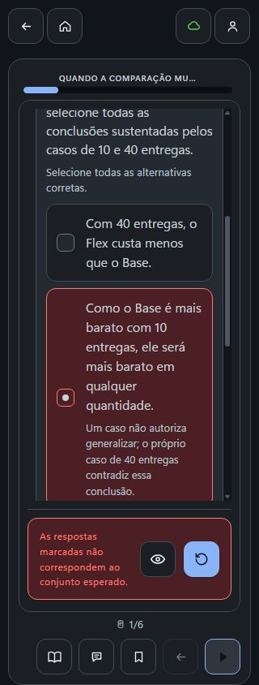
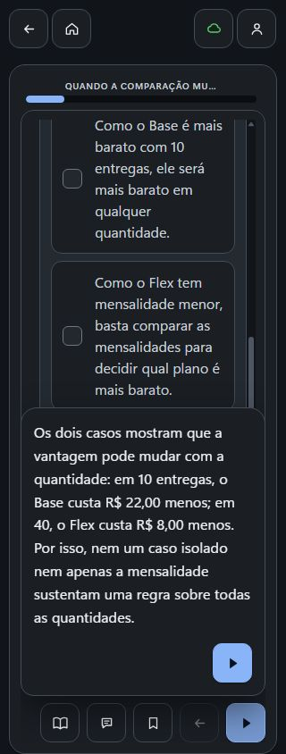
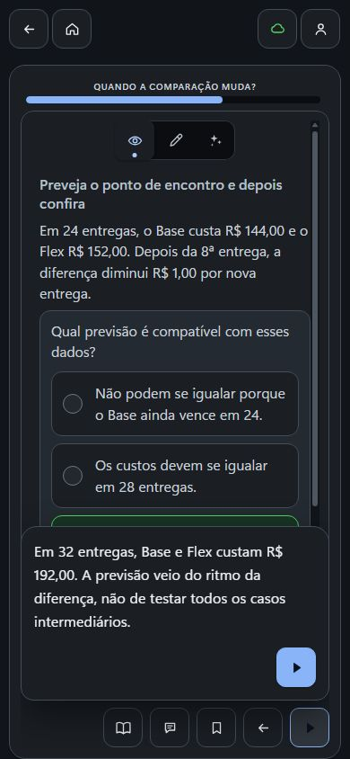
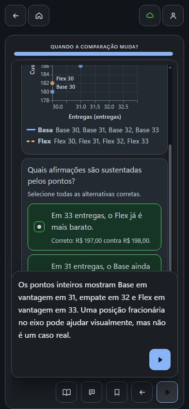
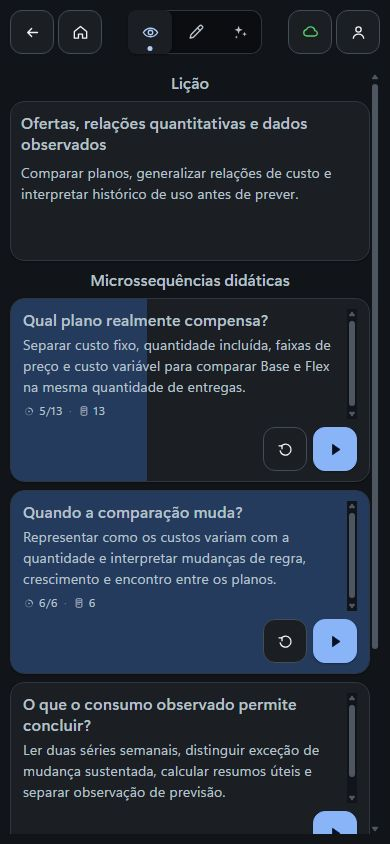
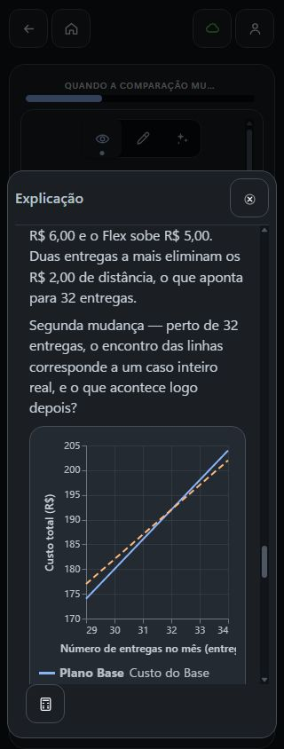
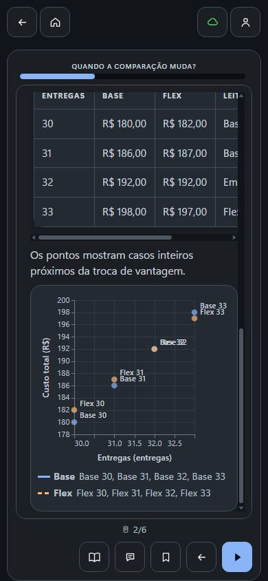

# Recuperação autônoma da segunda etapa por Actions — 0.0.88

A segunda etapa da MS2 saiu do estado sem unidades e chegou à revisão **153** com seis unidades, condição B realizada e matemática correta. A autoria partiu de uma autorização autônoma explícita; não houve aprovação humana e o mapa curricular continua rascunho. Esta consolidação documental reutiliza a auditoria fechada dos snapshots, sem repetir a coleta, abrir API ou navegador, mutar curso/produto, rodar CI ou teste amplo.

## Pedido e autoria real

Na conversa normal do GPT de autoria, Chrome persistente e potência Média, o pedido foi enviado às **19:40:27.416 UTC de 27/09/2026**:

> Você está autorizado a conduzir a autoria deste curso de forma autônoma, sem esperar revisão humana do mapa ou do conteúdo. Isso não é aprovação do mapa: mantenha-o como rascunho e não registre validação humana. Retome “Quando a comparação muda?” com essa autorização e conclua o material que falta, preservando a condição de pesquisa com prática antes e depois da explicação e as outras etapas. Confira se a tentativa inicial é compreensível com o que já foi estudado e se o ensino posterior ajuda a revisar o raciocínio. Salve, releia e registre a avaliação de IA sobre o que ficou realmente produzido. Se alguma ferramenta ainda impedir a continuação, traga o motivo exato que ela devolveu e diferencie esse impedimento de uma preferência de revisão; não presuma que eu precise aprovar pedagogicamente o mapa. Ao concluir, envie o link da etapa.

A gravação ocorreu pelo **Actions no ChatGPT**. A resposta final relata que a primeira versão da tentativa inicial recolhia apenas o vencedor, exigia também a diferença e foi corrigida antes de persistir; trata-se de **revisão interna relatada pelo GPT**, não de primeira geração limpa, e o snapshot final não recupera a versão intermediária. O manifesto da coleta foi registrado às **20:14:48.136 UTC**. Export e releitura da raiz foram consultas de engenharia; não são autoria adicional nem validação humana.

## Mudança, preservação e julgamento

A árvore documental fica idêntica ao retirar somente as seis novas unidades: **24 microssequências externas** (MS1 e MS3–MS25) e **36 unidades externas** permanecem iguais por hash antes/depois. Na MS2 alvo não havia unidade na baseline e entram seis. As **36 linhas de Analytics** por `studyUnitRef` foram retidas: **13 iguais integralmente** e **23 mudam só a posição +6**; todas as 36 declarações e pares solicitado/aplicado seguem iguais. Bases analíticas passam de 36 para 42 e contentReviews de 46 para 52, com as anteriores preservadas; os `explanationSources` só atualizam a revisão do curso. Inventários de análises, requisitos, fontes e escopo permanecem iguais. `contentReview` não equivale a inspeção por IA. Estados próprios de mapa, partes e configuração global sem unidades não estão no export: a alegação de mapa em rascunho é relato do GPT, não constatação deste snapshot.

| Dimensão | Resultado autônomo |
| --- | --- |
| Objetivo | PASS — objetivo e plano anteriores intactos; a comparação de custos evolui para ritmos, discreção e encontro |
| Explicação | PASS — U2 combina mecanismo +6/+5, diferença −1, tabela 30–33 e pontos; a Exp preservada amplia faixas, fórmulas e dois tipos de troca |
| Operação | PASS — U1 vencedor e diferença em 10/40; U3 compara ritmos; U4 prevê; U5 diferencia troca de empate; U6 lê pontos inteiros |
| Evidência | PARTIAL — R4/R5/R12/R13/R14 ligados a operações pertinentes, mas R12 tem 1 oportunidade contra mínimo aplicado 2 |
| Prática | PASS — tentativa inicial, ensino e quatro práticas; apoio em regras de MS1 é legítimo; não prova transferência independente |
| Feedback | PASS — 22/22 alternativas com feedback específico e cinco comentários finais |
| Representação | PASS — fórmulas, tabelas e cinco planos concordam; Base32/Flex32 em (32,192) representam o empate |
| Carga visual | PARTIAL — dois defeitos de renderer relatados pela raiz; a correção local .89 foi rejeitada na revisão visual e segue em correção |

Ao todo, **6 PASS e 2 PARTIAL** (evidência e carga visual). Escolhas podem observar discriminação e raciocínio dos casos; não observam derivação escrita independente, aprendizagem do estudante nem causalidade de pesquisa.

## Sequência, cálculos e parâmetros

A sequência salva é: U1 prévia (`multiple`, 6 alternativas/4 corretas) exige vencedor e diferença em 10/40 e fornece regras, não totais prontos; U2 ensina ritmos, discreção e encontro com tabela e plano; U3 (`single`) compara 20→24; U4 (`single`) prevê 32 a partir de 24 e redução de R$ 1; U5 (`single`) distingue troca 11→12 sem inteiro intermediário; U6 (`multiple`) lê 31/32/33 e recusa 31,5 real. A recuperação de resultados ensinados é legítima; as escolhas não provam cálculo autônomo nem transferência.

Base = 24 + 6·max(0, n−4); Flex = 12 + 7,5·min(n, 8) + 5·max(0, n−8), com n inteiro não negativo. Casos: 10→60/82 (Base por 22), 40→240/232 (Flex por 8), 20→120/132, 24→144/152, 30→180/182, 31→186/187, 32→192/192, 33→198/197. Empate em 32; o cruzamento visual em 1,6 não é entrega possível. U5 usa planos A/B genéricos (86/87 em 11 e 89/88 em 12) e não contradiz Base/Flex. Inventário: 19 instâncias novas — 5 tabelas, 2 planos, 7 parágrafos e 5 `choice` (3 `single`, 2 `multiple`, sem `gap` nem `ordering`) — elevando a MS2 a 39 componentes, incluindo os 20 da Explicação preservada. São 22 alternativas, 10 corretas, 12 distratores, 22 feedbacks específicos e 5 comentários finais. A auditoria fechada executou **146 conferências** matemáticas e semânticas com **zero falhas**.

Há **72 solicitados e 72 aplicados** por unidade, sem diferença em valor, origem, motivo ou tipo. Os 72 `applied.sourceScope.ref` são nulos: limite histórico do snapshot, sem nova perda de identidade. A condição B (`fixed`, `research_condition`, `before_and_after`) e o motivo literal coincidem com a configuração salva na revisão 105 e permanecem em 6/6. Como a baseline 143 não tinha unidades MS2, não existem 72 aplicações anteriores a preservar; as novas aplicações contextualizam os onze parâmetros automáticos e as configurações externas permanecem literais.

| Parâmetro | Realização e limite |
| --- | --- |
| Novas unidades de análise | U2 pede/aplica 3 e introduz A10–A12; as demais pedem 1 e não introduzem conceito novo |
| Formas de explicação | U2 cobre mecanismo, contraste, limite, exemplo resolvido e ligação entre representações; não se aplica quota expositiva às práticas |
| Oportunidades por requisito | 2 nas seis unidades; no curso R4=4, R5=5, R12=1, R13=2, R14=3 |
| Variação da prática | Casos, tarefa, apoio, representação e contexto declarados; rótulo isolado não prova transferência |
| Extensão das respostas | Alvo 180 em todas; alvo flexível, não teto |
| Extensão das unidades | Alvos 180/260/180/180/170/180; exportadas 267/218/159/142/126/130 |
| Distribuição das práticas | `interleaved` em 6/6; uma exposição na sequência curta, sem certificar alternância |
| Posição das práticas | `before_and_after` preservado em 6/6; primeira tentativa acessível com MS1 e quatro posteriores |
| Granularidade da parte e do lote | 1 em 6/6 por escopo documental; parte e lote não exportados, execução não certificada |
| Frequência de pausa | `on_request` em 6/6; continuidade autorizada, sem histórico completo de pausas |
| Preferência da conversa | `explanation` em 6/6; preferência não é parâmetro de aprendizagem |

## Destino, exploração e prática

O [destino retornado](https://fabio-ara.github.io/AraLearn/#/authoring/courses/68d099a5-60d6-4a26-bd93-4a990a4789c3?section=content&didacticMicrosequenceId=2f1606a7-dcb7-808e-ab44-e03e7d88e647) abriu a prévia real da U1/6. A raiz percorreu: Início com 42 unidades e 13/42; abertura da MS2 com 6 unidades; U1 em 320 com generalização incorreta, retorno específico, Tentar de novo, quatro alternativas corretas de vencedor/diferença em 10 e 40, comentário e avanço ao ensino da U2; tabela larga rolada até 471+232=703; gráfico da U2 e Explicação conferidos em 320/390/430/1280, com Escape devolvendo o foco; U3 em 390 com erro de ritmo, retorno específico 6/5, Tentar de novo, comparação correta das aproximações, comentário e avanço à U4; Início e recarga em 16/42, sincronizado. **U4–U6 não foram respondidas** naquela coleta (superado pelo adendo de retomada) e os números de progresso vêm da árvore acessível, com a imagem mostrando apenas a barra.

O [manifesto das capturas](ms2-088/manifesto.json) reúne sete imagens selecionadas e sua sequência, com bytes e hashes conferidos (sete naquela seleção; dez após o adendo de retomada). Nesta consolidação o worker inspecionou as sete imagens e as encontrou sanitizadas — sem nome, e-mail, credencial, cookie ou referência opaca de ator —, mas a **sequência interativa pertence à raiz**; as capturas são prova documental, não observação viva de UI.

## Adendo de retomada — U4–U6 (0.0.88, 390 px)

Depois da coleta das 22 capturas, a raiz retomou a mesma etapa em 390×844 e completou as práticas restantes: U4 (28 incorreta → feedback sobre 4 reais → retry 32 correta → comentário → U5); U5 (empate fracionário incorreto → feedback sobre quantidade discreta → retry troca sem empate → comentário → U6); U6 (31,5 incorreta → feedback sobre contagens inteiras → retry com 3 corretas → comentário → retorno à lição). A lição passa a mostrar a **MS2 6/6** e, após Sincronizado → Início → recarga, o curso aparece em **19/42** (antes 16/42; MS2 3/6). A narrativa histórica acima permanece como estava naquela coleta; este adendo a supera apenas quanto às práticas então não respondidas.

As três capturas do adendo foram copiadas sem recompressão do complemento privado e conferidas quanto a dados pessoais, credencial e referência opaca; o [manifesto](ms2-088/manifesto.json) passa a descrever dez imagens e o bloco de retomada. Limites: o número **19/42** vem da árvore acessível, e a captura do Início mostra apenas a barra; o feedback específico das respostas incorretas de U5/U6 foi observado pela raiz/AX, não por pixels integrais, porque nessas capturas a opção específica fica fora da área visível; a captura 03 original registrou a transição antes de pintar a resposta correta e **não** é usada como prova; o defeito de rótulos do gráfico em .88 continua aberto, sem aprovação visual do gráfico e sem correção hospedada; nenhuma validação humana.

## Rastreabilidade e limites materiais

- Baseline 143 (`ms9-mcp-088-estado-segunda-revisao.json`): 664.431 caracteres sem newline; SHA-256 do arquivo `952a82cfa72e770042f9a3be3e96829384ed1c284d0ea3ebd266b20189d5e8f0`.
- Export 153 (`ms2-actions-088-estado-autonomo.json`): 71 páginas informadas, 742.981 caracteres sem newline; SHA-256 do arquivo com LF final `7258e766b965dabd58188ebbfd74a52a8a70b7bc43935775c5bc0035bed74c03` (sem LF final, `6d0622b710fa1d1dbf3642012a922ebc612e5e4a28066686a505dcf85262f479`).
- F1 — R12 tem **1 oportunidade declarada no curso contra mínimo contextual 2**. U6 traz uma pergunta com várias afirmações pertinentes, não quatro perguntas; R4/R5 já têm 4/5 no curso, R13 tem 2 e R14 tem 3. Conciliar intenção e registro com a operação real, sem inflar contagem, exigir formato, novidade ou unidade extra.
- F2 — **inspeção por IA não persistida**: o último payload real tem `outcome=consistent`, 3 findings positivos e 5 checks `sufficient`; o normalizador publicado `baa4db44`, em `src/domain/courseContentInspection.js:27`, recusa `consistent` com findings não vazios e a reprodução local devolve `invalid_course_ai_inspection`. O export não contém `inspecaoIA` e o GPT relatou o bloqueio do validador. A releitura focal que bastaria para certificar o estado formal foi feita pela raiz pelo MCP às 21:35:39Z: 19 fragmentos, 196.938 caracteres completos, com inspecaoIA.state = pending; isso confirma o estado formal pendente e supera a ausência de releitura focal. O armazenamento raiz ms2InspectionRead89 não é acessível a este worker e a consulta não foi repetida. A engenharia 0.0.89 tem responsável próprio e não foi duplicada.
- F3 — **dois defeitos visuais de .88**: o eixo X da Explicação corta o título longo em 320 (SVG 222/250, canvas 222 sem rolagem) e os rótulos Base32/Flex32 coincidem em 320/390/430/1280 no gráfico da U2, com as coordenadas (32,192) representando o empate corretamente. A primeira correção local do renderer `plane` na candidata 0.0.89 foi **rejeitada na revisão visual da raiz**: nos recortes after4/resize, os rótulos ficam afastados sem vínculo e a leitura continua ambígua (Flex32 perto de 33; Flex33 perto de 32). O ajuste segue em correção com Lovelace, portanto a 0.0.89 está **em correção, não completa nem autonomamente consistente**; os oito casos antigos de `tests/runtime/chart-plane-academic.test.js` continuam válidos como prova de teste, mas não certificam o resultado visual. **Publicação e prova hospedada permanecem pendentes.**

Condição B **realizada**, mas realização não é causalidade: o snapshot e a interação não demonstram aprendizagem, transferência, eficácia da condição nem o efeito pretendido de H010. Nenhum resultado desta recuperação constitui validação humana pós-correção.
