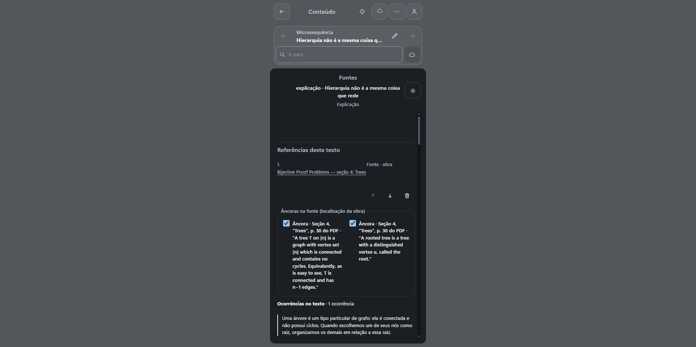
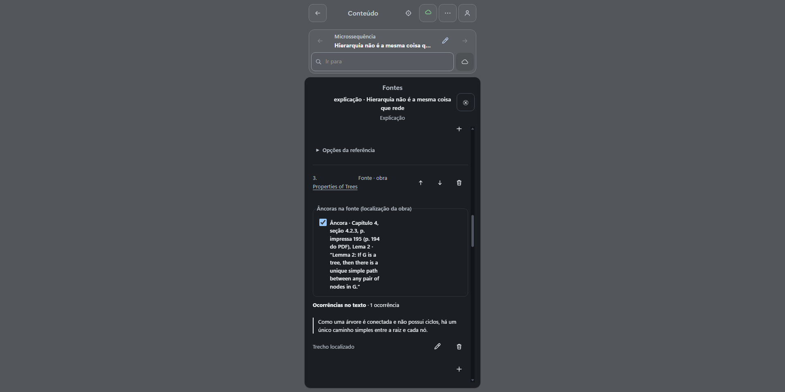
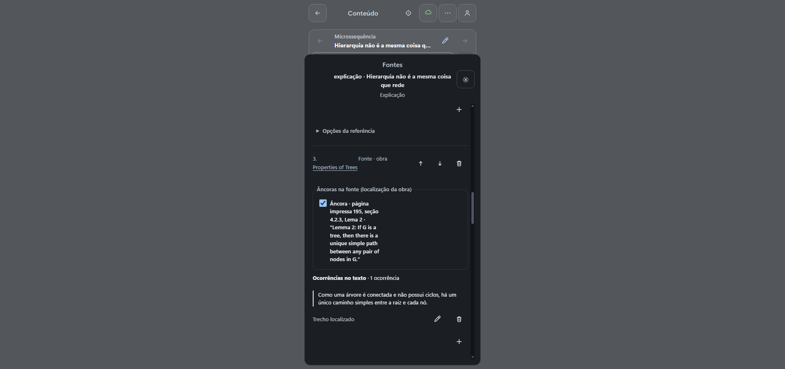
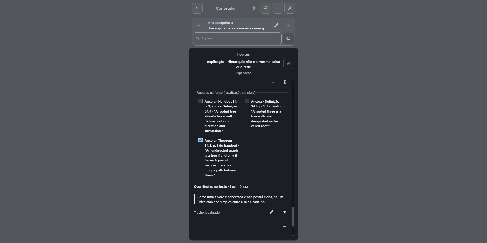

# Revisão das fontes da Explicação “Hierarquia não é a mesma coisa que rede” — 0.0.88

A etapa MS6 teve as fontes revisadas por IA em 27/09/2026, sem aprovação humana. A conferência desta entrega encontrou **seis obras vinculadas, todas localizadas, com zero pendências de ocorrência**, e confirmou os dois pontos sensíveis do pedido: o Lema 2 de Keith Schwarz está na seção 4.2.3, página impressa 195, **antes** do cabeçalho 4.2.3.1; e o vínculo com o CS280 Handout 34 usa **apenas o Teorema 34.3**, não a Definição 34.4 em que a fonte imprime “A rooted three is a tree…”. O painel de fontes do app e uma consulta MCP de engenharia (leitura, rotulada) foram lidos nesta sessão; eles descrevem o estado do curso e não substituem a verificação das fontes externas, que a raiz já fez nos dois PDFs decisivos, com os links oficiais reproduzidos na seção de conferência.

## Pedido e chamadas reais

O pedido foi enviado no Chat do GPT de autoria AraLearn, potência Média (2 de 5), e levou **9 min 22 s**:

> Neste mesmo curso, revise as fontes da etapa “Hierarquia não é a mesma coisa que rede”. Algumas localizações citadas não parecem sustentar exatamente os trechos a que foram ligadas. Confira a obra de Keith Schwarz e as demais referências usadas, encontre as passagens que realmente apoiam cada afirmação e corrija as localizações e vínculos necessários. Na obra de Schwarz, confira especialmente o Lema 2, na página impressa 195, seção 4.2.3; não o atribua automaticamente à subseção seguinte. Preserve o objetivo, as configurações de pesquisa e o conteúdo que já estiver correto. Se alguma afirmação não encontrar apoio na fonte, revise-a ou explicite o limite, sem inventar uma referência. Trabalhe somente nessa etapa por enquanto, salve as correções, releia o resultado e me diga o que conseguiu comprovar, com o link para abrir. Isso continua sendo uma revisão feita por IA, sem aprovação humana.

Há **pelo menos duas solicitações distintas observadas no turno** (Schwarz e CS280), ambas manter_fonte; o total e o status individual de cada uma **não ficam estabelecidos**, e a persistência foi conferida separadamente. A solicitação de Schwarz foi lida e consentida pela raiz (o arquivo privado ms6-actions-088-schwarz-consentimento.json prova a solicitação lida/consentida, não um recibo de execução), com âncora 1, trechoExato do Lema 2 e localizador §4.2.3, p. impressa 195; a de CS280, exibida no painel desta aba, traz a fonte **CS280 Handout 34 — Trees**, âncora 1 no trecho “Let T = (V, E) be a rooted tree with root r.”, localizador “Handout 34, p. 1, definição de rooted tree” e a nota de verificação de que a grafia anterior “rooted three” estava incorreta. Um único cartão na UI não prova uma única chamada: o total do turno não fica estabelecido sem a trilha completa, e não se refazem chamadas para contá-las. Na recuperação, uma **nova solicitação** manter_fonte (correção do localizador de Schwarz) foi observada, permitida uma vez e verificada na persistência. Nenhuma aprovação humana foi registrada.

## Vínculos persistidos

| # | Obra | Âncoras localizadas | Situação |
| --- | --- | --- | --- |
| 1 | Bijective Proof Problems — seção 4: Trees (Stanley) | Definição de árvore (conexa, sem ciclos) e de árvore enraizada por vértice distinguido | ativa, localizada |
| 2 | Trees and their Iterators — Tree Terminology (Cornell CS2110) | Ancestor/Descendant inclusivo; Tree/Node/Root; Parent/Child/Leaf | ativa, localizada |
| 3 | Properties of Trees (Keith Schwarz) | Capítulo 4, seção 4.2.3, **página impressa 195**, Lema 2 — localizador corrigido; o parêntese “(p. 194 do PDF)” fica preservado no histórico da recuperação | ativa, localizada |
| 4 | Trees — More Tree Terminology (Stanford CS106B) | Slide 7 (comprimento = nº de arestas); Slide 8 (um pai, sem ciclos) | ativa, localizada |
| 5 | Graphs — Overview and Terminology (Stanford CS106B) | Grafos sem ponto de entrada único; sem hierarquia obrigatória; comprimento por arestas | ativa, localizada |
| 6 | CS280 Handout 34 — Trees (Cornell) | Theorem 34.3, p. 1 do handout, unicidade do caminho entre pares de vértices | ativa, localizada |

O [manifesto das capturas](ms6-088/manifesto.json) registra bytes, hashes e a lista de âncoras. A captura da referência 6 mostra as duas âncoras da Definição 34.4 **desmarcadas** — inclusive a que imprime “A rooted three is a tree with one designated vertex called root.” — e apenas o Teorema 34.3 marcado, coerente com o relato do GPT.

## Conferência independente (MCP de engenharia, leitura)

Uma consulta focal de **engenharia** ao MCP do AraLearn (leitura, sem escrita) retornou o contrato aralearn.course-sources.v3 com as seis fontes, gravadas em **2026-09-27T21:47:36Z**, todas com localizada igual a true, status ativo, needsReverification falso e lista de issues vazia. O texto de verificação da referência 3 explicita que o Lema 2 aparece na página impressa 195 e precede o cabeçalho “4.2.3.1 Properties of Trees”. Nenhuma ocorrência ficou pendente.

O mesmo alvo foi aberto pelo deeplink retornado na resposta, na mesma aba de trabalho, e a Explicação persistida exibiu os marcadores de referência 1–6 e o painel de fontes com os mesmos localizadores. A preservação do texto foi checada contra a baseline: **13 das 13 passagens** da Explicação exportada na revisão 153 continuam presentes literalmente na página atual, na mesma ordem de blocos (16 itens: 13 parágrafos, 2 árvores e 1 grafo), por script DOM simples na página montada.

Comparação delimitada com a baseline 153, campo a campo: o **objetivo** da MS6 e o **planejamento da explicação** (propósito, pressupostos e relações) são idênticos aos do export 153, e o mapa segue em rascunho. A Explicação exportada tem 16 itens (13 parágrafos, 2 árvores e 1 grafo), e a página apresentou esses blocos na mesma ordem enquanto a Explicação estava montada; a conferência mecânica de texto conferiu **13 das 13 passagens** (todas presentes) em consulta posterior à montagem da Explicação. Para os **vínculos de design/parâmetros** da MS6, o export 153 (recorte MS2) não carrega essas linhas: essa parte **não foi comparada** e não se afirma preservação integral.

Limite da comparação: o export 153 existente tem recorte da MS2 e carrega as **seis URLs de fonte** do curso, mas não as linhas de vínculo/âncora da MS6. A comparação por arquivo cobre o conjunto de obras (idêntico, sem inclusão nem remoção); o “antes” no nível de âncora não é reconstituível por esse export; a leitura atual do painel e do MCP descreve o estado presente e **não reconstrói o passado**, então esse limite histórico permanece.

## Ressalva da resposta web

Na resposta final renderizada, o cartão do primeiro item (Keith Schwarz) exibe um link do Cornell CS280 e o cartão do item do CS280 mostra “1 fonte adicional”. A citação exibida junto ao item de Schwarz é inadequada. **A fonte salva no curso é distinta e conferida**: a âncora da referência 3 aponta para o PDF de Keith Schwarz hospedado no material de Stanford CS103, com o Lema 2 em 4.2.3, e o CS280 é uma fonte separada, na posição 6, restrita ao Teorema 34.3. Não se atribui causa a esse desencontro sem prova.

## Recuperação do localizador de Schwarz (resolvida)

A conferência primária encontrou uma **falha material** no localizador da referência 3: no PDF keith.pdf o Lema 2 está no índice zero 194, isto é, na **195ª página do arquivo** (cabeçalho 195/369), e a subseção 4.2.3.1 começa abaixo, na **mesma página impressa 195**. O parêntese persistido “(p. 194 do PDF)” confunde índice zero com o número que o leitor vê. A verificação independente da raiz nos PDFs oficiais — [Keith Schwarz CS103](https://theory.stanford.edu/~trevisan/cs103-14/keith.pdf) e [Cornell CS280 Handout 34](https://www.cs.cornell.edu/courses/cs280/2001sp/handouts/h34.pdf) — sustenta a correção: no Schwarz o Lema 2 está no índice zero 194, isto é, na 195ª página do arquivo; no h34, o Theorem 34.3 está na p. 1 e o erro literal “three” aparece na Definição 34.4.

O pedido em linguagem humana foi enviado na retomada, já na aba normal autenticada: a UI pediu consentimento para manter_fonte, o payload foi lido antes (fonte Properties of Trees, âncora 1, trechoExato do Lema 2, localizador **página impressa 195, seção 4.2.3, Lema 2**) e permitido **uma vez**. A nova resposta confirma a correção, e a consulta MCP focal de engenharia confirma a persistência: o localizador da referência 3 passou a ser **“página impressa 195, seção 4.2.3, Lema 2”**, sem o parêntese ambíguo. O erro inicial fica preservado no histórico como **recuperação posterior à primeira resposta**.

### Conferência textual focal das demais fontes (raiz)

A raiz conferiu as quatro fontes restantes nos trechos declarados, por consulta direta às páginas oficiais: [Stanley, Bijective Proof Problems — seção 4 Trees](https://math.mit.edu/~rstan/bij.pdf) (p. impressa 30, índice PDF 29: árvore conexa sem ciclos e raiz distinguida); [Cornell CS2110 — Tree Terminology](https://www.cs.cornell.edu/courses/cs2110/2025fa/lectures/lec16/) (raiz sem entrada, um pai por outro nó, ancestral inclusivo); [Stanford CS106B — Trees](https://web.stanford.edu/class/archive/cs/cs106b/cs106b.1252/lectures/22-trees/slides) (slides 7 e 8: comprimento por arestas, um pai, sem ciclos); e [Stanford CS106B — Graphs](https://web.stanford.edu/class/archive/cs/cs106b/cs106b.1258/lectures/25-graphs/) (Overview e Terminology: grafo sem entrada única nem hierarquia; comprimento por arestas, ressalvadas as convenções de caminho versus caminho simples). As duas fontes decisivas já estão ligadas na seção de recuperação: [Keith Schwarz CS103](https://theory.stanford.edu/~trevisan/cs103-14/keith.pdf) e [Cornell CS280 Handout 34](https://www.cs.cornell.edu/courses/cs280/2001sp/handouts/h34.pdf).

## Limites

Revisão por IA, sem validação humana e sem aprovação de mapa. A marcação “localizada/ativa/sem pendências” vem dos metadados do próprio app e da consulta MCP, além do painel visual das referências decisivas. As **seis fontes** foram consultadas nos trechos declarados (as duas decisivas pela raiz nos PDFs oficiais; as quatro demais na conferência textual focal), o que não equivale a leitura integral de cada obra nem a validação humana. Nenhum código, CI ou curso foi editado por HTTP nesta conferência. A autoria e a gravação pertencem ao GPT de autoria por Actions; a leitura pelo MCP é verificação de engenharia, não autoria adicional.
