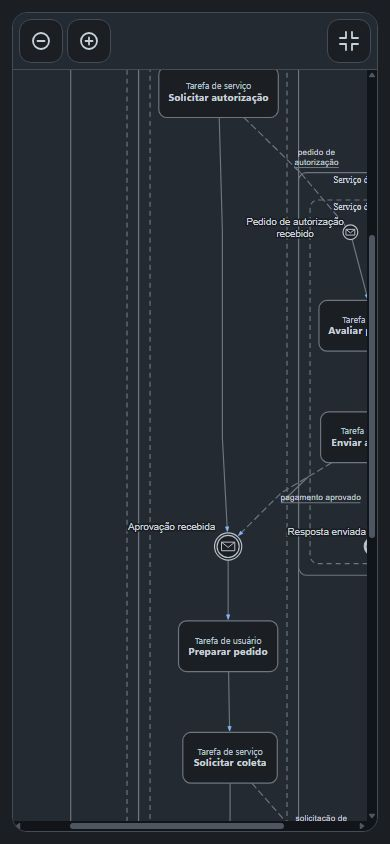
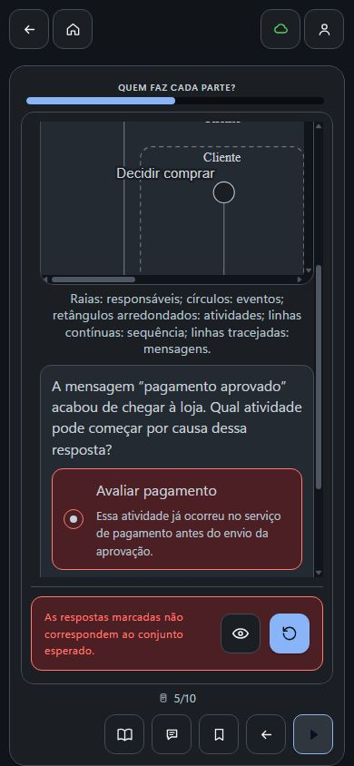
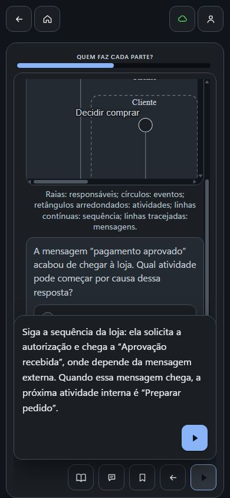

# Segunda revisão do processo por MCP — 0.0.88

As três representações da etapa “Quem faz cada parte?” agora ligam a solicitação à espera por aprovação e encerram os percursos locais da loja e do pagamento. A comparação **139→143**, a auditoria independente e a interação no Estudo confirmaram o resultado. O parecer de IA da prática alterada foi salvo; as inspeções da primeira unidade e da Explicação continuam pendentes. Nenhuma aprovação humana foi registrada.

## Pedido e autoria real

Na conversa normal do ChatGPT Chat, Chrome persistente e raciocínio Médio, o Codex enviou às **19:18:50.445 UTC de 27/09/2026**:

> Retome somente “Quem faz cada parte?” no mesmo curso. A correção do recebimento ficou mais clara, mas a conferência do processo ainda encontrou dois pontos: “Aprovação recebida”, na loja, aparece sem o caminho que leva até essa espera; e os percursos da loja e do serviço de pagamento mostram início sem mostrar sua conclusão. Revise essas ligações e os encerramentos para que o desenho represente um processo coerente, sem inventar etapas desnecessárias. Confira as ocorrências na explicação e nas atividades, preservando os objetivos, as configurações e as outras etapas. Mantenha as práticas que já observam adequadamente a responsabilidade e a próxima ação; não é necessário torná-las mais longas só por isso. Releia o material salvo, registre a inspeção como avaliação de IA e me dê o link real. Não registre aprovação humana.

A resposta final foi observada às **19:26:10.103 UTC**, com indicação de 5 min 42 s de raciocínio. A autoria e a gravação ocorreram pelo **MCP no ChatGPT**. Exports e releitura da raiz pelo conector MCP são verificação independente de engenharia, não autoria adicional. Não houve submissão HTTP manual do conteúdo.

## Mudança, preservação e julgamento

Os três grafos salvos — Explicação, U1 e P3/U5 — são iguais. Passaram de 18 nós/18 fluxos para **20 nós/21 fluxos**, acrescentando três ligações de sequência e dois eventos finais, sem nova atividade operacional. “Solicitar autorização” leva a “Aprovação recebida”; “Enviar aprovação” termina em “Resposta enviada”; “Solicitar coleta” termina em “Pedido encaminhado para coleta”. O último encerramento delimita o trecho local e não declara a entrega global concluída.

Todos os percursos locais alcançam seus finais. Mensagens cruzam participantes e sequências permanecem dentro deles. As nove ocorrências formais anteriores desapareceram nas três cópias. Essa conferência estática não é simulação integral de tokens ou certificação BPMN universal.

Texto e feedback foram reconciliados. P3 mantém a pergunta sobre qual atividade pode começar após a aprovação e a resposta **Preparar pedido**. O retorno explica a dependência satisfeita; os distratores continuam distinguindo o que já ocorreu, o que depende da preparação e o que pertence ao início. O requisito pede uma mensagem seguida da próxima ação, portanto não foi imposto um rastreamento mais longo.

| Dimensão | Resultado autônomo |
| --- | --- |
| Objetivo | Preservado; responsabilidades, mensagens e dependências observáveis |
| Explicação | Texto e ligações gráficas concordam; finais locais delimitados |
| Operação | Mensagem → próxima ação e efeito de ausência/recusa, conforme requisitos |
| Evidência | Adequada ao alcance local; não demonstra transferência ou aprendizagem real |
| Prática | Oito escolhas únicas preservadas; formato compatível com as operações |
| Feedback | 31 alternativas e oito retornos contextualizados; P3 explica a espera encerrada |
| Representação | Três cópias coerentes, sem as pendências formais anteriores |
| Carga visual | Interação da raiz nos dois hosts e quatro larguras, com exploração necessária |

As outras **24 microssequências**, as **26 unidades externas** e suas linhas integrais de Analytics permaneceram iguais por identidade. As oito unidades não alteradas da própria MS9 também permaneceram iguais. As dez declarações e os **120 pares solicitado/aplicado** foram preservados, incluindo ordem agrupada e prática depois do ensino. O formato histórico aplicado mantém referência de escopo nula e não inclui modo; esta revisão não reconstrói proveniência ausente.

P3/U5 tem parecer **current/consistent**, gravado às **19:23:22.321755 UTC**, com as cinco dimensões vigentes na 0.0.88. A base relida coincide com o conteúdo atual. **U1 e Explicação continuam pending**: o registro de P3 não cobre esses alvos. A sexta dimensão em desenvolvimento na 0.0.89 não foi imposta retroativamente. O registro curricular continua rascunho.

## Destino, exploração e prática

O [destino retornado](https://fabio-ara.github.io/AraLearn/#/authoring/courses/68d099a5-60d6-4a26-bd93-4a990a4789c3?section=content&didacticMicrosequenceId=d4a77e6a-0f59-8031-b207-aae9194de13a) abriu a prévia real da U1. A raiz explorou por pan e zoom a entrada na espera e os dois finais. Reabriu depois o curso pelo Início e conferiu o mesmo material no Estudo.

Unidade e Explicação foram exercitadas a **320, 390, 430 e 1280 px**, com zoom de 1 para 0,64, pan horizontal/vertical, tela inteira, Escape e retorno de foco. O grafo permanece explorável; a área fora do quadro inicial não foi tratada como desaparecimento.

Na P3/U5, a sequência foi: **Avaliar pagamento** incorreta → feedback específico integralmente visível → Tentar de novo → **Preparar pedido** correta → comentário revisado → avanço à U6. Início e recarga mantiveram sincronização e progresso **13/36**, antes 12/36. O número foi conferido na árvore acessível; as imagens mostram a barra, sem numeração.

O [manifesto de capturas](ms9-088/manifesto.json) reúne 16 imagens selecionadas e sua sequência. Uma captura inicial transitória foi excluída da evidência pública, substituída pelo estado estável. A auditoria independente conferiu arquivos e hashes; o julgamento de pixels/interação pertence à raiz, sem atribuição ao worker.

## Reprodução e limites

- Export anterior 139: SHA-256 `b14c6d55589e7d253f9d7700471b168eca277d0536283f252888b873618ed239`.
- Export 143: 63 páginas, 664.431 caracteres sem newline; SHA-256 `952a82cfa72e770042f9a3be3e96829384ed1c284d0ea3ebd266b20189d5e8f0`.
- Releitura focal de inspeções: 18 páginas, 190.854 caracteres sem newline; SHA-256 `5517c673f79b43462a8dc144bb4b145d84880d7827717c55214c4c5126f6416f`.

A pré-triagem reproduzível `scripts/auditRevisaoV10Course.mjs` marcou zero envelopes inválidos e zero ocorrências formais. Foi executada com código local 0.0.89, cujas regras BPMN neste recorte são as mesmas; não certifica as dimensões semânticas e visuais nem muda o contrato histórico do parecer. O comparador privado preserva diferenças, hashes e 120 pares de parâmetros, sem expor dados pessoais ou referências opacas.

Correção de conteúdo e interação: **consistentes no recorte**. Fechamento das inspeções persistidas: **parcial**, faltando U1 e Explicação. O resultado é recuperação assistida, preservado separadamente da primeira produção. Nenhum resultado desta intervenção constitui validação humana pós-correção.
