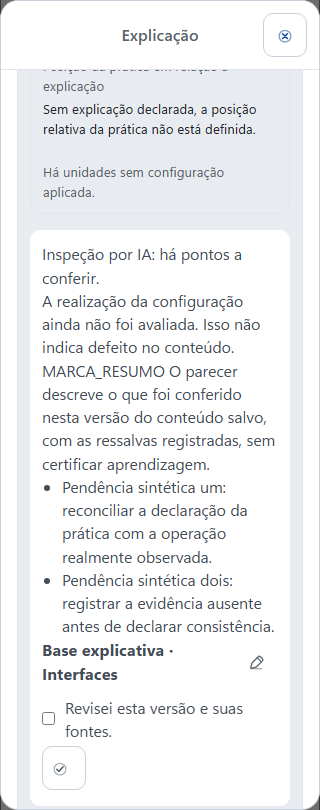

# Parâmetros legíveis e inspeção da configuração — candidata 0.0.89

**Implementado e testado localmente; publicação e prova hospedada pendentes.** O trabalho parte do commit `baa4db4405ce2fe0007b4a47a9acaeb5b353b3de`, versão hospedada 0.0.88. A candidata usa produto 0.0.89, Android 235 e catálogo humano 11.0.0. Não muda os 34 componentes nem as condições de pesquisa já gravadas.

## Problema e mecanismo compartilhado

A leitura humana dos parâmetros aplicados preservava valores, origem e justificativa, mas a filtragem técnica retirava o identificador sem oferecer o nome correspondente. Além disso, as cinco dimensões obrigatórias de inspeção permitiam um parecer completo sem julgamento explícito da realização da configuração. A primeira produção da etapa de estados mostrou por que as três coisas precisam permanecer distintas: parâmetro solicitado, aplicação declarada e percurso efetivamente apresentado.

A projeção agora usa o catálogo existente para oferecer **nome, campo, construto, operacionalização e limites**. Cada ocorrência conserva valor, origem, justificativa e campos históricos; parâmetros desconhecidos mantêm identidade, sem definição inventada. No contexto compartilhado de cada microssequência, as definições aparecem uma única vez, junto das bases que as usam. O agrupamento deriva da identidade e da igualdade da base, sem associação por título, serviço adicional ou consulta obrigatória a outra ferramenta. Sem grupo correspondente, a definição acompanha o parâmetro localmente. Cada página lógica é independente.

Novos pareceres exigem a sexta dimensão, **configuration**, com o mesmo formato de resultado, justificativa e evidência das demais. A orientação pede confronto contextual entre configuração aplicada e realização observável, distinguindo preferência automática de condição fixa de pesquisa. Não há regra de alternância, quota de formatos ou certificação por contagem. Insuficiência relevante deve ser reconhecida; não aplicável exige justificativa sobre a ausência de parâmetro observável pertinente.

MCP e Actions usam o mesmo núcleo. A base canônica e as referências de inspeção não mudam. Recursos literais, fontes, âncoras e citações por alvo são preservados. A UI explica que a realização da configuração ainda não foi avaliada quando o parecer histórico não a contém, sem inferir defeito no conteúdo.

## Histórico, persistência e recuperação

Pareceres históricos de zero ou cinco dimensões continuam legíveis; não recebem avaliação retroativa. Atualidade da base e completude das dimensões são propriedades separadas. Uma nova gravação de cinco dimensões é recusada, mas a repetição exata de uma tentativa antiga já salva continua recuperável, inclusive depois de outro parecer ou de mudança da base.

A migração nova `20260928110000_configuration_realization_inspection.sql` altera funções, sem tabela, coluna ou backfill. O recibo é conferido antes da exigência das seis dimensões. O RPC interno de recuperação exige `service_role`, acesso do ator ao curso, identidade da tentativa e hash da requisição. Mantém o limite de 64 KiB do recibo, sem transportar nele toda a base. Leitura integral da base, controles de acesso e conflito permanecem necessários.

## Custo do contexto e provas focais

A projeção inicial repetia as definições em todas as ocorrências. A medição do corpus preservado da etapa de estados identificou aumento material; por isso, o compartilhamento foi incorporado antes do gate amplo.

| Mesmo corpus: cinco unidades e uma Explicação | Caracteres | Bytes UTF-8 | Fragmentos |
| --- | ---: | ---: | ---: |
| Leitura 0.0.88 recomposta | 169.438 | 173.097 | 16 |
| 0.0.89 com definições repetidas | 227.134 | 232.705 | 21 |
| 0.0.89 final, definições por foco | 184.721 | 188.799 | 18 |

A medição final inclui a instrução nova, a orientação sobre pendências e a projeção da completude dos pareceres. São 120 ocorrências de parâmetros e **12 definições**, economizando 43.906 bytes e três fragmentos frente à repetição. A reconstrução das definições com os valores é estruturalmente equivalente. O acréscimo sobre a 0.0.88 é 9,07%, correspondente à informação acrescentada; não se alega melhora causal da qualidade do GPT a partir dessa medida local.

As provas focais cobrem nomes, campos desconhecidos, condições fixas, dois focos com mesmo título, bases distintas, duas páginas lógicas independentes, fallback local, fontes por alvo, recursos literais e paridade dos canais. O ajuste final passou em **76 casos focais**, além de lint e checks dos geradores. Esses casos se sobrepõem às rodadas anteriores e não são somados como total de testes únicos.

PGlite executou a migração inteira, autorização e replay: base integral de 104.708 bytes, parecer Unicode com seis dimensões de 184.912 bytes e recibo de 480 bytes. Novas cinco dimensões foram recusadas; histórico exato, mudança de base, grounding e estado de atenção foram exercitados. Isso não prova contenção concorrente em PostgreSQL hospedado. O manifesto SQL foi alinhado à revisão 28110000 e às 53 features, preservando as 27 assertions do consumidor pgTAP.

OpenAPI: **99.835 caracteres**, 30 operações, SHA-256 `c14a8af8a63cdfcb87c20464ca4c84dde85a3fa9676b14072120ad7553750281`. Catálogo: **144.989 bytes**, 56 tarefas, fingerprint `sha256:62ec2b77f44313f7d714ee27a46e29f1f9f7baf8fe994f4af5e489623523b887`. Os limites existentes não foram ampliados. A migração tem SHA-256 `032f7552b68db9421311b8cac47a01b43a30026d4bf56b9f0de216484191e778`.

A recuperação real da MS2 também mostrou uma ambiguidade do contrato: o GPT enviou resultado consistente com três observações positivas em `findings`, reservado a pendências. O normalizador publicado recusava isso com erro genérico. A reprodução local do payload preservado confirmou a causa dessa última tentativa. Schema e orientação agora explicitam o significado; mensagens de contradição entre resultado, pendências e dimensões indicam como reconciliar o parecer preservando o julgamento. As regras de aceitação, o grounding e o código de erro permanecem iguais. **56 testes focais** desse ajuste passaram, incluindo paridade de mensagens e replay; não são somados às rodadas anteriores como casos únicos. Não houve gravação de parecer corrigido por engenharia nem conclusão sobre as outras recusas sem seus respectivos corpos.

## Limites de conclusão

A prova visual local do aviso de inspeção percorreu **16 combinações**: parecer histórico com cinco dimensões consistente ou com atenção, parecer atual com seis dimensões suficientes e inspeção pendente, em 320/390/430/1280 px. O diálogo real da fixture de revisão usou o renderer e os estilos da candidata, com resposta controlada do controller. Não houve erro de página nem overflow medido de seção, diálogo ou documento. O aviso histórico conserva resumo e pendências; o atual completo não recebe esse aviso. A raiz conferiu os recortes decisivos de 320/390 px. [Manifesto e identidade dos inputs](inspecao-089/manifesto.json).

As provas acima são locais, com corpus real preservado e casos controlados. Gate amplo, CI protegida, publicação, configuração dos clientes e nova autoria real ainda precisam conferir os mesmos mecanismos. O snapshot aplicado histórico conserva somente o tipo de escopo e referência nula; este delta não reconstrói eventos ou origem histórica ausentes. Realização observável do conteúdo não equivale a aprendizagem de estudantes ou eficácia de uma condição de pesquisa.

Nenhum resultado desta intervenção constitui validação humana pós-correção.
