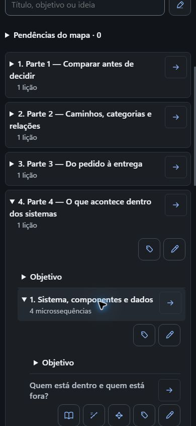
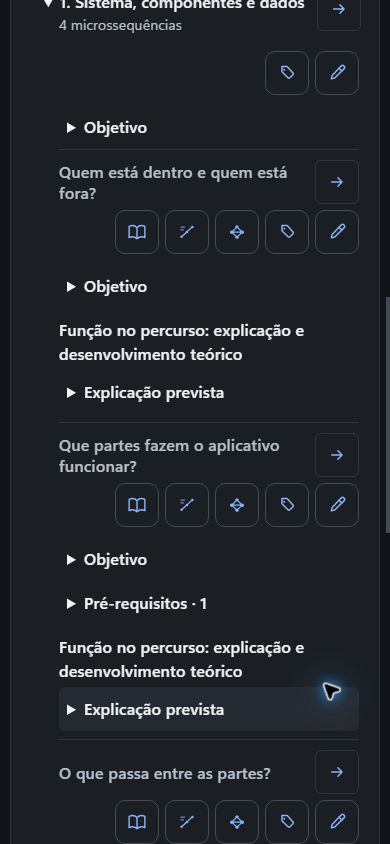
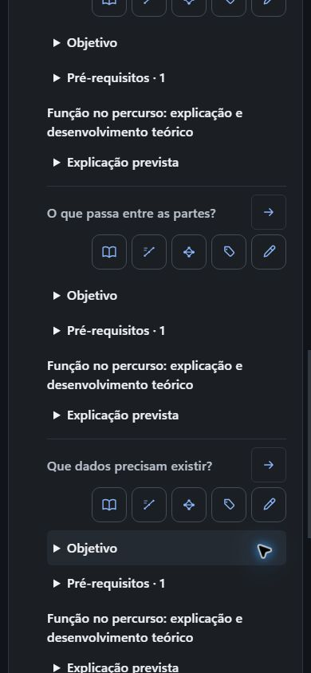

# Planejamento SysML por Actions — revisões 24 → 26

Etapa de planejamento do curso **Do sinal à decisão: como representamos situações para prever o que acontece depois** (`68d099a5-60d6-4a26-bd93-4a990a4789c3`), entre as revisões **24** e **26**. O ChatGPT incluiu, por Actions, uma microssequência sobre o que passa entre as partes de um sistema físico e renomeou a Parte 4. Este registro reúne evidência sanitizada; os logs de borda corroboram as chamadas do ChatGPT e pertencem ao diagnóstico de engenharia.

Consentimento pontual operado por Codex sob mandato do proprietário, restrito a este curso. Não houve pessoa revisando a produção neste momento; nada aqui é aprovação humana.

## Delta confirmado

- As **24 microssequências anteriores** permanecem byte a byte idênticas, por ID, título, objetivo, dependências, cobertura, plano, explicação e unidades vazias. A matriz completa está no [registro sanitizado](sysml-planejamento-actions.json).
- O módulo `7788b22e-4bc9-8148-a4c6-73883554597e`, na posição 3, passou de **Parte 4 — O que acontece dentro do aplicativo** para **Parte 4 — O que acontece dentro dos sistemas**; os demais títulos de módulo não mudaram.
- A nova microssequência `af7eac2c-0468-89b8-8926-93e426bb318d`, **O que passa entre as partes?**, entrou em `modules[3].lessons[0].microsequences[2]`, entre **Que partes fazem o aplicativo funcionar?** e **Que dados precisam existir?**; esta última deslocou-se de `3/0/2` para `3/0/3`.
- Nada mais mudou: as quatro explicações e as demais microssequências são as mesmas da revisão 24.

| Campo da nova microssequência | Valor |
| --- | --- |
| ID | `af7eac2c-0468-89b8-8926-93e426bb318d` |
| Título | O que passa entre as partes? |
| Papel | `explain` |
| Módulo / lição | `7788b22e-4bc9-8148-a4c6-73883554597e` / `68242214-8df1-8b61-b721-a08061dfec32` |
| Posição na revisão 26 | `modules[3].lessons[0].microsequences[2]` |
| Dependência | `331f2ecd-a025-8860-b92c-828b33d229ae` |
| `scopeItemIds` / `covers` | `[]` / `[]` |
| `checks` / `errors` / `studyUnits` | `[]` / `[]` / `[]` |
| `explanationPlan` / `explanation` | presente / ausente |

O objetivo planejado é: *“Seguir separadamente fluxos de informação, energia e material em um sistema físico, conferir se as interfaces conectadas são compatíveis com o que devem transportar e explicar o efeito de uma ligação ausente ou inadequada sem atribuir o problema ao caminho errado.”*

A etapa tem objetivo e plano de explicação (`purpose`, `prerequisites`, `relations`, `sourceIds`), mas **nenhum item de escopo vinculado**: as duas vizinhas usam o item `2b95248c-6923-8808-a050-fb7853e54c6f`, e a nova não o herda automaticamente nem recebe outro. A cobertura, portanto, permanece pendente e **não é cobertura completa**; este lote não atribui a ausência ao corpo da chamada, porque o recorte de chamadas não preserva argumentos.

## Chamadas observadas

O ciclo contém 14 chamadas: 12 respostas `200` e 2 respostas `404`, preservadas sem causa inventada.

| Operação | Status | UTC |
| --- | ---: | --- |
| `retomar_curso` | 200 | 2026-09-27T01:43:20.831000 |
| `consultar_planejamento` | 200 | 2026-09-27T01:43:26.018000 |
| `consultar_planejamento` | 200 | 2026-09-27T01:43:33.163000 |
| `consultar_planejamento` | 200 | 2026-09-27T01:43:39.990000 |
| `estrutura_curricular` | 404 | 2026-09-27T01:44:33.284000 |
| `estrutura_curricular` | 200 | 2026-09-27T01:44:44.866000 |
| `consultar_planejamento` | 404 | 2026-09-27T01:44:50.301000 |
| `consultar_planejamento` | 200 | 2026-09-27T01:44:56.449000 |
| `consultar_planejamento` | 200 | 2026-09-27T01:45:03.753000 |
| `consultar_planejamento` | 200 | 2026-09-27T01:45:09.672000 |
| `consultar_planejamento` | 200 | 2026-09-27T01:46:12.644000 |
| `estrutura_curricular` | 200 | 2026-09-27T01:47:32.069000 |
| `consultar_planejamento` | 200 | 2026-09-27T01:47:35.902000 |
| `consultar_planejamento` | 200 | 2026-09-27T01:47:42.912000 |

## Conversa

Os dois primeiros prompts da captura pertencem a esta etapa. Preservados literais:

> Você disse:
> rascunho-gpt-sysml.md
> Documento
> Quero acrescentar ao planejamento do mesmo curso uma etapa que ainda faz falta: compreender como as partes de um sistema físico se conectam e por onde passam água, energia e informação. Anexei o rascunho original que você produziu para uma irrigação automática. Inclua essa sequência junto da discussão sobre a organização interna dos sistemas, depois das partes do aplicativo, preservando integralmente as outras 24 sequências e todo o conteúdo já salvo. O objetivo deve pedir que o estudante siga cada tipo de fluxo, confira a compatibilidade entre conexões e explique o efeito de uma ligação ausente ou inadequada; não basta reconhecer nomes de peças. Planeje uma explicação com diagrama interno de bloco, exemplos suficientes e as práticas do rascunho, sem tratar o desenho como decoração ou confundi-lo com uma arquitetura apenas de software. Por enquanto ajuste somente o planejamento para receber essa etapa; não materialize o conteúdo nem altere as explicações existentes. Faça isso de forma autônoma apenas neste curso, sem mudar preferências gerais ou registrar aprovação humana. Releia o mapa salvo e confirme onde a nova etapa entrou.

> Você disse:
> A inclusão faz sentido. Como essa parte agora reúne software e um sistema físico, o título “O que acontece dentro do aplicativo” ficou estreito. Atualize apenas o título dessa parte para “O que acontece dentro dos sistemas”, preservando sua posição, as quatro sequências e todos os objetivos, relações, explicações e dados. Releia para confirmar a mudança. Não altere nenhuma outra parte nem registre revisão humana.

## Capturas (390×844, JPEG)

Três capturas reais da superfície de autoria, em 390 px, não editadas.

| Arquivo | Bytes | SHA-256 | O que mostra |
| --- | ---: | --- | --- |
| `sysml-planejamento-390.jpg` | 35918 | `51a5b5ca4fc69d636943c52c8927b1f67e672fa19cffe6d795ada219c4cc32e2` | mapa com **Pendências do mapa · 0** e a **Parte 4 — O que acontece dentro dos sistemas** já renomeada |
| `sysml-planejamento-390-detalhes.jpg` | 34912 | `389490de9ea09cee4174548f566248071166df085f4d3448ab072eddb1502752` | lição aberta com objetivos, “Função no percurso: explicação e desenvolvimento teórico” e **Explicação prevista** |
| `sysml-planejamento-390-nova-etapa.jpg` | 35143 | `bdfbdc0b3b75eb4426c4eda17cd634cb7e730e87a666026d8788d1934c7f47c0` | **O que passa entre as partes?** entre **Que partes fazem o aplicativo funcionar?** e **Que dados precisam existir?** |

A inspeção de pixels foi feita pela raiz Codex sobre essas capturas — não é inspeção humana proprietária.

## Limites

- O ciclo de Actions preserva rota, status e horário, não os corpos das chamadas: **não é possível provar por este recorte** se a cobertura foi omitida ou enviada vazia.
- Os dois `404` são observados por operação, status e horário; nenhuma causa é inferida.
- A nova microssequência está apenas planejada: sem explicação persistida, sem unidades de estudo, sem práticas materializadas e sem revisão humana registrada.
- A cobertura da nova MS segue pendente de correção; as 24 anteriores não foram rematerializadas nem alteradas neste delta.
- O parecer não declara suficiência pedagógica, prática, feedback, funcionalidade em Estudo nem aprovação humana.

## Fontes sanitizadas

Hashes das fontes privadas usadas neste lote (sem caminhos, tokens, request IDs ou URLs privadas):

| Arquivo | Papel | SHA-256 |
| --- | --- | --- |
| `new-course-exp4-after-visual.json` | export anterior, revisão 24 | `64847a5e9237f374952d651dbfce6069499d28f438d16368ff7715dd1cc248b8` |
| `new-course-after-sysml-plan.json` | export posterior, revisão 26 | `7b953a70e4054a2d10af58b735c4d06b04ebd29665c5c13df495cf38809bb235` |
| `actions-sysml-planejamento-ciclo.json` | 14 chamadas sanitizadas | `d6a1432132a457c039d17070015f134455ad3aa3a3a50941f52d968639dd62f2` |
| `actions-sysml-planejamento-logs-sanitizados.json` | logs de borda sanitizados | `516082d0cf78650d8b7d6e0a61cb5b0b5f3e63ccd55534378625fc8e242b4259` |
| `actions-exp5-observacao-gpt.json` | dois primeiros prompts `user/text` do lote | `6d727733c551e1aee431d8a6057b7e74341f7705503b4cd087ba730f01f5341d` |
| `auditoria-plano-sysml-actions.md` | comparação rev24/rev26, pendências e limites | `7ad371e0a3fe490f48af7e4ac5e344eff51814f4cf1dd679392fc5b54f31e614` |
