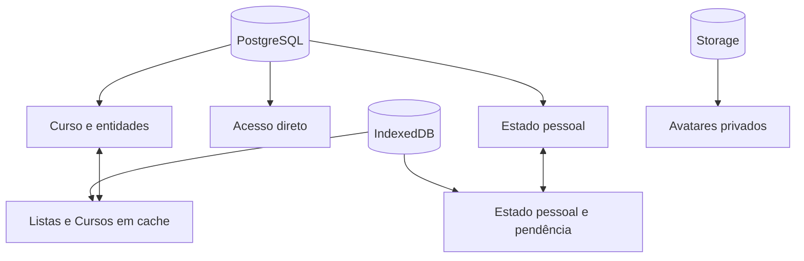

# Persistência relacional e sincronização

Este capítulo explica onde o runtime canônico guarda cada dado e por quê. A
decisão central é conservar um único Curso vivo no servidor, uma réplica local
para continuidade e um estado pessoal separado por pessoa.

## Conceitos fundamentais

**Persistência** é a conservação de estado além da execução corrente.

**Banco relacional** organiza dados em relações com chaves, restrições e
transações. O PostgreSQL do Supabase é a autoridade para Curso, propriedade,
acesso e estado compartilhado.

**IndexedDB** é o banco transacional do navegador. Ele mantém sessão, cache e
operações pessoais pendentes no dispositivo.

**Storage de objetos** guarda bytes por chave. Nesta etapa, recebe somente
fotos privadas de perfil; não é a fonte do conteúdo de Curso.

**Réplica local** é uma cópia útil para leitura e continuidade. Ela não substitui
a autoridade do servidor para acesso ou concorrência.

## Modelo mental

**Descrição textual:** o Curso possui uma raiz e entidades no PostgreSQL; o
dispositivo conserva descritores e Cursos já abertos; cada pessoa mantém um
estado pessoal local e remoto; fotos ficam no Storage privado.



## O que fica no PostgreSQL

### Raiz do Curso

`public.courses` conserva:

- identidade UUID;
- proprietário;
- título;
- objetivo;
- orientações;
- revisão corrente;
- estado básico de autoria;
- datas de criação e atualização.

Não existe coluna de arquivamento ou exclusão lógica no Curso canônico. Nenhum
comando atual de Estudo, Autoria ou MCP produz esse estado; mantê-lo no banco
criaria uma possibilidade sem operação correspondente no produto.

O estado de autoria v1 é um objeto fechado com `version`, `parts`, `decisions`
e `mandate`, limitado a 1 MiB. Isso é um contrato mínimo para retomada, não um
convite para colocar todo dado futuro num JSON único.

### Entidades do Curso

`private.course_entities` usa uma linha por Módulo, Lição, Tópico,
Microssequência didática ou Unidade de estudo. A chave primária é Curso + tipo
+ identidade. Colunas explícitas guardam pai, posição e revisão da entidade; o
conteúdo próprio fica em JSON. Cada linha também conserva `created_at` e
`updated_at`, de modo que revisão e tempo pertençam à entidade que realmente
mudou, e não apenas à raiz do Curso.

Uma chave estrangeira composta impede que uma entidade aponte para pai de
outro Curso. Restrições de posição impedem irmãos duplicados. Excluir um pai
remove descendentes na mesma árvore; o commit completo continua transacional.

### Propriedade e acesso

O proprietário fica na raiz. `public.course_access` contém somente Curso,
pessoa favorecida, concedente e instante. Não há nível, papel ou matriz de
permissões: a presença da linha significa acesso a Estudo.

### Estado pessoal

`public.course_personal_states` possui uma linha por pessoa e Curso:

```text
progress.lessons  → cursor e Unidades concluídas
reviewMarks       → instante da marca por Unidade
observations      → categoria, texto e atualização por Unidade
```

O documento é limitado a 512 KiB, 10 mil Lições, 100 mil conclusões, 100 mil
marcas e 10 mil observações. Esses tetos são limites de segurança, não metas de
desenho instrucional.

A quantidade concluída mostrada na lista não é uma coluna duplicada. A consulta
intersecta as identidades guardadas no estado com as Unidades ainda vivas no
Curso. Assim, remover uma Unidade não deixa um contador persistido incorreto.

### Eventos e recibos

`private.course_events` registra somente eventos pequenos que já possuem
consumidor de auditoria ou pesquisa: criação, alteração de metadados,
substituição de composição, concessão e revogação de acesso. O resumo não
replica o Curso nem contém e-mail.

Eventos de conteúdo usam `changeKind` para distinguir a natureza observada da
mudança e contagens de entidades efetivamente criadas, alteradas ou removidas.
Uma escrita que repete exatamente o estado corrente é um **no-op**: recebe e
sela o recibo idempotente, mas não muda revisão, datas ou versão de entidade e
não produz evento. Isso evita transformar repetição de transporte em atividade
autoral ou dado de pesquisa.

Dois conjuntos de recibos temporários permitem repetição segura:

- estado pessoal: UUID, hash e revisão resultante, até sete dias;
- Curso e acesso: pedido, operação, hash e resultado pequeno, até 14 dias.

Eles não formam histórico de conversa, fila geral ou segunda fonte de estado.

### Perfil

`public.person_profiles` contém identidade, nome opcional, chave de avatar e
data de atualização. O perfil nasce com a conta. Políticas permitem leitura da
própria pessoa e de outra pessoa somente quando existe relação direta de acesso
a algum Curso entre elas.

## O que fica no Storage

O bucket privado `person-avatars` aceita:

- JPEG, PNG ou WebP;
- no máximo 512 KiB;
- chave `<user-id>/<uuid>.<extensão>`.

A própria pessoa envia e apaga. A leitura usa a mesma relação direta do perfil.
A referência só pode ser registrada depois que o objeto existe e pertence à
conta. Ao excluir a conta, os objetos devem ser removidos antes da transação.

Não há documento integral imutável de Curso no Storage canônico. Fontes e
mídias de conteúdo poderão usar objetos quando seu tamanho e padrão de acesso
justificarem, mas essa decisão pertence às fatias que implementarem esses
dados.

## O que fica no IndexedDB

### Sessão

`aralearn-auth-v1` conserva o estado necessário à sessão. Ela usa banco próprio
para que limpeza e versionamento não se confundam com Curso.

### Cache de Curso

Cada conta possui `aralearn-course-v1-<user-id>`, com uma store genérica
`course_cache`. As chaves distinguem:

- páginas da lista de Estudo ou Autoria;
- cabeçalho de Curso;
- páginas de entidades por revisão;
- documento composto validado;
- estado pessoal e sua pendência.

Separar o banco por pessoa reduz vazamento acidental entre sessões no mesmo
dispositivo. Uma mudança de versão fecha a conexão anterior e pede nova
abertura.

## Lista fina e carregamento sob demanda

Na Home, o cliente busca páginas de descritores. Cada item traz contagens e
progresso, mas não milhares de Unidades. Ao abrir:

1. lê o cabeçalho e fixa a revisão;
2. percorre páginas de entidades;
3. recusa página cuja revisão não coincide;
4. recompõe o documento `aralearn.library.v1`;
5. valida estrutura e componentes;
6. salva somente o resultado íntegro no cache;
7. entrega o documento ao renderer.

Essa sequência evita misturar o começo de uma revisão com o fim de outra.

## Concorrência do Curso

Criação e alteração usam uma chave de pedido. Alteração também informa
`expectedRevision`. Na transação, o servidor:

1. valida pessoa e propriedade;
2. bloqueia o Curso;
3. procura recibo compatível;
4. compara a revisão;
5. valida metadados ou entidades;
6. aplica tudo ou nada;
7. calcula as diferenças efetivas;
8. se algo mudou, incrementa a revisão e registra o evento;
9. registra o recibo, inclusive quando o pedido válido não mudou nada.

Se a revisão estiver desatualizada, a mutação falha. O cliente precisa reler e
reconciliar; não há “última escrita vence” silenciosa.

## Sincronização do estado pessoal

Uma ação pessoal é aplicada primeiro ao documento local. O repositório cria
uma pendência com:

- `requestId` UUID;
- revisão remota usada como base;
- operações `set` ou `delete` por coleção e caminho;
- instante de criação.

Operações novas enquanto uma chamada está em curso entram numa fila compactada.
Depois da confirmação, a fila recebe uma nova chave e usa a revisão resultante.

### Falha de rede

Erro recuperável conserva pendência e estado local. A interface continua com o
que já conhece e tenta novamente quando o fluxo chamar `refresh` ou `flush`.

### Conflito entre dispositivos

Quando outro dispositivo avançou a revisão, o repositório:

1. baixa o estado remoto;
2. reaplica sobre ele as operações locais ainda pendentes;
3. gera nova chave de pedido;
4. usa a nova revisão de base;
5. tenta novamente, no máximo duas reconciliações consecutivas.

Se o estado continuar mudando, informa conflito em vez de repetir sem limite.
Essa estratégia preserva operações locais por chave; ela não afirma resolver
semanticamente qualquer edição futura de texto compartilhado.

### Perda de autoridade

Se o acesso foi revogado, o repositório apaga do cache o estado pessoal e as
páginas do Curso atingido e encerra a sincronização. Falha fechada impede novas
escritas sem autorização.

## Por que não existe uma outbox universal

Uma fila única para todo o produto aumentaria acoplamento entre operações com
semânticas diferentes. Nesta etapa, somente estado pessoal possui fila offline
durável. Alterações autorais exigem servidor disponível e revisão corrente.

Isso é uma decisão de escopo: não prova que nenhuma operação autoral futura
possa precisar de fila, mas exige justificar cada caso em vez de introduzir uma
infraestrutura universal antecipada.

## Segurança da persistência

- tabelas privadas não são acessadas diretamente pelo navegador;
- RPCs públicas têm `EXECUTE` concedido por função e papel exatos;
- funções de serviço exigem service role e identidade explícita do ator;
- RLS protege Curso, entidades, acesso, estado pessoal, perfil e Storage;
- Curso compartilhado não revela orientações privadas na busca;
- coestudantes não obtêm perfis entre si;
- eventos de acesso não registram e-mail;
- se uma pessoa favorecida excluir a conta, sua identidade é substituída por
  uma marca de conta excluída nos eventos e recibos; operação e instante
  permanecem, e o estado pessoal é removido pela relação com a conta;
- exclusão de conta exige confirmação textual e ausência de avatar.

## Orçamento do Supabase Free Plan

O desenho reduz custo por quatro meios: lista fina, composição sob demanda,
uma tabela de entidades em vez de uma tabela por nível, e Storage restrito a
objetos pequenos nesta etapa. Ainda faltam medições longitudinais de:

- egress por abertura e atualização;
- tamanho de índices e tabelas após migração;
- crescimento de estados pessoais e eventos;
- invocações e duração de Edge Functions;
- ocupação de avatares e futuras fontes.

Limite implementado não é evidência de sustentabilidade. A promoção deve
registrar baseline e repetir a medição com dados reais.

## Evidência e pontos não demonstrados

Testes locais cobrem composição, paginação, cache, revisão, idempotência,
conflito multi-dispositivo, autorização e migration em PGlite. Jornada de
navegador exercitou Estudo móvel sobre o novo controlador.

Ainda não estão demonstrados:

- importação integral dos oito Cursos hospedados;
- concorrência em PostgreSQL real após reset completo;
- comportamento prolongado com vários dispositivos;
- orçamento real do Free Plan;
- migração e Edge Functions hospedadas;
- APK assinado do novo corte.

O importador hospedado permanece bloqueado até que componentes antigos sem
equivalência recebam uma decisão semântica. Ele é transitório e não se torna
leitor permanente de formato anterior.

No corte, entidades provenientes da raiz relacional preservam sua própria
versão e seus instantes de criação e atualização. As entidades dos dois Cursos
que existem somente como publicação não possuem esses metadados por entidade
na origem: recebem, de forma declarada e verificável, versão `1` e os instantes
do registro do Curso. Esse default é uma limitação de proveniência, não uma
alegação de que todas as entidades foram criadas naquele mesmo instante.

Os 36 eventos existentes são reclassificados por um mapa temporário de sete
tipos canônicos de mudança. A migration confere, por tipo, a distribuição
`6 + 4 + 4 + 1 + 16 + 4 + 1`, além de identidade, Curso, revisão, ator,
instante e contagens. O mapa histórico deixa de existir ao fim da transação;
somente `changeKind` e as operações canônicas permanecem no runtime.
