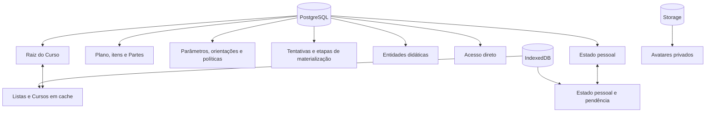

# Persistência relacional e sincronização

Este capítulo explica onde o runtime canônico guarda cada dado e por quê. A
decisão central é conservar um único Curso vivo no servidor, uma réplica local
para continuidade e um estado pessoal separado por pessoa.

## Conceitos fundamentais

**Persistência** é a conservação de estado além da execução corrente.

**Banco relacional** organiza dados em relações com chaves, restrições e
transações. O PostgreSQL do Supabase é a autoridade para Curso, propriedade,
acesso e estado compartilhado.

**IndexedDB** é o banco transacional do navegador. Ele mantém sessão, cache e
operações pessoais pendentes no dispositivo.

**Storage de objetos** guarda bytes por chave. Nesta etapa, recebe somente
fotos privadas de perfil; não é a fonte do conteúdo de Curso.

**Réplica local** é uma cópia útil para leitura e continuidade. Ela não substitui
a autoridade do servidor para acesso ou concorrência.

## Modelo mental

**Descrição textual:** o Curso possui raiz, plano instrucional, desenho por
escopo e entidades no PostgreSQL; o dispositivo conserva descritores e Cursos
já abertos; cada pessoa mantém um estado pessoal local e remoto; fotos ficam no
Storage privado.



## O que fica no PostgreSQL

### Raiz do Curso

`public.courses` conserva:

- identidade UUID;
- proprietário;
- título;
- objetivo;
- revisão corrente;
- datas de criação e atualização.

Não existe coluna de arquivamento ou exclusão lógica no Curso canônico. Nenhum
comando atual de Estudo, Autoria ou MCP produz esse estado; mantê-lo no banco
criaria uma possibilidade sem operação correspondente no produto.

Título e objetivo possuem uma única autoridade nessa relação. A projeção do
plano os inclui para leitura conjunta, mas não persiste uma cópia. Orientações,
Partes ou outro planejamento não ficam num JSON da raiz.

### Plano instrucional e Partes

O planejamento usa relações próprias:

- `private.course_instructional_plans`: público, escopo, faixa preferencial
  de Partes, origem da preferência e versão;
- `private.course_instructional_plan_items`: resultados de aprendizagem
  pretendidos, unidades de análise instrucional e requisitos de evidência,
  cada qual com identidade, posição, enunciado e versão;
- `private.course_design_target_plan_items`: atribuição muitos-para-muitos de
  unidades de análise e requisitos de evidência a Microssequências concretas;
- `private.course_authoring_parts`: título, intenção, posição, versão e eventual
  retirada do plano;
- `private.course_authoring_part_didactic_microsequences`: vínculo exclusivo e
  ordem de produção de cada Microssequência numa Parte.

A faixa 7–12 é o default de um plano novo, dentro do intervalo permitido de 1 a
64. Ela é configurável e sua origem é persistida; o banco não a trata como lei
pedagógica. Posições são contíguas no plano. A ordem do vínculo não substitui a
posição curricular da entidade. Um plano admite até 192 vínculos de
Microssequência no total. O alvo normalizado ocupa no máximo 512 KiB e a
projeção enriquecida é recusada acima de 1,75 MiB, mantendo margem para o teto
de 2 MiB do transporte.

Remover, dividir, unir ou reordenar Partes altera relações do plano. Módulos,
Lições, Microssequências e Unidades permanecem em `course_entities`. Assim, o
banco não interpreta uma mudança de plano como pedido implícito de exclusão de
conteúdo.

### Desenho pedagógico por escopo

O desenho não volta a ser um JSON único. Relações append-only conservam o fato
que realmente mudou:

- `private.course_design_parameter_definitions`: catálogo pequeno, versionado
  e imutável das quatro definições pedagógicas;
- `private.course_design_parameter_changes`: atribuições e remoções por
  parâmetro e escopo;
- `private.course_authoring_guidance_revisions`: texto original ou remoção de
  orientação por escopo;
- `private.course_authoring_guidance_interpretations`: interpretação
  estruturada ligada à revisão exata;
- `private.course_component_policy_changes`: política completa ou remoção por
  escopo.

A atribuição por alvo não é append-only: ela representa o conjunto corrente e
é substituída atomicamente por `set_target_plan_items`. Duas chaves
estrangeiras compostas garantem que a Microssequência e o item pertencem ao
mesmo Curso; somente `instructional_analysis_unit` e `evidence_requirement`
podem entrar. A leitura `targetPlanItems` devolve as duas listas no escopo de
Microssequência e `null` nos demais escopos.

Defaults e herança são calculados e não geram linhas. Uma mudança efetiva
avança a revisão do Curso e reutiliza `course_events` e
`course_change_receipts`; no-op não cria atividade. Parâmetros admitem Curso,
Lição e Microssequência. Orientação e política também admitem Módulo.

A leitura owner-only recebe um alvo concreto, reconstrói seus ancestrais e
devolve valores efetivos, origem, fonte e pilha de orientações. A política de
componentes efetiva prioriza `author|research_condition` no escopo aplicável
mais próximo, depois `automatic` no escopo mais próximo e, por fim, o default.
O catálogo de componentes no DTO é a revisão executável corrente, não uma lista
livre do cliente.

### Materialização retomável

`private.course_authoring_part_materializations` conserva uma tentativa por
Parte, a versão da Parte usada como base, ator, canal, estado, versão, contexto
de desenho, fatos do resultado e instantes. O contexto é calculado pelo
servidor a partir dos alvos, nunca aceito como declaração do cliente. Os
catálogos selam `{id, position, statement, version}` dos itens atribuídos e
cada alvo carrega somente suas duas listas de IDs. Somente uma tentativa
`running` pode existir por Parte.

`private.course_authoring_part_materialization_steps` conserva até 64 passos
ordenados por tentativa: carga de contexto, materialização de uma
Microssequência ou validação. Etapas registram estado, versão e fatos pequenos.
Quando uma etapa materializa uma Microssequência, as alterações de entidades e
o vínculo de produção são confirmados na mesma transação. Os fatos de aplicação
referenciam o hash do contexto selado e são auditados somente contra o
subconjunto atribuído ao alvo. Formas, oportunidades e dimensões de variação
são declarações validadas internamente, não fatos extraídos semanticamente das
entidades. O banco reconcilia materialmente os IDs de Unidades, o pai/alvo e os
`componentRefs` gravados, que também precisam obedecer à política selada.

No corte para a `1800`, não há conversor de tentativas antigas. O preflight
bloqueia tabelas de materialização e recusa qualquer tentativa ou etapa já
existente. Também bloqueia cada relação legada de desenho antes de confirmar
que está vazia, evitando que uma escrita concorrente passe entre a contagem e o
corte.

Posições de produção ficam no intervalo `0–63` e são contíguas dentro da
Parte. A restrição vale também na fronteira SQL, não apenas no cliente. Uma
tentativa `running` cerca a Parte e seus vínculos contra alteração; campos de
cabeçalho e itens independentes do plano podem continuar mudando.

`get_owned_course_authoring_part_materialization_for_actor_v1` recupera uma
tentativa owner-only com até 64 etapas e resposta de no máximo 1,25 MiB. A
projeção informa `nextPendingStep` somente quando a tentativa pode continuar.
O plano leve não repete esses dados. Um índice por Curso, Parte e atualização
sustenta a busca da tentativa mais recente. Quota e retenção histórica serão
fechadas com a política de evidência da #124 antes da promoção hospedada; esta
etapa não apaga fatos automaticamente.

O status mostrado na interface é derivado dessas relações, dos vínculos e das
Unidades vivas. Copiar um pedido para o chat não grava tentativa ou etapa e não
altera o status.

### Entidades do Curso

`private.course_entities` usa uma linha por Módulo, Lição, Tópico,
Microssequência didática ou Unidade de estudo. A chave primária é Curso + tipo
+ identidade. Colunas explícitas guardam pai, posição e revisão da entidade; o
conteúdo próprio fica em JSON. Cada linha também conserva `created_at` e
`updated_at`, de modo que revisão e tempo pertençam à entidade que realmente
mudou, e não apenas à raiz do Curso.

O discriminador final da Unidade é `study_unit`; o documento
`aralearn.course.v1` a expõe em `microsequence.studyUnits`. Não há alias no
contrato corrente. A posição de cada Unidade é local à Microssequência e
permanece estável no achatamento e na recomposição.

Uma chave estrangeira composta impede que uma entidade aponte para pai de
outro Curso. Restrições de posição impedem irmãos duplicados. Excluir um pai
remove descendentes na mesma árvore; o commit completo continua transacional.

### Propriedade e acesso

O proprietário fica na raiz. `public.course_access` contém somente Curso,
pessoa favorecida, concedente e instante. Não há nível, papel ou matriz de
permissões: a presença da linha significa acesso a Estudo.

### Estado pessoal

`public.course_personal_states` possui uma linha por pessoa e Curso:

```text
progress.lessons  → cursor e Unidades concluídas
reviewMarks       → instante da marca por Unidade
observations      → categoria, texto e atualização por Unidade
```

O documento é limitado a 512 KiB, 10 mil Lições, 100 mil conclusões, 100 mil
marcas e 10 mil observações. Esses tetos são limites de segurança, não metas de
desenho instrucional.

A quantidade concluída mostrada na lista não é uma coluna duplicada. A consulta
intersecta as identidades guardadas no estado com as Unidades ainda vivas no
Curso. Assim, remover uma Unidade não deixa um contador persistido incorreto.

### Eventos e recibos

`private.course_events` registra somente eventos pequenos que já possuem
consumidor de interface, auditoria ou pesquisa: criação, mudança de plano,
avanço de materialização, alteração de composição, concessão e revogação de
acesso. O resumo não replica o Curso nem contém e-mail.

Eventos de conteúdo usam `changeKind` para distinguir a natureza observada da
mudança e contagens de entidades efetivamente criadas, alteradas ou removidas.
Uma escrita que repete exatamente o estado corrente é um **no-op**: recebe e
sela o recibo idempotente, mas não muda revisão, datas ou versão de entidade e
não produz evento. Isso evita transformar repetição de transporte em atividade
autoral ou dado de pesquisa.

Dois conjuntos de recibos temporários permitem repetição segura:

- estado pessoal: UUID, hash e revisão resultante, até sete dias;
- Curso e acesso: pedido, operação, hash e resultado pequeno, até 14 dias.

Eles não formam histórico de conversa, fila geral ou segunda fonte de estado.

### Perfil

`public.person_profiles` contém identidade, nome opcional, chave de avatar e
data de atualização. O perfil nasce com a conta. Políticas permitem leitura da
própria pessoa e de outra pessoa somente quando existe relação direta de acesso
a algum Curso entre elas.

## O que fica no Storage

O bucket privado `person-avatars` aceita:

- JPEG, PNG ou WebP;
- no máximo 512 KiB;
- chave `<user-id>/<uuid>.<extensão>`.

A própria pessoa envia e apaga. A leitura usa a mesma relação direta do perfil.
A referência só pode ser registrada depois que o objeto existe e pertence à
conta. Ao excluir a conta, os objetos devem ser removidos antes da transação.

Não há documento integral imutável de Curso no Storage canônico. Fontes e
mídias de conteúdo poderão usar objetos quando seu tamanho e padrão de acesso
justificarem, mas essa decisão pertence às fatias que implementarem esses
dados.

## O que fica no IndexedDB

### Sessão

`aralearn-auth-v1` conserva o estado necessário à sessão. Ela usa banco próprio
para que limpeza e versionamento não se confundam com Curso.

### Cache de Curso

Cada conta possui `aralearn-course-v1-<user-id>`, com uma store genérica
`course_cache`. As chaves distinguem:

- páginas da lista de Estudo ou Autoria;
- cabeçalho de Curso;
- projeção do plano instrucional e atividade recente;
- páginas de entidades por revisão;
- páginas da Inspeção por revisão e pedido completo;
- posição local da Inspeção por Curso;
- documento composto validado;
- estado pessoal e sua pendência.

Separar o banco por pessoa reduz vazamento acidental entre sessões no mesmo
dispositivo. Uma mudança de versão fecha a conexão anterior e pede nova
abertura.

## Lista fina e carregamento sob demanda

Na Home, o cliente busca páginas de descritores. Cada item traz contagens e
progresso, mas não milhares de Unidades. Ao abrir:

1. lê o cabeçalho e fixa a revisão;
2. percorre páginas de entidades;
3. recusa página cuja revisão não coincide;
4. recompõe o documento `aralearn.course.v1`;
5. valida estrutura e componentes;
6. salva somente o resultado íntegro no cache;
7. entrega o documento ao renderer.

Essa sequência evita misturar o começo de uma revisão com o fim de outra.

### Inspeção vertical sob demanda

A Inspeção não recompõe o documento inteiro para desenhar uma sequência. Ela
consulta páginas owner-only de Unidades em ordem curricular, delimitadas por
Curso, Parte, ausência de Parte, Módulo, Lição ou Microssequência. Uma âncora
inclui a Unidade-alvo na página de entrada; um cursor `{studyUnitId}` marca a
fronteira da página seguinte ou anterior. Âncora e cursor são mutuamente
exclusivos.

A página normal contém 12 itens e aceita no máximo 24. `maxBytes` fica entre
64 KiB e 1.500.000 bytes; a resposta completa falha fechada acima de 1,75 MiB,
mantendo margem para o teto de 2 MiB. A interface virtualiza a sequência e
mantém no DOM no máximo 36 Unidades, com espaçadores para conservar a rolagem.

O cache distingue revisão, escopo, âncora ou cursor, direção, limite e orçamento
de bytes. Por Curso, conserva no máximo quatro páginas ou 8 MiB, o que ocorrer
primeiro. Sem rede, somente um pedido exato pode usar a cópia local, marcada
como offline ou desatualizada; não há aproximação entre escopos, revisões ou
cursores. A posição local guarda escopo, `studyUnitId`, deslocamento em relação
ao topo fixo e revisão. Mudança de revisão reancora pela identidade; alvo
explicitamente removido é informado como ausente. Revogação ou outra perda de
autoridade purga páginas e posição privadas.

## Concorrência do Curso

Criação e alteração usam uma chave de pedido. Alteração também informa
`expectedRevision`; plano e materialização acrescentam a versão esperada do
objeto específico. Na transação, o servidor:

1. valida pessoa e propriedade;
2. bloqueia o Curso;
3. procura recibo compatível;
4. compara a revisão;
5. valida o conteúdo de cada linha pelo tipo e as dependências das Lições
   afetadas;
6. aplica tudo ou nada;
7. calcula as diferenças efetivas;
8. se algo mudou, incrementa a revisão e registra o evento;
9. registra o recibo, inclusive quando o pedido válido não mudou nada.

Se uma revisão ou versão estiver desatualizada, a mutação falha. O cliente
precisa reler e reconciliar; não há “última escrita vence” silenciosa. Plano e
materialização incluem comando, versões esperadas e canal no hash; composição
inclui o lote exato e a revisão esperada. Por isso, uma repetição idêntica pode
recuperar o recibo antes do CAS, enquanto reutilizar a chave com outro conteúdo
é conflito.

Planejamento, composição e materialização possuem commits separados. A etapa
de materialização é a única que pode combinar seu fato operacional com um lote
pequeno de entidades e o vínculo correspondente; isso ocorre numa única
transação, não por sincronização posterior.

A composição continua segmentada: o serviço não recompõe o Curso integral a
cada escrita. Além das restrições SQL de forma e hierarquia, o domínio valida
`module|lesson|topic|microsequence|study_unit` individualmente, e o banco
recalcula `dependsOn` somente no conjunto de Lições alcançado pelo lote.

## Sincronização do estado pessoal

Uma ação pessoal é aplicada primeiro ao documento local. O repositório cria
uma pendência com:

- `requestId` UUID;
- revisão remota usada como base;
- operações `set` ou `delete` por coleção e caminho;
- instante de criação.

Operações novas enquanto uma chamada está em curso entram numa fila compactada.
Depois da confirmação, a fila recebe uma nova chave e usa a revisão resultante.

### Falha de rede

Erro recuperável conserva pendência e estado local. A interface continua com o
que já conhece e tenta novamente quando o fluxo chamar `refresh` ou `flush`.

### Conflito entre dispositivos

Quando outro dispositivo avançou a revisão, o repositório:

1. baixa o estado remoto;
2. reaplica sobre ele as operações locais ainda pendentes;
3. gera nova chave de pedido;
4. usa a nova revisão de base;
5. tenta novamente, no máximo duas reconciliações consecutivas.

Se o estado continuar mudando, informa conflito em vez de repetir sem limite.
Essa estratégia preserva operações locais por chave; ela não afirma resolver
semanticamente qualquer edição futura de texto compartilhado.

### Perda de autoridade

Se o acesso foi revogado, o repositório apaga do cache o estado pessoal e as
páginas do Curso atingido e encerra a sincronização. Falha fechada impede novas
escritas sem autorização.

## Por que não existe uma outbox universal

Uma fila única para todo o produto aumentaria acoplamento entre operações com
semânticas diferentes. Nesta etapa, somente estado pessoal possui fila offline
durável. Alterações autorais exigem servidor disponível e revisão corrente.

Isso é uma decisão de escopo: não prova que nenhuma operação autoral futura
possa precisar de fila, mas exige justificar cada caso em vez de introduzir uma
infraestrutura universal antecipada.

## Segurança da persistência

- tabelas privadas não são acessadas diretamente pelo navegador;
- RPCs públicas têm `EXECUTE` concedido por função e papel exatos;
- funções de serviço exigem service role e identidade explícita do ator;
- RLS protege Curso, entidades, acesso, estado pessoal, perfil e Storage;
- Curso compartilhado não revela orientações privadas na busca;
- coestudantes não obtêm perfis entre si;
- eventos de acesso não registram e-mail;
- se uma pessoa favorecida excluir a conta, sua identidade é substituída por
  uma marca de conta excluída nos eventos e recibos; operação e instante
  permanecem, e o estado pessoal é removido pela relação com a conta;
- exclusão de conta exige confirmação textual e ausência de avatar.

## Orçamento do Supabase Free Plan

O desenho reduz custo por lista fina, composição sob demanda, uma tabela de
entidades em vez de uma tabela por nível, plano relacional pequeno, fatos
limitados por tentativa/etapa e Storage restrito a objetos pequenos nesta
etapa. Ainda faltam medições longitudinais de:

- egress por abertura e atualização;
- tamanho de índices e tabelas após migração;
- crescimento de estados pessoais e eventos;
- invocações e duração de Edge Functions;
- ocupação de avatares e futuras fontes.

Na Inspeção, paginação de até 24 itens, janela de até 36 Unidades, cache de até
quatro páginas ou 8 MiB por Curso e hard cap de resposta de 1,75 MiB limitam
DOM, memória, armazenamento e egress. Esses limites tornam o ensaio no Free
Plan mensurável; não demonstram, por si só, sustentabilidade em uso prolongado.

Limite implementado não é evidência de sustentabilidade. A promoção deve
registrar baseline e repetir a medição com dados reais.

## Evidência e pontos não demonstrados

Testes locais cobrem composição, plano, comandos de Parte, materialização,
paginação, cache, revisão, idempotência, conflito multi-dispositivo,
autorização e migrations em PGlite. O ensaio focal em PostgreSQL real cobre
concorrência e o contrato final da Unidade após reset. Jornada de navegador
exercita o corte local; promoção hospedada e nova aceitação humana ainda são
gates.

Ainda não estão demonstrados:

- importação integral dos oito Cursos hospedados;
- comportamento prolongado com vários dispositivos;
- orçamento real do Free Plan;
- migração e Edge Functions hospedadas;
- APK assinado do novo corte.

O importador hospedado permanece bloqueado até que componentes antigos sem
equivalência recebam uma decisão semântica. Ele é transitório e não se torna
leitor permanente de formato anterior.

No corte, entidades provenientes da raiz relacional preservam sua própria
versão e seus instantes de criação e atualização. As entidades dos dois Cursos
que existem somente como publicação não possuem esses metadados por entidade
na origem: recebem, de forma declarada e verificável, versão `1` e os instantes
do registro do Curso. Esse default é uma limitação de proveniência, não uma
alegação de que todas as entidades foram criadas naquele mesmo instante.

Os 36 eventos existentes são reclassificados por um mapa temporário de sete
tipos canônicos de mudança. A migration confere, por tipo, a distribuição
`6 + 4 + 4 + 1 + 16 + 4 + 1`, além de identidade, Curso, revisão, ator,
instante e contagens. O mapa histórico deixa de existir ao fim da transação;
somente `changeKind` e as operações canônicas permanecem no runtime.
