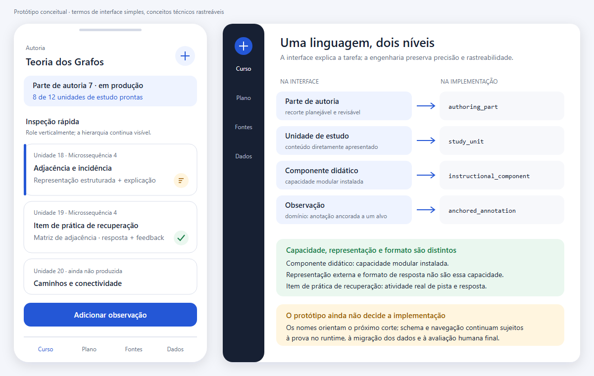

# Vocabulário controlado do AraLearn

> Documento gerado de `docs/evidence/terminologia-canonica.v1.json`. Não edite as tabelas manualmente; altere o registro e execute `npm run audit:terminology -- --render`.

Este vocabulário permite usar palavras simples na interface sem misturar conceitos de produto, pesquisa, protocolos e infraestrutura. Cada entrada liga o nome encontrado hoje aos termos de interface e de domínio, ao símbolo técnico-alvo, à definição operacional e à etapa que fará a retirada completa do nome anterior.

## Como as camadas se relacionam

- **Interface e documentação:** linguagem ensinável às pessoas que estudam, criam cursos ou pesquisam.
- **Domínio e pesquisa:** conceitos com definição operacional; eventos observáveis não recebem nomes de processos cognitivos não medidos.
- **Código, banco, Storage e implantação:** símbolos de implementação; não criam um segundo conceito para o mesmo objeto.
- **MCP e assistente:** distinguem instruções de sistema, prompt de tarefa, Resource MCP, ferramenta e estado persistido do curso.
- **Segurança e acessibilidade:** qualificam permissões e estados técnicos sem convertê-los em papéis institucionais ou cognição.

Um termo pode aparecer em várias camadas, mas conserva uma única definição. Termos de interface podem ser mais curtos que o símbolo técnico somente quando esta correspondência está registrada.

## Estatutos de decisão

- `manter` — manter: o nome coincide com o conceito, dentro da definição registrada.
- `restringir` — restringir: o nome permanece apenas no sentido e nas camadas declarados.
- `substituir` — substituir: o nome atual sai no corte indicado e o canônico assume todas as camadas.
- `remover` — remover: o nome ou símbolo não representa mais um conceito corrente.

`cutoverStatus` descreve somente o estado da **decisão terminológica**: `sem-corte` para um termo vigente, `pendente` para uma troca programada e `concluido` para uma troca já aplicada. Ele não afirma que a funcionalidade de produto correspondente existe, está conectada ou funciona.

Decisões pendentes usam corte limpo: não admitem aliases, fallback, dupla escrita nem leitor de legado. Migrations publicadas e evidências históricas podem conservar o nome anterior porque registram o passado; elas não autorizam esse nome em objetos ativos ou documentação corrente.

Caminhos históricos excluídos do gate de resíduos:

- `CHANGELOG.md`
- `docs/evidence/history/`
- `supabase/migrations/`

## Hipótese visual

A imagem abaixo é uma **hipótese visual ainda não implementada** para testar o vocabulário em celular. Ela não prova que os nomes já foram migrados nem que a interface foi aprovada por pessoas usuárias.

[Abrir a versão vetorial da hipótese](screenshots/authoring/prototype-terminologia-v1.svg).

## Mapa atual → canônico

### Superfícies do produto

| Termo encontrado | Interface | Domínio | Símbolo técnico-alvo | Decisão e etapa | Definição operacional | Base | Não usar como sinônimo |
|---|---|---|---|---|---|---|---|
| `Estudo` | **Estudo** | **Estudo** | `study_surface` | `restringir`; termo vigente; sem corte de renomeação | Superfície em que uma pessoa acessa e realiza as atividades de um curso; não designa aprendizagem comprovada nem resultado educacional. | `decisao-produto` #115 | `aprendizagem`, `domínio`, `resultado de aprendizagem` |
| `Autoria` | **Autoria** | **Autoria** | `authoring_surface` | `manter`; termo vigente; sem corte de renomeação | Atividade e superfície usadas para planejar, produzir, inspecionar, anotar, corrigir e investigar um curso e seus componentes. | [padrao-externo](https://www.w3.org/TR/ATAG20/); `decisao-produto` #115 | `chat`, `publicação`, `administração` |
| `Pesquisa` | **Pesquisa** | **Pesquisa** | `research_surface` | `restringir`; termo vigente; sem corte de renomeação | Superfície e conjunto de operações para configurar estudos, inspecionar medidas e exportar dados; não certifica validade científica por si só. | `decisao-produto` #127 | `analytics`, `experimento`, `relatório` |

### Estrutura instrucional

| Termo encontrado | Interface | Domínio | Símbolo técnico-alvo | Decisão e etapa | Definição operacional | Base | Não usar como sinônimo |
|---|---|---|---|---|---|---|---|
| `curso` | **Curso** | **Curso** | `course` | `restringir`; termo vigente; sem corte de renomeação | Objeto instrucional vivo e identificável que reúne estrutura, conteúdo, desenho, fontes, observações, parâmetros e estado de autoria, sem exigir estágio de publicação para ser utilizável. | `decisao-produto` #118 | `workspace`, `publicação`, `artefato` |
| `módulo` | **Módulo** | **Módulo** | `course_module` | `manter`; termo vigente; sem corte de renomeação | Agrupamento curricular de lições dentro de um curso, usado quando há uma organização didática justificável nesse nível. | `definicao-propria` #116 | `Parte de autoria`, `unidade de estudo`, `package` |
| `lição` | **Lição** | **Lição** | `lesson` | `manter`; termo vigente; sem corte de renomeação | Unidade curricular de um módulo que organiza uma progressão didática coerente em uma ou mais microssequências. | `definicao-propria` #116 | `Parte`, `microssequência`, `sessão` |
| `microssequência` | **Microssequência didática** | **Microssequência didática** | `didactic_microsequence` | `restringir`; termo vigente; sem corte de renomeação | Construto próprio do AraLearn: conjunto ordenado de unidades de estudo orientado a um objetivo instrucional delimitado, sem quantidade fixa. | `definicao-propria` #116; [evidencia-academica](https://doi.org/10.5209/clac.96949) | `parágrafo`, `subtópico automático`, `Parte` |
| `card` | **Unidade de estudo** | **Unidade de estudo** | atual: `card` → alvo: `study_unit` | `substituir`; corte #121; remoção integral até #129 | Menor unidade persistida, ordenável, endereçável e renderizável apresentada em Estudo e Autoria; pode ser somente expositiva ou também conter solicitação de resposta e feedback. | `definicao-propria` #116; [evidencia-academica](https://doi.org/10.1016/S0959-4752(02)00017-8) | `flashcard`, `tela`, `objeto de aprendizagem`, `parágrafo` |
| `flashcard` | **Item de prática de recuperação** | **Item de prática de recuperação** | `retrieval_practice_item` | `restringir`; termo vigente; sem corte de renomeação | Unidade específica organizada em torno de pista e resposta para praticar recuperação da memória; não designa qualquer unidade de estudo. | [evidencia-academica](https://doi.org/10.1097/ACM.0000000000005968) | `AraLearn`, `curso`, `unidade teórica`, `unidade de estudo` |

### Discurso e organização textual

| Termo encontrado | Interface | Domínio | Símbolo técnico-alvo | Decisão e etapa | Definição operacional | Base | Não usar como sinônimo |
|---|---|---|---|---|---|---|---|
| `gênero discursivo`, `gênero de produto` | **Gênero discursivo** | **Gênero discursivo** | `discourse_genre` | `restringir`; termo vigente; sem corte de renomeação | Forma recorrente de ação social reconhecida em uma situação comunicativa, adotada aqui na linhagem socioretórica de Miller; gênero comunicativo ou textual exige qualificação teórica própria. | [evidencia-academica](https://doi.org/10.1080/00335638409383686); [evidencia-academica](https://journals.aom.org/doi/10.5465/amr.1992.4279545) | `gênero comunicativo sem qualificação`, `gênero textual`, `classe de produto`, `tipo de unidade`, `mídia`, `flashcard` |
| `unidade discursiva`, `segmento semântico` | **Segmento discursivo** | **Segmento discursivo** | `discourse_segment` | `restringir`; termo vigente; sem corte de renomeação | Trecho delimitado segundo critério declarado, como intenção discursiva, relação retórica, subtópico, proposição ou função informacional; não existe fronteira universal independente do método. | [evidencia-academica](https://aclanthology.org/J97-1005/); [evidencia-academica](https://doi.org/10.5209/clac.96949) | `parágrafo`, `conceito`, `unidade de estudo`, `microssequência` |
| `parágrafo` | **Parágrafo** | **Parágrafo** | `text_paragraph` | `restringir`; termo vigente; sem corte de renomeação | Unidade gráfica e textual que contribui para a organização do texto, mas cuja fronteira não garante unidade conceitual, retórica ou instrucional. | [evidencia-academica](https://doi.org/10.5209/clac.96949) | `segmento semântico`, `unidade de estudo`, `conceito` |

### Representações e componentes

| Termo encontrado | Interface | Domínio | Símbolo técnico-alvo | Decisão e etapa | Definição operacional | Base | Não usar como sinônimo |
|---|---|---|---|---|---|---|---|
| `resource`, `recurso de card` | **Representação externa** | **Representação externa** | atual: `resource` → alvo: `external_representation` | `substituir`; corte #131; remoção integral até #129 | Forma perceptível pela qual conteúdo ou relações são apresentados, como texto, fórmula, tabela, gráfico, diagrama, código ou áudio. | [evidencia-academica](https://doi.org/10.1016/j.learninstruc.2006.03.001) | `MCP Resource`, `ativo de mídia`, `formato de resposta`, `pacote de componente` |
| `componente didático` | **Componente didático** | **Componente didático** | `instructional_component` | `restringir`; termo vigente; sem corte de renomeação | Capacidade modular instalada que produz uma representação externa, um formato de resposta ou ambos para uma Unidade de estudo, sem se confundir com a instância renderizada nem com seu pacote técnico. | `definicao-propria` #116; `observacao-tecnica` #131 | `representação externa`, `formato de resposta`, `pacote de componente`, `componente de interface` |
| `response resource`, `response package` | **Formato de resposta** | **Formato de resposta** | `response_format` | `substituir`; corte #131; remoção integral até #129 | Estrutura pela qual a pessoa responde a uma atividade e pela qual a resposta pode ser interpretada ou receber feedback. | `observacao-tecnica` #131 | `representação externa`, `resposta do estudante`, `feedback` |
| `arquivo de mídia`, `media asset` | **Ativo de mídia** | **Ativo de mídia** | `media_asset` | `restringir`; termo vigente; sem corte de renomeação | Arquivo binário ou documento armazenado e referenciado por uma representação, como imagem, áudio, vídeo ou anexo. | [padrao-externo](https://www.rfc-editor.org/rfc/rfc3986.html) | `representação externa`, `fonte`, `artefato de curso` |
| `resource package`, `package de resource` | **Pacote de componente** | **Pacote de componente** | `component_package` | `substituir`; corte #131; remoção integral até #129 | Unidade técnica versionada que reúne contrato, schema, validação e implementação de uma representação ou formato de resposta. | `observacao-tecnica` #131 | `representação externa`, `MCP Resource`, `módulo curricular` |
| `consultarRecursosDeCard`, `consultarPackagesDeCard` | **Nomes intermediários abolidos da biblioteca** | **Nomes intermediários abolidos da biblioteca** | atual: `consultarRecursosDeCard`, `consultarPackagesDeCard` → alvo: `abolished_resource_discovery_tools` | `remover`; corte terminológico concluído em #116 | Registro histórico dos dois símbolos intermediários já retirados da superfície MCP de descoberta de componentes. | `evidencia-historica` #116 | `MCP Resource`, `knowledge base`, `catálogo público de cursos` |
| `consultarBibliotecaDeResources` | **Biblioteca de componentes didáticos** | **Biblioteca de componentes didáticos** | atual: `consultarBibliotecaDeResources` → alvo: `consultarBibliotecaDeComponentesDidaticos` | `substituir`; corte #131; remoção integral até #129 | Ferramenta única de descoberta e inspeção seletiva dos componentes instalados; o símbolo atual ainda contém Resources e será substituído no corte integral da #131. | `observacao-tecnica` #131 | `MCP Resource`, `knowledge base`, `catálogo público de cursos` |
| `relação entre representações`, `multimodalidade` | **Relação entre representações** | **Relação entre representações** | `representation_relation` | `restringir`; termo vigente; sem corte de renomeação | Relação semântica declarada entre representações, como complementaridade, especialização, redundância, exemplificação ou interferência potencial. | [evidencia-academica](https://doi.org/10.1016/j.learninstruc.2006.03.001); [evidencia-academica](https://doi.org/10.1177/1470357205055928) | `tipo MIME`, `coocorrência`, `equivalência automática` |
| `tradutibilidade entre texto e visual`, `transformação entre representações` | **Transformação entre representações** | **Transformação entre representações** | `representation_transformation` | `restringir`; termo vigente; sem corte de renomeação | Mapeamento documentado entre representação de origem e destino com registro do conteúdo preservado, acrescentado, omitido ou reinterpretado. | [evidencia-academica](https://doi.org/10.1177/1470357205055928); [padrao-externo](https://www.w3.org/TR/prov-dm/) | `tradução sem perda`, `conversão de arquivo`, `redundância` |

### Processo de autoria

| Termo encontrado | Interface | Domínio | Símbolo técnico-alvo | Decisão e etapa | Definição operacional | Base | Não usar como sinônimo |
|---|---|---|---|---|---|---|---|
| `Parte` | **Parte de autoria** | **Parte de autoria** | `authoring_part` | `substituir`; corte #120; remoção integral até #129 | Unidade operacional configurável que agrupa planejamento, materialização, auditoria e revisão para tornar a produção pelo assistente manejável; não acrescenta nível à hierarquia didática. | `decisao-produto` #120 | `módulo`, `lição`, `lote de materialização`, `versão` |
| `planejamento` | **Plano instrucional vivo** | **Plano instrucional vivo** | `instructional_plan` | `restringir`; termo vigente; sem corte de renomeação | Estado revisável que explicita objetivos, organização, cobertura, progressão, prática, representações previstas, fontes e critérios de conclusão da materialização. | `decisao-produto` #120 | `prompt`, `blueprint imutável`, `curso materializado` |
| `materialização` | **Produção** | **Materialização** | `course_materialization` | `restringir`; termo vigente; sem corte de renomeação | Transformação controlada do plano e do estado autoral em unidades de estudo persistidas, renderizáveis e novamente auditáveis. | `definicao-propria` #120 | `publicação`, `geração de texto`, `release` |
| `auditoria` | **Auditoria instrucional** | **Auditoria instrucional** | `instructional_audit` | `restringir`; termo vigente; sem corte de renomeação | Exame explícito e rastreável que confronta plano, parâmetros, fontes, materialização e critérios, produzindo achados sem alterar automaticamente o curso. | `decisao-produto` #125 | `correção`, `teste automatizado`, `aprovação` |
| `reparo` | **Correção autoral** | **Correção autoral** | `authoring_correction` | `substituir`; corte #125; remoção integral até #129 | Alteração autorizada do curso em resposta a um achado ou observação, seguida de verificação independente do resultado. | `decisao-produto` #125 | `auditoria`, `revisão`, `resolução do achado` |
| `revisão de conteúdo` | **Revisão autoral** | **Revisão autoral** | `authoring_review` | `restringir`; termo vigente; sem corte de renomeação | Leitura e reconsideração humana ou assistida de conteúdo e desenho, que pode ou não resultar em alteração. | `definicao-propria` #125 | `versão de estado`, `auditoria`, `correção` |
| `revision`, `revisão CAS` | **Versão de estado** | **Versão de estado** | atual: `state_revision` → alvo: `state_version` | `substituir`; corte #118; remoção integral até #129 | Contador monotônico usado para detectar concorrência e ordenar mutações; não é uma revisão editorial nem uma cópia integral do curso. | `observacao-tecnica` #118 | `revisão autoral`, `versão de contrato`, `checkpoint` |

### Evidência, anotação e proveniência

| Termo encontrado | Interface | Domínio | Símbolo técnico-alvo | Decisão e etapa | Definição operacional | Base | Não usar como sinônimo |
|---|---|---|---|---|---|---|---|
| `fonte` | **Fonte** | **Fonte** | `source_entity` | `restringir`; termo vigente; sem corte de renomeação | Entidade identificável da qual uma afirmação, representação ou transformação deriva, com identidade e versão quando disponíveis. | [padrao-externo](https://www.w3.org/TR/prov-dm/) | `citação`, `âncora`, `proveniência`, `ativo de mídia` |
| `âncora`, `ancoragem` | **Âncora de fonte** | **Âncora de fonte** | `source_anchor` | `restringir`; termo vigente; sem corte de renomeação | Localizador preciso de um trecho ou região dentro de uma fonte, como página, intervalo, seletor, fragmento ou timestamp. | [padrao-externo](https://www.w3.org/TR/annotation-model/); [padrao-externo](https://www.rfc-editor.org/rfc/rfc3986.html) | `fonte`, `citação`, `evidência` |
| `proveniência` | **Proveniência** | **Proveniência** | `provenance_record` | `restringir`; termo vigente; sem corte de renomeação | Registro das entidades, atividades, agentes, derivações e versões envolvidos na produção ou transformação de conteúdo e dados. | [padrao-externo](https://www.w3.org/TR/prov-dm/) | `histórico de chat`, `citação`, `log`, `autoria comprovada` |
| `observação`, `comentário` | **Observação** | **Anotação ancorada** | `anchored_annotation` | `substituir`; corte #124; remoção integral até #129 | Anotação com corpo e alvo endereçável, autoria, motivação e estado; na interface, o rótulo simples “Observação” é mapeado explicitamente para este conceito de domínio. | [padrao-externo](https://www.w3.org/TR/annotation-model/); `decisao-produto` #124 | `achado de auditoria`, `mensagem de chat`, `nota privada sem alvo` |
| `finding`, `achado` | **Achado de auditoria** | **Achado de auditoria** | `audit_finding` | `substituir`; corte #125; remoção integral até #129 | Afirmação estruturada, verificável e situada produzida por uma auditoria, com regra, alvo, evidência, estado e decisão separados. | `decisao-produto` #125 | `anotação ancorada`, `erro confirmado`, `correção` |
| `citação` | **Citação bibliográfica** | **Citação bibliográfica** | `scholarly_citation` | `restringir`; termo vigente; sem corte de renomeação | Representação bibliográfica usada para identificar e apresentar uma fonte segundo uma convenção acadêmica. | `definicao-propria` #123 | `fonte`, `âncora`, `proveniência` |

### Parâmetros e regras

| Termo encontrado | Interface | Domínio | Símbolo técnico-alvo | Decisão e etapa | Definição operacional | Base | Não usar como sinônimo |
|---|---|---|---|---|---|---|---|
| `parâmetro` | **Parâmetro de desenho instrucional** | **Parâmetro de desenho instrucional** | `design_parameter` | `restringir`; termo vigente; sem corte de renomeação | Propriedade controlável do desenho com definição, tipo, unidade, escopo, origem, valor efetivo e limites explícitos. | `definicao-propria` #122 | `configuração técnica`, `métrica`, `restrição editorial` |
| `configuração` | **Configuração técnica** | **Configuração técnica** | `technical_configuration` | `restringir`; termo vigente; sem corte de renomeação | Valor que altera operação ou integração do software sem representar, por si, uma propriedade pedagógica pesquisada. | `observacao-tecnica` #116 | `parâmetro de desenho instrucional`, `política`, `condição experimental` |
| `policy`, `política` | **Política aplicável** | **Política aplicável** | `enforced_policy` | `restringir`; termo vigente; sem corte de renomeação | Regra versionada que permite, restringe ou exige comportamento e que é efetivamente aplicada por uma fronteira do sistema. | `observacao-tecnica` #122 | `preferência`, `parâmetro`, `documentação sem execução` |
| `default` | **Valor padrão** | **Valor padrão** | `default_value` | `substituir`; corte #122; remoção integral até #129 | Valor explicitamente definido e versionado que se aplica na ausência de atribuição mais específica; não é uma recomendação universal. | `definicao-propria` #122 | `auto`, `herança`, `melhor prática` |
| `herança` | **Herança calculada** | **Herança calculada** | `resolved_inheritance` | `restringir`; termo vigente; sem corte de renomeação | Resultado do resolvedor que aplica um valor de escopo ancestral quando não existe atribuição de maior autoridade no alvo; não é uma atribuição gravada. | `definicao-propria` #122 | `cópia`, `default`, `sobrescrita` |
| `sobrescrita`, `override` | **Sobrescrita explícita** | **Sobrescrita explícita** | `explicit_override` | `restringir`; termo vigente; sem corte de renomeação | Atribuição intencional em um escopo que substitui integralmente o valor herdado segundo a regra de autoridade declarada. | `definicao-propria` #122 | `edição do default`, `herança`, `lock de pesquisa` |
| `densidade conceitual` | **Densidade conceitual operacionalizada** | **Densidade conceitual operacionalizada** | `conceptual_density_measure` | `restringir`; termo vigente; sem corte de renomeação | Construto de pesquisa calculado a partir de unidades semânticas anotadas e de um denominador explícito, segundo esquema, versão e procedimento de validação declarados. | [evidencia-academica](https://doi.org/10.1037/0033-295X.85.5.363); [evidencia-academica](https://doi.org/10.1037/0003-066X.50.9.741) | `quantidade de caracteres`, `complexidade textual`, `carga cognitiva` |
| `extensão editorial`, `limite de caracteres` | **Extensão editorial** | **Extensão editorial** | `editorial_extent` | `restringir`; termo vigente; sem corte de renomeação | Contagem observável de caracteres, palavras, linhas, altura, duração ou payload usada para ergonomia, edição ou limites técnicos, sem inferência pedagógica automática. | [evidencia-academica](https://doi.org/10.1080/01449290410001715714) | `densidade conceitual`, `dificuldade`, `completude`, `qualidade` |

### Desenho e mensuração de pesquisa

| Termo encontrado | Interface | Domínio | Símbolo técnico-alvo | Decisão e etapa | Definição operacional | Base | Não usar como sinônimo |
|---|---|---|---|---|---|---|---|
| `variante` | **Variante experimental** | **Variante experimental** | `experimental_variant` | `restringir`; termo vigente; sem corte de renomeação | Instância comparável derivada de uma base comum e vinculada a uma condição experimental e a parâmetros versionados. | `decisao-produto` #126; [evidencia-academica](https://www.cengage.com/c/experimental-and-quasi-experimental-designs-for-generalized-causal-inference-2e-shadish-cook-campbell/9780395615560/) — Fundamenta desenho experimental, quase-experimental e validade causal; não implica que o schema técnico do AraLearn garanta um experimento válido. | `curso independente`, `versão de estado`, `branch Git` |
| `experimento` | **Experimento** | **Experimento** | `research_experiment` | `restringir`; termo vigente; sem corte de renomeação | Protocolo de pesquisa que compara condições mediante fatores, atribuição, medidas e análise previamente declarados; a estrutura técnica não garante validade causal. | `decisao-produto` #126; [evidencia-academica](https://www.cengage.com/c/experimental-and-quasi-experimental-designs-for-generalized-causal-inference-2e-shadish-cook-campbell/9780395615560/) — Fundamenta desenho experimental, quase-experimental e validade causal; não implica que o schema técnico do AraLearn garanta um experimento válido. | `variante`, `teste A/B informal`, `analytics` |
| `condição` | **Condição experimental** | **Condição experimental** | `experimental_condition` | `restringir`; termo vigente; sem corte de renomeação | Combinação declarada de níveis de fatores à qual uma variante ou participação é vinculada. | `definicao-propria` #126 | `variante`, `parâmetro isolado`, `grupo de acesso` |
| `medida` | **Medida observada** | **Medida observada** | `observed_measure` | `restringir`; termo vigente; sem corte de renomeação | Valor obtido por instrumento ou procedimento declarado, antes de qualquer interpretação como indicador de um construto. | [evidencia-academica](https://doi.org/10.1037/0003-066X.50.9.741) | `métrica calculada`, `indicador`, `construto` |
| `métrica`, `Analytics` | **Métrica calculada** | **Métrica calculada** | `computed_metric` | `substituir`; corte #127; remoção integral até #129 | Resultado operacional regenerável de fórmula versionada aplicada a fatos ou medidas, como contagem, razão ou agregação, com unidade e denominador explícitos; só constitui medida de construto quando houver modelo e validade declarados. | [evidencia-academica](https://doi.org/10.1037/0003-066X.50.9.741); `decisao-produto` #127 | `medida observada`, `indicador`, `atenção`, `aprendizagem` |
| `indicador` | **Indicador de pesquisa** | **Indicador de pesquisa** | `research_indicator` | `restringir`; termo vigente; sem corte de renomeação | Interpretação declarada de uma ou mais medidas para uma finalidade analítica específica, com inferências permitidas e proibidas. | [padrao-externo](https://www.testingstandards.net/) | `métrica`, `desfecho`, `prova` |
| `outcome` | **Resultado avaliado** | **Variável de resultado** | atual: `research_outcome` → alvo: `outcome_variable` | `substituir`; corte #127; remoção integral até #129 | Variável escolhida como resultado de interesse de um estudo e definida antes da interpretação quando o desenho exigir; a interface apresenta seu valor ou síntese como Resultado avaliado. | [padrao-externo](https://www.testingstandards.net/) | `métrica`, `indicador`, `resultado de uma função` |

### Organização, acesso e distribuição

| Termo encontrado | Interface | Domínio | Símbolo técnico-alvo | Decisão e etapa | Definição operacional | Base | Não usar como sinônimo |
|---|---|---|---|---|---|---|---|
| `Workspace`, `workspace de autoria` | **Curso em autoria** | **Curso em autoria** | atual: `workspace` → alvo: `authoring_course` | `substituir`; corte #117; remoção integral até #129 | O próprio curso vivo enquanto está sendo planejado e materializado; a pessoa não precisa compreender um recipiente abstrato separado. | `decisao-produto` #117 | `organização`, `tenant`, `projeto`, `pasta` |
| `Trilha`, `Trilhas` | **Biblioteca pessoal** | **Biblioteca pessoal** | `personal_course_library` | `substituir`; corte #117; remoção integral até #129 | Conjunto de cursos acessíveis à pessoa, separado de propriedade, compartilhamento e eventual ordenação curricular. | `decisao-produto` #117 | `sequência curricular`, `permissão`, `coleção` |
| `Coleção`, `Coleções` | **Catálogo público de cursos** | **Catálogo público de cursos** | `public_course_catalog` | `substituir`; corte #117; remoção integral até #129 | Índice de cursos tornados públicos por decisão explícita; organização de catálogo não concede nem substitui acesso privado direto. | `decisao-produto` #117 | `biblioteca pessoal`, `permissão`, `propriedade` |
| `publicação` | **Disponibilização pública** | **Disponibilização pública** | `public_course_release` | `restringir`; termo vigente; sem corte de renomeação | Operação explícita que torna uma versão do curso acessível publicamente; não é estágio obrigatório da autoria ou condição para estudo privado. | `decisao-produto` #118 | `materialização`, `salvamento`, `curso pronto` |
| `artefato` | **Artefato de conteúdo** | **Artefato de conteúdo** | `content_artifact` | `restringir`; termo vigente; sem corte de renomeação | Representação serializada e identificável por conteúdo usada para armazenamento ou distribuição; não é o curso vivo completo. | `observacao-tecnica` #118 | `curso`, `versão de estado`, `proveniência` |
| `checkpoint` | **Ponto de recuperação** | **Ponto de recuperação** | `recovery_checkpoint` | `substituir`; corte #130; remoção integral até #130 | Marco operacional criado para permitir retomada ou restauração controlada de trabalho técnico; não é revisão de conteúdo nem versão pública. | `observacao-tecnica` #130 | `versão de estado`, `release`, `revisão autoral` |

### Identidade e autorização

| Termo encontrado | Interface | Domínio | Símbolo técnico-alvo | Decisão e etapa | Definição operacional | Base | Não usar como sinônimo |
|---|---|---|---|---|---|---|---|
| `usuário` | **Pessoa usuária** | **Pessoa usuária** | `user_account` | `restringir`; termo vigente; sem corte de renomeação | Pessoa identificada no produto por uma conta; o registro de autenticação não resume sua identidade humana. | `decisao-produto` #119 | `perfil`, `ator técnico`, `proprietário` |
| `autor` | **Pessoa autora** | **Pessoa autora** | `course_author` | `restringir`; termo vigente; sem corte de renomeação | Pessoa que participa intencionalmente do planejamento, produção, revisão ou correção de um curso; autoria não decorre apenas de executar uma mutação técnica. | `decisao-produto` #119 | `proprietário`, `agente`, `operador` |
| `pesquisador` | **Pessoa pesquisadora** | **Pessoa pesquisadora** | `researcher` | `restringir`; termo vigente; sem corte de renomeação | Pessoa responsável por decisões, instrumentos ou análises de uma pesquisa; não recebe automaticamente propriedade ou acesso a todo curso. | `decisao-produto` #119 | `autor`, `administrador`, `participante` |
| `estudante` | **Pessoa estudante** | **Pessoa estudante** | `student` | `restringir`; termo vigente; sem corte de renomeação | Pessoa que acessa o curso para estudar ou participar de uma investigação, com consentimento e papel de pesquisa separados quando aplicável. | `decisao-produto` #119 | `participante de pesquisa`, `membro`, `usuário genérico` |
| `proprietário` | **Pessoa proprietária do curso** | **Pessoa proprietária do curso** | `course_owner` | `restringir`; termo vigente; sem corte de renomeação | Pessoa com autoridade primária sobre o curso e sobre a concessão de acesso, sem implicar autoria exclusiva de todo conteúdo. | `decisao-produto` #119 | `autor`, `administrador`, `criador original` |
| `membro` | **Pessoa com acesso** | **Pessoa com acesso** | `course_access_grantee` | `substituir`; corte #119; remoção integral até #129 | Pessoa à qual foi concedido acesso explícito a um curso, com permissões delimitadas; não pressupõe organização institucional. | `decisao-produto` #119 | `proprietário`, `autor`, `membro de organização` |
| `role` | **Papel de acesso** | **Papel de acesso** | `access_role` | `substituir`; corte #119; remoção integral até #129 | Rótulo técnico que agrupa responsabilidades ou permissões de acesso; não deve ser exposto como governança necessária para compartilhar um curso. | `decisao-produto` #119 | `permissão efetiva`, `identidade`, `cargo institucional` |
| `capability` | **Permissão efetiva** | **Permissão efetiva** | `effective_permission` | `substituir`; corte #119; remoção integral até #129 | Autorização concreta para executar uma operação sobre um alvo e estado específicos, derivada e revalidada no ponto de uso. | `observacao-tecnica` #119 | `papel de acesso`, `feature flag`, `propriedade` |

### Arquitetura de software

| Termo encontrado | Interface | Domínio | Símbolo técnico-alvo | Decisão e etapa | Definição operacional | Base | Não usar como sinônimo |
|---|---|---|---|---|---|---|---|
| `kernel` | **Núcleo de execução de componentes** | **Núcleo de execução de componentes** | atual: `kernel` → alvo: `component_runtime_core` | `substituir`; corte #131; remoção integral até #129 | Núcleo técnico pequeno que valida envelopes, resolve pacotes e coordena protocolos comuns sem conhecer tipos concretos de representação. | `observacao-tecnica` #131 | `sistema operacional`, `catálogo`, `engine de layout` |
| `runtime` | **Ambiente de execução** | **Ambiente de execução** | `runtime_environment` | `restringir`; termo vigente; sem corte de renomeação | Código e dependências necessários para executar um contrato em determinada plataforma; não inclui automaticamente autoria, persistência e catálogo. | `observacao-tecnica` #116 | `engine`, `aplicativo`, `núcleo` |
| `engine` | **Motor** | **Motor** | `processing_engine` | `restringir`; termo vigente; sem corte de renomeação | Componente que executa um algoritmo ou transformação substantiva bem delimitada; não é nome genérico para qualquer serviço. | `observacao-tecnica` #116 | `runtime`, `adapter`, `serviço` |
| `adapter` | **Adaptador** | **Adaptador** | `boundary_adapter` | `restringir`; termo vigente; sem corte de renomeação | Componente de fronteira que traduz entre contratos sem assumir a regra de negócio traduzida. | `observacao-tecnica` #116 | `serviço de domínio`, `fallback`, `alias` |
| `store` | **Repositório de estado** | **Repositório de estado** | atual: `store` → alvo: `state_repository` | `substituir`; corte #129; remoção integral até #129 | Componente que lê e grava estado em uma fronteira de persistência declarada; não é o estado em si nem necessariamente a fonte canônica. | `observacao-tecnica` #129 | `banco de dados`, `estado`, `cache` |
| `catalog` | **Catálogo** | **Catálogo** | `queryable_catalog` | `restringir`; termo vigente; sem corte de renomeação | Projeção consultável de itens disponíveis e de seus metadados; não é o registro de execução nem a coleção de dados completos. | `observacao-tecnica` #131 | `registry`, `biblioteca pessoal`, `MCP Resource` |

### Interação e cognição

| Termo encontrado | Interface | Domínio | Símbolo técnico-alvo | Decisão e etapa | Definição operacional | Base | Não usar como sinônimo |
|---|---|---|---|---|---|---|---|
| `Play` | **Começar, continuar ou retomar** | **Ação de entrada no Estudo** | `study_entry_action` | `substituir`; corte #121; remoção integral até #129 | Ação contextual que inicia uma unidade, continua a sequência corrente ou retoma uma posição anterior; o rótulo deve refletir o estado real. | `hipotese-produto` #121 | `reprodução de mídia`, `rolagem`, `avanço automático` |
| `rolar`, `scroll` | **Rolagem vertical** | **Rolagem vertical** | `vertical_scroll` | `restringir`; termo vigente; sem corte de renomeação | Deslocamento contínuo da viewport no eixo vertical, distinto do gesto físico que o iniciou e da mudança curricular entre unidades. | [evidencia-academica](https://doi.org/10.1007/s11145-022-10328-9) | `deslize`, `avançar`, `feed` |
| `deslizar`, `swipe` | **Gesto de deslize** | **Gesto de deslize** | `swipe_input_gesture` | `restringir`; termo vigente; sem corte de renomeação | Gesto de entrada observável executado sobre uma superfície, sem inferência automática sobre intenção ou processo cognitivo. | `definicao-propria` #116 | `rolagem`, `avanço`, `ação epistêmica` |
| `avançar`, `navegar`, `explorar`, `retomar` | **Navegação do curso** | **Navegação curricular** | `curricular_navigation` | `restringir`; termo vigente; sem corte de renomeação | Mudança de posição ou escopo dentro da estrutura do curso, com destino e estado explícitos, independentemente do gesto usado. | `definicao-propria` #121 | `rolagem`, `deslize`, `aprendizagem` |
| `gesto cognitivo`, `cognitiveOperations` | **Operação-alvo da tarefa** | **Operação-alvo da tarefa** | atual: `cognitiveOperations` → alvo: `taskOperations`, `taskOperationIds`, `task_operation.*` | `substituir`; corte terminológico concluído em #116 | Definição terminológica própria do AraLearn para a transformação que a tarefa exige da pessoa sobre o conteúdo; o contrato e a resposta são observáveis, mas o rótulo não afirma observação direta de uma operação mental. | `definicao-propria` #116 — Fixa o rótulo e a definição operacional adotados no domínio do AraLearn.; [evidencia-academica](https://doi.org/10.1207/s15516709cog1804_1) — Sustenta apenas a distinção entre ações pragmáticas e epistêmicas; não fundamenta o rótulo operação-alvo da tarefa. | `gesto de entrada`, `atenção`, `processo cognitivo medido`, `ação epistêmica` |
| `atenção` | **Atenção** | **Atenção** | `attention_construct` | `restringir`; termo vigente; sem corte de renomeação | Família de processos seletivos internos e externos que exige operacionalização e instrumento próprios; não é evento de visibilidade ou duração. | [evidencia-academica](https://doi.org/10.1146/annurev.psych.093008.100427) | `tempo de tela`, `foco de teclado`, `rolagem`, `engajamento` |
| `engajamento` | **Engajamento** | **Engajamento** | `engagement_construct` | `restringir`; termo vigente; sem corte de renomeação | Construto multidimensional cuja dimensão comportamental, cognitiva ou afetiva deve ser declarada e medida com evidência de validade. | [evidencia-academica](https://doi.org/10.1016/j.compedu.2015.09.005) | `clique`, `tempo`, `atenção`, `conclusão` |
| `foco` | **Foco do controle** | **Foco do controle** | `focus_state` | `restringir`; termo vigente; sem corte de renomeação | Estado técnico, conforme o modelo de foco do HTML, que determina qual controle recebe entrada de teclado ou tecnologia assistiva; não mede atenção psicológica. | [padrao-externo](https://html.spec.whatwg.org/multipage/interaction.html#focus) | `atenção`, `engajamento`, `seleção` |
| `sequência vertical de inspeção` | **Sequência vertical de inspeção** | **Sequência vertical de inspeção** | `vertical_inspection_sequence` | `manter`; termo vigente; sem corte de renomeação | Fluxo finito e curricularmente ordenado para percorrer unidades de estudo na Autoria, com posição, hierarquia, retomada e marcos explícitos. | `hipotese-produto` #121; [evidencia-academica](https://doi.org/10.1007/s11145-022-10328-9) | `feed`, `rolagem infinita`, `evidência de compreensão` |
| `feed` | **Feed social** | **Feed social** | `social_content_feed` | `restringir`; termo vigente; sem corte de renomeação | Fluxo digital continuamente abastecido, usado aqui apenas como antecedente comparativo; não descreve a sequência curricular finita do AraLearn. | `evidencia-historica` #116; [evidencia-academica](https://doi.org/10.1145/3491102.3501899) | `sequência vertical de inspeção`, `curso`, `navegação curricular` |
| `ação epistêmica` | **Ação epistêmica** | **Ação epistêmica** | `epistemic_action` | `restringir`; termo vigente; sem corte de renomeação | Ação externa realizada para revelar informação ou simplificar o trabalho cognitivo, usada somente quando essa função tiver sido demonstrada na tarefa. | [evidencia-academica](https://doi.org/10.1207/s15516709cog1804_1) | `toque`, `swipe`, `operação-alvo da tarefa`, `qualquer interação` |

### Assistente, MCP e estado

| Termo encontrado | Interface | Domínio | Símbolo técnico-alvo | Decisão e etapa | Definição operacional | Base | Não usar como sinônimo |
|---|---|---|---|---|---|---|---|
| `system prompt`, `system instructions` | **Instruções de sistema** | **Instruções de sistema** | `system_instructions` | `substituir`; corte #128; remoção integral até #129 | Camada estável reservada a invariantes, segurança, limites de autoridade e protocolo de uso das ferramentas; não contém estado corrente do curso nem manual científico mutável. | `decisao-produto` #128 | `prompt de tarefa`, `knowledge base`, `estado de autoria do curso` |
| `prompt` | **Prompt de tarefa** | **Prompt de tarefa** | `task_prompt` | `restringir`; termo vigente; sem corte de renomeação | Instrução contextual de uma execução ou turno; pode referenciar estado persistido, mas não se torna sua fonte de verdade. | `definicao-propria` #128 | `instruções de sistema`, `estado persistido`, `ferramenta` |
| `knowledge base`, `knowledge JIT` | **Base de referência estável** | **Base de referência estável** | `knowledge_base` | `restringir`; termo vigente; sem corte de renomeação | Conteúdo relativamente estável de referência recuperável sob demanda, como critérios, ciência, exemplos e limitações; não contém planejamento ou observações correntes do curso. | `decisao-produto` #128 | `RAG`, `estado de autoria do curso`, `instruções de sistema` |
| `estado autoral dinâmico` | **Estado de autoria do curso** | **Estado de autoria do curso** | `course_authoring_state` | `manter`; termo vigente; sem corte de renomeação | Estado persistido e editável do curso que reúne planejamento, parâmetros, fontes, observações, materialização e dados de pesquisa e que é compartilhado por interface e MCP. | `decisao-produto` #128 | `workspace`, `histórico de chat`, `knowledge base`, `prompt` |
| `RAG` | **Geração aumentada por recuperação** | **Geração aumentada por recuperação** | `retrieval_augmented_generation` | `restringir`; termo vigente; sem corte de renomeação | Processo em que uma consulta recupera explicitamente itens de um corpus indexado e os fornece à geração, com registro do corpus e da recuperação. | [evidencia-academica](https://arxiv.org/abs/2005.11401) | `knowledge base`, `MCP Resource`, `leitura direta de estado`, `busca simples` |
| `agent configuration`, `configuração do agente` | **Configuração do assistente** | **Configuração do assistente** | `agent_configuration` | `substituir`; corte #128; remoção integral até #129 | Conjunto versionado de modelo, instruções, ferramentas, políticas de recuperação e parâmetros operacionais que pode constituir fator experimental. | `decisao-produto` #128 | `estado de autoria do curso`, `perfil da pessoa`, `prompt isolado` |
| `MCP Resource` | **Resource MCP** | **Resource MCP** | `mcp_resource` | `restringir`; termo vigente; sem corte de renomeação | Primitiva do protocolo pela qual um servidor expõe dados ou contexto identificados por URI para leitura orientada pela aplicação. | [padrao-externo](https://modelcontextprotocol.io/specification/2025-11-25/server/resources) | `representação externa`, `knowledge base`, `tool`, `arquivo de Storage` |
| `tool`, `ferramenta MCP` | **Ferramenta MCP** | **Ferramenta MCP** | `mcp_tool` | `restringir`; termo vigente; sem corte de renomeação | Operação tipada exposta pelo servidor para o modelo solicitar uma ação ou consulta sob autorização e contrato explícitos. | [padrao-externo](https://modelcontextprotocol.io/specification/2025-11-25/server/tools) | `MCP Resource`, `prompt`, `estado persistido`, `capacidade` |

## Fichas terminológicas didáticas

As fichas explicam como aplicar cada decisão. O exemplo é situado no AraLearn; o risco registra a confusão que a escolha evita. Cada ficha registra candidatos realmente examinados ou justifica, com base no recorte disciplinar, por que nenhum nome próximo disputa o mesmo conceito.

### Superfícies do produto

#### Estudo — `study-surface`

- **Equivalente em inglês:** study surface.
- **Termo de domínio:** Estudo.
- **Símbolo técnico-alvo:** `study_surface`.
- **Exemplo no AraLearn:** Ao abrir um curso para praticar, a pessoa entra em Estudo e percorre as unidades sem que a tela afirme que houve aprendizagem.
- **Risco de ambiguidade:** Sem esta delimitação, “Estudo” pode ser confundido com aprendizagem, domínio, resultado de aprendizagem, produzindo decisões de interface, dados ou pesquisa sobre conceitos diferentes.
- **Alternativas consideradas:** “Prática”: examinada e rejeitada como nome da superfície porque excluiria explicações e outras unidades expositivas que também integram a atividade de estudo..
- **Impacto da migração:** Não há corte de renomeação programado; novas superfícies nas camadas interface, domain, documentation devem aplicar esta definição sem inferir que a funcionalidade já esteja disponível.

#### Autoria — `authoring-surface`

- **Equivalente em inglês:** authoring.
- **Termo de domínio:** Autoria.
- **Símbolo técnico-alvo:** `authoring_surface`.
- **Exemplo no AraLearn:** Na Autoria, a pessoa autora percorre o curso, abre uma unidade, consulta suas fontes e registra uma observação para correção.
- **Risco de ambiguidade:** Sem esta delimitação, “Autoria” pode ser confundido com chat, publicação, administração, produzindo decisões de interface, dados ou pesquisa sobre conceitos diferentes.
- **Alternativas consideradas:** “Edição de curso”: examinada e rejeitada porque cobre alteração de conteúdo, mas não planejamento, produção, investigação, auditoria e coordenação assistida abrangidos por Autoria..
- **Impacto da migração:** Não há corte de renomeação programado; novas superfícies nas camadas interface, domain, documentation devem aplicar esta definição sem inferir que a funcionalidade já esteja disponível.

#### Pesquisa — `research-surface`

- **Equivalente em inglês:** research.
- **Termo de domínio:** Pesquisa.
- **Símbolo técnico-alvo:** `research_surface`.
- **Exemplo no AraLearn:** Em Pesquisa, uma pessoa pesquisadora configura uma comparação e exporta medidas com seus dados brutos e metadados.
- **Risco de ambiguidade:** Sem esta delimitação, “Pesquisa” pode ser confundido com analytics, experimento, relatório, produzindo decisões de interface, dados ou pesquisa sobre conceitos diferentes.
- **Alternativas consideradas:** “Dados de pesquisa”: designa os registros tratados, não a superfície que configura estudos, inspeciona medidas e exporta conjuntos analisáveis.; “Análises da autoria”: cobre apenas um subconjunto do ciclo de pesquisa previsto em #127 e por isso não pode nomear a superfície completa..
- **Impacto da migração:** Nome reservado para #127: só deve aparecer como superfície quando configuração do estudo, medidas, análise e exportação formarem um ciclo acessível; até lá, Dados ou Análises nomeiam superfícies parciais.

### Estrutura instrucional

#### Curso — `course`

- **Equivalente em inglês:** course.
- **Termo de domínio:** Curso.
- **Símbolo técnico-alvo:** `course`.
- **Exemplo no AraLearn:** Um curso de japonês conserva o mesmo identificador enquanto o plano, as fontes, as unidades e as observações são revistos.
- **Risco de ambiguidade:** Sem esta delimitação, “Curso” pode ser confundido com workspace, publicação, artefato, produzindo decisões de interface, dados ou pesquisa sobre conceitos diferentes.
- **Alternativas consideradas:** “Documento de curso”: privilegia uma representação documental e não alcança o objeto vivo com estrutura, parâmetros, fontes, observações e estado autoral.; “Artefato instrucional”: descreve um produto serializado ou técnico, mas não a identidade persistente e editável do Curso..
- **Impacto da migração:** Não há corte de renomeação programado; novas superfícies nas camadas interface, domain, database, mcp, documentation devem aplicar esta definição sem inferir que a funcionalidade já esteja disponível.

#### Módulo — `module`

- **Equivalente em inglês:** module.
- **Termo de domínio:** Módulo.
- **Símbolo técnico-alvo:** `course_module`.
- **Exemplo no AraLearn:** O módulo “Escrita em hiragana” reúne lições relacionadas, mas não corresponde a uma Parte de autoria.
- **Risco de ambiguidade:** Sem esta delimitação, “Módulo” pode ser confundido com Parte de autoria, unidade de estudo, package, produzindo decisões de interface, dados ou pesquisa sobre conceitos diferentes.
- **Alternativas consideradas:** “Unidade curricular”: pode sugerir disciplina ou componente curricular formal; Módulo nomeia apenas o agrupamento interno de lições no curso.; “Seção”: foi examinada como rótulo editorial, mas não comunica a função curricular do agrupamento..
- **Impacto da migração:** Não há corte de renomeação programado; novas superfícies nas camadas interface, domain, database, mcp devem aplicar esta definição sem inferir que a funcionalidade já esteja disponível.

#### Lição — `lesson`

- **Equivalente em inglês:** lesson.
- **Termo de domínio:** Lição.
- **Símbolo técnico-alvo:** `lesson`.
- **Exemplo no AraLearn:** A lição “Vogais” organiza microssequências que apresentam, praticam e retomam os cinco sinais.
- **Risco de ambiguidade:** Sem esta delimitação, “Lição” pode ser confundido com Parte, microssequência, sessão, produzindo decisões de interface, dados ou pesquisa sobre conceitos diferentes.
- **Alternativas consideradas:** “Unidade didática”: é mais ampla e pode abranger módulo, lição ou sequência; não delimita este nível da hierarquia do AraLearn.; “Aula”: pressupõe sessão ou evento de ensino, enquanto a Lição persiste independentemente de encontro síncrono..
- **Impacto da migração:** Não há corte de renomeação programado; novas superfícies nas camadas interface, domain, database, mcp devem aplicar esta definição sem inferir que a funcionalidade já esteja disponível.

#### Microssequência didática — `didactic-microsequence`

- **Equivalente em inglês:** didactic microsequence.
- **Termo de domínio:** Microssequência didática.
- **Símbolo técnico-alvo:** `didactic_microsequence`.
- **Exemplo no AraLearn:** Uma microssequência didática pode articular explicação, exemplo e prática sobre は, sem impor um número fixo de unidades.
- **Risco de ambiguidade:** Sem esta delimitação, “Microssequência didática” pode ser confundido com parágrafo, subtópico automático, Parte, produzindo decisões de interface, dados ou pesquisa sobre conceitos diferentes.
- **Alternativas consideradas:** “Sequência didática breve”: torna a extensão editorial parte do nome, embora o limite seja parametrizável e não defina o construto.; “Bloco”: não expressa que há ordem interna e objetivo instrucional delimitado entre as unidades reunidas..
- **Impacto da migração:** Não há corte de renomeação programado; novas superfícies nas camadas interface, domain, database, mcp, research devem aplicar esta definição sem inferir que a funcionalidade já esteja disponível.

#### Unidade de estudo — `study-unit`

- **Equivalente em inglês:** study unit.
- **Termo de domínio:** Unidade de estudo.
- **Símbolo técnico-alvo:** atual: `card` → alvo: `study_unit`.
- **Exemplo no AraLearn:** Na rolagem móvel, cada Unidade de estudo ocupa um passo da sequência; uma pode só explicar e outra pode pedir resposta e oferecer feedback.
- **Risco de ambiguidade:** Sem esta delimitação, “Unidade de estudo” pode ser confundido com flashcard, tela, objeto de aprendizagem, produzindo decisões de interface, dados ou pesquisa sobre conceitos diferentes.
- **Alternativas consideradas:** “Unidade interativa”: descartado porque algumas unidades são somente expositivas e o nome prometeria interação inexistente.; “Card” ou “flashcard”: restrito porque a forma visual e o item pista–resposta não cobrem explicações, diagramas e outras unidades válidas..
- **Impacto da migração:** Corte limpo coordenado em #121, com remoção integral até #129: renomear interface, domínio e símbolos nas camadas interface, domain, database, mcp, code, sem alias, fallback ou dupla escrita.

#### Item de prática de recuperação — `retrieval-item`

- **Equivalente em inglês:** retrieval practice item.
- **Termo de domínio:** Item de prática de recuperação.
- **Símbolo técnico-alvo:** `retrieval_practice_item`.
- **Exemplo no AraLearn:** Uma Unidade de estudo pede a tradução de uma expressão antes de mostrar a resposta e o feedback, constituindo um item de prática de recuperação.
- **Risco de ambiguidade:** Sem esta delimitação, “Item de prática de recuperação” pode ser confundido com AraLearn, curso, unidade teórica, produzindo decisões de interface, dados ou pesquisa sobre conceitos diferentes.
- **Alternativas consideradas:** “Cartão de recuperação”: mantém a metáfora visual de cartão e pode induzir uma geometria que não define a função de prática.; “Item pista–resposta”: descreve a forma mínima da interação, mas omite que sua finalidade declarada é a prática de recuperação..
- **Impacto da migração:** Não há corte de renomeação programado; novas superfícies nas camadas domain, research, documentation devem aplicar esta definição sem inferir que a funcionalidade já esteja disponível.

### Discurso e organização textual

#### Gênero discursivo — `discourse-genre`

- **Equivalente em inglês:** discourse genre.
- **Termo de domínio:** Gênero discursivo.
- **Símbolo técnico-alvo:** `discourse_genre`.
- **Exemplo no AraLearn:** Uma Unidade de estudo pode realizar o Gênero discursivo explicação quando seu propósito e sua situação recorrente organizam a ação comunicativa, independentemente de ser texto ou diagrama.
- **Risco de ambiguidade:** Sem declarar a linhagem socioretórica, Gênero discursivo pode ser misturado a gênero comunicativo, gênero textual, classe de produto ou mídia, produzindo categorias de pesquisa incomparáveis.
- **Alternativas consideradas:** “Gênero comunicativo”: pertence a uma tradição que precisa ser qualificada; não foi usado como sinônimo automático da linhagem socioretórica adotada para Gênero discursivo.; “Gênero textual”: pertence a outra linhagem e a critérios teóricos que precisariam ser explicitados; não é adotado como sinônimo automático de Gênero discursivo..
- **Impacto da migração:** Não há corte de renomeação programado; novas superfícies nas camadas research, documentation devem aplicar esta definição sem inferir que a funcionalidade já esteja disponível.

#### Segmento discursivo — `discourse-segment`

- **Equivalente em inglês:** discourse segment.
- **Termo de domínio:** Segmento discursivo.
- **Símbolo técnico-alvo:** `discourse_segment`.
- **Exemplo no AraLearn:** Uma explicação longa pode ser dividida em Segmentos discursivos coerentes sem presumir que cada segmento seja um parágrafo ou conceito.
- **Risco de ambiguidade:** Sem esta delimitação, “Segmento discursivo” pode ser confundido com parágrafo, conceito, unidade de estudo, produzindo decisões de interface, dados ou pesquisa sobre conceitos diferentes.
- **Alternativas consideradas:** “Unidade discursiva”: sugere uma fronteira natural e estável, incompatível com a exigência de declarar o critério de segmentação.; “Segmento semântico”: restringe a delimitação ao sentido e exclui critérios retóricos, informacionais ou pragmáticos igualmente válidos..
- **Impacto da migração:** Não há corte de renomeação programado; novas superfícies nas camadas domain, research, documentation devem aplicar esta definição sem inferir que a funcionalidade já esteja disponível.

#### Parágrafo — `paragraph-unit`

- **Equivalente em inglês:** paragraph unit.
- **Termo de domínio:** Parágrafo.
- **Símbolo técnico-alvo:** `text_paragraph`.
- **Exemplo no AraLearn:** Uma representação textual pode conter dois Parágrafos dentro da mesma Unidade de estudo quando a organização discursiva o exigir.
- **Risco de ambiguidade:** Sem esta delimitação, “Parágrafo” pode ser confundido com segmento semântico, unidade de estudo, conceito, produzindo decisões de interface, dados ou pesquisa sobre conceitos diferentes.
- **Alternativas consideradas:** nenhum candidato plausível após exame — Parágrafo já é a unidade gráfico-textual estabelecida pela fonte adotada; segmento discursivo, conceito e unidade de estudo têm critérios de individuação diferentes, portanto não são nomes candidatos para o mesmo objeto.
- **Impacto da migração:** Não há corte de renomeação programado; novas superfícies nas camadas domain, research, documentation devem aplicar esta definição sem inferir que a funcionalidade já esteja disponível.

### Representações e componentes

#### Representação externa — `external-representation`

- **Equivalente em inglês:** external representation.
- **Termo de domínio:** Representação externa.
- **Símbolo técnico-alvo:** atual: `resource` → alvo: `external_representation`.
- **Exemplo no AraLearn:** Uma mesma ideia pode aparecer como texto, diagrama ou áudio; cada forma observável é registrada como representação externa.
- **Risco de ambiguidade:** Sem esta delimitação, “Representação externa” pode ser confundido com MCP Resource, ativo de mídia, formato de resposta, produzindo decisões de interface, dados ou pesquisa sobre conceitos diferentes.
- **Alternativas consideradas:** “Resource”: será retirado porque conflita com Resource MCP e não informa que se trata de uma forma externa observável.; “Mídia”: é estreito demais, pois texto estruturado, notação e diagrama também são representações externas..
- **Impacto da migração:** Corte limpo coordenado em #131, com remoção integral até #129: renomear interface, domínio e símbolos nas camadas interface, domain, database, mcp, code, sem alias, fallback ou dupla escrita.

#### Componente didático — `instructional-component`

- **Equivalente em inglês:** instructional component.
- **Termo de domínio:** Componente didático.
- **Símbolo técnico-alvo:** `instructional_component`.
- **Exemplo no AraLearn:** O componente de escolha combina uma apresentação de alternativas com um formato de resposta selecionável; cada uso gera uma instância dentro de uma Unidade de estudo.
- **Risco de ambiguidade:** Sem esta delimitação, Componente didático pode ser confundido com representação renderizada, pacote distribuível ou componente genérico de interface e esconder responsabilidades diferentes.
- **Alternativas consideradas:** “Resource”: não foi adotado porque conflita com Resource MCP e não distingue a capacidade instalada da representação produzida.; “Componente de UI”: foi restringido à engenharia de interface, pois um componente didático também possui contrato de domínio e formato de resposta..
- **Impacto da migração:** Não há corte isolado neste registro; a #131 deve aplicar o conceito ao substituir resource, package e kernel de modo coordenado, sem afirmar que a nova arquitetura já esteja disponível.

#### Formato de resposta — `response-format`

- **Equivalente em inglês:** response format.
- **Termo de domínio:** Formato de resposta.
- **Símbolo técnico-alvo:** `response_format`.
- **Exemplo no AraLearn:** Uma atividade pode aceitar escolha, texto digitado ou ordenação; o Formato de resposta declara essa estrutura sem definir o conteúdo.
- **Risco de ambiguidade:** Sem esta delimitação, “Formato de resposta” pode ser confundido com representação externa, resposta do estudante, feedback, produzindo decisões de interface, dados ou pesquisa sobre conceitos diferentes.
- **Alternativas consideradas:** “Pacote de resposta”: confunde a estrutura pela qual a pessoa responde com a unidade técnica versionada que pode implementá-la..
- **Impacto da migração:** Corte limpo coordenado em #131, com remoção integral até #129: renomear interface, domínio e símbolos nas camadas domain, code, mcp, research, sem alias, fallback ou dupla escrita.

#### Ativo de mídia — `media-asset`

- **Equivalente em inglês:** media asset.
- **Termo de domínio:** Ativo de mídia.
- **Símbolo técnico-alvo:** `media_asset`.
- **Exemplo no AraLearn:** Um arquivo de imagem ou áudio persistido no Storage é um Ativo de mídia referenciado por uma representação.
- **Risco de ambiguidade:** Sem esta delimitação, “Ativo de mídia” pode ser confundido com representação externa, fonte, artefato de curso, produzindo decisões de interface, dados ou pesquisa sobre conceitos diferentes.
- **Alternativas consideradas:** “Representação externa”: pode ser construída sem arquivo armazenado; Ativo de mídia nomeia especificamente o binário ou documento persistido e referenciado..
- **Impacto da migração:** Não há corte de renomeação programado; novas superfícies nas camadas domain, storage, database devem aplicar esta definição sem inferir que a funcionalidade já esteja disponível.

#### Pacote de componente — `component-package`

- **Equivalente em inglês:** component package.
- **Termo de domínio:** Pacote de componente.
- **Símbolo técnico-alvo:** `component_package`.
- **Exemplo no AraLearn:** Um Pacote de componente agrupa o contrato e o código distribuível de um componente, sem incorporar o conteúdo de cada curso.
- **Risco de ambiguidade:** Sem esta delimitação, “Pacote de componente” pode ser confundido com representação externa, MCP Resource, módulo curricular, produzindo decisões de interface, dados ou pesquisa sobre conceitos diferentes.
- **Alternativas consideradas:** “Pacote de resource”: foi rejeitado porque resource conflita com Resource MCP e não explicita que o pacote distribui uma capacidade modular instalada..
- **Impacto da migração:** Corte limpo coordenado em #131, com remoção integral até #129: renomear interface, domínio e símbolos nas camadas code, mcp, documentation, sem alias, fallback ou dupla escrita.

#### Nomes intermediários abolidos da biblioteca — `legacy-resource-discovery-tools`

- **Equivalente em inglês:** legacy resource discovery tools.
- **Termo de domínio:** Nomes intermediários abolidos da biblioteca.
- **Símbolo técnico-alvo:** atual: `consultarRecursosDeCard`, `consultarPackagesDeCard` → alvo: `abolished_resource_discovery_tools`.
- **Exemplo no AraLearn:** Os nomes consultarRecursosDeCard e consultarPackagesDeCard aparecem somente nesta ficha histórica de corte; nenhuma ferramenta MCP corrente deve expô-los.
- **Risco de ambiguidade:** Sem esta delimitação, “Nomes intermediários abolidos da biblioteca” pode ser confundido com MCP Resource, knowledge base, catálogo público de cursos, produzindo decisões de interface, dados ou pesquisa sobre conceitos diferentes.
- **Alternativas consideradas:** “consultarRecursosDeCard”: abolido porque fundia o termo ambíguo resource com a forma histórica card.; “consultarPackagesDeCard”: abolido porque expunha o empacotamento técnico como se fosse o objeto didático consultado..
- **Impacto da migração:** Corte terminológico concluído em #116; o gate rejeita os símbolos abolidos fora de migrations publicadas e evidências históricas.

#### Biblioteca de componentes didáticos — `didactic-component-library-tool`

- **Equivalente em inglês:** didactic component library tool.
- **Termo de domínio:** Biblioteca de componentes didáticos.
- **Símbolo técnico-alvo:** atual: `consultarBibliotecaDeResources` → alvo: `consultarBibliotecaDeComponentesDidaticos`.
- **Exemplo no AraLearn:** O assistente consulta seletivamente a biblioteca para descobrir quais componentes didáticos estão instalados antes de planejar uma unidade.
- **Risco de ambiguidade:** Sem esta delimitação, “Biblioteca de componentes didáticos” pode ser confundido com MCP Resource, knowledge base, catálogo público de cursos, produzindo decisões de interface, dados ou pesquisa sobre conceitos diferentes.
- **Alternativas consideradas:** “consultarBibliotecaDeResources”: será retirado porque resource conflita com Resource MCP e não nomeia o componente didático instalado.; “consultarPackagesDeCard”: não retorna porque package é unidade de distribuição e card é apenas o nome histórico da unidade apresentada..
- **Impacto da migração:** Corte limpo coordenado em #131, com remoção integral até #129: renomear interface, domínio e símbolos nas camadas mcp, code, documentation, sem alias, fallback ou dupla escrita.

#### Relação entre representações — `representation-relation`

- **Equivalente em inglês:** interrepresentational relation.
- **Termo de domínio:** Relação entre representações.
- **Símbolo técnico-alvo:** `representation_relation`.
- **Exemplo no AraLearn:** Texto e diagrama de uma unidade podem ser complementares; a Relação entre representações explicita o vínculo sem declarar equivalência automática.
- **Risco de ambiguidade:** Sem esta delimitação, “Relação entre representações” pode ser confundido com tipo MIME, coocorrência, equivalência automática, produzindo decisões de interface, dados ou pesquisa sobre conceitos diferentes.
- **Alternativas consideradas:** “Multimodalidade”: descreve combinação de modos em sentido amplo, mas não substitui a relação semântica explícita entre representações específicas..
- **Impacto da migração:** Não há corte de renomeação programado; novas superfícies nas camadas domain, mcp, research, documentation devem aplicar esta definição sem inferir que a funcionalidade já esteja disponível.

#### Transformação entre representações — `representation-transformation`

- **Equivalente em inglês:** representation transformation.
- **Termo de domínio:** Transformação entre representações.
- **Símbolo técnico-alvo:** `representation_transformation`.
- **Exemplo no AraLearn:** Ao converter uma explicação verbal em diagrama, a Transformação entre representações registra escolhas e perdas possíveis.
- **Risco de ambiguidade:** Sem esta delimitação, “Transformação entre representações” pode ser confundido com tradução sem perda, conversão de arquivo, redundância, produzindo decisões de interface, dados ou pesquisa sobre conceitos diferentes.
- **Alternativas consideradas:** “Tradução”: pode prometer equivalência entre origem e destino; Transformação exige registrar conteúdo preservado, acrescentado, omitido ou reinterpretado..
- **Impacto da migração:** Não há corte de renomeação programado; novas superfícies nas camadas domain, mcp, research, documentation devem aplicar esta definição sem inferir que a funcionalidade já esteja disponível.

### Processo de autoria

#### Parte de autoria — `authoring-part`

- **Equivalente em inglês:** authoring part.
- **Termo de domínio:** Parte de autoria.
- **Símbolo técnico-alvo:** `authoring_part`.
- **Exemplo no AraLearn:** O assistente pode planejar, produzir e auditar em uma mesma Parte de autoria várias microssequências que caibam no contexto disponível.
- **Risco de ambiguidade:** Sem esta delimitação, “Parte de autoria” pode ser confundido com módulo, lição, lote de materialização, produzindo decisões de interface, dados ou pesquisa sobre conceitos diferentes.
- **Alternativas consideradas:** “Lote de materialização”: descartado por ser estreito demais; a unidade também abrange planejamento, auditoria e revisão.; “Módulo”: descartado porque é nível curricular do curso, enquanto a Parte de autoria é um recorte operacional configurável..
- **Impacto da migração:** Corte limpo coordenado em #120, com remoção integral até #129: renomear interface, domínio e símbolos nas camadas interface, domain, database, mcp, sem alias, fallback ou dupla escrita.

#### Plano instrucional vivo — `instructional-plan`

- **Equivalente em inglês:** living instructional plan.
- **Termo de domínio:** Plano instrucional vivo.
- **Símbolo técnico-alvo:** `instructional_plan`.
- **Exemplo no AraLearn:** O plano de um curso registra objetivos e organização prevista, mas pode ser ampliado quando a autoria revela que um tópico exige mais desenvolvimento.
- **Risco de ambiguidade:** Sem esta delimitação, “Plano instrucional vivo” pode ser confundido com prompt, blueprint imutável, curso materializado, produzindo decisões de interface, dados ou pesquisa sobre conceitos diferentes.
- **Alternativas consideradas:** “Plano de curso”: é mais estreito quando entendido como ementa ou estrutura e não explicita fontes, cobertura, parâmetros e critérios de materialização.; “Blueprint”: foi rejeitado na linguagem de produto por ser jargão e sugerir um desenho congelado, incompatível com revisão durante a produção..
- **Impacto da migração:** Não há corte de renomeação programado; novas superfícies nas camadas interface, domain, database, mcp devem aplicar esta definição sem inferir que a funcionalidade já esteja disponível.

#### Produção — `materialization`

- **Equivalente em inglês:** materialization.
- **Termo de domínio:** Materialização.
- **Símbolo técnico-alvo:** `course_materialization`.
- **Exemplo no AraLearn:** Na interface, a pessoa acompanha a Produção; no domínio, cada transformação de uma Parte planejada em unidades persistidas e auditáveis é uma Materialização.
- **Risco de ambiguidade:** Sem separar o rótulo concreto da interface do termo de domínio, Produção pode ser confundida com geração de texto e Materialização com publicação ou release.
- **Alternativas consideradas:** “Produção”: é preferível na interface por ser concreta, mas no domínio não distingue a transformação persistida de outras atividades autorais.; “Geração”: foi rejeitada no domínio porque reduz o processo à criação de saída nova e omite persistência, vínculo ao plano e auditabilidade..
- **Impacto da migração:** Não há corte de renomeação programado; novas superfícies nas camadas domain, database, mcp, interface devem aplicar esta definição sem inferir que a funcionalidade já esteja disponível.

#### Auditoria instrucional — `instructional-audit`

- **Equivalente em inglês:** instructional audit.
- **Termo de domínio:** Auditoria instrucional.
- **Símbolo técnico-alvo:** `instructional_audit`.
- **Exemplo no AraLearn:** Depois de produzir uma Parte, a Auditoria instrucional compara unidades, objetivos, parâmetros, fontes e observações e gera achados verificáveis.
- **Risco de ambiguidade:** Sem esta delimitação, “Auditoria instrucional” pode ser confundido com correção, teste automatizado, aprovação, produzindo decisões de interface, dados ou pesquisa sobre conceitos diferentes.
- **Alternativas consideradas:** “Avaliação instrucional”: pode significar mensuração de mérito ou resultado educacional, enquanto a Auditoria confronta evidências com critérios declarados.; “Revisão de qualidade”: não exige por si só protocolo rastreável nem separa achado de alteração do curso..
- **Impacto da migração:** Não há corte de renomeação programado; novas superfícies nas camadas interface, domain, database, mcp, research devem aplicar esta definição sem inferir que a funcionalidade já esteja disponível.

#### Correção autoral — `authoring-correction`

- **Equivalente em inglês:** authoring correction.
- **Termo de domínio:** Correção autoral.
- **Símbolo técnico-alvo:** `authoring_correction`.
- **Exemplo no AraLearn:** Uma Correção autoral altera uma unidade por causa de um achado ou observação e registra o vínculo com a razão da mudança.
- **Risco de ambiguidade:** Sem esta delimitação, “Correção autoral” pode ser confundido com auditoria, revisão, resolução do achado, produzindo decisões de interface, dados ou pesquisa sobre conceitos diferentes.
- **Alternativas consideradas:** “Reparo”: carrega metáfora técnica de conserto e não deixa claro que a mudança é uma decisão autoral sobre conteúdo ou desenho.; “Edição corretiva”: limita a operação à edição local, embora uma correção possa alterar planejamento, parâmetros, fontes ou várias unidades..
- **Impacto da migração:** Corte limpo coordenado em #125, com remoção integral até #129: renomear interface, domínio e símbolos nas camadas interface, domain, database, mcp, code, sem alias, fallback ou dupla escrita.

#### Revisão autoral — `authoring-review`

- **Equivalente em inglês:** authoring review.
- **Termo de domínio:** Revisão autoral.
- **Símbolo técnico-alvo:** `authoring_review`.
- **Exemplo no AraLearn:** A pessoa autora relê uma Parte já materializada e decide manter, comentar ou solicitar correção de uma unidade.
- **Risco de ambiguidade:** Sem esta delimitação, “Revisão autoral” pode ser confundido com versão de estado, auditoria, correção, produzindo decisões de interface, dados ou pesquisa sobre conceitos diferentes.
- **Alternativas consideradas:** “Revisão de conteúdo”: exclui reconsideração do desenho instrucional e dos parâmetros, que também pertencem à Revisão autoral.; “Inspeção editorial”: é estreita e sugere conferência formal, não a reconsideração que pode terminar sem alteração..
- **Impacto da migração:** Não há corte de renomeação programado; novas superfícies nas camadas interface, domain, mcp devem aplicar esta definição sem inferir que a funcionalidade já esteja disponível.

#### Versão de estado — `state-revision`

- **Equivalente em inglês:** state version.
- **Termo de domínio:** Versão de estado.
- **Símbolo técnico-alvo:** atual: `state_revision` → alvo: `state_version`.
- **Exemplo no AraLearn:** Antes de uma alteração composta, uma Versão de estado permite identificar exatamente qual estado do curso foi analisado e qual resultou da mudança.
- **Risco de ambiguidade:** Sem esta delimitação, “Versão de estado” pode ser confundido com revisão autoral, versão de contrato, checkpoint, produzindo decisões de interface, dados ou pesquisa sobre conceitos diferentes.
- **Alternativas consideradas:** “Revisão”: colide em português com a atividade editorial de reconsiderar conteúdo e não comunica o controle monotônico de concorrência.; “Número de versão”: descreve a forma do valor, mas não sua função de identificar o estado-base de uma mutação..
- **Impacto da migração:** O runtime canônico já usa uma única revisão monotônica do Curso como condição de escrita; a troca final de símbolos técnicos e a remoção de resíduos fora do grafo executável continuam no gate de corte limpo, sem alias, fallback ou dupla escrita.

### Evidência, anotação e proveniência

#### Fonte — `source`

- **Equivalente em inglês:** source.
- **Termo de domínio:** Fonte.
- **Símbolo técnico-alvo:** `source_entity`.
- **Exemplo no AraLearn:** Um artigo, livro, documento interno ou entrevista usado para sustentar uma afirmação é registrado como Fonte identificável.
- **Risco de ambiguidade:** Sem esta delimitação, “Fonte” pode ser confundido com citação, âncora, proveniência, produzindo decisões de interface, dados ou pesquisa sobre conceitos diferentes.
- **Alternativas consideradas:** “Referência”: pode ser apenas um ponteiro interno ou bibliográfico; Fonte designa a entidade da qual conteúdo ou transformação deriva..
- **Impacto da migração:** Não há corte de renomeação programado; novas superfícies nas camadas interface, domain, database, mcp, research devem aplicar esta definição sem inferir que a funcionalidade já esteja disponível.

#### Âncora de fonte — `source-anchor`

- **Equivalente em inglês:** source anchor.
- **Termo de domínio:** Âncora de fonte.
- **Símbolo técnico-alvo:** `source_anchor`.
- **Exemplo no AraLearn:** Uma afirmação da unidade aponta para a página 42 e o trecho correspondente de uma Fonte por meio de uma Âncora de fonte.
- **Risco de ambiguidade:** Sem esta delimitação, “Âncora de fonte” pode ser confundido com fonte, citação, evidência, produzindo decisões de interface, dados ou pesquisa sobre conceitos diferentes.
- **Alternativas consideradas:** “Citação”: identifica ou remete a uma fonte, mas não localiza necessariamente a página, o trecho, a região ou o instante usado..
- **Impacto da migração:** Não há corte de renomeação programado; novas superfícies nas camadas interface, domain, database, mcp devem aplicar esta definição sem inferir que a funcionalidade já esteja disponível.

#### Proveniência — `provenance`

- **Equivalente em inglês:** provenance.
- **Termo de domínio:** Proveniência.
- **Símbolo técnico-alvo:** `provenance_record`.
- **Exemplo no AraLearn:** Ao corrigir uma unidade, o AraLearn registra que uma pessoa ou ferramenta realizou a atividade usando determinadas fontes e produzindo novo estado.
- **Risco de ambiguidade:** Sem esta delimitação, “Proveniência” pode ser confundido com histórico de chat, citação, log, produzindo decisões de interface, dados ou pesquisa sobre conceitos diferentes.
- **Alternativas consideradas:** “Histórico de alterações”: registra ordem de mudanças, porém não modela por si só entidades, atividades, agentes e relações de derivação como PROV..
- **Impacto da migração:** Não há corte de renomeação programado; novas superfícies nas camadas domain, database, mcp, research, documentation devem aplicar esta definição sem inferir que a funcionalidade já esteja disponível.

#### Observação — `anchored-annotation`

- **Equivalente em inglês:** anchored annotation.
- **Termo de domínio:** Anotação ancorada.
- **Símbolo técnico-alvo:** `anchored_annotation`.
- **Exemplo no AraLearn:** Na interface aparece “Observação”; ao enviá-la sobre uma unidade específica, o domínio registra uma Anotação ancorada com corpo, alvo, autoria e motivação.
- **Risco de ambiguidade:** Sem esta delimitação, “Observação” pode ser confundido com achado de auditoria, mensagem de chat, nota privada sem alvo, produzindo decisões de interface, dados ou pesquisa sobre conceitos diferentes.
- **Alternativas consideradas:** “Observação situada”: não foi adotado no domínio porque situated possui sentidos teóricos concorrentes e não explicita um alvo endereçável.; “Comentário”: permanece rótulo coloquial possível, mas é insuficiente para o contrato com corpo, alvo, autoria e motivação..
- **Impacto da migração:** Corte limpo coordenado em #124, com remoção integral até #129: renomear interface, domínio e símbolos nas camadas interface, domain, database, mcp, research, sem alias, fallback ou dupla escrita.

#### Achado de auditoria — `audit-finding`

- **Equivalente em inglês:** audit finding.
- **Termo de domínio:** Achado de auditoria.
- **Símbolo técnico-alvo:** `audit_finding`.
- **Exemplo no AraLearn:** A Auditoria registra que uma afirmação não possui âncora suficiente como um Achado de auditoria, distinto da observação que pode tê-lo motivado.
- **Risco de ambiguidade:** Sem esta delimitação, “Achado de auditoria” pode ser confundido com anotação ancorada, erro confirmado, correção, produzindo decisões de interface, dados ou pesquisa sobre conceitos diferentes.
- **Alternativas consideradas:** “Anotação ancorada”: permanece conceito separado porque registra uma contribuição ligada a um alvo; o achado é uma afirmação verificável produzida pela auditoria..
- **Impacto da migração:** Corte limpo coordenado em #125, com remoção integral até #129: renomear interface, domínio e símbolos nas camadas interface, domain, database, mcp, research, sem alias, fallback ou dupla escrita.

#### Citação bibliográfica — `scholarly-citation`

- **Equivalente em inglês:** scholarly citation.
- **Termo de domínio:** Citação bibliográfica.
- **Símbolo técnico-alvo:** `scholarly_citation`.
- **Exemplo no AraLearn:** Uma Fonte acadêmica recebe autores, título, ano, DOI e demais elementos necessários para gerar uma Citação bibliográfica verificável.
- **Risco de ambiguidade:** Sem esta delimitação, “Citação bibliográfica” pode ser confundido com fonte, âncora, proveniência, produzindo decisões de interface, dados ou pesquisa sobre conceitos diferentes.
- **Alternativas consideradas:** “Referência bibliográfica”: foi examinada como registro descritivo completo da fonte; Citação bibliográfica fica restrita à remissão apresentada no conteúdo, derivada dos mesmos metadados..
- **Impacto da migração:** Não há corte de renomeação programado; novas superfícies nas camadas domain, research, documentation devem aplicar esta definição sem inferir que a funcionalidade já esteja disponível.

### Parâmetros e regras

#### Parâmetro de desenho instrucional — `design-parameter`

- **Equivalente em inglês:** instructional design parameter.
- **Termo de domínio:** Parâmetro de desenho instrucional.
- **Símbolo técnico-alvo:** `design_parameter`.
- **Exemplo no AraLearn:** A densidade conceitual desejada é um Parâmetro de desenho instrucional quando possui definição, escala e escopo declarados.
- **Risco de ambiguidade:** Sem esta delimitação, “Parâmetro de desenho instrucional” pode ser confundido com configuração técnica, métrica, restrição editorial, produzindo decisões de interface, dados ou pesquisa sobre conceitos diferentes.
- **Alternativas consideradas:** “Variável de desenho instrucional”: pode ser observada ou analisada sem ser controlável; Parâmetro exige tipo, escopo, origem e regra de resolução explícitos..
- **Impacto da migração:** Não há corte de renomeação programado; novas superfícies nas camadas interface, domain, database, mcp, research devem aplicar esta definição sem inferir que a funcionalidade já esteja disponível.

#### Configuração técnica — `technical-configuration`

- **Equivalente em inglês:** technical configuration.
- **Termo de domínio:** Configuração técnica.
- **Símbolo técnico-alvo:** `technical_configuration`.
- **Exemplo no AraLearn:** Um limite de bytes aceito pelo Storage é uma Configuração técnica e não deve aparecer como escolha pedagógica.
- **Risco de ambiguidade:** Sem esta delimitação, “Configuração técnica” pode ser confundido com parâmetro de desenho instrucional, política, condição experimental, produzindo decisões de interface, dados ou pesquisa sobre conceitos diferentes.
- **Alternativas consideradas:** “Parâmetro de sistema”: é possível em engenharia, mas manteria a ambiguidade com parâmetros pedagógicos; Configuração técnica separa a finalidade operacional..
- **Impacto da migração:** Não há corte de renomeação programado; novas superfícies nas camadas code, deployment, documentation devem aplicar esta definição sem inferir que a funcionalidade já esteja disponível.

#### Política aplicável — `enforced-policy`

- **Equivalente em inglês:** enforced policy.
- **Termo de domínio:** Política aplicável.
- **Símbolo técnico-alvo:** `enforced_policy`.
- **Exemplo no AraLearn:** Uma restrição obrigatória de segurança é uma Política aplicável, separada de uma preferência autoral que pode ser alterada.
- **Risco de ambiguidade:** Sem esta delimitação, “Política aplicável” pode ser confundido com preferência, parâmetro, documentação sem execução, produzindo decisões de interface, dados ou pesquisa sobre conceitos diferentes.
- **Alternativas consideradas:** “Regra de negócio”: é ampla e pode existir apenas em documentação; Política aplicável exige versão e imposição efetiva numa fronteira do sistema..
- **Impacto da migração:** Não há corte de renomeação programado; novas superfícies nas camadas domain, database, mcp, security devem aplicar esta definição sem inferir que a funcionalidade já esteja disponível.

#### Valor padrão — `default-value`

- **Equivalente em inglês:** default value.
- **Termo de domínio:** Valor padrão.
- **Símbolo técnico-alvo:** `default_value`.
- **Exemplo no AraLearn:** Se a pessoa não ajustar a densidade, o Valor padrão definido para o curso é aplicado e sua origem continua visível.
- **Risco de ambiguidade:** Sem esta delimitação, “Valor padrão” pode ser confundido com auto, herança, melhor prática, produzindo decisões de interface, dados ou pesquisa sobre conceitos diferentes.
- **Alternativas consideradas:** “Valor inicial”: só descreve o momento de criação, enquanto Valor padrão também pode ser resolvido sempre que uma atribuição específica estiver ausente..
- **Impacto da migração:** Corte limpo coordenado em #122, com remoção integral até #129: renomear interface, domínio e símbolos nas camadas interface, domain, database, mcp, code, sem alias, fallback ou dupla escrita.

#### Herança calculada — `resolved-inheritance`

- **Equivalente em inglês:** resolved inheritance.
- **Termo de domínio:** Herança calculada.
- **Símbolo técnico-alvo:** `resolved_inheritance`.
- **Exemplo no AraLearn:** Uma lição mostra o valor efetivo herdado do módulo como Herança calculada e informa de qual nível ele veio.
- **Risco de ambiguidade:** Sem esta delimitação, “Herança calculada” pode ser confundido com cópia, default, sobrescrita, produzindo decisões de interface, dados ou pesquisa sobre conceitos diferentes.
- **Alternativas consideradas:** “Propagação de valor”: sugere cópia ou escrita nos descendentes; Herança calculada é resolvida sem criar atribuições locais duplicadas..
- **Impacto da migração:** Não há corte de renomeação programado; novas superfícies nas camadas interface, domain, database, mcp devem aplicar esta definição sem inferir que a funcionalidade já esteja disponível.

#### Sobrescrita explícita — `explicit-override`

- **Equivalente em inglês:** explicit override.
- **Termo de domínio:** Sobrescrita explícita.
- **Símbolo técnico-alvo:** `explicit_override`.
- **Exemplo no AraLearn:** A pessoa define para uma microssequência um valor diferente do curso; a Sobrescrita explícita fica registrada naquele escopo.
- **Risco de ambiguidade:** Sem esta delimitação, “Sobrescrita explícita” pode ser confundido com edição do default, herança, lock de pesquisa, produzindo decisões de interface, dados ou pesquisa sobre conceitos diferentes.
- **Alternativas consideradas:** “Exceção local”: não explicita que existe uma atribuição intencional que substitui integralmente o valor herdado segundo uma ordem de autoridade..
- **Impacto da migração:** Não há corte de renomeação programado; novas superfícies nas camadas interface, domain, database, mcp devem aplicar esta definição sem inferir que a funcionalidade já esteja disponível.

#### Densidade conceitual operacionalizada — `conceptual-density`

- **Equivalente em inglês:** operationalized conceptual density.
- **Termo de domínio:** Densidade conceitual operacionalizada.
- **Símbolo técnico-alvo:** `conceptual_density_measure`.
- **Exemplo no AraLearn:** A pesquisa define e mede quantas unidades conceituais relevantes aparecem em determinada extensão, em vez de usar “densidade” como impressão informal.
- **Risco de ambiguidade:** Sem esta delimitação, “Densidade conceitual operacionalizada” pode ser confundido com quantidade de caracteres, complexidade textual, carga cognitiva, produzindo decisões de interface, dados ou pesquisa sobre conceitos diferentes.
- **Alternativas consideradas:** “Contagem de conceitos”: fornece apenas o numerador; Densidade conceitual operacionalizada exige unidade semântica, denominador, esquema e validação declarados..
- **Impacto da migração:** Não há corte de renomeação programado; novas superfícies nas camadas domain, research, database, documentation devem aplicar esta definição sem inferir que a funcionalidade já esteja disponível.

#### Extensão editorial — `editorial-extent`

- **Equivalente em inglês:** editorial extent.
- **Termo de domínio:** Extensão editorial.
- **Símbolo técnico-alvo:** `editorial_extent`.
- **Exemplo no AraLearn:** O AraLearn registra caracteres, palavras, duração ou dimensão visual como Extensão editorial, separada da densidade conceitual.
- **Risco de ambiguidade:** Sem esta delimitação, “Extensão editorial” pode ser confundido com densidade conceitual, dificuldade, completude, produzindo decisões de interface, dados ou pesquisa sobre conceitos diferentes.
- **Alternativas consideradas:** “Limite de caracteres”: cobre uma única medida e ainda confunde o valor observado com a restrição aplicada; Extensão editorial admite outras unidades..
- **Impacto da migração:** Não há corte de renomeação programado; novas superfícies nas camadas domain, code, research, documentation devem aplicar esta definição sem inferir que a funcionalidade já esteja disponível.

### Desenho e mensuração de pesquisa

#### Variante experimental — `experimental-variant`

- **Equivalente em inglês:** experimental variant.
- **Termo de domínio:** Variante experimental.
- **Símbolo técnico-alvo:** `experimental_variant`.
- **Exemplo no AraLearn:** A mesma origem e o mesmo plano geram as variantes A e B, com densidades conceituais diferentes e identificadores próprios.
- **Risco de ambiguidade:** Sem esta delimitação, “Variante experimental” pode ser confundido com curso independente, versão de estado, branch Git, produzindo decisões de interface, dados ou pesquisa sobre conceitos diferentes.
- **Alternativas consideradas:** “Versão experimental”: colide com versionamento do mesmo objeto e não garante vínculo a uma condição de pesquisa.; “Curso derivado”: registra origem comum, mas não informa que a instância participa de uma comparação controlada..
- **Impacto da migração:** Não há corte de renomeação programado; novas superfícies nas camadas interface, domain, database, research devem aplicar esta definição sem inferir que a funcionalidade já esteja disponível.

#### Experimento — `experiment`

- **Equivalente em inglês:** experiment.
- **Termo de domínio:** Experimento.
- **Símbolo técnico-alvo:** `research_experiment`.
- **Exemplo no AraLearn:** Um experimento compara variantes previamente definidas, participantes elegíveis, medidas e um plano de análise documentado.
- **Risco de ambiguidade:** Sem esta delimitação, “Experimento” pode ser confundido com variante, teste A/B informal, analytics, produzindo decisões de interface, dados ou pesquisa sobre conceitos diferentes.
- **Alternativas consideradas:** nenhum candidato plausível após exame — O AraLearn reserva Experimento ao protocolo com fatores, condições, atribuição, medidas e análise declarados, à luz da literatura de desenho e validade causal; estudo, comparação e teste A/B nomeiam escopos diferentes, e nenhum schema garante validade por si.
- **Impacto da migração:** Não há corte de renomeação programado; novas superfícies nas camadas interface, domain, database, research devem aplicar esta definição sem inferir que a funcionalidade já esteja disponível.

#### Condição experimental — `experimental-condition`

- **Equivalente em inglês:** experimental condition.
- **Termo de domínio:** Condição experimental.
- **Símbolo técnico-alvo:** `experimental_condition`.
- **Exemplo no AraLearn:** A Condição experimental A aplica menor densidade conceitual; a B aplica maior densidade, mantendo os demais fatores definidos.
- **Risco de ambiguidade:** Sem esta delimitação, “Condição experimental” pode ser confundido com variante, parâmetro isolado, grupo de acesso, produzindo decisões de interface, dados ou pesquisa sobre conceitos diferentes.
- **Alternativas consideradas:** “Grupo experimental”: designa participantes agrupados e não a combinação de níveis de fatores atribuída à variante ou participação.; “Tratamento”: é estreito para desenhos que manipulam interface, parâmetros ou configuração sem uma intervenção tratamental..
- **Impacto da migração:** Não há corte de renomeação programado; novas superfícies nas camadas domain, database, research devem aplicar esta definição sem inferir que a funcionalidade já esteja disponível.

#### Medida observada — `observed-measure`

- **Equivalente em inglês:** observed measure.
- **Termo de domínio:** Medida observada.
- **Símbolo técnico-alvo:** `observed_measure`.
- **Exemplo no AraLearn:** O tempo registrado entre abertura e resposta é uma Medida observada; ainda não é interpretação de atenção ou aprendizagem.
- **Risco de ambiguidade:** Sem esta delimitação, “Medida observada” pode ser confundido com métrica calculada, indicador, construto, produzindo decisões de interface, dados ou pesquisa sobre conceitos diferentes.
- **Alternativas consideradas:** “Observação”: nomeia o registro ou ato observado, mas não necessariamente o valor produzido por instrumento e procedimento declarados.; “Mensuração”: designa o processo de medir; Medida observada é o valor resultante antes da interpretação..
- **Impacto da migração:** Não há corte de renomeação programado; novas superfícies nas camadas domain, database, research devem aplicar esta definição sem inferir que a funcionalidade já esteja disponível.

#### Métrica calculada — `computed-metric`

- **Equivalente em inglês:** computed metric.
- **Termo de domínio:** Métrica calculada.
- **Símbolo técnico-alvo:** `computed_metric`.
- **Exemplo no AraLearn:** A mediana do tempo por Unidade de estudo é uma Métrica calculada a partir dos eventos exportáveis e de uma fórmula versionada.
- **Risco de ambiguidade:** Sem esta delimitação, “Métrica calculada” pode ser confundido com medida observada, indicador, atenção, produzindo decisões de interface, dados ou pesquisa sobre conceitos diferentes.
- **Alternativas consideradas:** “Medida derivada”: foi reservada para casos com modelo de mensuração; contagens, razões e agregações operacionais continuam Métricas calculadas.; “Estatística”: é um subconjunto matemático e não cobre toda fórmula versionada aplicada a fatos operacionais..
- **Impacto da migração:** Em #127, preservar Métrica calculada para contagens, razões e agregações operacionais e exigir contrato de mensuração separado antes de interpretá-la como medida de um construto.

#### Indicador de pesquisa — `research-indicator`

- **Equivalente em inglês:** research indicator.
- **Termo de domínio:** Indicador de pesquisa.
- **Símbolo técnico-alvo:** `research_indicator`.
- **Exemplo no AraLearn:** Uma taxa de observações resolvidas pode servir como Indicador de pesquisa quando sua interpretação e limitações são declaradas.
- **Risco de ambiguidade:** Sem esta delimitação, “Indicador de pesquisa” pode ser confundido com métrica, desfecho, prova, produzindo decisões de interface, dados ou pesquisa sobre conceitos diferentes.
- **Alternativas consideradas:** “Indicador analítico”: é possível, mas omite que as inferências permitidas e proibidas devem estar vinculadas ao desenho da pesquisa.; “Proxy”: nomeia uma relação indireta específica; nem todo Indicador de pesquisa é proxy de um construto latente..
- **Impacto da migração:** Não há corte de renomeação programado; novas superfícies nas camadas interface, domain, research, documentation devem aplicar esta definição sem inferir que a funcionalidade já esteja disponível.

#### Resultado avaliado — `research-outcome`

- **Equivalente em inglês:** outcome variable.
- **Termo de domínio:** Variável de resultado.
- **Símbolo técnico-alvo:** atual: `research_outcome` → alvo: `outcome_variable`.
- **Exemplo no AraLearn:** Desempenho numa avaliação posterior pode ser uma Variável de resultado; a interface apresenta a medida correspondente como Resultado avaliado, com instrumento e momento declarados.
- **Risco de ambiguidade:** Sem separar termo de domínio e rótulo de interface, resultado pode ser confundido com saída técnica, métrica intermediária ou conclusão causal não sustentada.
- **Alternativas consideradas:** “Desfecho”: é preciso em várias áreas empíricas, mas tem conotação biomédica forte para uma plataforma interdisciplinar.; “Resultado”: isolado é ambíguo com saída de função, execução ou relatório; a interface usa Resultado avaliado e o domínio, Variável de resultado..
- **Impacto da migração:** Corte limpo coordenado em #127, com remoção integral até #129: renomear interface, domínio e símbolos nas camadas interface, domain, database, research, sem alias, fallback ou dupla escrita.

### Organização, acesso e distribuição

#### Curso em autoria — `authoring-workspace`

- **Equivalente em inglês:** course under authoring.
- **Termo de domínio:** Curso em autoria.
- **Símbolo técnico-alvo:** atual: `workspace` → alvo: `authoring_course`.
- **Exemplo no AraLearn:** O que antes aparecia como Workspace passa a ser tratado como o próprio Curso em autoria, sem uma caixa-preta organizacional adicional.
- **Risco de ambiguidade:** Sem esta delimitação, “Curso em autoria” pode ser confundido com organização, tenant, projeto, produzindo decisões de interface, dados ou pesquisa sobre conceitos diferentes.
- **Alternativas consideradas:** “Workspace”: será retirado porque introduz uma caixa organizacional adicional sem explicar que o objeto concreto é o próprio curso em autoria.; “Projeto”: não foi adotado porque pode abranger tarefas e artefatos externos que não pertencem ao estado vivo de um curso..
- **Impacto da migração:** O runtime canônico já entra diretamente pelo Curso em Estudo, Autoria, banco e MCP; o gate pendente remove somente resíduos físicos fora do grafo executável, sem conservar recipiente, alias, fallback ou dupla escrita.

#### Biblioteca pessoal — `personal-library`

- **Equivalente em inglês:** personal library.
- **Termo de domínio:** Biblioteca pessoal.
- **Símbolo técnico-alvo:** `personal_course_library`.
- **Exemplo no AraLearn:** A Biblioteca pessoal lista os cursos que pertencem à pessoa ou aos quais ela recebeu acesso, sem determinar uma sequência de estudo.
- **Risco de ambiguidade:** Sem esta delimitação, “Biblioteca pessoal” pode ser confundido com sequência curricular, permissão, coleção, produzindo decisões de interface, dados ou pesquisa sobre conceitos diferentes.
- **Alternativas consideradas:** “Trilha”: implica sequência planejada de estudo, enquanto Biblioteca pessoal reúne cursos acessíveis sem impor ordem curricular..
- **Impacto da migração:** A Home canônica já lista diretamente Cursos próprios e compartilhados, sem entidade organizacional intermediária; símbolos e arquivos físicos substituídos permanecem no gate de remoção final, fora do runtime.

#### Catálogo público de cursos — `public-course-catalog`

- **Equivalente em inglês:** public course catalog.
- **Termo de domínio:** Catálogo público de cursos.
- **Símbolo técnico-alvo:** `public_course_catalog`.
- **Exemplo no AraLearn:** O Catálogo público de cursos lista somente cursos disponibilizados explicitamente ao público, sem controlar propriedade ou acesso privado.
- **Risco de ambiguidade:** Sem esta delimitação, “Catálogo público de cursos” pode ser confundido com biblioteca pessoal, permissão, propriedade, produzindo decisões de interface, dados ou pesquisa sobre conceitos diferentes.
- **Alternativas consideradas:** “Coleção”: também pode ser agrupamento privado ou curatorial; Catálogo público explicita indexação e disponibilidade pública sem conceder acesso privado..
- **Impacto da migração:** O runtime canônico não oferece catálogo público nem usa organização editorial para conceder acesso; qualquer disponibilização pública futura será uma capacidade nova, enquanto os resíduos do modelo retirado seguem para remoção final.

#### Disponibilização pública — `public-release`

- **Equivalente em inglês:** public course availability.
- **Termo de domínio:** Disponibilização pública.
- **Símbolo técnico-alvo:** `public_course_release`.
- **Exemplo no AraLearn:** A pessoa proprietária decide disponibilizar publicamente um curso vivo; isso altera seu alcance, não cria um estado editorial imutável.
- **Risco de ambiguidade:** Sem esta delimitação, “Disponibilização pública” pode ser confundido com materialização, salvamento, curso pronto, produzindo decisões de interface, dados ou pesquisa sobre conceitos diferentes.
- **Alternativas consideradas:** “Publicação”: foi examinada, mas pode sugerir estágio obrigatório ou workflow editorial; Disponibilização pública nomeia a mudança explícita de acesso..
- **Impacto da migração:** Não há corte de renomeação programado; novas superfícies nas camadas interface, domain, database, storage devem aplicar esta definição sem inferir que a funcionalidade já esteja disponível.

#### Artefato de conteúdo — `content-artifact`

- **Equivalente em inglês:** content artifact.
- **Termo de domínio:** Artefato de conteúdo.
- **Símbolo técnico-alvo:** `content_artifact`.
- **Exemplo no AraLearn:** Um arquivo exportado ou uma representação produzida é um Artefato de conteúdo; não é automaticamente o Curso vivo completo.
- **Risco de ambiguidade:** Sem esta delimitação, “Artefato de conteúdo” pode ser confundido com curso, versão de estado, proveniência, produzindo decisões de interface, dados ou pesquisa sobre conceitos diferentes.
- **Alternativas consideradas:** “Snapshot”: sugere captura integral de estado num instante; Artefato de conteúdo pode representar apenas uma saída serializada e endereçada por conteúdo..
- **Impacto da migração:** Não há corte de renomeação programado; novas superfícies nas camadas domain, storage, database, deployment devem aplicar esta definição sem inferir que a funcionalidade já esteja disponível.

#### Ponto de recuperação — `recovery-checkpoint`

- **Equivalente em inglês:** recovery checkpoint.
- **Termo de domínio:** Ponto de recuperação.
- **Símbolo técnico-alvo:** `recovery_checkpoint`.
- **Exemplo no AraLearn:** Antes de uma operação composta, o sistema cria um Ponto de recuperação para restaurar o estado se a operação falhar.
- **Risco de ambiguidade:** Sem esta delimitação, “Ponto de recuperação” pode ser confundido com versão de estado, release, revisão autoral, produzindo decisões de interface, dados ou pesquisa sobre conceitos diferentes.
- **Alternativas consideradas:** “Snapshot”: pode ser uma cópia completa, enquanto Ponto de recuperação é o marco operacional usado para retomada ou restauração controlada..
- **Impacto da migração:** Corte limpo coordenado em #130, com remoção integral até #130: renomear interface, domínio e símbolos nas camadas code, deployment, documentation, sem alias, fallback ou dupla escrita.

### Identidade e autorização

#### Pessoa usuária — `user-account`

- **Equivalente em inglês:** user.
- **Termo de domínio:** Pessoa usuária.
- **Símbolo técnico-alvo:** `user_account`.
- **Exemplo no AraLearn:** O perfil mínimo exibe nome e avatar da Pessoa usuária sem transformar a plataforma em rede social.
- **Risco de ambiguidade:** Sem esta delimitação, “Pessoa usuária” pode ser confundido com perfil, ator técnico, proprietário, produzindo decisões de interface, dados ou pesquisa sobre conceitos diferentes.
- **Alternativas consideradas:** “Usuário”: é conciso, mas pode reduzir a pessoa ao ator técnico; Pessoa usuária é o rótulo de produto, deixando conta de autenticação como implementação..
- **Impacto da migração:** Não há corte de renomeação programado; novas superfícies nas camadas interface, domain, database, security devem aplicar esta definição sem inferir que a funcionalidade já esteja disponível.

#### Pessoa autora — `course-author`

- **Equivalente em inglês:** course author.
- **Termo de domínio:** Pessoa autora.
- **Símbolo técnico-alvo:** `course_author`.
- **Exemplo no AraLearn:** A Pessoa autora planeja, comenta e revisa o curso; ela pode ou não ser sua proprietária.
- **Risco de ambiguidade:** Sem esta delimitação, “Pessoa autora” pode ser confundido com proprietário, agente, operador, produzindo decisões de interface, dados ou pesquisa sobre conceitos diferentes.
- **Alternativas consideradas:** “Pessoa criadora”: privilegia o início do curso e exclui quem planeja, revisa ou corrige de forma autoral posteriormente..
- **Impacto da migração:** Não há corte de renomeação programado; novas superfícies nas camadas interface, domain, research, documentation devem aplicar esta definição sem inferir que a funcionalidade já esteja disponível.

#### Pessoa pesquisadora — `researcher`

- **Equivalente em inglês:** researcher.
- **Termo de domínio:** Pessoa pesquisadora.
- **Símbolo técnico-alvo:** `researcher`.
- **Exemplo no AraLearn:** A Pessoa pesquisadora define condições e analisa dados, função que pode coexistir com autoria na mesma conta.
- **Risco de ambiguidade:** Sem esta delimitação, “Pessoa pesquisadora” pode ser confundido com autor, administrador, participante, produzindo decisões de interface, dados ou pesquisa sobre conceitos diferentes.
- **Alternativas consideradas:** “Administrador de pesquisa”: descreve permissão operacional ou função institucional, não responsabilidade por decisões, instrumentos e análises científicas..
- **Impacto da migração:** Não há corte de renomeação programado; novas superfícies nas camadas interface, domain, research, security devem aplicar esta definição sem inferir que a funcionalidade já esteja disponível.

#### Pessoa estudante — `student`

- **Equivalente em inglês:** learner.
- **Termo de domínio:** Pessoa estudante.
- **Símbolo técnico-alvo:** `student`.
- **Exemplo no AraLearn:** A Pessoa estudante acessa um curso compartilhado, pratica e pode registrar observações sobre unidades específicas.
- **Risco de ambiguidade:** Sem esta delimitação, “Pessoa estudante” pode ser confundido com participante de pesquisa, membro, usuário genérico, produzindo decisões de interface, dados ou pesquisa sobre conceitos diferentes.
- **Alternativas consideradas:** “Aprendiz”: pode designar qualquer pessoa em processo de aprendizagem; Pessoa estudante nomeia o papel de acesso ao curso sem afirmar resultado..
- **Impacto da migração:** Não há corte de renomeação programado; novas superfícies nas camadas interface, domain, research, security devem aplicar esta definição sem inferir que a funcionalidade já esteja disponível.

#### Pessoa proprietária do curso — `course-owner`

- **Equivalente em inglês:** course owner.
- **Termo de domínio:** Pessoa proprietária do curso.
- **Símbolo técnico-alvo:** `course_owner`.
- **Exemplo no AraLearn:** A Pessoa proprietária controla o acesso ao curso e pode compartilhá-lo diretamente com outras pessoas.
- **Risco de ambiguidade:** Sem esta delimitação, “Pessoa proprietária do curso” pode ser confundido com autor, administrador, criador original, produzindo decisões de interface, dados ou pesquisa sobre conceitos diferentes.
- **Alternativas consideradas:** “Pessoa criadora do curso”: criação inicial não equivale à autoridade corrente para gerir propriedade e concessões de acesso..
- **Impacto da migração:** Não há corte de renomeação programado; novas superfícies nas camadas interface, domain, database, security devem aplicar esta definição sem inferir que a funcionalidade já esteja disponível.

#### Pessoa com acesso — `course-access-grantee`

- **Equivalente em inglês:** course access grantee.
- **Termo de domínio:** Pessoa com acesso.
- **Símbolo técnico-alvo:** `course_access_grantee`.
- **Exemplo no AraLearn:** Ao compartilhar um curso com outra pessoa, o registro de acesso identifica diretamente a Pessoa com acesso e suas permissões.
- **Risco de ambiguidade:** Sem esta delimitação, “Pessoa com acesso” pode ser confundido com proprietário, autor, membro de organização, produzindo decisões de interface, dados ou pesquisa sobre conceitos diferentes.
- **Alternativas consideradas:** “Membro”: pressupõe grupo ou organização; Pessoa com acesso expressa a concessão direta ao curso e suas permissões delimitadas..
- **Impacto da migração:** O runtime canônico já persiste uma relação direta Curso–pessoa para Estudo e a mostra em Pessoas; a retirada de nomes e arquivos físicos substituídos continua no gate final, sem camada de compatibilidade.

#### Papel de acesso — `access-role`

- **Equivalente em inglês:** access role.
- **Termo de domínio:** Papel de acesso.
- **Símbolo técnico-alvo:** `access_role`.
- **Exemplo no AraLearn:** Um Papel de acesso agrupa permissões estritamente necessárias, sem representar cargo ou hierarquia institucional.
- **Risco de ambiguidade:** Sem esta delimitação, “Papel de acesso” pode ser confundido com permissão efetiva, identidade, cargo institucional, produzindo decisões de interface, dados ou pesquisa sobre conceitos diferentes.
- **Alternativas consideradas:** “Perfil de acesso”: pode ser confundido com perfil humano ou conjunto estático da conta; Papel de acesso agrupa responsabilidades no alvo..
- **Impacto da migração:** O modelo canônico não persiste nem expõe papel para compartilhar Curso: proprietário edita e a relação direta concede Estudo. Estruturas físicas antigas ficam fora do runtime e serão removidas no corte final.

#### Permissão efetiva — `effective-capability`

- **Equivalente em inglês:** effective permission.
- **Termo de domínio:** Permissão efetiva.
- **Símbolo técnico-alvo:** `effective_permission`.
- **Exemplo no AraLearn:** A interface habilita uma ação somente quando a Permissão efetiva calculada autoriza aquela pessoa naquele curso.
- **Risco de ambiguidade:** Sem esta delimitação, “Permissão efetiva” pode ser confundido com papel de acesso, feature flag, propriedade, produzindo decisões de interface, dados ou pesquisa sobre conceitos diferentes.
- **Alternativas consideradas:** “Permissão”: pode designar a concessão armazenada; Permissão efetiva é o resultado revalidado para operação, alvo e estado concretos..
- **Impacto da migração:** A autorização canônica deriva diretamente de propriedade ou acesso a Estudo e é revalidada no ponto de uso; matrizes e símbolos substituídos não participam do runtime e seguem para remoção física final.

### Arquitetura de software

#### Núcleo de execução de componentes — `component-runtime-core`

- **Equivalente em inglês:** component runtime core.
- **Termo de domínio:** Núcleo de execução de componentes.
- **Símbolo técnico-alvo:** atual: `kernel` → alvo: `component_runtime_core`.
- **Exemplo no AraLearn:** O Núcleo de execução valida o manifesto e coordena a renderização de componentes, sem incorporar conteúdo ou regras pedagógicas específicas.
- **Risco de ambiguidade:** Sem esta delimitação, “Núcleo de execução de componentes” pode ser confundido com sistema operacional, catálogo, engine de layout, produzindo decisões de interface, dados ou pesquisa sobre conceitos diferentes.
- **Alternativas consideradas:** “Kernel”: foi rejeitado na linguagem canônica porque importa a metáfora de sistema operacional e oculta a responsabilidade limitada sobre componentes..
- **Impacto da migração:** Corte limpo coordenado em #131, com remoção integral até #129: renomear interface, domínio e símbolos nas camadas code, documentation, sem alias, fallback ou dupla escrita.

#### Ambiente de execução — `runtime`

- **Equivalente em inglês:** runtime.
- **Termo de domínio:** Ambiente de execução.
- **Símbolo técnico-alvo:** `runtime_environment`.
- **Exemplo no AraLearn:** O Ambiente de execução carrega e renderiza componentes no cliente sem ser confundido com o motor que transforma dados.
- **Risco de ambiguidade:** Sem esta delimitação, “Ambiente de execução” pode ser confundido com engine, aplicativo, núcleo, produzindo decisões de interface, dados ou pesquisa sobre conceitos diferentes.
- **Alternativas consideradas:** “Motor de execução”: confunde ambiente e dependências da plataforma com o componente que executa um algoritmo substantivo..
- **Impacto da migração:** Não há corte de renomeação programado; novas superfícies nas camadas code, deployment, documentation devem aplicar esta definição sem inferir que a funcionalidade já esteja disponível.

#### Motor — `engine`

- **Equivalente em inglês:** engine.
- **Termo de domínio:** Motor.
- **Símbolo técnico-alvo:** `processing_engine`.
- **Exemplo no AraLearn:** O Motor aplica uma transformação definida, como validar uma resposta, mas não representa toda a aplicação.
- **Risco de ambiguidade:** Sem esta delimitação, “Motor” pode ser confundido com runtime, adapter, serviço, produzindo decisões de interface, dados ou pesquisa sobre conceitos diferentes.
- **Alternativas consideradas:** “Serviço”: é genérico demais e pode coordenar regras ou I/O; Motor fica reservado ao algoritmo ou transformação substantiva delimitada..
- **Impacto da migração:** Não há corte de renomeação programado; novas superfícies nas camadas code, documentation devem aplicar esta definição sem inferir que a funcionalidade já esteja disponível.

#### Adaptador — `adapter`

- **Equivalente em inglês:** adapter.
- **Termo de domínio:** Adaptador.
- **Símbolo técnico-alvo:** `boundary_adapter`.
- **Exemplo no AraLearn:** Um Adaptador converte a forma usada pelo domínio para a API de Storage ou banco, mantendo essa fronteira explícita.
- **Risco de ambiguidade:** Sem esta delimitação, “Adaptador” pode ser confundido com serviço de domínio, fallback, alias, produzindo decisões de interface, dados ou pesquisa sobre conceitos diferentes.
- **Alternativas consideradas:** “Conversor”: sugere transformação unilateral de dados; Adaptador traduz uma fronteira contratual e pode mediar chamadas nos dois sentidos..
- **Impacto da migração:** Não há corte de renomeação programado; novas superfícies nas camadas code, documentation devem aplicar esta definição sem inferir que a funcionalidade já esteja disponível.

#### Repositório de estado — `store`

- **Equivalente em inglês:** store.
- **Termo de domínio:** Repositório de estado.
- **Símbolo técnico-alvo:** atual: `store` → alvo: `state_repository`.
- **Exemplo no AraLearn:** O Repositório de estado lê e grava dados de autoria; ele não é sinônimo do serviço Supabase Storage.
- **Risco de ambiguidade:** Sem esta delimitação, “Repositório de estado” pode ser confundido com banco de dados, estado, cache, produzindo decisões de interface, dados ou pesquisa sobre conceitos diferentes.
- **Alternativas consideradas:** “Banco de dados”: nomeia uma tecnologia de persistência, enquanto Repositório de estado é o componente que isola leitura e gravação nessa fronteira..
- **Impacto da migração:** Corte limpo coordenado em #129, com remoção integral até #129: renomear interface, domínio e símbolos nas camadas code, database, documentation, sem alias, fallback ou dupla escrita.

#### Catálogo — `catalog`

- **Equivalente em inglês:** catalog.
- **Termo de domínio:** Catálogo.
- **Símbolo técnico-alvo:** `queryable_catalog`.
- **Exemplo no AraLearn:** Um Catálogo permite consultar metadados e localizar componentes ou cursos sem assumir propriedade nem sequência.
- **Risco de ambiguidade:** Sem esta delimitação, “Catálogo” pode ser confundido com registry, biblioteca pessoal, MCP Resource, produzindo decisões de interface, dados ou pesquisa sobre conceitos diferentes.
- **Alternativas consideradas:** “Registry”: tende a sugerir registro autoritativo usado na execução; Catálogo é a projeção consultável de itens e metadados disponíveis..
- **Impacto da migração:** Não há corte de renomeação programado; novas superfícies nas camadas code, domain, mcp, documentation devem aplicar esta definição sem inferir que a funcionalidade já esteja disponível.

### Interação e cognição

#### Começar, continuar ou retomar — `study-entry-action`

- **Equivalente em inglês:** study entry action.
- **Termo de domínio:** Ação de entrada no Estudo.
- **Símbolo técnico-alvo:** `study_entry_action`.
- **Exemplo no AraLearn:** O botão inicial mostra Começar, Continuar ou Retomar conforme o progresso real, em vez do rótulo genérico Play.
- **Risco de ambiguidade:** Sem esta delimitação, “Começar, continuar ou retomar” pode ser confundido com reprodução de mídia, rolagem, avanço automático, produzindo decisões de interface, dados ou pesquisa sobre conceitos diferentes.
- **Alternativas consideradas:** “Abrir”: ignora se a ação inicia, continua ou retoma progresso existente e por isso não descreve corretamente todos os estados.; “Play”: foi rejeitado porque remete à reprodução de mídia, que não é a operação solicitada ao entrar no estudo..
- **Impacto da migração:** Corte limpo coordenado em #121, com remoção integral até #129: renomear interface, domínio e símbolos nas camadas interface, code, documentation, sem alias, fallback ou dupla escrita.

#### Rolagem vertical — `vertical-scroll`

- **Equivalente em inglês:** vertical scrolling.
- **Termo de domínio:** Rolagem vertical.
- **Símbolo técnico-alvo:** `vertical_scroll`.
- **Exemplo no AraLearn:** No celular, a pessoa desliza a página para cima e percorre rapidamente as Unidades de estudo em Rolagem vertical.
- **Risco de ambiguidade:** Sem esta delimitação, “Rolagem vertical” pode ser confundido com deslize, avançar, feed, produzindo decisões de interface, dados ou pesquisa sobre conceitos diferentes.
- **Alternativas consideradas:** nenhum candidato plausível após exame — Rolagem vertical nomeia precisamente a mudança contínua da viewport; deslize é gesto de entrada e avanço é navegação curricular, portanto nenhum deles disputa o mesmo conceito técnico.
- **Impacto da migração:** Não há corte de renomeação programado; novas superfícies nas camadas interface, code, research devem aplicar esta definição sem inferir que a funcionalidade já esteja disponível.

#### Gesto de deslize — `swipe-input`

- **Equivalente em inglês:** swipe gesture.
- **Termo de domínio:** Gesto de deslize.
- **Símbolo técnico-alvo:** `swipe_input_gesture`.
- **Exemplo no AraLearn:** Um movimento de dedo reconhecido como Gesto de deslize pode avançar a interface, mas não prova uma operação cognitiva.
- **Risco de ambiguidade:** Sem esta delimitação, “Gesto de deslize” pode ser confundido com rolagem, avanço, ação epistêmica, produzindo decisões de interface, dados ou pesquisa sobre conceitos diferentes.
- **Alternativas consideradas:** “Swipe”: é o empréstimo inglês do gesto e não melhora a precisão da interface em português.; “Arraste”: mantém um objeto sob contato durante o movimento e corresponde a outro padrão de entrada, distinto do deslize..
- **Impacto da migração:** Não há corte de renomeação programado; novas superfícies nas camadas interface, code, research devem aplicar esta definição sem inferir que a funcionalidade já esteja disponível.

#### Navegação do curso — `curricular-navigation`

- **Equivalente em inglês:** curricular navigation.
- **Termo de domínio:** Navegação curricular.
- **Símbolo técnico-alvo:** `curricular_navigation`.
- **Exemplo no AraLearn:** Na interface, a pessoa usa a Navegação do curso para saltar à próxima microssequência; o evento de domínio registra uma Navegação curricular com origem e destino.
- **Risco de ambiguidade:** Sem distinguir interface e domínio, Navegação do curso pode ser confundida com rolagem ou busca local, e Navegação curricular pode ser tomada por evidência de aprendizagem.
- **Alternativas consideradas:** “Navegação de conteúdo”: é ampla e inclui busca ou rolagem dentro de uma unidade; o domínio precisa registrar mudança na estrutura curricular do curso..
- **Impacto da migração:** Não há corte de renomeação programado; novas superfícies nas camadas interface, code, research devem aplicar esta definição sem inferir que a funcionalidade já esteja disponível.

#### Operação-alvo da tarefa — `task-operation`

- **Equivalente em inglês:** target task operation.
- **Termo de domínio:** Operação-alvo da tarefa.
- **Símbolo técnico-alvo:** atual: `cognitiveOperations` → alvo: `taskOperations`, `taskOperationIds`, `task_operation.*`.
- **Exemplo no AraLearn:** Uma atividade pode solicitar comparar duas representações; “comparar” é a Operação-alvo da tarefa, independentemente do toque usado para responder.
- **Risco de ambiguidade:** Sem esta delimitação, “Operação-alvo da tarefa” pode ser confundido com gesto de entrada, atenção, processo cognitivo medido, produzindo decisões de interface, dados ou pesquisa sobre conceitos diferentes.
- **Alternativas consideradas:** “Gesto cognitivo”: abolido porque sugere inferência sobre processo mental a partir de uma tarefa ou entrada observável.; “Gesto de entrada”: mantido separado porque descreve toque, clique ou deslize, não a transformação exigida e operacionalizada pela tarefa..
- **Impacto da migração:** Corte terminológico concluído em #116; o gate rejeita os símbolos abolidos fora de migrations publicadas e evidências históricas.

#### Atenção — `attention-construct`

- **Equivalente em inglês:** attention construct.
- **Termo de domínio:** Atenção.
- **Símbolo técnico-alvo:** `attention_construct`.
- **Exemplo no AraLearn:** Uma pesquisa pode definir Atenção como construto e escolher múltiplas medidas; um scroll isolado não recebe esse rótulo.
- **Risco de ambiguidade:** Sem esta delimitação, “Atenção” pode ser confundido com tempo de tela, foco de teclado, rolagem, produzindo decisões de interface, dados ou pesquisa sobre conceitos diferentes.
- **Alternativas consideradas:** nenhum candidato plausível após exame — Atenção é o construto estabelecido nas fontes reunidas; tempo de tela, foco do controle, rolagem e engajamento são eventos, estados ou construtos distintos, não nomes alternativos.
- **Impacto da migração:** Não há corte de renomeação programado; novas superfícies nas camadas research, documentation devem aplicar esta definição sem inferir que a funcionalidade já esteja disponível.

#### Engajamento — `engagement-construct`

- **Equivalente em inglês:** engagement construct.
- **Termo de domínio:** Engajamento.
- **Símbolo técnico-alvo:** `engagement_construct`.
- **Exemplo no AraLearn:** A pesquisa declara como Engajamento será inferido de diferentes evidências, sem renomear mera abertura de tela como engajamento.
- **Risco de ambiguidade:** Sem esta delimitação, “Engajamento” pode ser confundido com clique, tempo, atenção, produzindo decisões de interface, dados ou pesquisa sobre conceitos diferentes.
- **Alternativas consideradas:** nenhum candidato plausível após exame — Engajamento é o construto multidimensional estabelecido, sempre qualificado por dimensão; participação, persistência, cliques e duração podem ser medidas, mas não candidatos equivalentes.
- **Impacto da migração:** Não há corte de renomeação programado; novas superfícies nas camadas research, documentation devem aplicar esta definição sem inferir que a funcionalidade já esteja disponível.

#### Foco do controle — `input-focus`

- **Equivalente em inglês:** focus state.
- **Termo de domínio:** Foco do controle.
- **Símbolo técnico-alvo:** `focus_state`.
- **Exemplo no AraLearn:** Quando a caixa de observação se torna o elemento ativo para teclado, ela recebe Foco do controle; isso não demonstra atenção da pessoa.
- **Risco de ambiguidade:** Sem o complemento do controle, foco pode ser interpretado como atenção, ênfase visual ou seleção, contaminando métricas de interação e acessibilidade.
- **Alternativas consideradas:** “Foco de entrada”: explicita recepção de entrada, mas é menos concreto que Foco do controle para ensinar qual elemento está ativo.; “Foco da interface”: pode sugerir ênfase visual global, não o estado definido pelo modelo de foco do HTML para um controle..
- **Impacto da migração:** Não há corte de renomeação programado; novas superfícies nas camadas interface, code, accessibility devem aplicar esta definição sem inferir que a funcionalidade já esteja disponível.

#### Sequência vertical de inspeção — `vertical-inspection-sequence`

- **Equivalente em inglês:** vertical inspection sequence.
- **Termo de domínio:** Sequência vertical de inspeção.
- **Símbolo técnico-alvo:** `vertical_inspection_sequence`.
- **Exemplo no AraLearn:** Na Autoria móvel, uma Sequência vertical de inspeção permite percorrer unidade por unidade e abrir detalhes somente quando necessário.
- **Risco de ambiguidade:** Sem esta delimitação, “Sequência vertical de inspeção” pode ser confundido com feed, rolagem infinita, evidência de compreensão, produzindo decisões de interface, dados ou pesquisa sobre conceitos diferentes.
- **Alternativas consideradas:** “Roteiro de inspeção”: expressa ordem orientada, mas não registra a disposição vertical nem a navegação rápida entre unidades materializadas.; “Fila de inspeção”: remete a processamento de trabalho e não à sequência curricular renderizada para exame humano..
- **Impacto da migração:** Não há corte de renomeação programado; novas superfícies nas camadas interface, domain, research devem aplicar esta definição sem inferir que a funcionalidade já esteja disponível.

#### Feed social — `social-feed`

- **Equivalente em inglês:** social feed.
- **Termo de domínio:** Feed social.
- **Símbolo técnico-alvo:** `social_content_feed`.
- **Exemplo no AraLearn:** O feed do X serve como comparação histórica de rolagem e segmentação, mas não como modelo pedagógico ou evidência de eficácia.
- **Risco de ambiguidade:** Sem esta delimitação, “Feed social” pode ser confundido com sequência vertical de inspeção, curso, navegação curricular, produzindo decisões de interface, dados ou pesquisa sobre conceitos diferentes.
- **Alternativas consideradas:** nenhum candidato plausível após exame — Feed social é mantido apenas como antecedente comparativo reconhecível e não vira entidade do produto; curso, navegação e sequência de inspeção designam objetos funcionalmente diferentes.
- **Impacto da migração:** Não há corte de renomeação programado; novas superfícies nas camadas research, documentation devem aplicar esta definição sem inferir que a funcionalidade já esteja disponível.

#### Ação epistêmica — `epistemic-action`

- **Equivalente em inglês:** epistemic action.
- **Termo de domínio:** Ação epistêmica.
- **Símbolo técnico-alvo:** `epistemic_action`.
- **Exemplo no AraLearn:** Anotar uma contradição para facilitar o raciocínio pode ser modelado como Ação epistêmica quando a análise distingue ação observável e processo mental.
- **Risco de ambiguidade:** Sem esta delimitação, “Ação epistêmica” pode ser confundido com toque, swipe, operação-alvo da tarefa, produzindo decisões de interface, dados ou pesquisa sobre conceitos diferentes.
- **Alternativas consideradas:** nenhum candidato plausível após exame — Ação epistêmica é a tradução direta do construto de Kirsh e Maglio adotado; gesto, interação genérica e operação-alvo da tarefa mudariam o nível de análise e o próprio construto.
- **Impacto da migração:** Não há corte de renomeação programado; novas superfícies nas camadas domain, research, documentation devem aplicar esta definição sem inferir que a funcionalidade já esteja disponível.

### Assistente, MCP e estado

#### Instruções de sistema — `system-instructions`

- **Equivalente em inglês:** system instructions.
- **Termo de domínio:** Instruções de sistema.
- **Símbolo técnico-alvo:** `system_instructions`.
- **Exemplo no AraLearn:** As Instruções de sistema mantêm regras invariantes de segurança e de uso das ferramentas; o plano mutável do curso fica fora delas.
- **Risco de ambiguidade:** Sem esta delimitação, “Instruções de sistema” pode ser confundido com prompt de tarefa, knowledge base, estado de autoria do curso, produzindo decisões de interface, dados ou pesquisa sobre conceitos diferentes.
- **Alternativas consideradas:** “System prompt”: sugere um único bloco textual; Instruções de sistema também podem resultar de políticas e camadas estruturadas de autoridade..
- **Impacto da migração:** Corte limpo coordenado em #128, com remoção integral até #129: renomear interface, domínio e símbolos nas camadas mcp, assistant, documentation, sem alias, fallback ou dupla escrita.

#### Prompt de tarefa — `task-prompt`

- **Equivalente em inglês:** task prompt.
- **Termo de domínio:** Prompt de tarefa.
- **Símbolo técnico-alvo:** `task_prompt`.
- **Exemplo no AraLearn:** Ao pedir auditoria de uma Parte, a solicitação e seus limites formam o Prompt de tarefa daquela execução.
- **Risco de ambiguidade:** Sem esta delimitação, “Prompt de tarefa” pode ser confundido com instruções de sistema, estado persistido, ferramenta, produzindo decisões de interface, dados ou pesquisa sobre conceitos diferentes.
- **Alternativas consideradas:** “Comando”: descreve ordem executável, mas um Prompt de tarefa pode conter objetivo, contexto e critérios sem corresponder a uma única ação..
- **Impacto da migração:** Não há corte de renomeação programado; novas superfícies nas camadas assistant, mcp, documentation devem aplicar esta definição sem inferir que a funcionalidade já esteja disponível.

#### Base de referência estável — `knowledge-base`

- **Equivalente em inglês:** knowledge base.
- **Termo de domínio:** Base de referência estável.
- **Símbolo técnico-alvo:** `knowledge_base`.
- **Exemplo no AraLearn:** A Base de referência estável contém documentação durável sobre ferramentas e métodos, não o planejamento mutável de um curso.
- **Risco de ambiguidade:** Sem esta delimitação, “Base de referência estável” pode ser confundido com RAG, estado de autoria do curso, instruções de sistema, produzindo decisões de interface, dados ou pesquisa sobre conceitos diferentes.
- **Alternativas consideradas:** “Base de conhecimento”: sugere conhecimento validado ou sistema especialista; Base de referência estável descreve com mais cautela o corpus recuperável..
- **Impacto da migração:** Não há corte de renomeação programado; novas superfícies nas camadas assistant, storage, mcp, documentation devem aplicar esta definição sem inferir que a funcionalidade já esteja disponível.

#### Estado de autoria do curso — `course-authoring-state`

- **Equivalente em inglês:** course authoring state.
- **Termo de domínio:** Estado de autoria do curso.
- **Símbolo técnico-alvo:** `course_authoring_state`.
- **Exemplo no AraLearn:** O planejamento, os parâmetros, as fontes e as observações de um curso compõem seu Estado de autoria, lido pela UI e pelas ferramentas MCP.
- **Risco de ambiguidade:** Sem esta delimitação, “Estado de autoria do curso” pode ser confundido com workspace, histórico de chat, knowledge base, produzindo decisões de interface, dados ou pesquisa sobre conceitos diferentes.
- **Alternativas consideradas:** “Workspace”: nomeia um contêiner abstrato e esconde que o objeto compartilhado entre interface e MCP é o estado concreto do curso em autoria..
- **Impacto da migração:** Não há corte de renomeação programado; novas superfícies nas camadas interface, domain, database, storage, mcp, assistant devem aplicar esta definição sem inferir que a funcionalidade já esteja disponível.

#### Geração aumentada por recuperação — `retrieval-augmented-generation`

- **Equivalente em inglês:** retrieval-augmented generation.
- **Termo de domínio:** Geração aumentada por recuperação.
- **Símbolo técnico-alvo:** `retrieval_augmented_generation`.
- **Exemplo no AraLearn:** Uma execução só é descrita como RAG quando consulta um corpus indexado e incorpora os resultados recuperados ao contexto de geração.
- **Risco de ambiguidade:** Sem esta delimitação, “Geração aumentada por recuperação” pode ser confundido com knowledge base, MCP Resource, leitura direta de estado, produzindo decisões de interface, dados ou pesquisa sobre conceitos diferentes.
- **Alternativas consideradas:** “Busca semântica”: cobre apenas a recuperação; RAG exige que os itens recuperados sejam fornecidos à geração com corpus e consulta registráveis..
- **Impacto da migração:** Não há corte de renomeação programado; novas superfícies nas camadas assistant, mcp, research, documentation devem aplicar esta definição sem inferir que a funcionalidade já esteja disponível.

#### Configuração do assistente — `agent-configuration`

- **Equivalente em inglês:** agent configuration.
- **Termo de domínio:** Configuração do assistente.
- **Símbolo técnico-alvo:** `agent_configuration`.
- **Exemplo no AraLearn:** Uma pesquisa versiona duas Configurações do assistente para comparar instruções ou estratégias de ferramenta sob condições controladas.
- **Risco de ambiguidade:** Sem esta delimitação, “Configuração do assistente” pode ser confundido com estado de autoria do curso, perfil da pessoa, prompt isolado, produzindo decisões de interface, dados ou pesquisa sobre conceitos diferentes.
- **Alternativas consideradas:** “Perfil do assistente”: pode significar persona ou preferência não versionada; Configuração inclui modelo, instruções, ferramentas, recuperação e parâmetros operacionais..
- **Impacto da migração:** Corte limpo coordenado em #128, com remoção integral até #129: renomear interface, domínio e símbolos nas camadas assistant, mcp, research, database, sem alias, fallback ou dupla escrita.

#### Resource MCP — `mcp-resource`

- **Equivalente em inglês:** mcp resource.
- **Termo de domínio:** Resource MCP.
- **Símbolo técnico-alvo:** `mcp_resource`.
- **Exemplo no AraLearn:** Uma ferramenta cliente lê um Resource MCP exposto pelo servidor; ele não é um componente visual armazenado dentro de uma unidade.
- **Risco de ambiguidade:** Sem esta delimitação, “Resource MCP” pode ser confundido com representação externa, knowledge base, tool, produzindo decisões de interface, dados ou pesquisa sobre conceitos diferentes.
- **Alternativas consideradas:** “Arquivo MCP”: é estreito porque um Resource MCP pode expor dados calculados ou contexto por URI sem corresponder a arquivo armazenado..
- **Impacto da migração:** Não há corte de renomeação programado; novas superfícies nas camadas mcp, assistant, documentation devem aplicar esta definição sem inferir que a funcionalidade já esteja disponível.

#### Ferramenta MCP — `mcp-tool`

- **Equivalente em inglês:** mcp tool.
- **Termo de domínio:** Ferramenta MCP.
- **Símbolo técnico-alvo:** `mcp_tool`.
- **Exemplo no AraLearn:** O assistente chama uma Ferramenta MCP para registrar uma anotação ou materializar uma Parte, produzindo efeito verificável no estado persistido.
- **Risco de ambiguidade:** Sem esta delimitação, “Ferramenta MCP” pode ser confundido com MCP Resource, prompt, estado persistido, produzindo decisões de interface, dados ou pesquisa sobre conceitos diferentes.
- **Alternativas consideradas:** “Função MCP”: confunde a operação protocolar exposta ao modelo com a função de implementação interna que a atende..
- **Impacto da migração:** Não há corte de renomeação programado; novas superfícies nas camadas mcp, assistant, security, documentation devem aplicar esta definição sem inferir que a funcionalidade já esteja disponível.

## Uso operacional

1. Antes de criar UI, schema, RPC, ferramenta, evento ou métrica, procure o conceito neste registro.
2. Se o conceito não existir, acrescente uma decisão com definição, camadas, fontes, issue de corte e termos não sinônimos.
3. Se a decisão for diferida, registre `removeBy` e faça um único corte coordenado; não crie compatibilidade paralela.
4. Quando a substituição terminar, marque-a como concluída e informe `forbiddenSymbols`; o audit falhará diante de qualquer resíduo corrente.
5. Execute `npm run audit:terminology`. Para regenerar este documento, use `npm run audit:terminology -- --render`.
